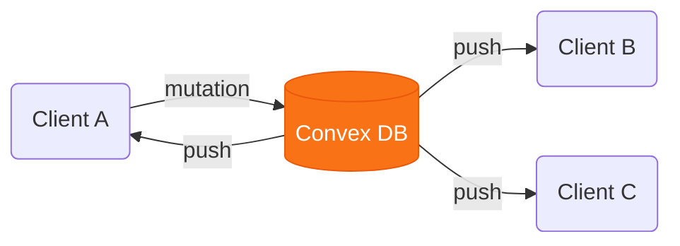

# Chapitre 3
## L'état serveur
<div class="opacity-60 pt-2">Le cache d'appels réseau</div>

---
layout: center
---

# État local, état distant

<div v-click class="flex items-center justify-center gap-3 pt-2 text-sm">
  <div class="border border-gray-500 rounded-lg px-4 py-2 text-center">
    <div class="text-3xl">🗄️</div>
    <div class="opacity-60 pt-1">Serveur / DB</div>
  </div>
  <div class="text-orange-400 text-center px-1">
    <div class="text-[10px] uppercase tracking-wider opacity-70">réseau · async</div>
    <div class="text-2xl leading-none">→</div>
  </div>
  <div class="border-2 border-orange-500 rounded-lg px-4 py-2 text-center bg-orange-400/10">
    <div class="text-3xl">💻</div>
    <div class="opacity-80 pt-1">Client · React</div>
  </div>
  <div class="text-orange-400 text-center px-1 leading-tight">
    <div class="text-2xl leading-none">→</div>
    <div class="text-2xl leading-none">←</div>
  </div>
  <div class="border border-gray-500 rounded-lg px-4 py-2 text-center">
    <div class="text-3xl">🖥️</div>
    <div class="opacity-60 pt-1">UI</div>
  </div>
</div>

<div v-click class="text-center pt-4 opacity-80">
Toute donnée affichée doit être connue du client → <span v-mark.orange>le client doit gérer le state</span>.<br>
Mais le client n'est <b>pas</b> l'unique source de vérité du state.
</div>

<div v-click class="text-center pt-6 text-lg">
La vraie question n'est pas <b>où c'est centralisé</b><br>
mais <span v-mark.underline.orange>est-ce que la source de vérité est à l'endroit où le state est géré ou non</span>.
</div>

<!--
Le pivot conceptuel du chapitre, dans la continuité de « tout l'état finit dans le client ».
Le client n'oppose pas serveur : il les CONTIENT tous les deux. Donc « client vs serveur » est
trompeur — à l'écran tout est state client. Le bon axe, c'est la PROPRIÉTÉ : du state local
(que ton client possède, même global) vs du state serveur (une copie d'une donnée que tu ne
possèdes pas). C'est ce déplacement d'axe qui prépare la slide suivante.
-->

---
layout: center
---

# Deux states de <span v-mark.underline.orange>nature</span> différente

<div class="grid grid-cols-2 gap-10 pt-4">
<div v-click class="text-center">

### State local
<div class="text-xs opacity-50 pt-1">généré sur le client</div>
<div class="text-5xl py-3">🔒</div>
<b>Possédé par le client</b>

<div class="text-sm opacity-60 pt-2">
Synchrone<br>
Toujours « frais »
</div>

</div>
<div v-click class="text-center border-l border-gray-600 pl-8">

### State distant
<div class="text-xs opacity-50 pt-1">copie d'une donnée d'ailleurs</div>
<div class="text-5xl py-3">🌐</div>
<b>Emprunté par le client</b>

<div class="text-sm opacity-60 pt-2">
<span v-mark.orange>Asynchrone</span> · d'autres le changent<br>
Peut périmer à tout moment
</div>

</div>
</div>

<div v-click class="pt-8 text-center opacity-80">
Le state asynchrone demande une gestion particulière :<br>cache, déduplication, invalidation…
</div>

<!--
Le point conceptuel le plus important du chapitre. State serveur = capture à un
instant T d'une donnée qu'on ne possède pas. C'est ce qui justifie un outil dédié.
TanStack Query n'est PAS qu'un wrapper réseau : c'est du server-state management.
-->

---

# Les outils habituels ne suffisent pas

<div class="grid grid-cols-2 gap-6 items-center">
<div>

```tsx {all|2-4|6-11|13-15}
function TripList() {
  const [data, setData] = useState()
  const [error, setError] = useState()
  const [isLoading, setLoading] = useState(true)

  useEffect(() => {
    fetchTrips()
      .then(setData)
      .catch(setError)
      .finally(() => setLoading(false))
  }, [])

  if (isLoading) return <Spinner />
  if (error) return <Error />
  return <Trips trips={data} />
}
```

</div>
<div>

<ul class="space-y-4 list-disc list-inside">
<li v-click>beaucoup de code à écrire <b>à la main</b></li>
<li v-click>autant d'occasions de se <b>tromper</b></li>
<li v-click>difficile à <b>maintenir</b></li>
<li v-click>comment assurer la synchronisation entre tous les composants qui consomment la donnée ?</li>
</ul>

</div>
</div>

<div v-click class="pt-6 text-center opacity-80">
Il nous faut un <span v-mark.underline.orange>outil dédié</span>,<br>pensé pour les spécificités du state asynchrone.
</div>

<!--
Bridge vers SWR / TanStack Query. Les API natives et les state managers classiques savent
STOCKER du state synchrone, pas gérer l'async : cache partagé, déduplication des requêtes en
vol, refetch en fond, invalidation, retry, race conditions. Le hook « à la main » le montre :
beaucoup de code pour un seul fetch, et il manque encore tout le reste. D'où un outil dédié.
-->

---

# Gérer ≠ aller chercher

<div class="flex items-stretch justify-center gap-4 pt-10 text-sm">
<div v-click class="border-2 border-orange-500 rounded-lg p-4 text-center w-56 bg-orange-400/10 flex flex-col justify-center">
<div class="font-bold pb-2">Le gestionnaire de state async</div>
<div class="opacity-80 leading-relaxed">gère la donnée quand elle arrive au client</div>
<div class="text-xs opacity-50 pt-2">cache · dédup · revalidation · invalidation</div>
</div>

<div v-click class="flex flex-col items-center justify-center px-2 text-orange-400 w-44">
<div class="flex flex-col items-center">
<div class="text-[11px] uppercase tracking-wider opacity-80 pb-1">orchestre l'appel</div>
<div class="text-2xl leading-none">→</div>
</div>
<div class="flex flex-col items-center pt-3">
<div class="text-2xl leading-none">←</div>
<div class="text-[11px] uppercase tracking-wider opacity-80 pt-1">une <b>Promise</b> de donnée</div>
</div>
</div>

<div v-click class="border border-gray-600 rounded-lg p-4 text-center w-56 flex flex-col justify-center">
<div class="font-bold pb-2">La stack réseau</div>
<div class="opacity-70 leading-relaxed"><code>fetch</code> · <code>axios</code><br>client GraphQL · headers d'auth…</div>
<div class="text-xs opacity-50 pt-2">au choix, l'outil s'en moque</div>
</div>
</div>

<!--
Slide-charnière à poser AVANT SWR, parce que c'est le contresens classique : « c'est une lib de
fetch ». Non. La frontière, c'est la Promise. À droite, la stack réseau (fetch nu, axios, un
client GraphQL, headers d'auth, gestion d'erreur) — l'outil n'a aucun avis dessus. À gauche, le
gestionnaire de state async : il gère la donnée une fois arrivée au client — cache, dédup,
revalidation, états, invalidation. Bien insister sur le sens des flèches : le gestionnaire
ORCHESTRE l'appel (il décide QUAND déclencher, refetch, retry…) mais ne le FAIT pas lui-même —
c'est la stack réseau qui exécute et lui rend une promesse. Le seul contrat entre les deux : une
fonction qui renvoie une promesse de donnée. C'est ce qui rend le terme
« state serveur » plus juste que « data fetching » — et ça prépare le fetcher de SWR et la
queryFn de TanStack, qui ne sont que ce point de contact.
-->

---
layout: center
class: text-center
---

<h1 class="text-8xl font-bold">SWR</h1>
<div class="text-2xl opacity-60 pt-6">Une bibliothèque minimaliste de gestion de state serveur</div>

---
layout: center
---

# Stale-While-Revalidate

<div class="text-center text-sm opacity-60 pt-2"><b>RFC HTTP 5861</b> — un pattern d'invalidation de cache générique</div>

<div class="max-w-xl mx-auto pt-10 text-lg space-y-4">
<div v-click>on sert la donnée <b>du cache</b>, quoi qu'il arrive</div>
<div v-click>on envoie une requête pour <b>revalider</b> en fond</div>
<div v-click>on <b>remplace</b> si la donnée a changé</div>
</div>

<!--
Poser le concept avant la lib. SWR = stale-while-revalidate, une stratégie d'invalidation de
cache classique : on sert le cache, on revalide en fond, on remplace si besoin. C'est un
standard HTTP (RFC 5861) — la librairie ne fait que l'implémenter côté React.
-->

---

# Un **hook** et c'est tout

<div class="grid grid-cols-[3fr_2fr] gap-10 items-center pt-5">
<div>

Un seul hook : <code>useSWR(clé, fetcher)</code>

```tsx {all|1|3|4-5}
import useSWR from 'swr'

const fetcher = (url) => fetch(url).then(r => r.json())
const { data, error, isLoading } =
  useSWR('/api/trips', fetcher)
```

<div class="space-y-2 pt-5 text-sm">
<div v-click><code class="text-orange-400">data</code> — la donnée résolue, <code>undefined</code> tant qu'elle n'est pas là</div>
<div v-click><code class="text-orange-400">error</code> — l'erreur si le <i>fetcher</i> a rejeté</div>
<div v-click><code class="text-orange-400">isLoading</code> — vrai pendant le premier chargement, sans donnée en cache</div>
</div>

</div>
<div>

<div class="space-y-5">
<div v-click>❌ pas de provider</div>
<div v-click>❌ pas de store global</div>
<div v-click>❌ pas de config</div>
</div>

</div>
</div>

<div v-click class="pt-10 text-center opacity-80">
Nécessité de définir une fonction <i>fetcher</i> qui va chercher la donnée.
</div>

<!--
Le point à marteler : SWR n'est rien d'autre qu'un hook. Pas de Provider à monter, pas de
store global à câbler, pas de config. On importe useSWR, on l'appelle dans le composant avec
une clé + un fetcher, et il renvoie data / error / isLoading. Le fetcher est trivial :
args ⇒ fetch(...).then(r ⇒ r.json()). À l'oral : on pense en dépendances de données, pas en appels.
-->

---

# La clé — le cœur de SWR

```tsx {all|1-3|5-7}
// clé simple
const fetcher = (url) => fetch(url).then(r => r.json())
useSWR('/api/trips', fetcher)            // → fetch('/api/trips')

// clé composite
const getTrip = ([url, id]) => fetch(`${url}/${id}`).then(r => r.json())
useSWR(['/api/trips', tripId], getTrip) // → fetch('/api/trips/1')
```

<div class="grid grid-cols-2 gap-8 pt-4 text-sm">
<div v-click class="flex items-center justify-center text-center">

La clé **identifie** la donnée dans le cache.

</div>
<div v-click class="border-l-4 border-orange-500 pl-3">

Même clé dans 10 composants ⇒ <span v-mark.orange>une seule requête</span>, un cache partagé (déduplication).

</div>
</div>

<div v-click class="pt-4 text-center text-sm opacity-60">
Simplicité voulue : la clé n'est pas décorrélée du fetch.
</div>

<!--
Le concept central. La clé est passée en argument au fetcher, donc le plus souvent c'est l'URL
elle-même. Avantage : pas de clé à maintenir à part. Et comme le cache est indexé par clé,
plusieurs composants qui demandent la même clé partagent une seule requête.
-->

---

# Un seul *fetcher*, réutilisé partout

<div class="grid grid-cols-[3fr_2fr] gap-8 items-center pt-2">
<div>

```tsx {all|1-2|4-6|8-9}
// défini une fois pour toute l'app
const fetcher = (url) => fetch(url).then(r => r.json())

useSWR('/api/trips', fetcher)
useSWR(`/api/trips/${id}`, fetcher)
useSWR('/api/me', fetcher)

// ou en global → plus besoin de le repasser
<SWRConfig value={{ fetcher }}>
```

</div>
<div>

<v-clicks>

- le *fetcher* encapsule **la stack réseau** — `fetch`, `axios`, client GraphQL, headers d'auth…
- on le définit **une fois** et on le réutilise partout
- la seule partie dynamique : <span v-mark.orange>la clé</span>

</v-clicks>

</div>
</div>

<div v-click class="pt-8 text-center text-sm opacity-70">
Flexibilité : il est toujours possible de <b>surcharger</b> le fetcher par défaut en passant une autre fonction au cas par cas si nécessaire.
</div>

<!--
Corollaire de la slide précédente : comme la clé porte toute la spécificité de la requête, le
fetcher, lui, est générique. Un projet définit UN fetcher (fetch nu, axios, un client GraphQL,
avec ses headers d'auth, sa gestion d'erreurs…) et le réutilise partout — voire le pose en
global via SWRConfig. La seule chose qui change d'un appel à l'autre, c'est la clé.
-->

---

# Un hook custom par ressource

```tsx {all|1-2|4-7}
const useTrips = ()   => useSWR('/api/trips', fetcher)
const useTrip  = (id) => useSWR(`/api/trips/${id}`, fetcher)

function TripList() {
  const { data, isLoading } = useTrips()
  // ...
}
```

<div v-click class="pt-6 text-center opacity-80">
La bonne pratique : <b>wrapper chaque appel</b> dans un hook.<br>
Le composant déclare la donnée dont il <b>dépend</b>, pas comment l'aller chercher.
</div>

<div v-click class="pt-6 text-center text-sm opacity-70">
Bonus : la clé est définie à <b>un seul endroit</b> → <span v-mark.orange>déduplication garantie</span>, plus de typo dans la clé qui casse le partage du cache.
</div>

<!--
Bonne pratique recommandée : un hook custom par ressource. Le composant ne voit plus ni l'URL
ni le fetcher — juste useTrips(). La dépendance de données devient explicite et réutilisable.
-->

---

# Requêtes conditionnelles & dépendantes

```tsx {all|1-2|4-6}
// clé null ⇒ pas de requête
useSWR(userId ? `/api/users/${userId}` : null, fetcher)

// clé sous forme de fonction : si elle throw ou renvoie null,
// la requête est sautée ⇒ requêtes dépendantes
const { data: me } = useSWR('/api/me', fetcher)
useSWR(() => `/api/projects/${me.id}`, fetcher)
```

<div class="grid grid-cols-2 gap-8 pt-6 text-sm">
<div v-click><b>Conditionnelle</b> — clé <code>null</code> = aucun appel.</div>
<div v-click><b>Dépendante</b> — la 2ᵉ attend la donnée de la 1ʳᵉ (l'accès à <code>me.id</code> throw tant que <code>me</code> est absent).</div>
</div>

<!--
Deux patterns gratuits via la clé. Si la clé vaut null, aucune requête (query conditionnelle). Impossible à faire sinon sans briser les rules of hooks.
Si la clé est une fonction qui throw ou renvoie null, l'exception est attrapée et la requête
n'est pas exécutée — c'est exactement ce qui permet d'enchaîner des requêtes dépendantes.
-->

---

# Patterns avancés

<div class="grid grid-cols-2 grid-rows-2 gap-4 pt-4 text-sm h-[400px]">

<div v-click class="border border-gray-600 rounded-lg p-4 flex flex-col justify-between">
<div class="font-bold pb-2"><code>isLoading</code> vs <code>isValidating</code></div>

```ts
const { isLoading, isValidating } = useSWR(key, f)
```

<div class="text-xs opacity-60 pt-2"><code>isLoading</code> = 1er fetch · <code>isValidating</code> = toute revalidation en fond.</div>

</div>

<div v-click class="border border-gray-600 rounded-lg p-4 flex flex-col justify-between">
<div class="font-bold pb-2"><code>keepPreviousData</code></div>

```ts
useSWR(`/search?q=${q}`, f, { keepPreviousData: true })
```

<div class="text-xs opacity-60 pt-2">Garde l'ancien résultat pendant que la clé change — pas de flash (ex. recherche).</div>

</div>

<div v-click class="border border-gray-600 rounded-lg p-4 flex flex-col justify-between">
<div class="font-bold pb-2">Re-render fin</div>

```ts
const { data } = useSWR(key, f)
```

<div class="text-xs opacity-60 pt-2">Re-render seulement sur les valeurs lues — si on ne lit que <code>data</code>, un changement d'<code>error</code> ne re-rend pas.</div>

</div>

<div v-click class="border border-gray-600 rounded-lg p-4 flex flex-col justify-between">
<div class="font-bold pb-2"><code>mutate</code> — écrire dans le cache</div>

```ts
const { data, mutate } = useSWR('/api/trips', f)
```

<div class="text-xs opacity-60 pt-2">Met à jour le cache à la main — revalidation ou mise à jour optimiste.</div>

</div>

</div>

<!--
Quelques patterns avancés qui montrent que SWR n'est pas qu'un toy : isLoading vs isValidating,
keepPreviousData (clé pilotée par un input de recherche), re-render fin (on ne re-rend que sur
les champs lus), et mutate pour écrire dans le cache.
-->

---

# SWR — bilan

<Bilan
  :scores="[5, 5, 4, 2, 2]"
  poids="5 kB (gzip)"
  perimetre="State serveur / async"
  idealPour="Apps simples à moyennes, surtout en lecture"
  :avantages="[
    'Un seul hook, zéro config',
    'Cache, dédup & revalidation gratuits',
    'Conditionnel / dépendant faciles',
  ]"
  :limites="[
    'APIs pauvres dès qu\'on mute beaucoup',
    'Petite communauté, peu d\'évolutions',
    'Doc parfois imprécise, pas de devtools',
  ]"
/>

<!--
Bilan SWR sur la grille de critères PARTAGÉE (réutilisée pour chaque solution). Forces :
prise en main et légèreté maximales, bonnes perfs (re-render fin). Faiblesses : écosystème
(petite communauté, pas de devtools, doc imprécise) et montée en charge (API trop pauvre dès
qu'on mute beaucoup). D'où le passage à TanStack Query.
-->

---
layout: center
class: text-center
---

<h1 class="text-7xl font-bold">TanStack Query</h1>
<div class="text-2xl opacity-60 pt-6">Le standard de la gestion de state serveur</div>

---
layout: center
---

# Les origines

<div class="grid grid-cols-2 gap-10 pt-6 items-center">
<div v-click>

<div class="text-lg">D'abord <b>React Query</b></div>
<div class="opacity-70 pt-2 text-sm leading-relaxed">
Créé par <b>Tanner Linsley</b> en 2020 pour résoudre le state serveur en React.<br>
Devenu une référence de l'écosystème.
</div>

</div>
<div v-click class="border-l border-gray-600 pl-8">

<div class="text-lg">Puis <b>TanStack Query</b></div>
<div class="opacity-70 pt-2 text-sm leading-relaxed">
Le cœur a été <b>extrait du React</b> : un noyau agnostique + des adaptateurs.<br>
React, Vue, Svelte, Solid, Angular…
</div>

</div>
</div>

<div v-click class="pt-10 text-center">
Tanstack : une famille de libs <span v-mark.orange>framework-agnostic</span> pour le frontend moderne
</div>

<div class="grid grid-cols-4 gap-3 pt-4 text-xs text-center opacity-70">
<div v-click class="border border-gray-600 rounded p-2">Query</div>
<div v-click class="border border-gray-600 rounded p-2">Table</div>
<div v-click class="border border-gray-600 rounded p-2">Router</div>
<div v-click class="border border-gray-600 rounded p-2">Form · Virtual…</div>
</div>

<!--
Repositionner avant d'entrer dans l'API. L'outil est né React Query — Tanner Linsley, devenu LE
standard du state serveur côté React. Le projet a ensuite été refactoré : un noyau pur,
framework-agnostic, et des adaptateurs (React, Vue, Svelte, Solid, Angular). D'où le rebrand
TanStack — une famille de libs headless pour le frontend moderne : Query, Table, Router, Form,
Virtual… On ne couvre que Query, mais le nom n'est plus « React » par hasard.
-->

---

# `useQuery`

```tsx {all|2|3|5}
const { data, isPending, isError } = useQuery({
  queryKey: ['trips', tripId],          // identifiant unique de la donnée
  queryFn: () => fetchTrip(tripId),     // comment la récupérer (renvoie une promesse)
})
```

<div v-click class="pt-3 text-center text-sm opacity-80">
Même principe que SWR : une <b>clé</b> + une <b>fonction async</b>.<br>
Différence : ici la clé et la fonction sont <span v-mark.orange>découplées</span> — la clé n'est pas passée au <code>queryFn</code>.
</div>

<div class="grid grid-cols-2 gap-8 pt-4">
<div v-click class="opacity-80 text-sm">

On dit juste **comment récupérer** la donnée. TanStack gère tout l'entre-deux : fraîcheur, cohérence, dédup.

</div>
<div v-click class="border-l-4 border-orange-500 pl-3 text-sm">

`queryFn` renvoie **une promesse** — pas forcément un appel réseau. D'où : librairie de **state asynchrone**, pas de fetching.

</div>
</div>

<!--
Tout part de useQuery : une queryKey + une queryFn. La magie c'est l'abstraction de
ce qu'il y a entre "je veux la donnée" et "je l'ai". TSQ ne fetch pas (on garde fetch/axios).
-->

---

# Etats de la requête

```tsx {all|2|4|6}
function TripList() {
  if (isPending) return <Skeleton />        // 1er fetch
  if (isError)   return <Error />           // échec
  return <ul>{data.map(...)}</ul>           // succès
}
```

<div class="grid grid-cols-2 gap-8 pt-4 text-sm">
<div v-click class="border border-gray-600 rounded p-3">

**`isPending`** — premier chargement
<div class="opacity-60">→ skeleton</div>

</div>
<div v-click class="border border-gray-600 rounded p-3">

**`isFetching`** — inclut les refetch
<div class="opacity-60">→ garder l'ancienne donnée + indicateur</div>

</div>
</div>

<div v-click class="pt-4 text-center">
Zéro <code>useState</code> de loading/error. <span v-mark.orange>C'est un standard de l'industrie.</span>
</div>

<!--
Les états retournés automatiquement = la moitié de la valeur. Distinguer isPending
(1er fetch, skeleton) de isFetching (revalidation, on peut laisser la donnée périmée).
-->

---

# La `queryKey` — identifiant + hiérarchie

<div class="grid grid-cols-2 gap-10 items-center pt-4">
<div>

```ts {none|1|2|3}
['trips']                 // toute la racine
['trips', 'list']         // la liste
['trips', tripId]         // un item particulier
```

<div v-click="5" class="pt-5">

```tsx
<QueryClientProvider client={queryClient}>
  <App />
</QueryClientProvider>
```

</div>

</div>
<div class="space-y-5 text-sm">

<div>
La clé est l'<b>identifiant unique</b> d'une query : c'est par elle que TanStack retrouve, partage et invalide la donnée dans le cache.
</div>

<div v-click="4" class="opacity-75">
Clé <b>dynamique</b> = comme un tableau de dépendances : si elle change → refetch automatique.
</div>

<div v-click="5" class="opacity-70 border-l-4 border-orange-500 pl-3">
Un seul <code>QueryClientProvider</code> en haut de l'app → cache partagé par tous les consommateurs d'une même clé.
</div>

</div>
</div>

<!--
La queryKey est centrale : elle permet de retrouver la donnée de façon décentralisée
dans toute l'app, et d'invalider hiérarchiquement. Si la query dépend d'une variable,
cette variable DOIT être dans la clé. Le QueryClientProvider qui wrappe l'app héberge le
cache : tous les useQuery en dessous, où qu'ils soient, partagent ce cache par leur clé.
-->

---

# Invalidation manuelle

<div class="text-sm opacity-70 pb-6">
Après une mutation, on marque la donnée du cache comme <b>périmée</b>.
</div>

<div class="grid grid-cols-2 gap-8 items-start">
<div>

```ts
// une query précise
queryClient.invalidateQueries({
  queryKey: ['trips', tripId]
})
```

<div class="text-sm opacity-75 pt-4">
Cible <b>exactement</b> cette clé → seule cette query est invalidée.
</div>

</div>
<div v-click>

```ts
// un préfixe → tout le sous-arbre
queryClient.invalidateQueries({
  queryKey: ['trips']
})
```

<div class="text-sm opacity-75 pt-4">
<code>['trips']</code> invalide <b>aussi</b> <code>['trips', 'list']</code> et <code>['trips', tripId]</code>.
</div>

</div>
</div>

<div v-click class="pt-5 text-center text-sm opacity-70">
Les clés forment une <b>arborescence hiérarchique</b> : permet une <span v-mark.orange>invalidation fine</span>.
</div>

<div v-click class="flex flex-col items-center gap-1 pt-5 text-sm">
<div>Clé invalidée</div>
<div class="text-orange-400 text-xl leading-none">↓</div>
<div><b>TanStack refetch les queries des composants montés</b></div>
<div class="text-orange-400 text-xl leading-none">↓</div>
<div>l'UI se resynchronise toute seule</div>
</div>

<!--
D'abord le cas normal : on invalide une clé précise — ['trips', tripId] ne touche que cette query.
Puis le twist : la clé est un PRÉFIXE. invalidateQueries({ queryKey: ['trips'] }) marque périmé
tout le sous-arbre 'trips' — la liste, chaque détail. C'est l'invalidation hiérarchique : on vise
large (toute la ressource) ou précis (un seul id). Seules les queries actuellement montées sont
refetchées ; les autres le seront au prochain montage.
-->

---

# Cycle de vie : stale-while-revalidate

<div class="w-fit mx-auto pt-6 grid items-center" style="grid-template-columns: repeat(7, auto); column-gap: 0.5rem;">

  <!-- boucle de revalidation (stale → fetching) -->
  <div v-click="5" class="row-start-1 col-start-3 col-end-8 mx-12 text-center text-xs text-orange-400 pb-1">refocus · reconnexion · remontage</div>
  <div v-click="5" class="row-start-2 col-start-3 col-end-8 mx-12 mb-2 relative h-6">
    <div class="h-full border-t-2 border-l-2 border-r-2 border-dashed border-orange-500 rounded-t-lg"></div>
    <!-- pointe de flèche vers le bas, juste au-dessus de « fetch » -->
    <div class="absolute bottom-0 left-0 translate-y-1/2 -translate-x-1/2 w-2 h-2 border-r-2 border-b-2 border-orange-500 rotate-45"></div>
  </div>

  <!-- ligne d'états -->
  <div v-click="1" class="row-start-3 col-start-1 border border-gray-500 rounded-lg px-3 py-2 text-center text-sm w-24">🪝<div class="opacity-70 pt-1">mount</div></div>
  <div v-click="1" class="row-start-3 col-start-2 text-gray-400 text-xl text-center">→</div>
  <div v-click="1" class="row-start-3 col-start-3 border border-gray-500 rounded-lg px-3 py-2 text-center text-sm w-24">⏳<div class="opacity-70 pt-1">fetch</div></div>
  <div v-click="2" class="row-start-3 col-start-4 text-gray-400 text-xl text-center">→</div>
  <div v-click="2" class="row-start-3 col-start-5 rounded-lg px-3 py-2 text-center text-sm w-24 bg-green-500 text-white">✨<div class="pt-1">fresh</div></div>
  <div v-click="3" class="row-start-3 col-start-6 flex flex-col items-center text-gray-400 px-1">
    <div class="text-[10px] uppercase tracking-wide text-center leading-tight pb-0.5">staleTime<br>écoulé</div>
    <div class="text-xl leading-none">→</div>
  </div>
  <div v-click="3" class="row-start-3 col-start-7 rounded-lg px-3 py-2 text-center text-sm w-24 bg-orange-500 text-white">🍂<div class="pt-1">stale</div></div>

  <!-- flèches vers l'UI, depuis fresh et stale -->
  <div v-click="4" class="row-start-4 col-start-5 text-center text-gray-400 text-xl leading-none pt-1">↓</div>
  <div v-click="4" class="row-start-4 col-start-7 text-center text-gray-400 text-xl leading-none pt-1">↓</div>

  <div v-click="4" class="row-start-5 col-start-5 col-end-8 text-center text-xs text-gray-400">sert la valeur en cache, fraîche ou périmée</div>
  <div v-click="4" class="row-start-6 col-start-5 col-end-8 flex justify-center pt-1">
    <div class="border-2 border-gray-400 rounded-lg px-6 py-2 text-center text-sm">🖥️ <b>UI</b></div>
  </div>

</div>

<div class="grid grid-cols-2 gap-8 pt-6 text-sm">
<div v-click="6" class="opacity-80">
Par défaut <code>staleTime = 0</code> : tout est périmé d'office (l'app ne possède pas la donnée).
</div>
<div v-click="7" class="border-l-4 border-orange-500 pl-3">
Périmé ≠ refetché. La donnée stale est <b>servie depuis le cache</b> et rafraîchie à <span v-mark.orange>certaines conditions</span>.
</div>
</div>

<div v-click="8" class="pt-5 text-center text-sm opacity-80">
Régler le <code>staleTime</code> est une affaire de <span v-mark.orange>stratégie</span> : selon la fraîcheur dont la donnée a besoin.
</div>

<!--
Le modèle mental clé. Donnée toujours rendue depuis le cache (dispo), refetch sous
conditions. Bien distinguer "périmé" (éligible au refetch) de "refetché". Ne pas
confondre staleTime avec gcTime (suppression quand plus aucun consommateur).
-->

---

# `useMutation`

<div class="text-sm opacity-70 pb-4">
<code>useQuery</code> est au <code>GET</code> ce que <code>useMutation</code> est au <code>POST</code> / <code>PUT</code> / <code>DELETE</code>.
</div>

<div class="grid grid-cols-[5fr_4fr] gap-8 items-center pt-2">
<div>

```ts {all|5-7|all}
const { mutate } = useMutation({
  mutationFn: (trip) => api.post('/trips', trip),
  onSuccess: () => {
    queryClient.invalidateQueries({ queryKey: ['trips'] })
  },
})
```

</div>
<div class="space-y-3 text-sm">

<div v-click>
Ne s'occupe pas d'<b>effectuer</b> la mutation, il l'<span v-mark.orange>orchestre</span> — comme <code>useQuery</code>.
</div>

<div v-click>
Pas d'exécution automatique : le callback est renvoyé <b>décoré</b> dans <code>mutate</code>.
</div>

<div v-click>
Les <b>états</b> sont reçus automatiquement (<code>pending</code>, <code>error</code>…).
</div>

<div v-click class="border-l-4 border-orange-500 pl-3">
<code>onSuccess</code> : exécuter du code <b>si</b> la mutation réussit — invalider, sans gérer la mécanique.
</div>

</div>
</div>

<!--
Démo 3a : cycle complet fetch → mutation → invalidation. Backend maison (Hono/Express).
Message : le server state a son propre cycle de vie. TSQ le gère, useEffect le subit.
Enchaîner sur les devtools.
-->

---

# Les `DevTools`

<div class="text-sm opacity-70 pb-6">
Une fenêtre sur le cache, en direct — sans rien instrumenter.
</div>

<div class="grid grid-cols-3 gap-4 text-sm">
<div v-click class="border border-gray-600 rounded-lg p-4">
<div class="font-bold pb-1">🗂️ Le cache</div>
<div class="opacity-70">Toutes les <code>queryKey</code> présentes et leur donnée.</div>
</div>
<div v-click class="border border-gray-600 rounded-lg p-4">
<div class="font-bold pb-1">🚦 Les états</div>
<div class="opacity-70"><code>fresh</code> · <code>stale</code> · <code>fetching</code> · <code>inactive</code>, en temps réel.</div>
</div>
<div v-click class="border border-gray-600 rounded-lg p-4">
<div class="font-bold pb-1">🔄 Les refetch</div>
<div class="opacity-70">Chaque revalidation et invalidation, au moment où elle se produit.</div>
</div>
</div>

<div v-click class="pt-8 text-center opacity-80">
On <span v-mark.orange>voit</span> le state serveur vivre — un atout décisif pour déboguer.
</div>

<!--
Les devtools sont une part majeure de l'adoption de TSQ : on rend visible un state habituellement
invisible. À l'écran : ouvrir le panneau, montrer une clé passer de fresh à stale, déclencher une
mutation et voir l'invalidation + le refetch en direct. C'est ce qui « vend » l'outil en démo.
-->

---

# Patterns avancés

<div class="grid grid-cols-2 grid-rows-2 gap-4 pt-4 text-sm h-[400px]">

<div v-click class="border border-gray-600 rounded-lg p-4 flex flex-col justify-between">
<div class="font-bold pb-2">Mise à jour optimiste</div>

```ts
useMutation({ mutationFn, onMutate, onError, onSettled })
```

<div class="text-xs opacity-60 pt-2"><code>onMutate</code> applique le changement avant la réponse, <code>onError</code> rollback — UI instantanée.</div>

</div>

<div v-click class="border border-gray-600 rounded-lg p-4 flex flex-col justify-between">
<div class="font-bold pb-2"><code>placeholderData</code> · <code>keepPreviousData</code></div>

```ts
useQuery({ queryKey: ['trips', page], queryFn,
  placeholderData: keepPreviousData })
```

<div class="text-xs opacity-60 pt-2">Garde l'ancienne page affichée pendant le fetch de la suivante — pagination sans flash.</div>

</div>

<div v-click class="border border-gray-600 rounded-lg p-4 flex flex-col justify-between">
<div class="font-bold pb-2"><code>select</code> · <code>prefetchQuery</code></div>

```ts
useQuery({ queryKey, queryFn, select: d => d.trips })
queryClient.prefetchQuery({ queryKey, queryFn })
```

<div class="text-xs opacity-60 pt-2"><code>select</code> = dérive/filtre sans re-render inutile · <code>prefetch</code> = charger avant le besoin (hover, route).</div>

</div>

<div v-click class="border border-gray-600 rounded-lg p-4 flex flex-col justify-between">
<div class="font-bold pb-2"><code>useInfiniteQuery</code></div>

```ts
useInfiniteQuery({ queryKey, queryFn, getNextPageParam })
```

<div class="text-xs opacity-60 pt-2">Pagination « charger plus » / scroll infini, pages et curseurs gérés pour nous.</div>

</div>

</div>

<!--
Patterns qui montrent l'étendue de TSQ vs SWR : mise à jour optimiste complète (onMutate/onError/
onSettled avec rollback), placeholderData/keepPreviousData pour la pagination sans flash, select
pour dériver la donnée sans re-render, prefetchQuery pour précharger (hover/route), et
useInfiniteQuery pour le scroll infini. C'est la richesse d'API qui justifie le poids.
-->

---
layout: center
class: text-center
---

# Pour aller plus loin

<div class="flex justify-center pt-4">
  <Youtube id="NwSmWe2IRFM" width="720" height="405" />
</div>

<!--
Slide de clôture de la partie TanStack Query. Renvoyer vers la ressource vidéo pour approfondir.
-->

---

# TanStack Query — bilan

<Bilan
  :scores="[4, 3, 5, 5, 5]"
  poids="13,3 kB (gzip)"
  perimetre="State serveur / async"
  idealPour="De l'app simple au gros projet, lecture comme écriture"
  :avantages="[
    'Queries + mutations, états & cache gérés',
    'Invalidation hiérarchique, DevTools',
    'Agnostique du transport, énorme écosystème',
  ]"
  :limites="[
    'Plus lourd que SWR',
    'Courbe d\'apprentissage (clés, staleTime…)',
    'Bien le configurer demande de comprendre le modèle',
  ]"
/>

<!--
Bilan TanStack Query sur la même grille que SWR. Forces : couvre tout le cycle (queries +
mutations), écosystème massif, devtools, perfs et montée en charge excellentes. Contreparties :
plus lourd que SWR (13,3 kB) et une vraie courbe d'apprentissage (clés, staleTime, invalidation).
C'est le prix de la richesse — et ça reste LE standard du state serveur en React.
-->

---

# 3b · `Apollo` — quand le préférer

<div class="grid grid-cols-2 gap-8 pt-6">
<div v-click class="border border-gray-600 rounded-lg p-5">

### TanStack Query
- n'importe quelle API (REST, RPC…)
- cache **par query** (par clé)
- agnostique du transport

</div>
<div v-click class="border-2 border-orange-500 rounded-lg p-5">

### Apollo
- API **GraphQL** existante
- cache **normalisé par entité**
- **subscriptions** GraphQL natives
- **fragments** : co-location des données

</div>
</div>

<div v-click class="pt-6 text-center opacity-70">
<span class="text-sm">THÉORIE</span> — même use case, deux philosophies de cache.
</div>

<!--
4a théorie uniquement. Choisir Apollo quand : backend GraphQL, besoin d'un cache
normalisé par entité, subscriptions, fragments. Montrer un snippet comparatif.
-->

---

# 3c · `Convex` — réactif par défaut

<div class="text-center text-xl pt-2 opacity-80">
Et si la réactivité était le comportement <span v-mark.orange>par défaut</span> de toute la stack ?
</div>



<div class="grid grid-cols-3 gap-3 pt-2 text-xs text-center opacity-75">
<div v-click>Pas de cache à invalider</div>
<div v-click>Pas de polling</div>
<div v-click>Pas de websocket à brancher</div>
</div>

<!--
Killer feature du talk. Question différente : et si la réactivité était le défaut ?
Dès qu'une donnée change, tout le monde se met à jour, automatiquement.
-->

---

# Convex — TypeScript de bout en bout

<div class="grid grid-cols-2 gap-4 text-sm">
<div>

```ts
// convex/schema.ts — la source de vérité
defineTable({
  name: v.string(),
  destination: v.string(),
  budget: v.number(),
})
```

```ts
// convex/trips.ts — fonction serveur
export const list = query({
  handler: (ctx) =>
    ctx.db.query('trips').collect(),
})
```

</div>
<div>

```tsx
// côté client — typé end-to-end
function TripList() {
  const trips = useQuery(api.trips.list)
  //    ↑ ne refetch jamais : il REÇOIT
  return <ul>{trips?.map(/* … */)}</ul>
}
```

<v-clicks>

- **query** = lecture réactive
- **mutation** = écriture ACID
- **action** = appels externes

</v-clicks>

</div>
</div>

<!--
Schema + fonctions serveur + types client dans le même repo TS. Zéro codegen.
useQuery ressemble à TanStack mais ne refetch jamais : il reçoit via subscription.
-->

---

# Convex — sous le capot

<div class="grid grid-cols-2 gap-6 pt-2">
<div>

<v-clicks>

- **un seul WebSocket** partagé par toute l'app
- **dependency tracking** : Convex sait quelles lignes chaque query a lues
- une ligne change → seules les queries concernées re-tournent

</v-clicks>

</div>
<div v-click="4" class="border-l-4 border-orange-500 pl-4 flex flex-col justify-center">

Le **cache n'est pas géré** : c'est une **projection** des subscriptions actives.

<div class="pt-3 opacity-70">
Pas d'invalidation. Pas de <code>staleTime</code>.<br>
La donnée est soit en chargement, soit à jour.
</div>

</div>
</div>

<div v-click class="pt-5 text-center text-sm opacity-70">
Même principe que les Signals / <code>useMemo</code> — mais appliqué <b>côté serveur, sur la DB</b>.
</div>

<!--
Le dependency tracking est exactement le principe de la réactivité fine, mais sur la base.
Le cache devient une conséquence, pas une chose à gérer.
-->

---

# Convex vs les autres BaaS

<div class="text-sm pt-2">

| | Firebase | Supabase | **Convex** |
|---|---|---|---|
| Temps réel | RTDB / Firestore | Postgres + WS | **natif, toutes les queries** |
| Langage | JS/TS + config JSON | SQL + REST/GraphQL | **TypeScript pur, e2e** |
| Typage | partiel | génération CLI | **inféré automatiquement** |
| Fonctions serveur | séparées | séparées | **co-localisées** |
| Cible | mobile / web | web, profils SQL | **React / frontend-first** |

</div>

<div class="grid grid-cols-3 gap-3 pt-5 text-xs opacity-70">
<div v-click>⚠️ <b>Vendor lock-in</b> — infra Convex</div>
<div v-click>⚠️ <b>Pas universel</b> — reporting, legacy</div>
<div v-click>⚠️ <b>Pricing</b> — à la consommation</div>
</div>

<!--
Démo 3c : deux onglets côte à côte, ajout d'étape visible en <100ms dans l'autre,
refresh → état intact. "Pas une ligne de code temps réel écrite." Rester honnête
sur les limites : lock-in, pas universel, pricing.
-->

