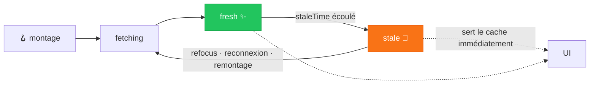
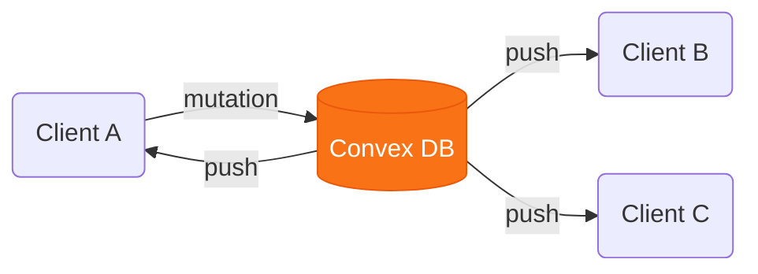

# Chapitre 3
## L'état serveur
<div class="opacity-60 pt-2">Le cache d'appels réseau</div>

---
layout: center
---

# Le state serveur est différent

<div class="grid grid-cols-2 gap-10 pt-4">
<div v-click class="text-center">

### State local
<div class="text-5xl py-3">🔒</div>
**Tu le possèdes.**

<div class="text-sm opacity-60 pt-2">
Synchrone. Toi seul le changes.<br>
Toujours « frais ».
</div>

</div>
<div v-click class="text-center border-l border-gray-600 pl-8">

### State serveur
<div class="text-5xl py-3">🌐</div>
**Tu l'empruntes.**

<div class="text-sm opacity-60 pt-2">
<span v-mark.orange>Asynchrone.</span> D'autres le changent.<br>
Peut périmer à tout moment.
</div>

</div>
</div>

<div v-click class="pt-8 text-center opacity-80">
Les APIs de React ne sont pas faites pour ça. Redux non plus :<br>il faudrait recoder cache, dédup, invalidation… à la main.
</div>

<!--
Le point conceptuel le plus important du chapitre. State serveur = capture à un
instant T d'une donnée qu'on ne possède pas. C'est ce qui justifie un outil dédié.
TanStack Query n'est PAS qu'un wrapper réseau : c'est du server-state management.
-->

---

# `SWR` — le minimum viable

<div class="grid grid-cols-2 gap-6 items-center">
<div>

```tsx
const { data, error, isLoading } =
  useSWR('/api/trips', fetcher)
```

<div class="text-xs opacity-60 pt-2">
SWR = <b>stale-while-revalidate</b> : on sert le cache, on revalide en fond, on remplace si besoin.
</div>

</div>
<div>

<v-clicks>

- une **clé** (souvent l'URL) + une fonction de fetch
- bonne pratique : un **hook custom par ressource**
- query conditionnelle (clé `null` ⇒ pas d'appel)
- requêtes dépendantes

</v-clicks>

</div>
</div>

<div v-click class="pt-6 text-sm opacity-60 border-l-4 border-gray-500 pl-3">
Très simple, petite communauté, peu d'APIs si on <b>mute</b> beaucoup. → on passe à TanStack Query.
</div>

<!--
SWR = la version la plus simple. Les composants ne pensent plus en "appels" mais en
"dépendances de données". Limite : trop simple dès qu'on mute beaucoup.
-->

---

# `TanStack Query` — `useQuery`

```tsx {all|2|3|5}
const { data, isPending, isError } = useQuery({
  queryKey: ['trips', tripId],          // identifiant unique de la donnée
  queryFn: () => fetchTrip(tripId),     // comment la récupérer (renvoie une promesse)
})
```

<div class="grid grid-cols-2 gap-8 pt-4">
<div v-click class="opacity-80 text-sm">

On dit juste **comment récupérer** la donnée. TanStack gère tout l'entre-deux : fraîcheur, cohérence, dédup.

</div>
<div v-click class="border-l-4 border-orange-500 pl-3 text-sm">

`queryFn` renvoie **une promesse** — pas forcément un appel réseau. D'où : librairie de **state asynchrone**, pas de fetching.

</div>
</div>

<!--
Tout part de useQuery : une queryKey + une queryFn. La magie c'est l'abstraction de
ce qu'il y a entre "je veux la donnée" et "je l'ai". TSQ ne fetch pas (on garde fetch/axios).
-->

---

# Les états, gratuits

```tsx {all|2|4|6}
function TripList() {
  if (isPending) return <Skeleton />        // 1er fetch
  if (isError)   return <Error />           // échec
  return <ul>{data.map(...)}</ul>           // succès
}
```

<div class="grid grid-cols-2 gap-8 pt-4 text-sm">
<div v-click class="border border-gray-600 rounded p-3">

**`isPending`** — premier chargement
<div class="opacity-60">→ skeleton</div>

</div>
<div v-click class="border border-gray-600 rounded p-3">

**`isFetching`** — inclut les refetch
<div class="opacity-60">→ garder l'ancienne donnée + indicateur</div>

</div>
</div>

<div v-click class="pt-4 text-center">
Zéro <code>useState</code> de loading/error. <span v-mark.orange>C'est un standard de l'industrie.</span>
</div>

<!--
Les états retournés automatiquement = la moitié de la valeur. Distinguer isPending
(1er fetch, skeleton) de isFetching (revalidation, on peut laisser la donnée périmée).
-->

---

# La `queryKey` — identifiant + hiérarchie

<div class="grid grid-cols-2 gap-6">
<div>

```ts
['trips']                 // toute la racine
['trips', 'list']         // la liste
['trips', tripId]         // un détail
```

<div v-click="2" class="text-sm opacity-75 pt-2">
Clé **dynamique** = comme un tableau de dépendances : si elle change → refetch automatique.
</div>

</div>
<div v-click="3">

### Invalidation fine

```ts
// invalide TOUT ce qui commence par 'trips'
queryClient.invalidateQueries({
  queryKey: ['trips']
})
```

<div class="text-sm opacity-60 pt-2">
Arborescence de clés : on invalide large ou précis, au choix.
</div>

</div>
</div>

<div v-click="4" class="pt-4 text-center text-sm opacity-70">
<code>QueryClientProvider</code> : tous les consommateurs d'une même clé partagent la même donnée.
</div>

<!--
La queryKey est centrale : elle permet de retrouver la donnée de façon décentralisée
dans toute l'app, et d'invalider hiérarchiquement. Si la query dépend d'une variable,
cette variable DOIT être dans la clé.
-->

---

# Cycle de vie : stale-while-revalidate



<div class="grid grid-cols-2 gap-8 pt-3 text-sm">
<div v-click class="opacity-80">
Par défaut <code>staleTime = 0</code> : tout est périmé d'office (l'app ne possède pas la donnée).
</div>
<div v-click class="border-l-4 border-orange-500 pl-3">
Périmé ≠ refetché. La donnée stale est <b>servie depuis le cache</b>, puis rafraîchie.
</div>
</div>

<!--
Le modèle mental clé. Donnée toujours rendue depuis le cache (dispo), refetch sous
conditions. Bien distinguer "périmé" (éligible au refetch) de "refetché". Ne pas
confondre staleTime avec gcTime (suppression quand plus aucun consommateur).
-->

---

# Les mutations — écrire et resynchroniser

```ts {all|5-7}
const { mutate } = useMutation({
  mutationFn: (trip) => api.post('/trips', trip),
  onSuccess: () => {
    // la killer feature : invalider le cache, déclarativement
    queryClient.invalidateQueries({ queryKey: ['trips'] })
  },
})
```

<div class="grid grid-cols-2 gap-8 pt-4 text-sm">
<div v-click class="opacity-80">
Comme les queries, on reçoit les **états** automatiquement (pending, error…).
</div>
<div v-click class="border-l-4 border-orange-500 pl-3">
<code>onSuccess</code> : exécuter du code <b>si</b> la mutation réussit — invalider, sans gérer la mécanique.
</div>
</div>

<div v-click class="pt-4 text-center opacity-60 text-sm">
🛠️ Et les <b>DevTools</b> : voir le cache, les états, les refetch en live.
</div>

<!--
Démo 3a : cycle complet fetch → mutation → invalidation. Backend maison (Hono/Express).
Message : le server state a son propre cycle de vie. TSQ le gère, useEffect le subit.
Terminer par les devtools.
-->

---

# 3b · `Apollo` — quand le préférer

<div class="grid grid-cols-2 gap-8 pt-6">
<div v-click class="border border-gray-600 rounded-lg p-5">

### TanStack Query
- n'importe quelle API (REST, RPC…)
- cache **par query** (par clé)
- agnostique du transport

</div>
<div v-click class="border-2 border-orange-500 rounded-lg p-5">

### Apollo
- API **GraphQL** existante
- cache **normalisé par entité**
- **subscriptions** GraphQL natives
- **fragments** : co-location des données

</div>
</div>

<div v-click class="pt-6 text-center opacity-70">
<span class="text-sm">THÉORIE</span> — même use case, deux philosophies de cache.
</div>

<!--
4a théorie uniquement. Choisir Apollo quand : backend GraphQL, besoin d'un cache
normalisé par entité, subscriptions, fragments. Montrer un snippet comparatif.
-->

---

# 3c · `Convex` — réactif par défaut

<div class="text-center text-xl pt-2 opacity-80">
Et si la réactivité était le comportement <span v-mark.orange>par défaut</span> de toute la stack ?
</div>



<div class="grid grid-cols-3 gap-3 pt-2 text-xs text-center opacity-75">
<div v-click>Pas de cache à invalider</div>
<div v-click>Pas de polling</div>
<div v-click>Pas de websocket à brancher</div>
</div>

<!--
Killer feature du talk. Question différente : et si la réactivité était le défaut ?
Dès qu'une donnée change, tout le monde se met à jour, automatiquement.
-->

---

# Convex — TypeScript de bout en bout

<div class="grid grid-cols-2 gap-4 text-sm">
<div>

```ts
// convex/schema.ts — la source de vérité
defineTable({
  name: v.string(),
  destination: v.string(),
  budget: v.number(),
})
```

```ts
// convex/trips.ts — fonction serveur
export const list = query({
  handler: (ctx) =>
    ctx.db.query('trips').collect(),
})
```

</div>
<div>

```tsx
// côté client — typé end-to-end
function TripList() {
  const trips = useQuery(api.trips.list)
  //    ↑ ne refetch jamais : il REÇOIT
  return <ul>{trips?.map(/* … */)}</ul>
}
```

<v-clicks>

- **query** = lecture réactive
- **mutation** = écriture ACID
- **action** = appels externes

</v-clicks>

</div>
</div>

<!--
Schema + fonctions serveur + types client dans le même repo TS. Zéro codegen.
useQuery ressemble à TanStack mais ne refetch jamais : il reçoit via subscription.
-->

---

# Convex — sous le capot

<div class="grid grid-cols-2 gap-6 pt-2">
<div>

<v-clicks>

- **un seul WebSocket** partagé par toute l'app
- **dependency tracking** : Convex sait quelles lignes chaque query a lues
- une ligne change → seules les queries concernées re-tournent

</v-clicks>

</div>
<div v-click="4" class="border-l-4 border-orange-500 pl-4 flex flex-col justify-center">

Le **cache n'est pas géré** : c'est une **projection** des subscriptions actives.

<div class="pt-3 opacity-70">
Pas d'invalidation. Pas de <code>staleTime</code>.<br>
La donnée est soit en chargement, soit à jour.
</div>

</div>
</div>

<div v-click class="pt-5 text-center text-sm opacity-70">
Même principe que les Signals / <code>useMemo</code> — mais appliqué <b>côté serveur, sur la DB</b>.
</div>

<!--
Le dependency tracking est exactement le principe de la réactivité fine, mais sur la base.
Le cache devient une conséquence, pas une chose à gérer.
-->

---

# Convex vs les autres BaaS

<div class="text-sm pt-2">

| | Firebase | Supabase | **Convex** |
|---|---|---|---|
| Temps réel | RTDB / Firestore | Postgres + WS | **natif, toutes les queries** |
| Langage | JS/TS + config JSON | SQL + REST/GraphQL | **TypeScript pur, e2e** |
| Typage | partiel | génération CLI | **inféré automatiquement** |
| Fonctions serveur | séparées | séparées | **co-localisées** |
| Cible | mobile / web | web, profils SQL | **React / frontend-first** |

</div>

<div class="grid grid-cols-3 gap-3 pt-5 text-xs opacity-70">
<div v-click>⚠️ <b>Vendor lock-in</b> — infra Convex</div>
<div v-click>⚠️ <b>Pas universel</b> — reporting, legacy</div>
<div v-click>⚠️ <b>Pricing</b> — à la consommation</div>
</div>

<!--
Démo 3c : deux onglets côte à côte, ajout d'étape visible en <100ms dans l'autre,
refresh → état intact. "Pas une ligne de code temps réel écrite." Rester honnête
sur les limites : lock-in, pas universel, pricing.
-->

