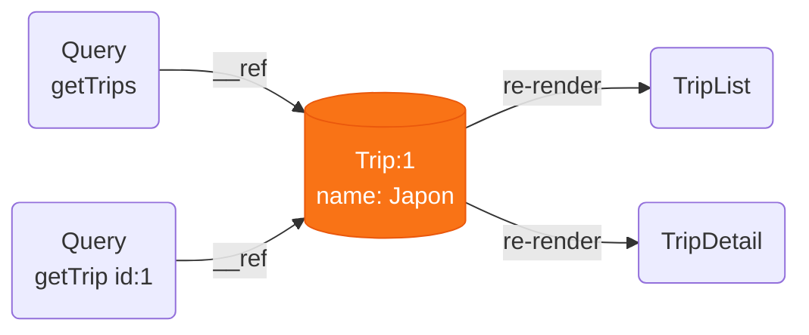
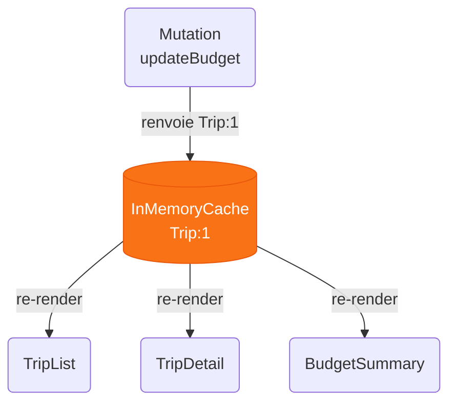

# Chapitre 3
## L'état serveur
<div class="opacity-80 pt-2">Le cache d'appels réseau</div>

---

# État local, état distant

<div v-click class="flex items-center justify-center gap-3 pt-2 text-sm">
  <div class="border border-gray-500 rounded-lg px-4 py-2 text-center">
    <div class="text-3xl">🖥️</div>
    <div class="opacity-60 pt-1">UI</div>
  </div>
  <div class="text-orange-400 text-center px-1 leading-tight">
    <div class="text-2xl leading-none">←</div>
    <div class="text-2xl leading-none">→</div>
  </div>
  <div class="border-2 border-orange-500 rounded-lg px-4 py-2 text-center bg-orange-400/10">
    <div class="text-3xl">💻</div>
    <div class="opacity-80 pt-1">Client · React</div>
  </div>
  <div class="text-orange-400 text-center px-1">
    <div class="text-[10px] uppercase tracking-wider opacity-70">réseau · async</div>
    <div class="text-2xl leading-none">←</div>
  </div>
  <div class="border border-gray-500 rounded-lg px-4 py-2 text-center">
    <div class="text-3xl">🗄️</div>
    <div class="opacity-60 pt-1">Serveur / DB</div>
  </div>
</div>

<div class="grid grid-cols-2 gap-10 pt-16">
<div v-click class="text-center">

### State local
<div class="text-xs opacity-50 pt-1">généré sur le client</div>
<div class="text-5xl py-3">🔒</div>
<b>Possédé par le client</b>

<div class="text-sm opacity-60 pt-2">
Synchrone<br>
Toujours « frais »
</div>

</div>
<div v-click class="text-center border-l border-gray-600 pl-8">

### State distant
<div class="text-xs opacity-50 pt-1">copie d'une donnée d'ailleurs</div>
<div class="text-5xl py-3">🌐</div>
<b>Emprunté par le client</b>

<div class="text-sm opacity-60 pt-2">
<span v-mark.orange>Asynchrone</span> · d'autres le changent<br>
Peut périmer à tout moment
</div>

</div>
</div>

<!--
Le client centralise le state mais il ne le possède pas intégralement.

On revient à la question : "où vit le state" ?

Le state asynchrone demande à être géré différemment du state synchrone.
-->

---

# Limitations des outils classiques

<div class="grid grid-cols-2 gap-6 items-center">
<div>

```tsx
function TripList() {
  const [data, setData] = useState()
  const [error, setError] = useState()
  const [isLoading, setLoading] = useState(true)

  useEffect(() => {
    fetchTrips()
      .then(setData)
      .catch(setError)
      .finally(() => setLoading(false))
  }, [])

  if (isLoading) return <Spinner />
  if (error) return <Error />
  return <Trips trips={data} />
}
```

</div>
<div>

<ul class="space-y-4 list-disc list-inside">
<li v-click>beaucoup de code à écrire <b>à la main</b></li>
<li v-click>autant d'occasions de se <b>tromper</b></li>
<li v-click>difficile à <b>maintenir</b></li>
<li v-click>comment assurer la synchronisation entre tous les composants qui consomment la donnée ?</li>
</ul>

</div>
</div>

<!--
Problème de faire ça à la main : beaucoup de code fragile, et aucune synchro entre composants.
-->

---

# Gérer ≠ aller chercher

<div class="flex items-stretch justify-center gap-4 pt-10 text-sm">
<div v-click class="border-2 border-orange-500 rounded-lg p-4 text-center w-56 bg-orange-400/10 flex flex-col justify-center">
<div class="font-bold pb-2">Le gestionnaire de state async</div>
<div class="text-xs opacity-50 pt-2">cache · dédup · revalidation · invalidation · gestion d'erreurs</div>
</div>

<div v-click class="flex flex-col items-center justify-center px-2 text-orange-400 w-44">
<div class="flex flex-col items-center">
<div class="text-[11px] uppercase tracking-wider opacity-80 pb-1">orchestre l'appel</div>
<div class="text-2xl leading-none">→</div>
</div>
<div class="flex flex-col items-center pt-3">
<div class="text-2xl leading-none">←</div>
<div class="text-[11px] uppercase tracking-wider opacity-80 pt-1">Promesse</div>
</div>
</div>

<div v-click class="border border-gray-600 rounded-lg p-4 text-center w-56 flex flex-col justify-center">
<div class="font-bold pb-2">La stack réseau</div>
<div class="opacity-70 leading-relaxed"><code>fetch</code> · <code>axios</code><br>client GraphQL · headers d'auth…</div>
</div>
</div>

<!--
Les libs d'état asynchrone demandent juste qu'on leur passe une fonction qui renvoie une promesse, elles ne gèrent pas cette fonction elles-mêmes.
-->

---
layout: cover
crumb: { tool: "SWR" }
image: /covers/factory-jon-meyer.jpg
credit: Jon Meyer
---

# SWR

<div class="text-xl opacity-80 pt-3">Une bibliothèque minimaliste de gestion de state serveur</div>

---

# SWR

<FicheSolution
  annee="2019"
  auteur="Shu Ding — Vercel"
  tagline="La donnée distante en un hook : on sert le cache, on revalide en fond."
  probleme="La gestion manuelle de state asynchrone est pénible, peu maintenable et ne scale pas."
  creneau="Le state serveur simple : afficher de la donnée fraîche facilement. Minimaliste et quasi sans config."
  :infos="[
    'Développé par Vercel, l\'équipe derrière Next.js — intégration naturelle avec.',
    'Très léger (~4 kB) : un seul hook, pas de Provider obligatoire, presque pas de config.',
    'Centré sur la lecture et la revalidation ; les mutations restent plus minimalistes que chez TanStack Query.',
  ]"
/>

<!--
SWR est la solution la plus minimaliste pour gérer du state serveur.
-->

---
layout: center
---

# Stale-While-Revalidate

<div class="text-center text-sm opacity-60 pt-2"><b>RFC HTTP 5861</b> — un pattern d'invalidation de cache générique</div>

<div class="max-w-xl mx-auto pt-10 text-lg space-y-4">
<div v-click>on sert la donnée <b>du cache</b>, quoi qu'il arrive</div>
<div v-click>on envoie une requête pour <b>revalider</b> en fond</div>
<div v-click>on <b>remplace</b> si la donnée a changé</div>
</div>

<!--
SWR = stale-while-revalidate, une stratégie d'invalidation de
cache classique : on sert le cache, on revalide en fond, on remplace si besoin. C'est un
standard HTTP (RFC 5861) — la librairie ne fait que l'implémenter côté React.
-->

---

# `useSWR`

<div class="grid grid-cols-[3fr_2fr] gap-10 items-center pt-5">
<div>

```tsx
import useSWR from 'swr'

const fetcher = (url) => fetch(url).then(r => r.json())
const { data, error, isLoading } =
  useSWR('/api/trips', fetcher)
```

</div>
<div>

</div>
</div>

<div class="flex items-center justify-center gap-4 pt-8 text-sm">

<div class="flex flex-col gap-3">
<div v-click="1" class="border border-gray-500 rounded-lg px-4 py-2 text-center">
<div class="opacity-60 text-xs pb-1">Composant A</div>
<code>useSWR('trips')</code>
</div>
<div v-click="5" class="border border-gray-500 rounded-lg px-4 py-2 text-center">
<div class="opacity-60 text-xs pb-1">Composant B</div>
<code>useSWR('trips')</code>
</div>
</div>

<div class="flex flex-col items-center text-orange-400 px-1">
<div v-click="2" class="text-2xl leading-none">→</div>
<div v-click="5" class="text-[10px] uppercase tracking-wider opacity-80 pt-1">même clé</div>
</div>

<div v-click="2" class="border-2 border-orange-500 rounded-lg px-5 py-3 text-center bg-orange-400/10">
<div class="font-bold pb-1">Cache SWR</div>
<div class="text-xs opacity-70"><code>'trips'</code> → 1 entrée</div>
</div>

<div v-click="[3,4]" class="flex flex-col items-center text-orange-400 px-1">
<div class="text-[10px] uppercase tracking-wider opacity-80 pb-1">1 seule requête</div>
<div class="text-2xl leading-none">→</div>
</div>

<div v-click="[3,4]" class="border border-gray-500 rounded-lg px-4 py-3 text-center">
<div class="text-3xl">🗄️</div>
<div class="opacity-60 pt-1 text-xs">Serveur</div>
</div>

</div>

<!--
SWR = un seul hook. On passe une clé et une fonction de fetch.
Trois valeurs de retours (de base) : data, error, isLoading.
Les requêtes pour une clé sont dédupliquées puis stockées en cache.
-->

---

# Clé de requête

```tsx
const fetcher = (url) => fetch(url).then(r => r.json())
useSWR('/api/trips', fetcher)

const getTrip = ([url, id]) => fetch(`${url}/${id}`).then(r => r.json())
useSWR(['/api/trips', tripId], getTrip)
```

<div class="grid grid-cols-[1fr_auto_1fr] items-start gap-6 pt-16 text-2xl font-mono">

<!-- colonne clé -->
<div class="flex flex-col items-end gap-3">
<div class="text-[11px] uppercase tracking-wider opacity-50 font-sans">clé</div>
<div class="relative h-14 w-full flex items-center justify-end">
<div v-click="[1,3]" class="absolute inset-0 flex items-center justify-end text-orange">'/api/trips'</div>
<div v-click="3" class="absolute inset-0 flex items-center justify-end text-orange">['/api/trips', 1]</div>
</div>
</div>

<!-- fetcher -->
<div class="relative w-32 h-14 self-end">
<div v-click="[2,3]" class="absolute inset-0 flex flex-col items-center justify-center text-orange">
<div class="text-[11px] uppercase tracking-wider opacity-70 font-sans">fetcher</div>
<div class="text-3xl leading-none">→</div>
</div>
<div v-click="4" class="absolute inset-0 flex flex-col items-center justify-center text-orange">
<div class="text-[11px] uppercase tracking-wider opacity-70 font-sans">fetcher</div>
<div class="text-3xl leading-none">→</div>
</div>
</div>

<!-- colonne endpoint -->
<div class="flex flex-col items-start gap-3">
<div class="text-[11px] uppercase tracking-wider opacity-50 font-sans">endpoint</div>
<div class="relative h-14 w-full flex items-center justify-start">
<div v-click="[2,3]" class="absolute inset-0 flex items-center justify-start"><span class="opacity-50">GET&nbsp;</span>/api/trips</div>
<div v-click="4" class="absolute inset-0 flex items-center justify-start"><span class="opacity-50">GET&nbsp;</span>/api/trips/1</div>
</div>
</div>

</div>

<!--
La clé est passée en argument au fetcher, donc le plus souvent c'est l'URL
elle-même. Avantage : pas de clé à maintenir à part.
Possibilité d'avoir des clés composites avec un tableau : tous les arguments sont passés au fetcher,
qui reconstruit l'URL (ici ['/api/trips', 1] → /api/trips/1). Possibilité d'arguments dynamiques.
La clé sert aussi d'identifiant de cache : deux composants avec la même clé = une seule requête, dédupliquée.
-->

---

# Un seul *fetcher*, réutilisé partout

<div class="grid grid-cols-[3fr_2fr] gap-8 items-center pt-2">
<div>

```tsx
// défini une fois pour toute l'app
const fetcher = (url) => fetch(url).then(r => r.json())

useSWR('/api/trips', fetcher)
useSWR(`/api/trips/${id}`, fetcher)
useSWR('/api/me', fetcher)

// ou en global → plus besoin de le repasser
<SWRConfig value={{ fetcher }}>
```

</div>
</div>

<!--
Fetcher = comment on va chercher la donnée, donc plutôt générique. On en a un par app en général.
On peut le déterminer dans le provider de config (et surcharger dans le hook au besoin).
-->

---

# Bonne pratique : un hook custom par ressource

```tsx
const useTrips = ()   => useSWR('/api/trips', fetcher)
const useTrip  = (id) => useSWR(`/api/trips/${id}`, fetcher)

function TripList() {
  const { data, isLoading } = useTrips()
  // ...
}
```

<!--
Bonne pratique recommandée : un hook custom par ressource. Le composant ne voit plus ni l'URL
ni le fetcher — juste useTrips(). La dépendance de données devient explicite et réutilisable.
-->

---

# Requêtes conditionnelles & dépendantes

```tsx
// ❌ Rules of Hooks : impossible d'appeler useSWR dans un if
if (userId) {
  const { data } = useSWR(`/api/users/${userId}`, fetcher)
}
```

<div class="flex items-center justify-center gap-4 pt-10 text-sm">

<div v-click="1" class="border border-gray-500 rounded-lg px-4 py-3 text-center">
<div class="opacity-60 text-xs pb-2">Composant</div>
<div class="relative">
<code v-click="[1,2]" class="whitespace-nowrap">useSWR(userId ? `/users/${userId}` : null)</code>
<code v-click="[2,3]" class="absolute inset-0 whitespace-nowrap text-orange-400">useSWR(null)</code>
<code v-click="[3,4]" class="absolute inset-0 whitespace-nowrap">useSWR(() => `/projects/${me.id}`)</code>
<code v-click="4" class="absolute inset-0 whitespace-nowrap text-orange-400">useSWR(💣)</code>
</div>
</div>

<div class="relative flex flex-col items-center px-1 text-gray-600">
<div v-click="[2,3]" class="text-2xl leading-none line-through decoration-2">→</div>
<div v-click="4" class="absolute inset-0 flex items-center justify-center text-2xl leading-none line-through decoration-2">→</div>
</div>

<div class="relative">
<div v-click="[2,3]" class="border-2 border-gray-600 rounded-lg px-5 py-3 text-center opacity-40 flex flex-col justify-center">
<div class="font-bold pb-1">SWR</div>
<div class="text-xs">non appelé — 0 requête</div>
</div>
<div v-click="4" class="absolute inset-0 border-2 border-gray-600 rounded-lg px-5 py-3 text-center opacity-40 flex flex-col justify-center">
<div class="font-bold pb-1">SWR</div>
<div class="text-xs">non appelé — 0 requête</div>
</div>
</div>

</div>

<!--
Rules of hooks, on peut pas appeler useSWR conditionnellement (dans un if).
La clé permet ce pattern en étant définie dynamiquement : on passe l'expression directement en clé.
Ici userId ? url : null — quand userId est défini la clé résout en URL et la requête part ;
quand il est undefined la clé résout en null et SWR n'exécute rien.
Même mécanisme pour les requêtes dépendantes : une clé sous forme de fonction qui throw ou
renvoie null (ex. () => `/projects/${me.id}` tant que me est absent) est simplement sautée.
-->

---

# Patterns avancés

<div class="grid grid-cols-2 grid-rows-2 gap-4 pt-4 text-sm">

<div v-click class="border border-gray-600 rounded-lg p-4 flex flex-col items-center justify-center text-center">
<div class="font-bold pb-2"><code>isLoading</code> vs <code>isValidating</code></div>

```ts
const { isLoading, isValidating } = useSWR(key, f)
```

</div>

<div v-click class="border border-gray-600 rounded-lg p-4 flex flex-col items-center justify-center text-center">
<div class="font-bold pb-2"><code>keepPreviousData</code></div>

```ts
useSWR(`/search?q=${q}`, f, { keepPreviousData: true })
```

</div>

<div v-click class="border border-gray-600 rounded-lg p-4 flex flex-col items-center justify-center text-center">
<div class="font-bold pb-2">Re-render fin</div>

```ts
const { data } = useSWR(key, f)
```

</div>

<div v-click class="border border-gray-600 rounded-lg p-4 flex flex-col items-center justify-center text-center">
<div class="font-bold pb-2"><code>mutate</code> — écrire dans le cache</div>

```ts
const { data, mutate } = useSWR('/api/trips', f)
```

</div>

</div>

<!--
Patterns avancés pour faire des choses plus poussées.
-->

---

# Bilan

<Bilan
  :scores="[5, 4, 4, 2, 1]"
  poids="5 kB (gzip)"
  perimetre="State serveur / async"
  idealPour="Apps simples à moyennes, surtout en lecture"
  :avantages="[
    'Un seul hook, zéro config',
    'Cache, dédup & revalidation gratuits',
    'Conditionnel / dépendant faciles',
  ]"
  :limites="[
    'APIs pauvres dès qu\'on mute beaucoup',
    'Petite communauté, peu d\'évolutions',
    'Doc parfois imprécise, pas de devtools',
  ]"
/>

<!--
Bilan, tout est sur la slide.
-->

---
layout: cover
crumb: { tool: "TanStack Query" }
image: /covers/factory-wolfgang-weiser.jpg
credit: Wolfgang Weiser
---

# TanStack Query

<div class="text-xl opacity-80 pt-3">Le standard de la gestion de state serveur</div>

---

# TanStack Query

<FicheSolution
  annee="2020"
  auteur="Tanner Linsley — TanStack"
  tagline="Le state serveur résolu : cache, déduplication, revalidation et invalidation, prêts à l'emploi."
  probleme="Problème de gestion du state asynchrone à l'échelle dans le cycle de vie complet d'une application : mutations, invalidations..."
  creneau="Tout state serveur : la donnée asynchrone qu'on ne possède pas, quelle que soit la stack réseau (REST, GraphQL, fonctions RPC…)."
  :infos="[
    'Né React Query en 2020, devenu LE standard du state serveur côté React.',
    'Refactoré en un noyau agnostique + adaptateurs : React, Vue, Svelte, Solid, Angular.',
    'Plus complet que SWR : mutations, invalidation ciblée par clé, et des Devtools dédiés.',
  ]"
/>

<!--
Première slide de la sous-section, sur la même fiche que nuqs et SWR. L'outil est né React Query
— Tanner Linsley, devenu LE standard du state serveur côté React. Le projet a ensuite été
refactoré : un noyau pur, framework-agnostic, et des adaptateurs (React, Vue, Svelte, Solid,
Angular). D'où le rebrand TanStack — une famille de libs headless pour le frontend moderne :
Query, Table, Router, Form, Virtual… On ne couvre que Query, mais le nom n'est plus « React »
par hasard.
-->

---

# `useQuery`

```tsx
const { data, isPending, isError } = useQuery({
  queryKey: ['trips', tripId],          // identifiant unique de la donnée
  queryFn: () => fetchTrip(tripId),     // comment la récupérer (renvoie une promesse)
})
```

<div v-click class="pt-3 text-center text-sm opacity-80">
Différence : la clé et la fonction sont <span v-mark.orange>découplées</span>
</div>

<!--
Comme SWR, sauf que la clé n'est pas passée à la fonction de query, les deux ne sont plus strictement corrélées, même si dans les faits il y a toujours une corrélation. Plus flexible.
-->

---

# Invalidation hiérarchique

<!-- panneau « cache » : chaque état d'invalidation se peint par-dessus le précédent (un seul visible à la fois) -->
<div class="relative p-4 h-[250px]">

<!-- état de base : le cache, toujours visible sous les couches suivantes -->
<div class="absolute inset-0 p-4 pt-20">
<div class="grid grid-cols-5 gap-2 text-[11px] font-mono">
<div class="border border-gray-500 rounded-md p-2">
<div class="font-sans text-[9px] uppercase tracking-wide opacity-50 pb-1">Liste</div>
<div class="leading-tight break-words">['trips']</div>
</div>
<div class="border border-gray-500 rounded-md p-2">
<div class="font-sans text-[9px] uppercase tracking-wide opacity-50 pb-1">Voyage 1</div>
<div class="leading-tight break-words">['trips', 1]</div>
</div>
<div class="border border-gray-500 rounded-md p-2">
<div class="font-sans text-[9px] uppercase tracking-wide opacity-50 pb-1">Budget V1</div>
<div class="leading-tight break-words">['trips', 1, 'budget']</div>
</div>
<div class="border border-gray-500 rounded-md p-2">
<div class="font-sans text-[9px] uppercase tracking-wide opacity-50 pb-1">Voyage 2</div>
<div class="leading-tight break-words">['trips', 2]</div>
</div>
<div class="border border-gray-500 rounded-md p-2">
<div class="font-sans text-[9px] uppercase tracking-wide opacity-50 pb-1">Profil</div>
<div class="leading-tight break-words">['users', 'me']</div>
</div>
</div>
</div>

<!-- click 1 — globale : tout est stale -->
<div v-click class="absolute inset-0 p-4 pt-20" style="background-color:#ffffff">
<div class="grid grid-cols-5 gap-2 text-[11px] font-mono">
<div class="border border-orange-400/40 rounded-md p-2 opacity-40">
<div class="font-sans text-[9px] uppercase tracking-wide text-orange-400 pb-1">stale</div>
<div class="leading-tight break-words line-through">['trips']</div>
</div>
<div class="border border-orange-400/40 rounded-md p-2 opacity-40">
<div class="font-sans text-[9px] uppercase tracking-wide text-orange-400 pb-1">stale</div>
<div class="leading-tight break-words line-through">['trips', 1]</div>
</div>
<div class="border border-orange-400/40 rounded-md p-2 opacity-40">
<div class="font-sans text-[9px] uppercase tracking-wide text-orange-400 pb-1">stale</div>
<div class="leading-tight break-words line-through">['trips', 1, 'budget']</div>
</div>
<div class="border border-orange-400/40 rounded-md p-2 opacity-40">
<div class="font-sans text-[9px] uppercase tracking-wide text-orange-400 pb-1">stale</div>
<div class="leading-tight break-words line-through">['trips', 2]</div>
</div>
<div class="border border-orange-400/40 rounded-md p-2 opacity-40">
<div class="font-sans text-[9px] uppercase tracking-wide text-orange-400 pb-1">stale</div>
<div class="leading-tight break-words line-through">['users', 'me']</div>
</div>
</div>
<div class="text-center font-mono text-orange pt-5">invalidateQueries()</div>
</div>

<!-- click 2 — par domaine : tout le sous-arbre ['trips'] -->
<div v-click class="absolute inset-0 p-4 pt-20" style="background-color:#ffffff">
<div class="grid grid-cols-5 gap-2 text-[11px] font-mono">
<div class="border border-orange-400/40 rounded-md p-2 opacity-40">
<div class="font-sans text-[9px] uppercase tracking-wide text-orange-400 pb-1">stale</div>
<div class="leading-tight break-words line-through">['trips']</div>
</div>
<div class="border border-orange-400/40 rounded-md p-2 opacity-40">
<div class="font-sans text-[9px] uppercase tracking-wide text-orange-400 pb-1">stale</div>
<div class="leading-tight break-words line-through">['trips', 1]</div>
</div>
<div class="border border-orange-400/40 rounded-md p-2 opacity-40">
<div class="font-sans text-[9px] uppercase tracking-wide text-orange-400 pb-1">stale</div>
<div class="leading-tight break-words line-through">['trips', 1, 'budget']</div>
</div>
<div class="border border-orange-400/40 rounded-md p-2 opacity-40">
<div class="font-sans text-[9px] uppercase tracking-wide text-orange-400 pb-1">stale</div>
<div class="leading-tight break-words line-through">['trips', 2]</div>
</div>
<div class="border border-gray-500 rounded-md p-2">
<div class="font-sans text-[9px] uppercase tracking-wide opacity-50 pb-1">Profil</div>
<div class="leading-tight break-words">['users', 'me']</div>
</div>
</div>
<div class="text-center font-mono text-orange pt-5">invalidateQueries({ queryKey: ['trips'] })</div>
</div>

<!-- click 3 — ciblée : le voyage 1 et ses enfants -->
<div v-click class="absolute inset-0 p-4 pt-20" style="background-color:#ffffff">
<div class="grid grid-cols-5 gap-2 text-[11px] font-mono">
<div class="border border-gray-500 rounded-md p-2">
<div class="font-sans text-[9px] uppercase tracking-wide opacity-50 pb-1">Liste</div>
<div class="leading-tight break-words">['trips']</div>
</div>
<div class="border border-orange-400/40 rounded-md p-2 opacity-40">
<div class="font-sans text-[9px] uppercase tracking-wide text-orange-400 pb-1">stale</div>
<div class="leading-tight break-words line-through">['trips', 1]</div>
</div>
<div class="border border-orange-400/40 rounded-md p-2 opacity-40">
<div class="font-sans text-[9px] uppercase tracking-wide text-orange-400 pb-1">stale</div>
<div class="leading-tight break-words line-through">['trips', 1, 'budget']</div>
</div>
<div class="border border-gray-500 rounded-md p-2">
<div class="font-sans text-[9px] uppercase tracking-wide opacity-50 pb-1">Voyage 2</div>
<div class="leading-tight break-words">['trips', 2]</div>
</div>
<div class="border border-gray-500 rounded-md p-2">
<div class="font-sans text-[9px] uppercase tracking-wide opacity-50 pb-1">Profil</div>
<div class="leading-tight break-words">['users', 'me']</div>
</div>
</div>
<div class="text-center font-mono text-orange pt-5">invalidateQueries({ queryKey: ['trips', 1] })</div>
</div>

<!-- click 4 — exacte : uniquement la liste, sans son sous-arbre -->
<div v-click class="absolute inset-0 p-4 pt-20" style="background-color:#ffffff">
<div class="grid grid-cols-5 gap-2 text-[11px] font-mono">
<div class="border border-orange-400/40 rounded-md p-2 opacity-40">
<div class="font-sans text-[9px] uppercase tracking-wide text-orange-400 pb-1">stale</div>
<div class="leading-tight break-words line-through">['trips']</div>
</div>
<div class="border border-gray-500 rounded-md p-2">
<div class="font-sans text-[9px] uppercase tracking-wide opacity-50 pb-1">Voyage 1</div>
<div class="leading-tight break-words">['trips', 1]</div>
</div>
<div class="border border-gray-500 rounded-md p-2">
<div class="font-sans text-[9px] uppercase tracking-wide opacity-50 pb-1">Budget V1</div>
<div class="leading-tight break-words">['trips', 1, 'budget']</div>
</div>
<div class="border border-gray-500 rounded-md p-2">
<div class="font-sans text-[9px] uppercase tracking-wide opacity-50 pb-1">Voyage 2</div>
<div class="leading-tight break-words">['trips', 2]</div>
</div>
<div class="border border-gray-500 rounded-md p-2">
<div class="font-sans text-[9px] uppercase tracking-wide opacity-50 pb-1">Profil</div>
<div class="leading-tight break-words">['users', 'me']</div>
</div>
</div>
<div class="text-center font-mono text-orange pt-5">invalidateQueries({ queryKey: ['trips'], exact: true })</div>
</div>

</div>

<!--
Clé complexe = invalidation fine. Tout est possible, on peut invalider tout le store ou que certaines parties, jusqu'à certaines requêtes uniques. exact : true permet d'invalider finement une requête de haut niveau.
-->

---

# Cycle de vie : stale-while-revalidate

<div class="w-fit mx-auto pt-6 grid items-center" style="grid-template-columns: repeat(7, auto); column-gap: 0.5rem;">

  <!-- boucle de revalidation (stale → fetching) -->
  <div v-click="5" class="row-start-1 col-start-3 col-end-8 mx-12 text-center text-xs text-orange-400 pb-1">refocus · reconnexion · remontage</div>
  <div v-click="5" class="row-start-2 col-start-3 col-end-8 mx-12 mb-2 relative h-6">
    <div class="h-full border-t-2 border-l-2 border-r-2 border-dashed border-orange-500 rounded-t-lg"></div>
    <!-- pointe de flèche vers le bas, juste au-dessus de « fetch » -->
    <div class="absolute bottom-0 left-0 translate-y-1/2 -translate-x-1/2 w-2 h-2 border-r-2 border-b-2 border-orange-500 rotate-45"></div>
  </div>

  <!-- ligne d'états -->
  <div v-click="1" class="row-start-3 col-start-1 border border-gray-500 rounded-lg px-3 py-2 text-center text-sm w-24">🪝<div class="opacity-70 pt-1">mount</div></div>
  <div v-click="1" class="row-start-3 col-start-2 text-gray-400 text-xl text-center">→</div>
  <div v-click="1" class="row-start-3 col-start-3 border border-gray-500 rounded-lg px-3 py-2 text-center text-sm w-24">⏳<div class="opacity-70 pt-1">fetch</div></div>
  <div v-click="2" class="row-start-3 col-start-4 text-gray-400 text-xl text-center">→</div>
  <div v-click="2" class="row-start-3 col-start-5 rounded-lg px-3 py-2 text-center text-sm w-24 bg-green-500 text-white">✨<div class="pt-1">fresh</div></div>
  <div v-click="3" class="row-start-3 col-start-6 flex flex-col items-center text-gray-400 px-1">
    <div class="text-[10px] uppercase tracking-wide text-center leading-tight pb-0.5">staleTime<br>écoulé</div>
    <div class="text-xl leading-none">→</div>
  </div>
  <div v-click="3" class="row-start-3 col-start-7 rounded-lg px-3 py-2 text-center text-sm w-24 bg-orange-500 text-white">🍂<div class="pt-1">stale</div></div>

  <!-- flèches vers l'UI, depuis fresh et stale -->
  <div v-click="4" class="row-start-4 col-start-5 text-center text-gray-400 text-xl leading-none pt-1">↓</div>
  <div v-click="4" class="row-start-4 col-start-7 text-center text-gray-400 text-xl leading-none pt-1">↓</div>

  <div v-click="4" class="row-start-5 col-start-5 col-end-8 text-center text-xs text-gray-400">sert la valeur en cache, fraîche ou périmée</div>
  <div v-click="4" class="row-start-6 col-start-5 col-end-8 flex justify-center pt-1">
    <div class="border-2 border-gray-400 rounded-lg px-6 py-2 text-center text-sm">🖥️ <b>UI</b></div>
  </div>

</div>

<!--
Cycle de vie de la donnée dans TSQ.
Staletime = 0 par défaut (la donnée est toujours stale)
Stale n'implique pas un refetch immédiat, éligible à un refetch lors du refocus, reconnexion, remount.
Régler le stale time est une affaire de stratégie.
-->

---

# `useMutation`

<div class="grid grid-cols-[5fr_4fr] gap-8 items-center pt-2">
<div>

```ts
const { mutate } = useMutation({
  mutationFn: (trip) => api.post('/trips', trip),
  onSuccess: () => {
    queryClient.invalidateQueries({ queryKey: ['trips'] })
  },
})
```

</div>
</div>

<div v-click class="pt-6">
<div class="opacity-50 uppercase text-xs tracking-widest pb-3">Cycle de vie des callbacks</div>
<div class="flex items-center justify-center gap-2 text-xs">

<!-- déclenchement -->
<div class="border border-gray-600 rounded-lg px-3 py-2 text-center">
<code>mutate()</code>
<div class="opacity-50 text-[10px]">appel</div>
</div>
<span class="text-orange text-lg leading-none">→</span>

<!-- onMutate -->
<div class="border border-orange-400 rounded-lg px-3 py-2 text-center">
<code class="text-orange">onMutate</code>
<div class="opacity-50 text-[10px]">avant</div>
</div>
<span class="text-orange text-lg leading-none">→</span>

<!-- mutationFn -->
<div class="border border-gray-600 rounded-lg px-3 py-2 text-center">
<code>mutationFn</code>
<div class="opacity-50 text-[10px]">requête</div>
</div>
<span class="text-orange text-lg leading-none">→</span>

<!-- fourche succès / échec -->
<div class="flex flex-col gap-2">
<div class="border border-orange-400 rounded-lg px-3 py-1.5 text-center">
<code class="text-orange">onSuccess</code> <span class="opacity-50 text-[10px]">réussite</span>
</div>
<div class="border border-orange-400 rounded-lg px-3 py-1.5 text-center">
<code class="text-orange">onError</code> <span class="opacity-50 text-[10px]">échec</span>
</div>
</div>
<span class="text-orange text-lg leading-none">→</span>

<!-- onSettled -->
<div class="border border-orange-400 rounded-lg px-3 py-2 text-center">
<code class="text-orange">onSettled</code>
<div class="opacity-50 text-[10px]">toujours</div>
</div>

</div>
</div>

<!--
useMutation est l'équivalent de useQuery pour le POST/PUT/DELETE (action sur le serveur). Ca ne fait pas tourner la fonction,
mais ça la renvoie décorée.
-->

---

# DevTools


<!--
Feature majeure de TSQ
Permet d'inspecter le cache, l'état de chaque requête, voir l'invalidation.
On peut agir dessus.
-->

---

# Patterns avancés

<div class="grid grid-cols-2 grid-rows-2 gap-4 pt-4 text-sm">

<div v-click class="border border-gray-600 rounded-lg p-4 flex flex-col items-center justify-center text-center">
<div class="font-bold pb-2">Mise à jour optimiste</div>

```ts
useMutation({ mutationFn, onMutate, onError,
 onSettled })
```

</div>

<div v-click class="border border-gray-600 rounded-lg p-4 flex flex-col items-center justify-center text-center">
<div class="font-bold pb-2"><code>placeholderData</code> · <code>keepPreviousData</code></div>

```ts
useQuery({ queryKey: ['trips', page], queryFn,
  placeholderData: keepPreviousData })
```

</div>

<div v-click class="border border-gray-600 rounded-lg p-4 flex flex-col items-center justify-center text-center">
<div class="font-bold pb-2"><code>select</code> · <code>prefetchQuery</code></div>

```ts
useQuery({ queryKey, queryFn, select: d => d.trips })
queryClient.prefetchQuery({ queryKey, queryFn })
```

</div>

<div v-click class="border border-gray-600 rounded-lg p-4 flex flex-col items-center justify-center text-center">
<div class="font-bold pb-2"><code>useInfiniteQuery</code></div>

```ts
useInfiniteQuery({ queryKey, queryFn, 
getNextPageParam })
```

</div>

</div>

<!--
 * Optimistic rendering with mutations (onMutate)
 * keepPreviousData : garde la donnée si la query change tant que la nouvelle donnée n'est pas arrivée
 * Select (ne re-render que à une partie de la donnée) / prefetchQuery : prefetch les données
 * useInfiniteQuery : permet de faire du chargement infini.
-->

---
layout: center
class: text-center
---

# Pour aller plus loin

<div class="flex justify-center pt-4">
  <Youtube id="NwSmWe2IRFM" width="720" height="405" />
</div>

<!--
Slide de clôture de la partie TanStack Query. Renvoyer vers la ressource vidéo pour approfondir.
-->

---

# Bilan

<Bilan
  :scores="[4, 3, 5, 5, 5]"
  poids="13,3 kB (gzip)"
  perimetre="State serveur / async"
  idealPour="De l'app simple au gros projet, lecture comme écriture"
  :avantages="[
    'Queries + mutations, états & cache gérés',
    'Invalidation hiérarchique, DevTools',
    'Agnostique du transport, énorme écosystème',
  ]"
  :limites="[
    'Plus lourd que SWR',
    'Courbe d\'apprentissage (clés, staleTime…)',
    'Bien le configurer demande de comprendre le modèle',
  ]"
/>

<!--
Bilan : standard de la gestion de state serveur. Enormément de possibilités et d'options, très puissant.
-->

---
layout: cover
crumb: { tool: "Apollo Client" }
image: /covers/factory-gnep-photo.avif
credit: Gnep Photo
---

<h1 class="text-7xl font-bold">Apollo Client</h1>
<div class="text-2xl opacity-60 pt-6">Le client GraphQL de référence</div>

---

# `Apollo Client`

<FicheSolution
  annee="2016"
  auteur="Meteor Development Group → Apollo GraphQL"
  tagline="Un client GraphQL complet : cache normalisé, mutations, subscriptions."
  probleme="REST impose la forme des réponses côté serveur (over-fetching, under-fetching, allers-retours multiples)."
  creneau="API GraphQL existante avec des entités partagées entre plusieurs vues, subscriptions temps réel, ou grands projets avec fragments co-localisés."
  :infos="[
    'Apollo Client est le client GraphQL le plus utilisé dans l\'écosystème React.',
    'Maintenu par Apollo GraphQL, qui développe aussi Apollo Server et Apollo Studio.',
    'Inclut InMemoryCache, un cache normalisé qui synchronise automatiquement les entités entre les vues.',
  ]"
/>

<!--
Apollo n'est pas un remplaçant de TanStack Query — c'est un outil pour une situation précise.
La question à poser : est-ce que le backend expose du GraphQL ? Si non, Apollo n'a aucun intérêt.
-->

---

# GraphQL inverse le contrat REST

<div class="grid grid-cols-2 gap-10 pt-6 items-start">
<div v-click>

### REST
<div class="text-xs opacity-50 pt-1">le serveur décide de la forme</div>

```tsx
// on reçoit ce que le serveur veut
GET /api/trips
→ { id, name, destination,
    budget, steps, users, … }
```

<div class="text-sm opacity-70 pt-3">
<b>Over-fetching</b> — des champs inutiles<br>
<b>Under-fetching</b> — plusieurs requêtes pour assembler une vue
</div>

</div>
<div v-click class="border-l border-gray-600 pl-8">

### GraphQL
<div class="text-xs opacity-50 pt-1">le client décide de la forme</div>

```tsx
// on demande exactement ce dont on a besoin
query GetTrip($id: ID!) {
  trip(id: $id) {
    id
    name
    budget   # uniquement ces champs
  }
}
```

<div class="text-sm opacity-70 pt-3">
Un seul endpoint · une seule requête<br>
La réponse a <span v-mark.orange>exactement la forme demandée</span>
</div>

</div>
</div>

<!--
Exemple concret d'under-fetching : une vue "détail de voyage" qui a besoin des étapes, du budget
et des membres — avec REST ça peut être 3 endpoints. GraphQL : une seule requête, zéro aller-retour superflu.
-->

---

# `useQuery` — le composant déclare ses besoins

```tsx
// Le composant déclare ses besoins, Apollo s'occupe du reste
const { data, loading, error } = useQuery(gql`
  query GetTrip($id: ID!) {
    trip(id: $id) {
      id
      name
      budget
    }
  }
`, { variables: { id: tripId } })
```

<div class="grid grid-cols-3 gap-6 pt-4 text-sm">
<div v-click class="border border-gray-600 rounded-lg p-3">
<code class="text-orange-400">data</code>
<div class="text-xs opacity-60 pt-1">La réponse GraphQL résolue</div>
</div>
<div v-click class="border border-gray-600 rounded-lg p-3">
<code class="text-orange-400">loading</code>
<div class="text-xs opacity-60 pt-1">Vrai pendant le premier chargement</div>
</div>
<div v-click class="border border-gray-600 rounded-lg p-3">
<code class="text-orange-400">error</code>
<div class="text-xs opacity-60 pt-1">Erreur réseau ou GraphQL</div>
</div>
</div>

<div v-click class="pt-5 text-center opacity-80">
Plus proche de SWR que de TanStack : la <span v-mark.orange>query GraphQL est à la fois la clé et le contrat</span> — pas de découplage.
</div>

<!--
Les variables jouent le rôle de la clé dynamique : si tripId change, Apollo refetch automatiquement.
Différence notable : loading (pas isPending) — Apollo garde son API historique.
-->

---

# Le cache normalisé — le cœur d'Apollo

<div class="text-center text-sm opacity-70 pb-4">La différence fondamentale avec TanStack Query ou SWR</div>

<div class="grid grid-cols-2 gap-10 items-start">
<div>

<div v-click>

**TanStack Query / SWR**
<div class="text-xs opacity-50 pb-2">cache par clé de requête</div>

```
cache
├── ['trips']       → [Trip, Trip, Trip]
├── ['trips', '1']  → Trip (copie)
└── ['trips', '2']  → Trip (copie)
```

<div class="text-xs opacity-60 pt-1">Muter Trip:1 → invalider manuellement toutes les clés concernées.</div>

</div>

</div>
<div v-click class="border-l border-gray-600 pl-8">

**Apollo — InMemoryCache**
<div class="text-xs opacity-50 pb-2">cache normalisé par entité</div>

```
InMemoryCache (store plat)
├── Trip:1  → { id, name, budget }
├── Trip:2  → { id, name, budget }
└── Step:7  → { …, trip: __ref:Trip:1 }
```

<div class="text-xs opacity-60 pt-1">Muter Trip:1 → <span class="text-orange-400">toutes les vues</span> qui référencent Trip:1 se mettent à jour automatiquement.</div>

</div>
</div>

<div v-click class="pt-4 text-center text-sm opacity-80">
Chaque objet a une clé : <code class="text-orange-400">__typename + id</code> → <code class="text-orange-400">Trip:1</code>, <code class="text-orange-400">Step:7</code>…
</div>

<div v-click class="pt-4 max-w-sm mx-auto">

```ts
// pas de onSuccess, pas d'invalidation
const [updateTrip] = useMutation(UPDATE_TRIP)
updateTrip({ variables: { id, budget } })
// Trip:1 se propage automatiquement
```

</div>

<!--
La clé de normalisation est construite automatiquement depuis __typename et id.
Si un objet n'a pas d'id, Apollo ne peut pas le normaliser — il stocke la réponse brute.
C'est le cas à connaître quand la normalisation ne fonctionne pas comme attendu.
-->

---

# Une entité, une source de vérité

<div class="text-sm opacity-70 pb-6 text-center">
Deux queries ramènent le même voyage — une seule entrée dans le cache.
</div>



<div v-click class="pt-4 grid grid-cols-2 gap-8 text-sm">
<div class="border-l-4 border-orange-500 pl-3">
Pas de copie dupliquée — les deux queries <b>pointent</b> vers la même entrée.
</div>
<div class="border-l-4 border-gray-600 pl-3">
Une mutation renvoie Trip:1 → <b>TripList et TripDetail</b> se re-rendent. Automatiquement.
</div>
</div>

<!--
C'est le scénario le plus courant dans une vraie app : une liste et une page détail
qui affichent la même entité. Avec TanStack il faudrait invalider les deux clés après une mutation.
Avec Apollo : rien à écrire.
-->

---

# La propagation automatique — mutations

<div class="grid grid-cols-2 gap-10 items-center pt-2">
<div>



</div>
<div class="space-y-6">

<div v-click>
Apollo calcule la clé de l'objet renvoyé (<code>Trip:1</code>),
merge les champs mis à jour dans le store,
et <span v-mark.orange>déclenche le re-render de tous les abonnés</span>.
</div>

<div v-click class="text-sm opacity-60 border-t border-gray-700 pt-4">
Pas d'invalidation à écrire. Pas de refetch manuel.<br>
<b>C'est un store global qui se met à jour lui-même.</b>
</div>

</div>
</div>

<!--
Condition nécessaire : la mutation doit renvoyer les champs modifiés dans sa réponse.
Si elle ne renvoie rien (204), Apollo ne peut pas merger — il faut invalider manuellement ou
mettre à jour le cache via cache.modify(). C'est l'exception, pas la règle.
-->

---

# Les fragments — co-location des données

<div class="text-sm opacity-70 pb-4">Chaque composant déclare <b>ses propres besoins</b> — indépendamment de la query qui l'encapsule.</div>

```tsx
// TripCard déclare ses besoins — colocalisés avec le composant
const TRIP_CARD_FIELDS = gql`
  fragment TripCardFields on Trip {
    id
    name
    destination
  }
`

// La page compose les fragments — sans connaître les détails
const { data } = useQuery(gql`
  ${TRIP_CARD_FIELDS}
  query GetTrips { trips { ...TripCardFields } }
`)

function TripList() {
  return data.trips.map(trip =>
    <TripCard key={trip.id} trip={trip} />
  )
}
```

<div v-click class="pt-3 text-center text-sm opacity-80">
Ajouter un champ à <code>TripCard</code> = modifier <b>uniquement son fragment</b>.<br>
La query s'adapte — <span v-mark.orange>comme la co-location CSS ou les tests unitaires</span>.
</div>

<!--
En pratique : quand un designer ajoute un champ à une card, le dev ne touche que le fragment
de cette card — pas la query de la page. Dans une grande équipe, c'est ce qui évite les
dépendances croisées et les PR qui cassent la query partagée.
-->

---

# Les subscriptions GraphQL natives

<div class="text-sm opacity-70 pb-4">GraphQL définit trois opérations : <code>query</code>, <code>mutation</code>, et <code>subscription</code>.</div>

```tsx
// Même API que useQuery — le composant reçoit les updates en temps réel
const { data } = useSubscription(gql`
  subscription OnTripUpdated($id: ID!) {
    tripUpdated(id: $id) { id budget }
  }
`, { variables: { id: tripId } })
```

<div class="grid grid-cols-3 gap-4 pt-5 text-sm">
<div v-click class="border border-gray-600 rounded-lg p-3">
<div class="font-bold pb-1">🔌 WebSocket</div>
<div class="opacity-70 text-xs">Connexion ouverte au montage, fermée au démontage.</div>
</div>
<div v-click class="border border-gray-600 rounded-lg p-3">
<div class="font-bold pb-1">🗃️ Cache intégré</div>
<div class="opacity-70 text-xs">Les données reçues passent par l'InMemoryCache → propagation automatique.</div>
</div>
<div v-click class="border border-gray-600 rounded-lg p-3">
<div class="font-bold pb-1">🧹 Cleanup</div>
<div class="opacity-70 text-xs">Comme un <code>useEffect</code> avec cleanup — Apollo gère la connexion.</div>
</div>
</div>

<!--
Contrairement à Convex qui arrive juste après, les subscriptions Apollo nécessitent
une configuration WebSocket côté serveur (subscriptions-transport-ws ou graphql-ws).
Ce n'est pas zéro config — mais une fois en place, le comportement est identique à useQuery.
-->

---

# Les Apollo DevTools

<div class="text-sm opacity-70 pb-6">
Une fenêtre sur le cache normalisé, en direct — extension Chrome et Firefox, zéro config.
</div>

<div class="grid grid-cols-3 gap-4 text-sm">
<div v-click class="border border-gray-600 rounded-lg p-4">
<div class="font-bold pb-1">🗂️ Le cache</div>
<div class="opacity-70">Toutes les entités <code>Trip:1</code>, <code>Step:7</code>… leurs champs et leurs références.</div>
</div>
<div v-click class="border border-gray-600 rounded-lg p-4">
<div class="font-bold pb-1">🔍 Les queries</div>
<div class="opacity-70">Chaque opération GraphQL active, ses variables et la réponse du cache.</div>
</div>
<div v-click class="border border-gray-600 rounded-lg p-4">
<div class="font-bold pb-1">🔄 Les mutations</div>
<div class="opacity-70">Historique des mutations et leur impact sur les entités du cache.</div>
</div>
</div>

<div v-click class="pt-8 text-center opacity-80">
On <span v-mark.orange>voit le cache normalisé vivre</span> — indispensable pour déboguer<br>
quand une entité ne se propage pas comme attendu.
</div>

<!--
Le cas d'usage typique : une entité ne se met pas à jour après une mutation.
On ouvre les DevTools, on inspecte l'entrée Trip:1 — soit le champ n'est pas dans la réponse
de la mutation, soit l'id est absent et la normalisation n'a pas fonctionné.
-->

---

# Quand choisir Apollo

<div class="grid grid-cols-2 gap-8 pt-6">
<div v-click class="border border-gray-600 rounded-lg p-5">

### Choisir TanStack Query
- n'importe quelle API (REST, RPC…)
- cache **par query** (par clé)
- agnostique du transport
- quelques endpoints → pas besoin de gérer un cache d'entités

</div>
<div v-click class="border-2 border-orange-500 rounded-lg p-5">

### Choisir Apollo
- API **GraphQL** existante côté backend
- entités partagées entre **plusieurs vues**
- **subscriptions** temps réel natives
- **fragments** : grands projets, co-location

</div>
</div>

<div v-click class="pt-6 text-center text-sm opacity-70">
Apollo n'est pas un remplaçant de TanStack Query — <span v-mark.orange>c'est un outil pour une situation précise</span>.
</div>

<!--
TanStack Query supporte GraphQL — un fetcher graphql-request suffit, et le bundle reste à 13 kB.
Apollo se justifie quand le graphe d'entités est complexe : beaucoup d'entités partagées entre vues,
mutations qui doivent se propager partout automatiquement. Si c'est 2-3 queries GraphQL, TanStack fait le job.
-->

---

# Limitations

<div class="grid grid-cols-3 gap-4 pt-6 text-sm">
<div v-click class="border border-gray-600 rounded-lg p-4">
<div class="text-2xl pb-2">📦</div>
<div class="font-bold pb-1">Bundle size</div>
<div class="opacity-70">~50 kB minifié + gzip — significatif pour une app légère.</div>
</div>
<div v-click class="border border-gray-600 rounded-lg p-4">
<div class="text-2xl pb-2">🔬</div>
<div class="font-bold pb-1">Complexité du cache</div>
<div class="opacity-70">Puissant, mais difficile à déboguer. Il faut comprendre <code>__typename</code>, <code>keyFields</code>, la normalisation.</div>
</div>
<div v-click class="border border-gray-600 rounded-lg p-4">
<div class="text-2xl pb-2">🚫</div>
<div class="font-bold pb-1">GraphQL uniquement</div>
<div class="opacity-70">Inutilisable avec REST sans couche de traduction. Nécessite une API GraphQL.</div>
</div>
</div>

<div v-click class="pt-6 text-center opacity-80">
Le cache normalisé est à double tranchant : <span v-mark.orange>quand une entité ne se met pas à jour comme attendu</span>,<br>
il faut comprendre les règles de normalisation pour déboguer.
</div>

<!--
À l'oral : insister sur le rapport 50 kB vs 13 kB (TanStack). Le delta se justifie
uniquement si on exploite vraiment le cache normalisé — sinon autant utiliser TanStack + un client GraphQL léger comme graphql-request.
-->

---

# Apollo Client — bilan

<Bilan
  :scores="[2, 1, 4, 4, 5]"
  poids="~50 kB (gzip)"
  perimetre="State serveur GraphQL"
  idealPour="API GraphQL, entités partagées entre vues, subscriptions, grands projets"
  :avantages="[
    'Cache normalisé : propagation automatique sans invalidation',
    'Subscriptions temps réel intégrées nativement',
    'Fragments : co-location des besoins en données par composant',
  ]"
  :limites="[
    'Bundle lourd (~50 kB) — justifié uniquement avec GraphQL',
    'Cache normalisé complexe à déboguer (__typename, keyFields)',
    'Nécessite une API GraphQL — inutilisable avec REST',
  ]"
/>

<!--
Enchaîner sur Convex : "on vient de voir deux approches où le client gère un cache.
Et si le cache n'existait tout simplement pas ?"
-->

---
layout: cover
image: /covers/factory-dietmar-rabich.avif
credit: Dietmar Rabich
crumb: { tool: "Convex" }
---

<h1 class="text-7xl font-bold">Convex</h1>
<div class="text-2xl opacity-60 pt-6">Base de données réactive</div>

<!--
Transition depuis Apollo : "on vient de voir deux approches où le client gère un cache.
Et si le cache n'existait tout simplement pas ?"
-->

---

# `Convex`

<FicheSolution
  annee="2023"
  auteur="James Cowling — Convex"
  tagline="Le backend temps réel comme infrastructure, pas comme feature à câbler."
  probleme="La réactivité multi-clients est difficile à implémenter : cache à invalider, polling, websockets à gérer, synchronisation à la main."
  creneau="App React avec des données partagées en temps réel — sans backend custom à maintenir."
  :infos="[
    'Base de données + fonctions serveur + types client dans un seul repo TypeScript.',
    'Chaque query est une subscription live : les clients reçoivent les updates sans code explicite.',
    'Conçu React-first — ConvexProvider, useQuery, useMutation reprennent les patterns connus.',
  ]"
/>

<!--
Convex n'est pas juste un outil de plus : c'est un changement de paradigme.
On ne gère plus le state réseau, on s'y abonne.
-->

---

# Réactif par défaut

<div class="text-center text-lg pt-1 opacity-80">
Et si la réactivité était le comportement <span v-mark.orange>par défaut</span> de toute la stack ?
</div>

<div class="flex items-center justify-center gap-6 pt-6">

  <!-- Client A -->
  <div class="flex flex-col items-center gap-2">
    <div v-click="1" class="border-2 border-orange-500 rounded-lg px-5 py-3 text-center bg-orange-400/10 w-32">
      <div class="text-xs uppercase tracking-widest opacity-60 pb-1">Client A</div>
      <div class="text-sm font-bold">mutation</div>
    </div>
  </div>

  <!-- Flèche mutation → DB -->
  <div v-click="1" class="flex flex-col items-center gap-1 text-orange-400">
    <div class="text-[10px] uppercase tracking-widest opacity-70">mutation</div>
    <div class="text-2xl">→</div>
  </div>

  <!-- Convex DB -->
  <div v-click="1" class="border-2 border-orange-500 rounded-xl px-6 py-4 text-center bg-orange-500 text-white w-36">
    <div class="text-xs uppercase tracking-widest opacity-80 pb-1">Convex</div>
    <div class="text-2xl">🗄️</div>
  </div>

  <!-- Flèches push → clients -->
  <div class="flex flex-col gap-3">
    <div v-click="2" class="flex items-center gap-3">
      <div class="flex flex-col items-center gap-0.5 text-orange-400">
        <div class="text-[10px] uppercase tracking-widest opacity-70">push</div>
        <div class="text-xl">→</div>
      </div>
      <div class="border border-gray-500 rounded-lg px-4 py-2 text-center w-28">
        <div class="text-xs opacity-50 pb-0.5">Client A</div>
        <div class="text-xs opacity-70">mis à jour ✓</div>
      </div>
    </div>
    <div v-click="3" class="flex items-center gap-3">
      <div class="flex flex-col items-center gap-0.5 text-orange-400">
        <div class="text-[10px] uppercase tracking-widest opacity-70">push</div>
        <div class="text-xl">→</div>
      </div>
      <div class="border border-gray-500 rounded-lg px-4 py-2 text-center w-28">
        <div class="text-xs opacity-50 pb-0.5">Client B</div>
        <div class="text-xs opacity-70">mis à jour ✓</div>
      </div>
    </div>
    <div v-click="4" class="flex items-center gap-3">
      <div class="flex flex-col items-center gap-0.5 text-orange-400">
        <div class="text-[10px] uppercase tracking-widest opacity-70">push</div>
        <div class="text-xl">→</div>
      </div>
      <div class="border border-gray-500 rounded-lg px-4 py-2 text-center w-28">
        <div class="text-xs opacity-50 pb-0.5">Client C</div>
        <div class="text-xs opacity-70">mis à jour ✓</div>
      </div>
    </div>
  </div>

</div>

<div class="grid grid-cols-3 gap-3 pt-5 text-sm text-center">
<div v-click="5" class="border border-gray-600 rounded-lg p-3">Pas de cache à invalider</div>
<div v-click="6" class="border border-gray-600 rounded-lg p-3">Pas de polling</div>
<div v-click="7" class="border border-gray-600 rounded-lg p-3">Un WebSocket géré automatiquement</div>
</div>

<!--
Killer feature du talk. La question n'est plus "comment je synchronise ?" mais "pourquoi ce n'est pas le défaut ?"
Animer click par click : d'abord Client A + la mutation vers la DB, puis les push vers chaque client un par un.
Le WebSocket existe bien — il est juste géré par le ConvexProvider, pas par le développeur.
-->

---

# TypeScript de bout en bout

<div class="grid grid-cols-2 gap-6 text-sm pt-2">
<div>

```ts
// convex/schema.ts — la source de vérité
export default defineSchema({
  trips: defineTable({
    name: v.string(),
    destination: v.string(),
    budget: v.number(),
  }),
})
// Types inférés automatiquement côté client
// Pas de codegen. Pas d'étape de build.
// Une seule source de vérité.
```

</div>
<div>

<v-clicks>

- Schéma en TypeScript — pas de SQL, pas de Zod séparé
- Types propagés automatiquement jusqu'au client
- `v.string()`, `v.number()`, `v.id("trips")` — validators intégrés

</v-clicks>

<div v-click class="border-l-4 border-orange-500 pl-4 mt-4 text-xs opacity-80">
Zéro contrat d'API à maintenir entre le schéma, les fonctions serveur et le client.
</div>

</div>
</div>

<!--
Pas de SQL, pas de Zod séparé, pas de JSON Schema.
Le schéma est la source de vérité — le reste en découle automatiquement.
Montrer que c'est exactement ce qu'on a dans l'app : convex/schema.ts → convex/trips.ts → ch3c/index.tsx.
-->

---

# Les 3 primitives

<div class="grid grid-cols-3 gap-4 pt-4 text-sm">

<div v-click class="border border-gray-600 rounded-lg p-4 flex flex-col gap-2">
<div class="text-xs uppercase tracking-widest opacity-50">Query</div>

```ts
export const list = query({
  handler: async (ctx) =>
    ctx.db.query('trips')
      .filter(q => q.gt(q.field('budget'), 0))
      .collect(),
})
```

<div class="opacity-70 text-xs pt-1">
Lecture <b>réactive</b> — Convex trace les lignes lues et re-exécute dès qu'une change.<br>
ORM intégré : <code>.filter()</code>, <code>.order()</code>, <code>.take()</code>…
</div>
</div>

<div v-click class="border border-gray-600 rounded-lg p-4 flex flex-col gap-2">
<div class="text-xs uppercase tracking-widest opacity-50">Mutation</div>

```ts
export const create = mutation({
  args: { name: v.string(), … },
  handler: async (ctx, args) =>
    ctx.db.insert('trips', args),
})
```

<div class="opacity-70 text-xs pt-1">
Écriture <b>transactionnelle ACID</b> — déclenche les updates sur tous les clients abonnés.<br>
Les <code>args</code> sont <b>revalidés côté serveur</b> — le client ne peut pas tricher.
</div>
</div>

<div v-click class="border border-gray-600 rounded-lg p-4 flex flex-col gap-2">
<div class="text-xs uppercase tracking-widest opacity-50">Action</div>

```ts
export const notify = action({
  handler: async (ctx) => {
    await fetch('https://…/webhook')
  },
})
```

<div class="opacity-70 text-xs pt-1">
Appels <b>externes</b> — webhooks, emails, APIs tierces. Pas de contrainte déterministe.<br>
Appelable depuis le client <b>ou déclenchée par une mutation</b> côté serveur.
</div>
</div>

</div>

<!--
Trois primitives, trois responsabilités claires.
Query : ORM intégré avec filter/order/take — pas de SQL, pas d'ORM externe à installer.
La réactivité est automatique : Convex trace les lignes lues et re-push si elles changent.
Mutation : ACID + revalidation des args côté serveur. Même si le client envoie n'importe quoi,
les validators v.string(), v.number() rejettent les données invalides avant l'exécution.
Action : escape hatch non-déterministe. Peut être appelée depuis useAction côté client,
ou déclenchée par ctx.scheduler.runAfter() / ctx.runAction() depuis une mutation.
Dans notre démo on n'utilise que query + mutation — c'est suffisant pour 95% des apps.
-->

---

# Côté client — `useQuery` reçoit, ne refetch pas

<div class="grid grid-cols-2 gap-6 pt-2">
<div>

```ts
const rawTrips = useQuery(api.trips.list)
//    ↑ subscription live — reçoit les updates
const createTrip = useMutation(api.trips.create)
const removeTrip = useMutation(api.trips.remove)

const trips = (rawTrips ?? []).map((t) => ({
  id: t._id, name: t.name, budget: t.budget,
}))
```

</div>
<div class="flex flex-col gap-4 pt-2">

<v-clicks>

- `useQuery` ne refetch jamais. Il **reçoit** via le WebSocket partagé
- `rawTrips` est `undefined` le temps que la subscription s'établisse
- `useMutation` retourne une fonction, typée end-to-end depuis le schéma

</v-clicks>

</div>
</div>

<!--
Montrer le code de ch3c/index.tsx — c'est exactement ce que l'audience voit ici.
L'API ressemble à TanStack Query mais le modèle est inverse : pas de refetch, pas de staleTime.
La donnée arrive quand elle change. C'est tout.
Le ?? [] est le seul endroit où on gère l'état "chargement" — Convex n'a que deux états : loading ou à jour.
-->

---

# Sous le capot

<div class="grid grid-cols-2 gap-6 pt-2">
<div>

<v-clicks>

- `ConvexProvider` ouvre **un seul WebSocket** partagé par toutes les subscriptions de l'app
- **Dependency tracking** : Convex sait quelles lignes de DB chaque query a lues à l'exécution
- Une ligne change → seules les queries qui l'ont lue sont re-exécutées et pushées

</v-clicks>

</div>
<div v-click="4" class="border-l-4 border-orange-500 pl-4 flex flex-col justify-center">

Le **cache n'est pas géré** : c'est une **projection** des subscriptions actives.

<div class="pt-3 opacity-70 text-sm">
Pas d'invalidation. Pas de <code>staleTime</code>.<br>
La donnée est soit en chargement, soit à jour.
</div>

</div>
</div>

<div v-click="5" class="pt-5 text-center text-sm opacity-70">
Même principe que les Signals / <code>useMemo</code> — mais appliqué <b>côté serveur, sur la DB</b>.
</div>

<!--
Le dependency tracking est exactement le principe de la réactivité fine-grained, appliqué à la base.
Convex instrumente l'exécution de chaque query pour savoir exactement quelles lignes elle a touchées.
Quand une mutation modifie une ligne, seules les queries qui ont lu cette ligne sont re-poussées.
Le cache client devient une conséquence automatique, pas quelque chose à gérer.
-->

---

# Limitations

<div class="grid grid-cols-3 gap-5 pt-6">

<div v-click class="border-2 border-gray-600 rounded-lg p-5 flex flex-col gap-3">
<div class="text-2xl">🔒</div>
<div class="font-bold">Vendor lock-in</div>
<div class="text-sm opacity-70">
Tourne sur l'infra Convex, pas sur votre serveur. Migration difficile si besoin de changer.
</div>
</div>

<div v-click class="border-2 border-gray-600 rounded-lg p-5 flex flex-col gap-3">
<div class="text-2xl">⚠️</div>
<div class="font-bold">Pas universel</div>
<div class="text-sm opacity-70">
Reporting complexe, bases existantes, migrations à grande échelle : Convex n'est pas adapté.
</div>
</div>

<div v-click class="border-2 border-gray-600 rounded-lg p-5 flex flex-col gap-3">
<div class="text-2xl">💰</div>
<div class="font-bold">Pricing</div>
<div class="text-sm opacity-70">
Gratuit jusqu'à un certain volume. Au-delà : facturation à la consommation.
</div>
</div>

</div>

<!--
Convex est impressionnant mais pas une solution universelle.
Lock-in réel — si demain Convex change son pricing ou ferme, migrer est coûteux.
Pas adapté aux bases existantes, aux gros volumes d'écriture, ou aux besoins SQL complexes.
Le gratuit est généreux pour une démo ou un side project — en production il faut budgéter.
-->

---

# `Convex` — bilan

<Bilan
  :scores="[4, 3, 5, 3, 3]"
  poids="~13 kB (gzip)"
  perimetre="State serveur / temps réel"
  idealPour="App React avec données partagées en temps réel, sans backend custom"
  :avantages="[
    'Réactivité multi-clients sans une ligne de code temps réel',
    'TypeScript end-to-end — schéma, fonctions serveur et client unifiés',
    'Cache, invalidation, polling : ces problèmes disparaissent',
  ]"
  :limites="[
    'Vendor lock-in fort : dépendance à l\'infra Convex',
    'Pas adapté aux bases existantes ou au reporting complexe',
    'Écosystème encore jeune comparé à Firebase ou Supabase',
  ]"
/>

<!--
Bilan Convex. Score Prise en main : 4 — l'API est familière (ressemble à TanStack Query) mais le paradigme
"base réactive" demande un vrai changement mental.
Poids : 3 — ~13 kB, honnête mais loin des plus légers. Le vrai poids, c'est surtout la dépendance à l'infra externe.
Performance : 5 — c'est le point fort, latence <100ms, WebSocket unique, dependency tracking fin.
Écosystème : 3 — jeune, moins de ressources que Firebase ou Supabase.
Montée en charge : 3 — vendor lock-in + pricing à la consommation = incertitude sur les gros volumes.
-->

