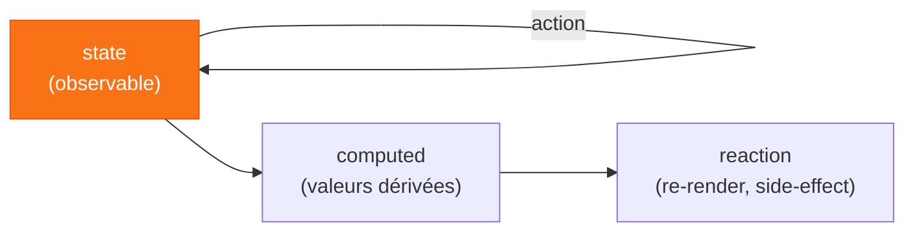
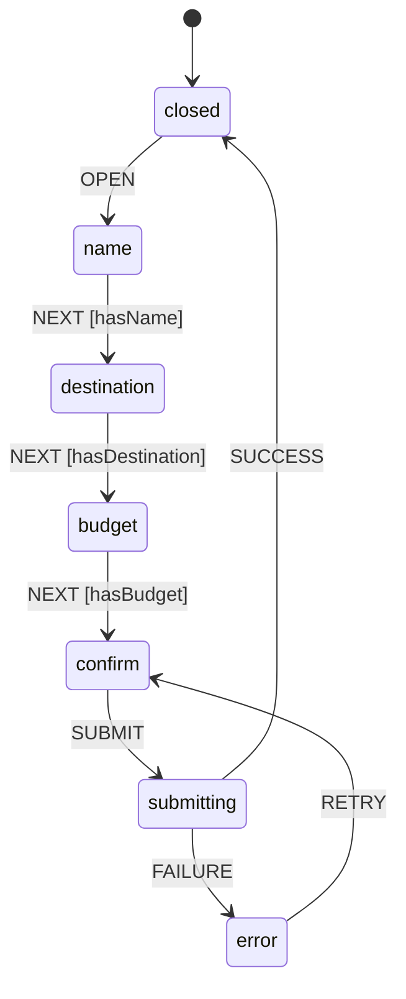

# Chapitre 5
## Les solutions exotiques
<div class="opacity-60 pt-2">Quand un paradigme différent colle mieux au problème</div>

---

# `Jotai` — l'état atomique

<div class="grid grid-cols-2 gap-6 items-center">
<div>

```ts
const textAtom = atom('hello')

// dérivé : on passe une fonction
const upper = atom(
  (get) => get(textAtom).toUpperCase()
)

// dans un composant
const [text, setText] = useAtom(textAtom)
```

</div>
<div>

<v-clicks>

- logique **bottom-up** : pas de store central, des **atomes**
- `useAtom` ≈ `useState` ; `useAtomValue` / `useSetAtom`
- atome = un **accessor** (la valeur vit dans un store)
- ⚠️ créer les atomes **hors composant**

</v-clicks>

</div>
</div>

<div v-click class="pt-3 text-xs opacity-60 text-center">
3 formes : <code>read</code> seul (computed) · <code>write</code> seul (action) · <code>read+write</code>
</div>

<!--
5b théorie. Bottom-up vs top-down. Sous le capot : useState/useReducer (pas
useSyncExternalStore). Atom config = objet immuable sans valeur, la valeur est dans
le store. Attention à l'égalité référentielle des atomes.
-->

---

# `MobX` — les observables

<div class="text-center opacity-70 text-sm pt-1">
Inspiration : un tableur. On change une cellule, tout ce qui en dépend se recalcule. 📊
</div>



<div class="grid grid-cols-2 gap-6 pt-2 text-sm">
<div v-click class="opacity-80">
Wrappe un composant dans <code>observer</code> → re-render <b>seulement</b> sur les propriétés réellement lues.
</div>
<div v-click class="border-l-4 border-orange-500 pl-3">
Dérivations **synchrones** : action → lire une valeur dérivée à jour, tout de suite. Le bénéfice clé.
</div>
</div>

<!--
5b théorie. state → computed → reaction. Synchrone = le gros avantage vs beaucoup
d'observables async. Actions = batching + contrôle. Observe les PROPRIÉTÉS (proxys),
pas l'objet. Attention au déréférencement hors d'un observer → perte de réactivité.
-->

---

# `XState`

<FicheSolution
  annee="2018"
  auteur="David Khourshid"
  tagline="Des machines d'états et des statecharts pour rendre les états impossibles… impossibles."
  probleme="Les actions centralisent le state, pas les transitions — les combinaisons invalides restent atteignables."
  creneau="Workflows complexes (wizard, checkout, onboarding, player) où le problème ressemble à un graphe."
  :infos="[
    'XState = implémentation des statecharts de David Harel (1987), formalisés dans un article de la Weizmann Institute of Science.',
    'La machine ne « tourne » pas : c\'est un objet pur. C\'est l\'acteur (createActor / useMachine) qui l\'exécute.',
    'Stately Studio : éditeur visuel collaboratif en ligne, les machines se dessinent avant de se coder.',
    'v5 (2023) : acteurs comme unité centrale, typage fort sans typegen, persistance profonde, API simplifiée.',
  ]"
/>

<!--
XState n'est pas un upgrade des store managers : c'est un paradigme différent pour un problème différent.
Dès que le problème ressemble à un graphe, XState est le bon outil.
-->

---

# `XState` · rendre les états impossibles… impossibles

Toutes les solutions basées sur des actions partagent la même limite :

<div class="grid grid-cols-2 gap-8 mt-4">
<div v-click>

**8 combinaisons, la plupart invalides**

```ts
// Ces 3 booléens peuvent coexister
// dans n'importe quelle combinaison
const [isOpen, setIsOpen] = useState(false)
const [isSubmitting, setIsSubmitting] = useState(false)
const [hasError, setHasError] = useState(false)

// isSubmitting && !isOpen ? 💀
// hasError && !isSubmitting ? 💀
```

</div>
<div v-click>

**Les `if` se dispersent partout**

```ts
function handleNext() {
  if (!name) return        // dans StepName.tsx
  if (!destination) return // dans StepDest.tsx
  if (!budget) return      // dans StepBudget.tsx
  dispatch({ type: 'GO_TO_CONFIRM' })
  // GO_TO_CONFIRM reste dispatchable
  // même si tous les if passent à false demain
}
```

</div>
</div>

<div v-click class="mt-4 border-l-4 border-orange-500 pl-3">
Etat impossible = bug potentiel qui se produira dans les bonnes conditions.
</div>

<!--
Toutes les libs basées sur des actions ont ce problème : elles centralisent le state, pas les transitions.
Qui empêche les combinaisons invalides ? Personne — des if dans les composants, jamais exhaustifs.
-->

---

# Les machines à états finis

<div class="grid grid-cols-2 gap-8 items-center pt-4">
<div class="flex flex-col items-center gap-6">

<div class="flex gap-8 items-center">
  <div v-click="1" class="flex flex-col items-center gap-2">
    <div class="w-14 h-14 rounded-full border-4 border-gray-600" :class="{ 'bg-red-500 shadow-[0_0_20px_4px_rgba(239,68,68,0.6)]': true }"></div>
    <div class="w-14 h-14 rounded-full border-4 border-gray-600 bg-gray-700"></div>
    <div class="w-14 h-14 rounded-full border-4 border-gray-600 bg-gray-700"></div>
  </div>
  <div v-click="2" class="text-3xl text-gray-400">→</div>
  <div v-click="2" class="flex flex-col items-center gap-2">
    <div class="w-14 h-14 rounded-full border-4 border-gray-600 bg-gray-700"></div>
    <div class="w-14 h-14 rounded-full border-4 border-gray-600" :class="{ 'bg-orange-400 shadow-[0_0_20px_4px_rgba(251,146,60,0.6)]': true }"></div>
    <div class="w-14 h-14 rounded-full border-4 border-gray-600 bg-gray-700"></div>
  </div>
  <div v-click="3" class="text-3xl text-gray-400">→</div>
  <div v-click="3" class="flex flex-col items-center gap-2">
    <div class="w-14 h-14 rounded-full border-4 border-gray-600 bg-gray-700"></div>
    <div class="w-14 h-14 rounded-full border-4 border-gray-600 bg-gray-700"></div>
    <div class="w-14 h-14 rounded-full border-4 border-gray-600" :class="{ 'bg-green-500 shadow-[0_0_20px_4px_rgba(34,197,94,0.6)]': true }"></div>
  </div>
</div>

<div v-click="4" class="text-xs opacity-50 text-center">
  rouge → orange → vert → rouge…<br>jamais rouge → vert directement
</div>

</div>
<div>

<v-clicks at="5">

- Un seul **état actif** à la fois
- Des **événements** déclenchent des **transitions**
- Ce qui n'est pas défini **ne peut pas arriver**
- Formalisé par David Harel (1987) — électronique, protocoles, jeux vidéo

</v-clicks>

</div>
</div>

<!--
Insister sur l'absence : rouge → vert n'existe pas dans le graphe, donc c'est impossible par construction.
C'est ça, la garantie. Pas un if, pas une convention — une absence dans la spec.
-->

---

# La machine d'états

<div class="grid grid-cols-[1fr_2fr] gap-8 items-start pt-2">
<div>



</div>
<div class="flex flex-col gap-3 pt-2">
<div class="grid grid-cols-2 gap-3">
<div v-click class="border border-gray-500 rounded-lg p-3 text-center">
<div class="font-bold text-orange-400 text-sm pb-1">États</div>
<div class="text-xs opacity-70">Une seule valeur active à la fois</div>
</div>
<div v-click class="border border-gray-500 rounded-lg p-3 text-center">
<div class="font-bold text-orange-400 text-sm pb-1">Transitions</div>
<div class="text-xs opacity-70">Les flèches nommées entre états</div>
</div>
<div v-click class="border border-gray-500 rounded-lg p-3 text-center">
<div class="font-bold text-orange-400 text-sm pb-1">Guards</div>
<div class="text-xs opacity-70">Conditions pour qu'une transition ait lieu</div>
</div>
<div v-click class="border border-gray-500 rounded-lg p-3 text-center">
<div class="font-bold text-orange-400 text-sm pb-1">Contexte</div>
<div class="text-xs opacity-70">Les données qui accompagnent les états</div>
</div>
</div>
<div v-click class="border-l-4 border-orange-500 pl-3 text-sm mt-2">
Ce qui n'est pas dans le graphe <b>n'existe pas</b>.<br>Les états impossibles sont impossibles par construction.
</div>
</div>
</div>

<!--
Pas un concept React — 60 ans de formalisme (électronique, protocoles, jeux vidéo).
Pointer les absences dans le graphe : pas de chemin closed→confirm, pas de CANCEL sur submitting. Ce qui manque est une garantie.
-->

---

# Machine vs Acteur

<div class="grid grid-cols-2 gap-8 pt-6">
<div v-click class="border border-gray-500 rounded-lg p-6">

### Machine

<div class="text-sm opacity-70 pt-1">

Objet pur et immutable. Décrit les états, les transitions, les guards. **Ne tourne pas.**

Peut être partagée, sérialisée, visualisée, testée sans React.

</div>
</div>
<div v-click class="border border-gray-500 rounded-lg p-6">

### Acteur

<div class="text-sm opacity-70 pt-1">

```tsx
const [snapshot, send] = useMachine(machine)
// snapshot.value   → état courant
// snapshot.context → les données
```

Créé par `useMachine`, abonné à React via `useSyncExternalStore`.

</div>
</div>
</div>

<div v-click class="pt-8 text-center text-xl">
Machine = partition. Acteur = <span v-mark.underline.orange="3">musicien qui la joue</span>.
</div>

<!--
La machine = fichier TypeScript pur, zéro React. Testable en isolation.
Plusieurs wizards en parallèle = plusieurs acteurs, une seule machine.
-->

---

# Guards et contexte

<div class="grid grid-cols-2 gap-8 pt-6">
<div v-click class="border border-gray-500 rounded-lg p-6">

### Guards

<div class="text-sm opacity-70 pt-1">

Fonctions pures déclarées dans `setup`, référencées par nom dans les transitions. Si le guard retourne `false`, la transition est ignorée.

Les composants **envoient des événements**. La machine décide si la transition a lieu.

</div>
</div>
<div v-click class="border border-gray-500 rounded-lg p-6">

### Contexte

<div class="text-sm opacity-70 pt-1">

Les données du wizard vivent dans la machine, pas dans les composants.

Naviguer entre les étapes, revenir en arrière, repartir : les valeurs saisies sont **toujours là**.

</div>
</div>
</div>

<!--
Guards : la validation sort des composants, elle entre dans la spec. Le composant n'a plus à savoir.
Contexte : montrer le contraste avec useState par étape — retour en arrière = champs vidés.
-->

---

# Les composants ne savent plus rien

<div class="grid grid-cols-2 gap-8 pt-6 items-center">
<div>

```
● name

Transitions disponibles :
→ NEXT  (guard: hasName ✗)
→ SET_NAME

Contexte :
{ name: '', destination: '', budget: 0 }
```

<div class="pt-3 opacity-60 text-xs">
Remplir le nom → <code>hasName ✓</code> → <code>NEXT</code> devient actif.
</div>

</div>
<div>

<v-clicks>

- Les composants envoient des événements
- La machine décide si la transition a lieu
- L'Inspector rend ça **visible en temps réel**
- Ce qui n'est pas dans le graphe ne peut pas arriver

</v-clicks>

</div>
</div>

<!--
Ouvrir l'Inspector en premier, le garder visible.
Déroulé : OPEN → name → "Suivant" sans remplir (guard ✗, rien) → remplir → NEXT → back → données intactes → confirm → SUBMIT → submitting → SUCCESS.
Montrer setup() + createMachine() dans l'IDE pendant submitting.
-->

---

# Envoyer des événements — côté React

<div class="grid grid-cols-2 gap-8 pt-4">
<div v-click>

```tsx
// useMachine retourne snapshot + send
const [snapshot, send] = useMachine(wizardMachine)

// send() dans les handlers
<input
  value={snapshot.context.name}
  onChange={e => send({ type: 'SET_NAME', value: e.target.value })}
/>

<button onClick={() => send({ type: 'NEXT' })}>
  Suivant
</button>
```

</div>
<div>

<v-clicks>

- Pas d'import de fonctions — juste `send()`
- Un événement = un objet `{ type, ...payload }`
- La machine décide si la transition a lieu
- Le composant ne connaît pas l'état courant

</v-clicks>

</div>
</div>

<!--
Montrer que send() est la seule interface — pas d'action creator, pas de dispatch nommé. Le composant est ignorant.
-->

---

# Lire l'état — côté React

<div class="grid grid-cols-2 gap-8 pt-4">
<div v-click>

```tsx
const [snapshot, send] = useMachine(wizardMachine)

// état courant
snapshot.value          // 'name' | 'confirm' | …

// données du contexte
snapshot.context.name
snapshot.context.budget

// tester l'état actif
snapshot.matches('submitting')

// transition disponible ?
snapshot.can({ type: 'NEXT' })
```

</div>
<div>

<v-clicks>

- `snapshot.value` = l'état actif (string ou objet imbriqué)
- `snapshot.context` = les données, toujours disponibles
- `snapshot.matches()` pour le rendu conditionnel
- `snapshot.can()` pour activer/désactiver un bouton

</v-clicks>

</div>
</div>

<!--
snapshot.can() est la clé : le composant demande à la machine si NEXT est possible, il ne le calcule pas lui-même.
-->

---
layout: quote
---

# « XState rend les états impossibles… impossibles. »

Par construction, pas par convention.

<div class="text-base opacity-60 pt-4">
Ce qui n'est pas dans le graphe n'existe pas.<br>
Les guards centralisent la validation dans la machine, hors des composants.
</div>

<div v-click class="text-sm opacity-50 pt-8">
Machine = définition. Acteur = instance. <code>useMachine</code> = <code>useSyncExternalStore</code>.<br>
Le même pattern que Zustand et nuqs — l'acteur est un store externe.
</div>

<!--
Wizard, checkout, onboarding, player audio/vidéo — dès que le problème ressemble à un graphe, XState est le bon outil.
-->

