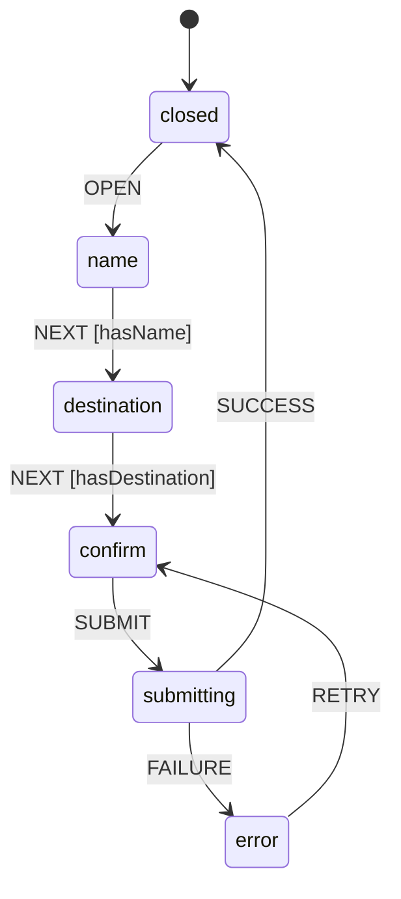

# Chapitre 5
## Les solutions exotiques
<div class="opacity-80 pt-2">Quand un paradigme différent colle mieux au problème</div>

---

# Limitations des store managers classiques

<div class="text-center opacity-70 text-sm pt-1">
Un store = un sac de valeurs qu'on mute via des actions. Générique… mais aveugle à la forme du problème.
</div>

<div class="grid grid-cols-2 gap-6 pt-4 text-sm">
<div v-click class="border border-gray-600 rounded-lg p-5">

### Ce qu'ils font mal
- l'état = **données plates**, aucune notion de **transitions**
- rien n'empêche les **états impossibles**
- dérivations & réactivité fine : **à la main**

</div>
<div v-click class="border-l-4 border-orange-500 pl-3">

### Le signal qu'il faut changer
- un **workflow** à étapes avec des règles de passage → **graphe**
- beaucoup d'**état dérivé**, réactivité fine et synchrone → **atomes / observables**

</div>
</div>

<div v-click class="pt-6 text-center text-xl">
Changer d'outil, c'est souvent changer de <span v-mark.orange>paradigme</span>.
</div>

<!--
Transition ch4 → ch5. Les state managers classiques traitent tout état comme un sac de
valeurs muté par des actions : générique, mais aveugle à la structure du problème. Deux
symptômes appellent une solution spécialisée : (1) un état qui est en réalité une machine
(étapes, transitions, gardes) → XState ; (2) un graphe de valeurs dérivées avec besoin de
réactivité fine et synchrone → Jotai / MobX. Le bon outil épouse la forme du problème.
-->

---
layout: section
crumb: { tool: "Jotai" }
image: /covers/factory-istock.avif
credit: IStock
---

# Jotai
<div class="text-2xl opacity-70 pt-2">Un état atomique</div>
<div class="opacity-50 pt-3 text-sm"></div>

<!--
Divider de sous-section. On enchaîne sur la fiche d'identité de Jotai, puis le « comment
ça marche ». 状態 (jōtai) = « état » en japonais — clin d'œil du créateur.
-->

---

# Jotai

<FicheSolution
  annee="2020"
  auteur="Daishi Kato — pmndrs"
  tagline="Un état composé de bas en haut, atome par atome."
  probleme="Un store top-down concentre tout au même endroit. Beaucoup de code si on veut juste partager des valeurs globales."
  creneau="État fragmenté et fortement dérivé, où l'on veut une réactivité fine sans store central."
  :infos="[
    '状態 — « état » en japonais',
    'Bottom-up : composition d\'atomes, pas de store central',
    'Atome = accessor immuable : la valeur vit dans un store caché',
    'Sous le capot : useReducer, pas useSyncExternalStore',
    'Use case précis : useState global',
  ]"
/>

<!--
Fiche d'identité. Daishi Kato (aussi auteur de Zustand & Valtio), collectif pmndrs. Le
créneau : beaucoup d'état dérivé interdépendant + besoin de re-renders fins, sans store
monolithique. Pont vers la slide suivante : voyons concrètement à quoi ressemble un atome.
-->

---

# Atomes primitifs

<div class="text-xs opacity-50 uppercase tracking-widest pb-1">Hors React</div>

```ts
const countAtom = atom(0)                          
```

<div class="text-xs opacity-50 uppercase tracking-widest pt-4 pb-1">Dans un composant</div>

```ts
function Counter() {
  // au choix, selon le besoin :
  const [count, setCount] = useAtom(countAtom)      // lire + écrire (= useState)
  const count             = useAtomValue(countAtom) // lire — s'abonne
  const setCount          = useSetAtom(countAtom)   // écrire — sans abonner
}
```

<div class="grid grid-cols-3 gap-3 pt-4 text-xs">
<div v-click>📦 <code>atom(init)</code> rend un <b>accessor</b> : la valeur vit dans le store</div>
<div v-click>👁️ <code>useAtomValue</code> <b>lit</b> et abonne le composant</div>
<div v-click>✍️ <code>useSetAtom</code> <b>écrit</b> sans abonner</div>
</div>

<div v-click class="pt-4 text-sm opacity-70 text-center">
Séparer lecture et écriture : un composant qui ne fait qu'<b>écrire</b> ne re-render pas. 🎯
</div>

<div v-click class="pt-3 text-xs text-center border-t border-orange-500/40 mt-3 pt-3">
⚠️ Le setter ne fait que <b>poser une valeur</b> — pas d'action prédéfinie (ex. <code>increment</code>) pour modifier l'état de façon standardisée.
</div>

<!--
L'atome se crée au niveau module, HORS de React : c'est une identité, pas une valeur —
le créer dans le composant en fabriquerait un nouveau à chaque render. Dans le composant,
3 gestes : useAtom = read+write, l'API jumelle de useState ; useAtomValue lit et abonne ;
useSetAtom écrit sans abonner → write-only, pas de re-render, l'atout du modèle atomique.
Les trois lignes sont des alternatives (« au choix »), pas des déclarations cumulées.
Les atomes dérivés (atom(get => ...)) viendront ensuite.
-->

---

# Atomes dérivés

<div class="text-center opacity-70 text-sm pt-1">
On passe une <b>fonction</b> au lieu d'une valeur → un atome <b>lecture seule</b>.
</div>

<div class="grid grid-cols-2 gap-6 items-center pt-2">
<div>

```ts
const countAtom  = atom(0)

const doubleAtom = atom((get) => get(countAtom) * 2)

// dans un composant — pas de setter
const double = useAtomValue(doubleAtom)
```

</div>
<div>

<v-clicks>

- `get` **abonne** le dérivé à ses dépendances
- recalculé **seulement** quand une dépendance change (mémoïsé)
- **composable** : un dérivé peut en lire d'autres
- pas de setter → atome **lecture seule**

</v-clicks>

</div>
</div>

<div v-click class="pt-4 text-sm opacity-70 text-center">
WanderState : <code>totalBudget</code> = somme des étapes. Déclaré une fois et à jour partout. ✨
</div>

<!--
Le dérivé : on passe une fonction (get) => ... au lieu d'une valeur. get(autreAtome) lit
ET abonne — quand une dépendance change, le dérivé est recalculé, sinon il est mémoïsé
(comme un computed / une createSelector). Composable : un dérivé peut lire d'autres
dérivés, on construit un graphe. Aucun setter ici → lecture seule (la forme write viendra
pour les actions). Pont démo : le budget total de WanderState devient un atome dérivé.
-->

---

# Atomes d'action

<div class="text-center opacity-70 text-sm pt-1">
2 arguments : pas de valeur, juste une <b>logique d'écriture</b> → un atome <b>écriture seule</b>.
</div>

<div class="grid grid-cols-2 gap-6 items-center pt-2">
<div>

```ts
const countAtom = atom(0)

const incrementAtom = atom(
  null,                              // rien à lire
  (get, set, by = 1) => set(countAtom, get(countAtom) + by),
)

const increment = useSetAtom(incrementAtom)
increment()      // +1
increment(5)     // +5
```

</div>
<div>

<v-clicks>

- 1er arg `null` → **rien à lire** (write-only)
- 2e arg = la **logique** `(get, set, ...args)`
- `set(autreAtome, val)` met à jour d'autres atomes
- `useSetAtom` rend une **action** (≈ dispatch), avec arguments
- les args de l'appel arrivent **après** `get`/`set` : `increment(5)` → `by = 5`

</v-clicks>

</div>
</div>

<div v-click class="pt-4 text-sm opacity-70 text-center">
<b>action nommée</b> qui manquait au setter brut : la logique vit dans l'atome. ✅
</div>

<!--
La forme write : atom(read, write). Ici read = null (rien à lire → write-only), write =
(get, set, ...args) => ... C'est l'inverse du dérivé. set(autreAtome, valeur) écrit dans
d'autres atomes ; on peut en toucher plusieurs d'un coup. useSetAtom renvoie l'action, qui
accepte des arguments (increment(5)). C'est la réponse à la limite vue plus tôt : on
encapsule la logique de mutation (increment) dans l'atome au lieu de la disperser dans les
composants — l'équivalent atomique des actions Zustand/Redux. Et atom(read, write) combine
les deux : lisible ET déclencheur d'action.
-->

---

# Atomes lecture-écriture

<div class="text-center opacity-70 text-sm pt-1">
Les 2 fonctions réunies : un <b>read</b> et un <b>write</b> → l'atome est lisible <b>et</b> pilotable.
</div>

<div class="grid grid-cols-2 gap-6 items-center pt-2">
<div>

```ts
const countAtom = atom(0)

const doubleAtom = atom(
  (get) => get(countAtom) * 2,                   // read
  (get, set, next) => set(countAtom, next / 2),  // write
)

const [double, setDouble] = useAtom(doubleAtom)
```

</div>
<div>

<v-clicks>

- read + write → l'atome est **lisible ET pilotable**
- `useAtom` rend `[valeur, action]`, comme `useState`
- dérivé **inscriptible** : on lit `double`, on écrit, ça remonte à la source

</v-clicks>

</div>
</div>

<div v-click class="mt-4 px-4 py-2 text-sm text-center">
⚠️ Pouvoir total : lecture/écriture de <b>n'importe quel</b> atome, exécution d'effets de bord… <b>À manier avec une extrême prudence.</b>
</div>

<!--
La forme complète atom(read, write) cumule les deux précédentes : un dérivé qui sait aussi
s'écrire. useAtom rend [valeur, action]. Exemple : double lit countAtom, et l'écrire
répercute sur la source. AVERTISSEMENT : c'est l'atome le plus puissant — on peut y lire et
écrire n'importe quel autre atome, déclencher des effets, etc. Cette liberté cache vite de
la complexité (logique implicite, dépendances circulaires, effets surprises). À réserver aux
cas qui le justifient, sinon préférer les formes simples read-only / write-only.
-->

---

# Atomes asynchrones

<div class="text-center opacity-70 text-sm pt-1">
La fonction <code>read</code> peut être <b>async</b> → l'atome résout une <code>Promise</code>.
</div>

<div class="grid grid-cols-2 gap-6 items-center pt-2">
<div>

```ts
const userAtom = atom(async (get) =>
  fetch(`/api/users/${get(idAtom)}`).then(r => r.json())
)

// dans un composant
const user = useAtomValue(userAtom)   // valeur résolue
```

</div>
<div>

<v-clicks>

- `useAtomValue` rend la **valeur résolue**, pas la `Promise`
- le composant **suspend** → `<Suspense>` ; erreur → Error Boundary
- composable : un dérivé peut `await get(asyncAtom)`
- `loadable(atom)` → `{ loading, data, error }` sans Suspense

</v-clicks>

</div>
</div>

<div v-click class="pt-4 text-xs opacity-60 text-center">
Pratique pour de l'async simple — pour le vrai <b>state serveur</b> (cache, refetch…), voir TanStack Query (ch. 3).
</div>

<!--
Atome async : la fonction read renvoie une Promise. Jotai déballe la Promise — useAtomValue
rend la valeur résolue et le composant suspend pendant le fetch (Suspense + Error Boundary,
zéro état loading/error manuel). Réévalué quand une dépendance change (ici idAtom) → refetch
automatique. Composable : un atome dérivé peut await get(asyncAtom). loadable() évite Suspense
en exposant {state: loading|hasData|hasError}. NUANCE : c'est élégant pour de l'async dérivé,
mais ce n'est pas un client de cache — pour le vrai state serveur (dedup, refetch, invalidation)
le chapitre 3 (TanStack Query) reste l'outil. Il existe d'ailleurs jotai-tanstack-query.
-->

---

# Patterns avancés

<div class="text-center opacity-70 text-sm pt-1">
Le cœur tient en 4 formes d'atomes — l'écosystème fait le reste.
</div>

<div class="grid grid-cols-2 gap-3 pt-4 text-sm">

<div v-click class="border border-gray-600 rounded-lg p-3">
<code class="text-orange-400">atomWithStorage</code> — persistance localStorage en une ligne
</div>

<div v-click class="border border-gray-600 rounded-lg p-3">
<code class="text-orange-400">atomFamily</code> — atomes <b>paramétrés</b> par un id : <code>tripAtom(id)</code>
</div>

<div v-click class="border border-gray-600 rounded-lg p-3">
Atomes <b>asynchrones</b> — <code>atom(async (get) => …)</code>, branchés sur <b>Suspense</b>
</div>

<div v-click class="border border-gray-600 rounded-lg p-3">
<code class="text-orange-400">splitAtom</code> — une liste → un atome par élément (re-renders ciblés)
</div>

<div v-click class="border border-gray-600 rounded-lg p-3">
<code class="text-orange-400">Provider</code> — <b>scope</b> un sous-arbre : isolation, tests, multi-instances
</div>

<div v-click class="border border-gray-600 rounded-lg p-3">
<b>Intégrations</b> — <code>jotai-tanstack-query</code>, <code>jotai-immer</code>, optics…
</div>

</div>

<div v-click class="pt-4 text-xs opacity-60 text-center">
Tout reste composable : ces helpers <b>renvoient des atomes</b>, lus avec les <b>mêmes</b> hooks.
</div>

<!--
Panorama de l'écosystème — pas à détailler, juste montrer l'étendue. atomWithStorage :
persistance en une ligne (le pendant du middleware persist de Zustand). atomFamily : un
atome par entité indexé par id — parfait pour des collections (les trips de WanderState).
Atomes async : un atom(async get => fetch) se branche directement sur Suspense + Error
Boundary → l'état serveur entre dans le graphe d'atomes (recouvre le chapitre TanStack
Query). splitAtom : éclate une liste en atomes individuels pour des re-renders ciblés.
Provider : scope un sous-arbre, utile en SSR et en test. Le point clé : tous ces helpers
RENVOIENT des atomes, lus avec useAtom/useAtomValue/useSetAtom — la composabilité ne casse
jamais.
-->

---

# Bilan

<Bilan
  :scores="[4, 4, 5, 4, 3]"
  poids="~3.5 kB (gzip)"
  perimetre="État client : local → global"
  idealPour="beaucoup d'état dérivé interdépendant, réactivité fine sans store central, usage minimal (useState global)"
  :avantages="[
    'Re-renders ultra-ciblés (granularité de l\'atome)',
    'API minuscule et composable : 4 formes d\'atomes',
    'Async + Suspense natifs, riche écosystème pmndrs',
    'Idéal en complément : un useState global pour les cas simples',
  ]"
  :limites="[
    'Penser bottom-up : changement de modèle mental',
    'Tout est atome, risque de confusion',
    'État dispersé : la vue d\'ensemble peut manquer',
    'atom(read, write) = pouvoir total, à discipliner',
  ]"
/>

<!--
Bilan Jotai. Note le poids plume et la perf (re-renders ciblés par atome). Prise en main 4
et pas 5 : l'API est minuscule mais le bottom-up + l'égalité référentielle demandent un
basculement mental. Montée en charge 3 : beaucoup d'atomes interdépendants peuvent diluer
la vue d'ensemble — d'où le meilleur usage : EN COMPLÉMENT d'une autre solution, pour
quelques atomes globaux simples (un useState global), PAS pour stocker tout l'état. Idéal
aussi quand l'état est très dérivé et qu'on veut une réactivité fine sans store central.
À éviter si on cherche juste un store global complet (Zustand) ou une vraie machine (XState).
-->

---
layout: section
crumb: { tool: "MobX" }
image: /covers/factory-jra9393.avif
credit: jra9393
---

# MobX
<div class="text-2xl opacity-70 pt-2">Un state directement observable</div>

<!--
Divider de sous-section. Changement de paradigme par rapport à Jotai : on quitte l'immuable
et le bottom-up pour du mutable et de la réactivité transparente. On enchaîne sur la fiche
d'identité, puis le modèle state → computed → reaction.
-->

---

# MobX

<FicheSolution
  annee="2015"
  auteur="Michel Weststrate"
  tagline="Tout ce qui peut être dérivé de l'état devrait l'être — automatiquement."
  probleme="Garder l'état dérivé cohérent et les re-renders minimaux, sans câbler à la main sélecteurs et dépendances."
  creneau="État mutable riche en valeurs dérivées, avec une réactivité fine et synchrone — proche du modèle objet."
  :infos="[
    'Réactivité transparente : on mute l\'état normalement, MobX suit (proxys)',
    'Le modèle du tableur : state → computed → reaction',
    'observer ne re-render que sur les propriétés réellement lues',
    'Dérivations synchrones : la valeur dérivée est à jour immédiatement',
  ]"
/>

<!--
Fiche d'identité. Michel Weststrate, 2015 (ex-Mobservable). Philosophie : maximiser la
dérivation automatique. À l'opposé de Jotai/Redux : état MUTABLE observé par proxys, on
mute normalement et MobX propage. Souvent associé à un style OO (classes de store). Pont
vers la slide suivante : le modèle state → computed → reaction.
-->

---

# Flux de données unidirectionnel

<div class="text-center opacity-70 text-sm pt-8">
Inspiration : un tableur. Au changement d'une cellule, tout ce qui en dépend se recalcule. 📊
</div>

<div class="flex items-stretch justify-center gap-1 pt-24">

<div v-click class="flex flex-col justify-center border-2 border-orange-500 px-5 py-3 text-center">
<div class="font-bold">action</div>
<div class="text-xs opacity-60">seule à muter</div>
</div>

<div v-click="2" class="flex items-center px-1 text-3xl text-orange-400">→</div>

<div v-click="2" class="flex flex-col justify-center border-2 border-orange-500 bg-orange-500/15 px-5 py-3 text-center">
<div class="font-bold">state</div>
<div class="text-xs opacity-60">observable</div>
</div>

<div v-click="3" class="flex items-center px-1 text-3xl text-orange-400">→</div>

<div v-click="3" class="flex flex-col justify-center border-2 border-gray-500 px-5 py-3 text-center">
<div class="font-bold">computed</div>
<div class="text-xs opacity-60">valeurs dérivées</div>
</div>

<div v-click="4" class="flex items-center px-1 text-3xl text-orange-400">→</div>

<div v-click="4" class="flex flex-col justify-center border-2 border-gray-500 px-5 py-3 text-center">
<div class="font-bold">reaction</div>
<div class="text-xs opacity-60">re-render · effet</div>
</div>

</div>

<div v-click="5" class="text-center text-xs opacity-50 pt-24">
Flux <b>unidirectionnel</b> : seule une <b>action</b> mute le state — jamais l'inverse.
</div>

<!--
5b théorie. state → computed → reaction. Synchrone = le gros avantage vs beaucoup
d'observables async. Actions = batching + contrôle. Observe les PROPRIÉTÉS (proxys),
pas l'objet. Attention au déréférencement hors d'un observer → perte de réactivité.
-->

---

# Créer des observables

<div class="grid grid-cols-2 gap-5 pt-3">
<div class="flex flex-col gap-3">

<div>
<div class="text-xs opacity-70 pb-1">👉 <b>Le défaut</b> — objet <i>ou</i> <code>this</code> dans une classe, rôles inférés. Renvoie l'objet modifié <b>sans changer sa référence</b></div>

```ts
const store = makeAutoObservable({
  trips: [],                                // observable
  get total() { return this.trips.length }, // computed
  addTrip(t) { this.trips.push(t) },        // action
})
```

</div>

<div v-click>
<div class="text-xs opacity-70 pb-1"><b>Sans classe</b> — objet, tableau, <code>Map</code>, <code>Set</code> ; primitive via <code>.box</code>. Renvoie un proxy de l'objet</div>

```ts
const s = observable({ trips: [] })
const n = observable.box(0)        // .get() / .set()
```

</div>

</div>
<div>

<div v-click>
<div class="text-xs opacity-70 pb-1"><b>Classe</b> annotée à la main — héritage, contrôle fin</div>

```ts
class Store {
  trips = []
  constructor() {
    makeObservable(this, {
      trips:   observable,
      total:   computed,
      addTrip: action,
    })
  }
}
```

</div>

</div>
</div>

<div v-click class="pt-4 text-sm opacity-70 text-center">
<code>observable()</code> est la <b>seule</b> voie pour un observable à <b>propriétés dynamiques</b> (ajouter / supprimer des clés à la volée).
</div>

<!--
Créer des observables : plusieurs portes d'entrée, à choisir selon la FORME des données — mais un
défaut sain pour la grande majorité des cas : makeAutoObservable. Il infère les rôles sans rien
annoter (champ → observable, getter → computed mémoïsé, méthode → action), et marche aussi bien sur
un objet littéral que sur this dans une classe ; il annote l'objet EN PLACE (pas de copie).
Les autres voies, quand elles collent mieux au modèle de données :
— makeObservable(this, {observable, computed, action}) : une CLASSE où l'on annote explicitement
chaque membre, utile pour l'héritage ou un contrôle fin (plus verbeux).
— observable({...}) / [...] / Map / Set : rend une structure PROFONDÉMENT réactive sans classe ;
attention, ça renvoie un Proxy-COPIE à utiliser à la place de l'original.
— observable.box(v) : pour une primitive isolée (number, string), qui ne peut pas être proxifiée —
conteneur avec .get()/.set().
POINT COMMUN à toutes : ensuite on mute en JS NORMAL (affectation, push), les Proxies interceptent
lectures (track) et écritures (notify). Message à faire passer : il existe plusieurs syntaxes selon
comment vos données sont modélisées, mais ne pas se prendre la tête — makeAutoObservable par défaut.
Pont : maintenant qu'on sait créer des observables, voyons comment MobX les suit (tracking).
-->

---

# Muter le state : les `action`

<div class="text-center opacity-70 text-sm pt-1">
Une <b>action</b> = une <b>transaction</b> : ses mutations forment un tout indivisible.
</div>

<div class="grid grid-cols-2 gap-6 items-start pt-2">
<div>

```ts
const store = makeAutoObservable({
  payTrip(t) {           
    this.trips.push(t)     
    this.remaining -= t.cost
  },
})

store.payTrip(porto)      
```

</div>
<div v-click class="text-sm pt-2">

Une **action** **groupe** ses mutations : les observers ne voient que l'état **final**, jamais un état à moitié à jour.

</div>
</div>

<div class="grid grid-cols-3 gap-4 pt-4">
<div v-click class="border border-gray-600 rounded-lg p-4 text-sm">
<div class="font-bold pb-1">🔎 Comprendre / debugger</div>
Les changements ont un nom et arrivent en bloc — pas d'incohérence transitoire à traquer.
</div>
<div v-click class="border border-gray-600 rounded-lg p-4 text-sm">
<div class="font-bold pb-1">⚡ Performance</div>
1 seule notification → 1 re-render, au lieu d'un par mutation.
</div>
<div v-click class="border border-gray-600 rounded-lg p-4 text-sm">
<div class="font-bold pb-1">🔒 Contrainte souple</div>
<code>configure({ enforceActions: 'always' })</code> lève une erreur si on mute hors d'une action.
</div>
</div>

<div v-click class="pt-3 text-sm opacity-70 text-center">
<code>makeAutoObservable</code> marque déjà les méthodes comme actions. Hors méthode : <code>action(fn)</code> ou <code>runInAction(() => …)</code>.
</div>

<!--
Les actions. L'idée centrale : une action est une TRANSACTION. payTrip fait deux mutations —
on ajoute le voyage PUIS on baisse le budget. Si ces deux lignes notifiaient individuellement,
entre les deux les observers verraient un état incohérent : le voyage déjà là mais le budget
pas encore débité → un dérivé "dépassé ?" qui passe à true puis revient, une bannière qui
clignote. L'action groupe tout : les observers ne voient que l'état FINAL. Deux bénéfices
concrets : (1) on comprend et on debugge plus facilement — les changements portent un nom et
arrivent en bloc, pas d'incohérence transitoire à traquer ; (2) la performance — une seule
notification donc un seul re-render au lieu d'un par mutation. Et c'est une contrainte SOUPLE :
par défaut muter dehors marche, mais configure({ enforceActions: 'always' }) lève une erreur
si on le fait — garde-fou recommandé. makeAutoObservable marque déjà les méthodes comme actions ;
sinon action(fn) ou runInAction. PIÈGE ASYNC : le code APRÈS un await n'est plus dans l'action
(nouvelle pile d'exécution) → il faut envelopper ces mutations dans runInAction, ou utiliser un
flow (générateur) qui gère ça pour nous.
-->

---

# Les dérivations

<div class="text-center opacity-70 text-sm pt-1">
Tout ce qui découle du state est <b>dérivé</b> automatiquement.
</div>

<div class="grid grid-cols-2 gap-6 pt-6">
<div v-click class="border-l-4 border-orange-500 pl-4 py-2">

### `computed` — valeurs
<div class="opacity-80 text-sm pt-1">
Du state <b>dérivé</b> d'autre state.<br>
Pur · mémoïsé · produit une <b>valeur</b>.
</div>

</div>
<div v-click class="border-l-4 border-gray-600 pl-4 py-2">

### Réactions — effets
<div class="opacity-80 text-sm pt-1">
Le state qui agit sur le <b>monde extérieur</b>.<br>
Impur · produit un <b>effet de bord</b>.
</div>

</div>
</div>

<div v-click class="mt-7 border-2 border-orange-500 px-5 py-4">

<div class="text-center text-lg pb-2">⚡ Toutes les dérivations sont <b>synchrones</b></div>

<div class="opacity-80 text-sm text-center pb-4">
Dès qu'une action mute le state, les <code>computed</code> sont recalculés et les réactions ont déjà tourné — <b>dans la même pile</b>, avant la fin de l'action. Aucun re-render à attendre.
</div>

<div class="grid grid-cols-2 gap-6 text-sm">
<div>

```ts
// MobX — lisible aussitôt
store.addExpense(50)
store.totalBudget // ✅ à jour
```

</div>
<div>

```ts
// useState — décalé d'un render
setCount(c => c + 1)
count // ❌ encore l'ancienne valeur
```

</div>
</div>

<div class="opacity-70 text-xs text-center pt-3">
Pas de « stale state », pas de <code>useEffect</code> pour réagir à son propre changement.
</div>

</div>

<!--
Les dérivations — le pendant « lecture » des actions. Vue d'ensemble : MobX distingue DEUX sortes
de dérivations, qu'on détaille juste après. COMPUTED = du state dérivé d'autre state : pur,
mémoïsé, ça PRODUIT UNE VALEUR. RÉACTIONS = le state qui agit sur le monde extérieur (DOM, réseau,
logs) : impur, ça PRODUIT UN EFFET DE BORD. Le modèle mental, le fil rouge des deux prochaines
slides : state → computed (du state dérivé) → réactions (effets). Et le bénéfice transverse : on
ne stocke jamais une valeur dérivée, on la calcule → aucun cache à invalider à la main.
BÉNÉFICE MAJEUR : tout est SYNCHRONE. Dès qu'une action a muté le state, les computed sont
recalculés et les réactions ont tourné — immédiatement, dans la même pile. On peut LIRE la valeur
dérivée juste après l'avoir changée. Contraste frappant avec useState : après setState, la variable
locale garde encore l'ancienne valeur — il faut attendre le re-render pour la lire. MobX n'a pas ce
décalage : pas de « stale state », pas de useEffect pour réagir à son propre changement.
-->

---

# `computed`

<div class="grid grid-cols-2 gap-6 items-center pt-2">
<div>

```ts
const store = makeAutoObservable({
  trips: [],
  get totalBudget() {                  // computed
    return this.trips.reduce((s, t) => s + t.cost, 0)
  },
})

store.totalBudget   // calculé
store.totalBudget   // ⚡ valeur en cache, pas recalculé
```

</div>
<div>

<v-clicks>

- une **fonction pure** des observables qu'elle lit
- **mémoïsée** : recalculée seulement si une dépendance change
- **paresseuse** : pas calculée tant qu'aucun observer ne la lit
- se chaîne : un computed peut en lire un autre

</v-clicks>

</div>
</div>

<div v-click class="pt-4 text-sm opacity-70 text-center">
À privilégier dès qu'une valeur se calcule depuis le state : gratuit et toujours à jour. ✨
</div>

<!--
computed en détail. Un getter (get totalBudget) déclaré sur l'observable. C'est une fonction PURE :
elle lit des observables et renvoie une valeur, sans effet de bord. Trois propriétés clés :
(1) MÉMOÏSÉ — la valeur est mise en cache et n'est recalculée que si une de ses dépendances change ;
deux lectures successives sans changement → un seul calcul. (2) PARESSEUX — tant qu'aucun observer
(réaction ou composant observer) ne le lit, il n'est même pas calculé ; et il « s'éteint » quand
plus personne ne l'observe. (3) Dans makeAutoObservable, tout get est automatiquement un computed.
Les computed se CHAÎNENT (l'un lit l'autre) et MobX optimise le graphe. Règle : dès qu'une valeur
dérive du state, en faire un computed plutôt que de la stocker → toujours cohérent, zéro cache manuel.
-->

---

# Les réactions : effets de bord

<div class="text-center opacity-70 text-sm pt-1">
Ré-exécuter du code <b>impur</b> à chaque changement du state observé.
</div>

<div class="grid grid-cols-2 gap-6 items-center pt-2">
<div>

```ts
autorun(() => {     
  console.log(store.totalBudget)
})

reaction(
  () => store.isOverBudget,       
  () => save(store.trips),       
)

when(() => store.ready,
     () => start())
```

</div>
<div>

<v-clicks>

- `autorun` — l'effet **tout de suite**, puis à chaque changement
- `reaction` — seule la **1ʳᵉ** fonction est suivie : l'effet peut lire d'autres observables **sans s'y abonner** (≠ `autorun`, qui suit *tout* ce qu'il lit)
- `when` — attend qu'une condition soit vraie, **une seule fois**

</v-clicks>

</div>
</div>

<div v-click class="pt-4 text-sm opacity-70 text-center">
⚠️ Hors React, <code>autorun</code>/<code>reaction</code>/<code>when</code> renvoient un <b>disposer</b> à appeler pour les interrompre pour éviter les fuites mémoire. Dans React : on les crée et on les interrompt dans un <code>useEffect</code>.
</div>

<!--
Les réactions en détail. Là où computed produit une valeur (pur), une réaction produit un EFFET DE
BORD (impur) en réponse au state. Trois APIs : autorun(fn) exécute fn immédiatement puis à chaque
fois qu'un observable qu'elle a lu change — idéal pour un effet qui dépend de « tout ce que je lis ».
reaction(data, effect) : SEULE la 1ère fonction (data) est suivie. Le vrai intérêt vs autorun :
l'effet peut lire d'AUTRES observables sans s'y abonner — ici on déclenche sur isOverBudget mais on
sauve store.trips sans que chaque édition de trips ne re-déclenche. (Avec autorun, tout ce qu'on lit
est suivi, donc save(store.trips) re-tournerait à chaque mutation de trips.) Bonus : l'effet ne tourne
PAS au démarrage, seulement sur changement. when(predicate,
effect) attend que le prédicat devienne vrai, exécute l'effet UNE fois, puis se dispose tout seul
(version async/await aussi). POINT CLÉ : un composant observer est une réaction comme une autre, son
effet étant le re-render. PIÈGE CLEANUP : autorun/reaction/when créés hors React renvoient un disposer
qu'il faut appeler pour les arrêter (sinon fuite) — dans React, on les crée/dispose dans un useEffect.
Les réactions sont le pont state → monde extérieur (DOM, réseau, localStorage, logs).
-->

---

# Les réactions sont sur-utilisées

<div class="text-center opacity-70 text-sm pt-1">
Comme <code>useEffect</code> : avant d'écrire une réaction, demandez-vous <b>d'où vient le changement</b>.
</div>

<div class="grid grid-cols-2 gap-6 items-center pt-4">
<div>

<v-clicks>

- vrai cas d'usage : la donnée peut changer **depuis plein d'endroits** — impossible de tous les couvrir à la main
- une **seule** origine (corrélée à une action) → pas besoin de réaction : l'effet va **dans l'action**
- plus simple, explicite et **traçable**

</v-clicks>

</div>
<div v-click>

```ts
// ❌ réaction pour un effet à origine unique
reaction(() => store.trips.length, () => save())

// ✅ directement dans l'action
addTrip(t) {
  this.trips.push(t)
  save()
}
```

</div>
</div>

<!--
À MARTELER : comme useEffect en React, les réactions sont SUR-UTILISÉES, notamment par les
débutants. Avant d'en écrire une, se demander d'où vient le changement. Le vrai cas d'usage : un
effet doit se déclencher quand un observable change, ET ce changement peut provenir de PLEIN
d'endroits différents (impossible de tous les couvrir à la main). Si au contraire le changement
n'a qu'UNE seule origine — il est corrélé à une action précise — alors pas besoin de réaction :
on lance l'effet directement DANS l'action, c'est plus simple, explicite et traçable.
-->

---

# Dans React : `observer`

<div class="text-center opacity-70 text-sm pt-1">
Principal effet de bord : re-rendre un composant React !
</div>

<div class="grid grid-cols-2 gap-6 items-center pt-2">
<div>

```tsx
import { observer } from 'mobx-react-lite'

const Header = observer(({observable}) => {
  // on déréférence dans le render → tracké
  return <p>{observable.trips.length} voyages · {observable.totalBudget} €</p>
})
```

</div>
<div>

<v-clicks>

- `observer(Composant)` l'abonne à ce qu'il **déréférence** au render
- re-render **ciblé** : seules les propriétés lues comptent
- pas de provider obligatoire : le store est un **module** importé

</v-clicks>

</div>
</div>

<div v-click class="pt-2 text-xs text-center opacity-60">
💡 Plugin Babel/SWC <code>mobx-react-observer</code> qui enveloppe automatiquement avec <code>observer</code> tout composant qui lit des observables.
</div>

<!--
Dans React : observer (de mobx-react-lite). observer() enveloppe le composant et le branche
sur le même mécanisme de tracking : les propriétés déréférencées PENDANT le render deviennent
ses dépendances → re-render ciblé, sans sélecteur ni memo. Le store n'a pas besoin de
provider : c'est un simple module importé (on peut aussi le passer via Context/props). Pour
de l'état local au composant, useLocalObservable crée un observable au montage. PIÈGES :
(1) ne pas oublier observer (sinon pas de réactivité) ; (2) déréférencer les props observables
DANS le composant observer, pas dans un parent non-observer (sinon la dépendance est perdue).
ASTUCE : le plugin Babel/SWC mobx-react-observer wrappe automatiquement chaque composant qui
lit des observables → plus besoin d'écrire observer() à la main, et fini l'oubli (piège 1).
-->

---

# Attention : ne pas déréferencer trop tôt

<div class="text-center opacity-70 text-sm pt-1">
MobX s'abonne à la propriété <b>lue</b>, pas à l'objet. Lire trop tôt = valeur figée.
</div>

<div class="grid grid-cols-2 gap-6 items-start pt-3">
<div>

```tsx
const Parent = observer(() => (
  // ❌ on lit .length ICI → on passe un nombre figé
  <Header count={store.trips.length} />
))
// Header ne re-render jamais : il reçoit un nombre
const Header = observer(({ count }) => <p>{count}</p>)
```

<div class="text-xs opacity-60 pt-1">La dépendance est captée par <code>Parent</code>, pas par <code>Header</code>.</div>

</div>
<div>

```tsx
const Parent = observer(() => (
  // ✅ on passe l'observable, pas la valeur
  <Header store={store} />
))
// le déréférencement a lieu DANS l'observer qui affiche
const Header = observer(({ store }) => <p>{store.trips.length}</p>)
```

<div class="text-xs opacity-60 pt-1">Chaque composant track ce qu'il lit lui-même.</div>

</div>
</div>

<div v-click class="pt-4 text-sm text-center opacity-80">
Règle : <b>déréférencer le plus tard possible</b>, dans le composant <code>observer</code> qui utilise la valeur. 🎯
</div>

<!--
Le piège n°1 de MobX avec React. Le tracking se fait sur le DÉRÉFÉRENCEMENT : MobX note « cet
observer dépend de cette propriété » au moment où on accède au Proxy (get). Si on déréférence
trips.length dans le parent et qu'on passe le NOMBRE en prop, c'est le parent qui devient
dépendant de length — le Header, lui, ne reçoit qu'un nombre primitif, sans aucun lien avec
l'observable. Résultat : le parent se re-render (et donc le Header avec lui, par cascade React
classique), mais le Header n'a aucune réactivité propre. Si le parent n'est pas observer, ou si
on optimise avec memo, le Header ne se mettra jamais à jour. La bonne pratique : passer
l'observable (ou le store) et déréférencer DANS le composant qui affiche la valeur — chacun
s'abonne alors à ce qu'il lit réellement. Corollaire pour la destructuration : `const { name } =
trip` fige aussi la valeur ; garder `trip.name` au point d'utilisation.
-->

---

# Un filtre anti-bruit

<div class="text-center opacity-70 text-sm pt-1">
Le cache <b>absorbe</b> les changements qui ne modifient pas la valeur dérivée.
</div>

<div class="grid grid-cols-2 gap-6 items-center pt-2">
<div>

```ts
get tripCount() { return this.trips.length }
// budget, notes, dates… changent souvent

autorun(() => save(store.tripCount))
// ↑ ne re-tourne QUE si tripCount change

store.trips[0].budget = 500   // tripCount inchangé → autorun muet
store.trips.push(porto)       // tripCount: 2 → 3 → autorun !
```

</div>
<div>

<v-clicks>

- brancher l'`autorun` **directement** sur le state → il tourne à **chaque** mutation
- le passer **via un computed** → il ne tourne que si le **résultat** change
- un computed renvoie la <b>même valeur</b> ⇒ ses observers dorment
- il **filtre le bruit** : le state bouge souvent, la dérivée reste stable

</v-clicks>

</div>
</div>

<div v-click class="pt-4 text-sm opacity-70 text-center">
👉 Dériver au maximum : une réaction devrait dépendre de <b>peu</b> de computed <b>très stables</b>.
</div>

<!--
Deuxième slide computed : le cache n'est pas qu'une optim de calcul, c'est un FILTRE qui réduit le
bruit dans le graphe de réactivité. Exemple : un computed tripCount = trips.length, observé par un
autorun. Si on branchait l'autorun directement sur trips (ou sur le state brut), il re-tournerait à
CHAQUE mutation de trips — y compris quand on change le budget d'un voyage, ses notes, ses dates…
toutes choses qui ne changent PAS le count. En passant par le computed, MobX compare la valeur
produite : tant que tripCount renvoie la même valeur, ses observers (l'autorun) ne sont PAS notifiés.
Le computed agit comme un filtre : en entrée, un state qui change souvent pour plein de raisons ; en
sortie, une valeur qui ne change que quand ça compte vraiment. CONCLUSION / bonne pratique : dériver
AU MAXIMUM. Les computed sont des filtres qui réduisent le bruit, donc les réactions (coûteuses,
impures) devraient idéalement dépendre d'un PETIT nombre de computed TRÈS STABLES, plutôt que du
state brut. Moins de re-runs inutiles, graphe plus lisible.
-->

---

# La règle d'or de la réactivité

<div class="text-center opacity-70 text-sm pt-1">
MobX réagit à toute propriété observable <b>lue pendant</b> l'exécution d'une fonction trackée.
</div>

<div class="grid grid-cols-2 gap-6 items-start pt-3">
<div>

```ts
// ❌ lu trop tôt : on capture la valeur, pas la propriété
const n = store.tripCount
autorun(() => console.log(n))          // muet

// ❌ déstructuration = déréférencement immédiat
const { tripCount } = store
autorun(() => console.log(tripCount))  // muet

// ❌ accès dans un callback async : hors du tracking
autorun(() => setTimeout(() => console.log(store.tripCount)))
```

</div>
<div>

```ts
// ✅ on lit la propriété DANS la fonction trackée
autorun(() => console.log(store.tripCount))

// ✅ accès synchrone, puis on déclenche l'async
autorun(() => {
  const n = store.tripCount   // lu ici → tracké
  setTimeout(() => save(n))   // on utilise la valeur figée
})
```

</div>
</div>

<div class="grid grid-cols-2 gap-4 pt-3 text-xs">
<div v-click class="opacity-80">
🔍 Trois fautes, une seule cause : <b>déréférencer hors</b> de la fonction trackée (avant, ailleurs, ou trop tard).
</div>
<div v-click class="border-l-4 border-orange-500 pl-3">
Passer l'objet entier (<code>autorun(() => log(store))</code>) ne track <b>rien</b> : il faut lire une <b>propriété</b>. Clés dynamiques → <code>Map</code> observable.
</div>
</div>

<div v-click class="pt-3 text-sm text-center opacity-80">
En cas de doute : <code>trace()</code> dans la fonction trackée dit <b>pourquoi</b> elle re-tourne (ou pas). 🎯
</div>

<!--
La page « Understanding reactivity » de la doc MobX, condensée. LA RÈGLE, une seule à retenir :
« MobX réagit à toute propriété observable LUE PENDANT l'exécution d'une fonction trackée »
(autorun, reaction, computed, composant observer). MobX track des ACCÈS À DES PROPRIÉTÉS via le
Proxy (get), pas des valeurs. Tout le reste découle de là. Les pièges classiques sont tous la même
erreur sous trois déguisements — déréférencer HORS de la fonction trackée :
(1) trop TÔT : on lit store.tripCount et on stocke la valeur AVANT l'autorun → on observe un nombre
mort, plus rien ne le relie à l'observable.
(2) DÉSTRUCTURATION : const { tripCount } = store fait exactement ce déréférencement immédiat —
même piège, syntaxe plus sournoise. (Idem const { name } = trip, cf. le slide observer.)
(3) ASYNC : dans un setTimeout / .then / après un await, on est SORTI de l'exécution synchrone de
la fonction trackée → les accès ne sont plus enregistrés. Solution : lire l'observable de façon
synchrone DANS la fonction, puis utiliser la valeur capturée dans l'async.
Deux corollaires : passer l'OBJET entier (autorun(() => log(store))) ne track aucune propriété —
il faut en lire une ; et pour des clés qui apparaissent/disparaissent dynamiquement, utiliser une
Map observable plutôt qu'un objet nu (sinon l'ajout de clé n'est pas réactif). OUTIL : trace() posé
dans une fonction trackée logge précisément de quelle dépendance vient (ou pas) le re-run — l'arme
n°1 pour déboguer « pourquoi ça (ne) re-render (pas) ». Ce slide généralise le piège du
déréférencement vu côté observer : c'est le MÊME principe, valable pour TOUTES les fonctions trackées.
-->

---

# Le graphe de dépendances

<div class="text-center opacity-70 text-sm pt-1">
Le state se propage de <b>gauche</b> (sources) vers la <b>droite</b> (effets), filtré par les dérivés.
</div>

<div class="flex justify-center pt-1">
<svg viewBox="0 0 840 384" class="w-full" style="max-width: 860px; font-family: ui-monospace, monospace">
  <defs>
    <marker id="ah" markerWidth="8" markerHeight="8" refX="7" refY="4" orient="auto">
      <path d="M0,0 L8,4 L0,8 z" fill="currentColor" opacity="0.35"/>
    </marker>
    <marker id="ahA" markerWidth="9" markerHeight="9" refX="7.5" refY="4.5" orient="auto">
      <path d="M0,0 L9,4.5 L0,9 z" fill="#f97316"/>
    </marker>
  </defs>

  <!-- column headers -->
  <text x="176" y="22" text-anchor="middle" fill="currentColor" opacity="0.55" style="font-size:11px; letter-spacing:1px">STATE</text>
  <text x="476" y="22" text-anchor="middle" fill="currentColor" opacity="0.55" style="font-size:11px; letter-spacing:1px">COMPUTED (dérivés)</text>
  <text x="772" y="22" text-anchor="middle" fill="currentColor" opacity="0.55" style="font-size:11px; letter-spacing:1px">RÉACTIONS</text>

  <!-- ===== base edges (circle boundary → circle boundary, r=22) ===== -->
  <g stroke="currentColor" stroke-opacity="0.25" stroke-width="1.5" fill="none" marker-end="url(#ah)">
    <line x1="198" y1="70" x2="354" y2="66"/>   <!-- trips → tripCount -->
    <line x1="198" y1="70" x2="354" y2="146"/>  <!-- trips → totalBudget -->
    <line x1="198" y1="146" x2="354" y2="146"/> <!-- budget → totalBudget -->
    <line x1="198" y1="146" x2="354" y2="246" stroke-dasharray="4 3"/> <!-- budget → budgetLabel (inerte) -->
    <line x1="198" y1="250" x2="354" y2="326"/> <!-- dates → itinerary -->
    <line x1="198" y1="326" x2="354" y2="326"/> <!-- notes → itinerary -->
    <line x1="398" y1="146" x2="554" y2="190"/> <!-- totalBudget → isOverBudget (L1→L2) -->
    <line x1="398" y1="66" x2="750" y2="90"/>   <!-- tripCount → Header -->
    <line x1="398" y1="146" x2="750" y2="90"/>  <!-- totalBudget → Header -->
    <line x1="598" y1="190" x2="750" y2="200"/> <!-- isOverBudget → save -->
    <line x1="598" y1="190" x2="750" y2="310"/> <!-- isOverBudget → Banner -->
    <line x1="398" y1="326" x2="750" y2="200"/> <!-- itinerary → save -->
  </g>

  <!-- ===== base nodes (circles, label below) ===== -->
  <!-- state -->
  <g font-weight="600">
    <circle cx="176" cy="70"  r="22" fill="rgb(from #3b82f6 r g b / 12%)" stroke="#3b82f6" stroke-width="1.8"/>
    <text x="176" y="106" text-anchor="middle" fill="currentColor" style="font-size:12px">trips</text>
    <circle cx="176" cy="146" r="22" fill="rgb(from #3b82f6 r g b / 12%)" stroke="#3b82f6" stroke-width="1.8"/>
    <text x="176" y="182" text-anchor="middle" fill="currentColor" style="font-size:12px">budget</text>
    <circle cx="176" cy="250" r="22" fill="rgb(from #3b82f6 r g b / 12%)" stroke="#3b82f6" stroke-width="1.8"/>
    <text x="176" y="286" text-anchor="middle" fill="currentColor" style="font-size:12px">dates</text>
    <circle cx="176" cy="326" r="22" fill="rgb(from #3b82f6 r g b / 12%)" stroke="#3b82f6" stroke-width="1.8"/>
    <text x="176" y="362" text-anchor="middle" fill="currentColor" style="font-size:12px">notes</text>
  </g>
  <!-- computed — niveau 1 -->
  <g font-weight="600">
    <circle cx="376" cy="66"  r="22" fill="rgb(from #a855f7 r g b / 12%)" stroke="#a855f7" stroke-width="1.8"/>
    <text x="376" y="102" text-anchor="middle" fill="currentColor" style="font-size:12px">tripCount</text>
    <circle cx="376" cy="146" r="22" fill="rgb(from #a855f7 r g b / 12%)" stroke="#a855f7" stroke-width="1.8"/>
    <text x="376" y="182" text-anchor="middle" fill="currentColor" style="font-size:12px">totalBudget</text>
    <circle cx="376" cy="326" r="22" fill="rgb(from #a855f7 r g b / 12%)" stroke="#a855f7" stroke-width="1.8"/>
    <text x="376" y="362" text-anchor="middle" fill="currentColor" style="font-size:12px">itinerary</text>
  </g>
  <!-- computed observant budget mais NON observé → lazy, jamais recalculé -->
  <g font-weight="600" opacity="0.6">
    <circle cx="376" cy="246" r="22" fill="rgb(from #a855f7 r g b / 6%)" stroke="#a855f7" stroke-width="1.8" stroke-dasharray="4 3"/>
    <text x="376" y="282" text-anchor="middle" fill="currentColor" style="font-size:12px">budgetLabel</text>
  </g>
  <!-- computed — niveau 2 (dérivé d'un dérivé) -->
  <g font-weight="600">
    <circle cx="576" cy="190" r="22" fill="rgb(from #a855f7 r g b / 12%)" stroke="#a855f7" stroke-width="1.8"/>
    <text x="576" y="226" text-anchor="middle" fill="currentColor" style="font-size:12px">isOverBudget</text>
  </g>
  <!-- reactions -->
  <g font-weight="600">
    <circle cx="772" cy="90"  r="22" fill="rgb(from #f97316 r g b / 12%)" stroke="#f97316" stroke-width="1.8"/>
    <text x="772" y="126" text-anchor="middle" fill="currentColor" style="font-size:11px">&lt;Header/&gt;</text>
    <circle cx="772" cy="200" r="22" fill="rgb(from #f97316 r g b / 12%)" stroke="#f97316" stroke-width="1.8"/>
    <text x="772" y="236" text-anchor="middle" fill="currentColor" style="font-size:11px">autorun→save</text>
    <circle cx="772" cy="310" r="22" fill="rgb(from #f97316 r g b / 12%)" stroke="#f97316" stroke-width="1.8"/>
    <text x="772" y="346" text-anchor="middle" fill="currentColor" style="font-size:11px">&lt;Banner/&gt;</text>
  </g>

  <!-- ===== click 1 : action → budget ===== -->
  <g v-click="1">
    <line x1="10" y1="146" x2="150" y2="146" stroke="#f97316" stroke-width="3" marker-end="url(#ahA)"/>
    <text x="12" y="134" font-weight="700" fill="#f97316" style="font-size:12px">setBudget(500)</text>
    <circle cx="176" cy="146" r="22" fill="#3b82f6" stroke="#1d4ed8" stroke-width="3"/>
    <text x="176" y="182" text-anchor="middle" fill="currentColor" font-weight="700" style="font-size:12px">budget</text>
  </g>

  <!-- ===== click 2 : totalBudget recalcule — la VALEUR CHANGE → propage ===== -->
  <g v-click="2">
    <line x1="198" y1="146" x2="354" y2="146" stroke="#f97316" stroke-width="3" marker-end="url(#ahA)"/>
    <circle cx="376" cy="146" r="22" fill="#a855f7" stroke="#7e22ce" stroke-width="3"/>
    <text x="376" y="182" text-anchor="middle" fill="currentColor" font-weight="700" style="font-size:12px">totalBudget</text>
  </g>

  <!-- ===== click 3 : isOverBudget recalcule mais reste ÉGAL → la propagation s'arrête ===== -->
  <g v-click="3">
    <line x1="398" y1="146" x2="554" y2="190" stroke="#f97316" stroke-width="3" marker-end="url(#ahA)"/>
    <circle cx="576" cy="190" r="22" fill="none" stroke="#64748b" stroke-width="3.5"/>
    <text x="576" y="198" text-anchor="middle" fill="#64748b" font-weight="800" style="font-size:22px">=</text>
  </g>

  <!-- ===== click 4 : seul Header re-tourne ; save & Banner observent un computed inchangé ===== -->
  <g v-click="4">
    <!-- Header dépend de totalBudget (qui a changé) → re-tourne -->
    <line x1="398" y1="146" x2="750" y2="90" stroke="#f97316" stroke-width="3" marker-end="url(#ahA)"/>
    <circle cx="772" cy="90" r="22" fill="none" stroke="#f97316" stroke-width="4"/>
    <text x="772" y="98" text-anchor="middle" fill="#f97316" font-weight="700" style="font-size:24px">↻</text>
    <!-- save & Banner n'observent que isOverBudget (inchangé) → ne re-tournent PAS -->
    <text x="772" y="205" text-anchor="middle" style="font-size:16px">💤</text>
    <text x="772" y="315" text-anchor="middle" style="font-size:16px">💤</text>
    <!-- computed dont le state n'a pas bougé : pas recalculés -->
    <text x="376" y="73"  text-anchor="middle" style="font-size:16px">💤</text>
    <text x="376" y="333" text-anchor="middle" style="font-size:16px">💤</text>
    <!-- budgetLabel : son entrée (budget) a bougé, mais personne ne l'observe → lazy, pas recalculé -->
    <text x="376" y="253" text-anchor="middle" style="font-size:16px">💤</text>
  </g>
</svg>
</div>

<!--
Le MODÈLE MENTAL de MobX en une image — à garder en tête pour tout le reste du chapitre. Le graphe
se lit de gauche à droite : les SOURCES (state observable) à gauche, les DÉRIVÉS (computed) au
milieu, les EFFETS (réactions : autorun/reaction, ET les composants observer) à droite. Les flèches
sont des dépendances de LECTURE, recâblées à chaque exécution (cf. la règle d'or). Déroulé de
l'animation, sur une mutation de budget :
(1) une ACTION arrive de l'extérieur et mute un nœud de state (budget). C'est le seul point d'entrée.
(2) totalBudget LIT budget → il est recalculé et sa VALEUR CHANGE → il notifie (orange, il propage).
(3) isOverBudget lit totalBudget → il est recalculé À SON TOUR… mais il renvoie la MÊME valeur
(on était déjà « au-dessus du budget », on l'est toujours). MobX compare le résultat d'un computed :
valeur identique ⇒ il ne notifie PAS ses observers. La propagation s'ARRÊTE ici (marqueur =).
(4) du coup, une seule réaction re-tourne : <Header/>, parce qu'il observe totalBudget (qui a changé)
→ ↻. En revanche save et <Banner/> n'observent QUE isOverBudget : comme il n'a pas notifié, ils ne
re-tournent PAS (💤). tripCount et itinerary, eux, ne dépendent pas de budget → même pas recalculés (💤).
budgetLabel (en pointillés) est un cas À PART : il LIT budget, qui vient justement de changer — on
pourrait croire qu'il se recalcule. Mais PERSONNE ne l'observe (aucune réaction, aucun composant ne le
lit). Un computed non observé est LAZY : MobX ne le tient pas à jour, il ne sera recalculé qu'au moment
où quelqu'un le lira (et même là, à la demande). Donc malgré son entrée qui bouge → 💤. À retenir : un
computed ne « vit » que tant qu'il est observé ; sans observer, il s'éteint, peu importe ses entrées.
LE POINT À MARTELER : recalcul ≠ notification. Un computed est un FILTRE — il recalcule quand ses
entrées changent, mais ne réveille ses observers QUE si son RÉSULTAT change. Une valeur dérivée stable
agit comme un coupe-circuit : elle absorbe le changement et protège tout l'aval de re-runs inutiles.
D'où la bonne pratique (slide précédent) : dériver au max, pour que les réactions coûteuses dépendent
de computed très stables. Le graphe est l'ossature commune à observer, computed, reaction : une seule
mécanique, branchée partout.
-->

---

# Passer à l'échelle : le `RootStore`

<div class="text-center opacity-70 text-sm pt-1">
Un store racine, instancié une fois, distribué par <b>Context</b> — pas d'import global.
</div>

<div class="grid grid-cols-2 gap-6 items-center pt-2">
<div>

```ts
class RootStore {
  trips = new TripStore(this)   // slices
  ui = new UiStore(this)        // ↑ référence au root
  constructor() { makeAutoObservable(this) }
}

const StoreContext = createContext<RootStore>(null!)
export const useStore = () => useContext(StoreContext)
```

```tsx
// tout en haut de l'arbre, une seule instance
<StoreContext.Provider value={rootStore}>
  <App />
</StoreContext.Provider>
```

</div>
<div>

<v-clicks>

- **un** `RootStore` instancié une fois, fourni au sommet de l'arbre
- les composants le lisent via `useStore()` — testable, pas de singleton importé
- beaucoup de state → **découper en slices** (`TripStore`, `UiStore`…)
- chaque slice garde une **référence au root** → accès croisés sans recoupler
- chaque domaine porte ses **observables + computed + actions**

</v-clicks>

</div>
</div>

<div v-click class="pt-3 text-sm opacity-70 text-center">
Un seul graphe réactif, découpé par <b>domaine</b> — l'app grandit sans devenir un gros store fourre-tout. 🌳
</div>

<!--
Passer à l'échelle. Le pattern canonique MobX pour une vraie app = le ROOT STORE. Une classe racine
qui agrège des sous-stores (« slices »), un par domaine métier : TripStore, UiStore, etc. On
l'instancie UNE fois et on le fournit tout en haut de l'arbre via un Context React, lu par un hook
useStore(). Pourquoi un Context plutôt qu'un module importé en global ? Testabilité (on injecte un
store neuf par test / story), SSR (une instance par requête, sinon fuite d'état entre utilisateurs),
et pas de singleton planqué. Quand le state grossit, on DÉCOUPE en slices : chaque slice est un store
autonome (ses observables, ses computed, ses actions) et reçoit une référence au root dans son
constructeur → il peut lire/agir sur les autres domaines SANS qu'on recâble tout à la main (le
couplage reste explicite et localisé). Résultat : un seul graphe réactif cohérent, mais organisé par
domaine — l'opposé du « god store » monolithique. Analogie : les slices de Zustand, mais en classes.
PIÈGE : éviter les dépendances circulaires lourdes entre slices ; passer par le root, pas en direct.
-->

---

# Pas de sérialisation automatique du state

<div class="text-center opacity-70 text-sm pt-1">
MobX optimise la réactivité sur des objets <b>quelconques</b> — au prix d'un arbre normé.
</div>

<div class="grid grid-cols-2 gap-6 items-start pt-3">
<div>

```ts
// un observable peut contenir N'IMPORTE QUOI
const store = makeAutoObservable({
  trips: [],
  onSelect: () => {},     // fonctions, instances de classe,
  map: new Map(),         // refs circulaires… non normé
})

toJS(store)   // 📸 snapshot ponctuel… que je dois gérer à la main
```

<div class="text-xs opacity-60 pt-1">Aucune structure imposée ⇒ aucune sérialisation <b>automatique</b>.</div>

</div>
<div>

<v-clicks>

- `toJS()` donne un cliché **ponctuel**, mais pas de flux : ni snapshot-à-chaque-changement, ni patches
- donc **pas d'undo/redo** ni de **time-travel** gratuits (rien à rejouer)
- devtools de **réactivité** ok (`trace`, `spy`), mais pas d'**historique d'état**
- persistance / SSR / sync : **à câbler à la main**

</v-clicks>

</div>
</div>

<!--
Le fil rouge des deux slides suivants : la SÉRIALISATION. MobX vanille est optimisé pour une chose —
la réactivité fine sur des objets JS QUELCONQUES. C'est sa force (liberté totale : on met des
classes, des fonctions, des Map, des réfs circulaires dans un observable) et c'est aussi sa limite.
NUANCE IMPORTANTE à ne pas déformer : les données MobX ne sont pas « non sérialisables » en soi —
toJS()/JSON.stringify donnent un cliché ponctuel d'un state plain-ish. Le vrai manque, c'est
l'absence de STRUCTURE IMPOSÉE : pas d'arbre normé ⇒ pas de sérialisation AUTOMATIQUE et
INCRÉMENTALE. Concrètement, ce qu'on n'a PAS gratuitement : un snapshot émis à chaque changement, un
flux de patches JSON. Et comme tout ça manque, ce qui se construit dessus manque aussi : undo/redo,
time-travel debugging (rien à rejouer), synchro structurée. Côté devtools : MobX a de bons outils de
RÉACTIVITÉ (trace, spy, mobx-devtools) mais pas d'historique d'état / time-travel façon redux-devtools.
Persistance localStorage, hydratation SSR, sync réseau : faisables mais à la main. D'où les deux
surcouches suivantes, qui font le MÊME pari — contraindre le state en un arbre normé et sérialisable
— avec deux compromis opposés : MST sacrifie les classes (DSL de types runtime), keystone garde des
classes mais contraintes via TypeScript.
-->

---

# `mobx-state-tree` : la sérialisation au prix des classes

<div class="grid grid-cols-2 gap-6 items-center pt-2">
<div>

```ts
const Trip = types.model('Trip', {  // schéma runtime
  name: types.string,               
  budget: types.number,
}).actions(self => ({
  setBudget(b: number) { self.budget = b },
}))

const TripStore = types.model({
  trips: types.array(Trip),
}).views(self => ({ get total() { return sum(self.trips) } }))

const store = TripStore.create({ trips: [] })
onSnapshot(store, snap => save(snap))  
onPatch(store, patch => sync(patch))   
applySnapshot(store, loaded)         
```

</div>
<div>

<v-clicks>

- le state **est** sa propre description : un schéma normé, validé au runtime
- **plus de classes natives**, un Domain Specific Language de types à apprendre, API verbeuse
- sérialisation **native et automatique**
- `onSnapshot` → un cliché immuable **à chaque mutation** (persistance, SSR)
- `onPatch` (JSON Patch) → **undo/redo, time-travel, sync**

</v-clicks>

</div>
</div>

<div v-click class="pt-3 text-sm opacity-70 text-center">
MST échange la liberté des classes contre un arbre <b>sérialisable de bout en bout</b>. 🌲
</div>

<!--
mobx-state-tree (MST) : LE point de vue à tenir = la sérialisation. C'est une surcouche de MobX dont
la raison d'être est de combler le manque du slide précédent. Le compromis central : on RENONCE aux
classes JS libres. Un modèle MST n'est pas une classe, c'est un SCHÉMA décrit avec types.model —
props typées et validées à l'EXÉCUTION (pas seulement par TS), views (= computed), actions (seule
porte pour muter). Parce que le state est entièrement décrit et normé, MST peut le sérialiser
AUTOMATIQUEMENT : onSnapshot émet un cliché immuable à CHAQUE changement (≠ le toJS() ponctuel de
vanilla), onPatch émet un flux de patches JSON Patch. De là découlent gratuitement persistance,
hydratation SSR (applySnapshot), undo/redo, time-travel (redux-devtools via les patches), synchro
réseau incrémentale, plus les references (nœud → nœud par id). CONTREPARTIE assumée : verbeux, un
système de types runtime à apprendre, on perd l'ergonomie des classes. À POSITIONNER : c'est la
solution « entreprise » historique ; on la sort quand la sérialisation/l'historique sont un vrai
besoin — sinon le RootStore vanille suffit.
-->

---

# `mobx-keystone` : la sérialisation avec les classes

<div class="text-center opacity-70 text-sm pt-1">
Des <b>classes TS contraintes</b> plutôt qu'un DSL runtime.
</div>

<div class="grid grid-cols-2 gap-6 items-center pt-2">
<div>

```ts
@model('app/Trip')
class Trip extends Model({   // contrainte : Model
  name: prop<string>(),      // contrainte : prop<T>()
  budget: prop<number>(0),
}) {
  @modelAction
  setBudget(b: number) { this.budget = b }
}

const trip = new Trip({ name: 'Porto' })
onSnapshot(trip, snap => save(snap))    
onPatch(trip, patch => sync(patch))     
getSnapshot(trip)                      
```

</div>
<div>

<v-clicks>

- des **classes**, mais contraintes : `Model` / `prop<T>()` / `@modelAction`
- la **contrainte des types TS** remplace le DSL runtime → une seule source de vérité
- mêmes super-pouvoirs : **snapshots, patches, refs, undo/redo**, inférence bien meilleure
- runtime un peu plus lourd, écosystème plus jeune mais maintenu

</v-clicks>

</div>
</div>

<div v-click class="pt-3 text-sm opacity-70 text-center">
La sérialisabilité de MST avec TypeScript et des classes. Le choix moderne. ⚡
</div>

<!--
mobx-keystone : MÊME point de vue (sérialisation), compromis OPPOSÉ à MST. Le problème que keystone
résout vs MST : MST t'oblige à décrire les types DEUX fois (le DSL runtime types.X + ce que TS en
infère) et à abandonner les classes. Keystone obtient le MÊME contrat de sérialisation —
getSnapshot/onSnapshot à chaque changement, onPatch (JSON Patch), references, undo/redo — mais en
gardant de VRAIES classes TS, simplement CONTRAINTES : on étend Model({...}), les champs sont des
prop<T>(), les mutations sont des @modelAction, les dérivées des @computed. La contrainte qui rend le
state sérialisable passe donc par le système de types TYPESCRIPT (+ décorateurs), pas par un DSL
runtime parallèle → une seule source de vérité, inférence nettement meilleure, moins de cérémonie.
CONTREPARTIES : runtime un peu plus lourd que MST, communauté plus jeune (mais en prod). À
POSITIONNER : sur un projet TS neuf qui a besoin de sérialisation structurée, keystone est souvent le
meilleur choix ergonomique aujourd'hui ; MST reste le standard historique le mieux outillé. Rappel
transversal : pour la plupart des apps, le RootStore vanille suffit — ces deux-là ne se justifient
que quand snapshots/historique/sync structurée sont un vrai besoin.
-->

---

# Bilan

<Bilan
  :scores="[3, 3, 5, 4, 5]"
  poids="~16 kB (gzip) + mobx-react-lite"
  perimetre="État client : local → global, modèle objet"
  idealPour="un modèle de domaine riche en OOP, beaucoup d'état dérivé, réactivité fine sans sélecteurs. Utile pour une application avec beaucoup de state client décentralisé et des contraintes de perfomance."
  :avantages="[
    'Réactivité fine automatique : on mute en JS normal, MobX suit',
    'Re-renders ciblés, sans sélecteurs ni mémoïsation manuelle',
    'Dérivations synchrones : computed et réactions à jour immédiatement',
    'Modèle classe/objet naturel, écosystème mûr (MST, keystone)',
  ]"
  :limites="[
    'Magie du Proxy : pièges subtils (déréférencement, lecture trop tôt)',
    'State mutable et implicite : moins explicite que Redux/Zustand',
    'Snapshots / devtools temporels → passer par MST ou keystone',
    'À contre-courant du React idiomatique (immutabilité)',
  ]"
/>

<!--
Bilan MobX. Perf 5 et montée en charge 5 : c'est sa grande force — réactivité fine, re-renders
chirurgicaux sans qu'on écrive le moindre sélecteur, et le pattern RootStore passe très bien à
l'échelle (grosses apps en prod). Prise en main 4 : démarrer est facile (on mute en JS normal) mais
le modèle d'observabilité cache des pièges subtils (déréférencement, lecture hors fonction trackée,
actions). Poids 3 : plus lourd que Zustand/Jotai. Écosystème 4 : mûr et outillé (MST, keystone,
devtools). LE positionnement : idéal quand on a un vrai modèle de domaine OOP avec beaucoup d'état
dérivé interdépendant, et qu'on veut une réactivité automatique sans la cérémonie des sélecteurs. À
éviter si l'équipe tient à un flux explicite et immuable (Redux/Zustand) ou si on veut rester dans
le grain idiomatique React. Snapshots/undo/time-travel structurés ⇒ MST ou keystone, sinon le
RootStore vanille suffit.
-->

---
layout: section
crumb: { tool: "XState" }
image: /covers/factory-bfenton_photo.avif
credit: bfenton_photo
---

# XState
<div class="text-2xl opacity-70 pt-2">Les machines à états</div>

---

# `XState` — la machine à états

<FicheSolution
  annee="2018"
  auteur="David Khourshid"
  tagline="Des machines d'états et des statecharts pour rendre les états impossibles… impossibles."
  probleme="Les actions centralisent le state, pas les transitions — les combinaisons invalides restent atteignables."
  creneau="Workflows complexes (wizard, checkout, onboarding, player) où le problème ressemble à un graphe."
  :infos="[
    'XState = implémentation des statecharts de David Harel (1987), formalisés dans un article de la Weizmann Institute of Science.',
    'La machine ne « tourne » pas : c\'est un objet pur. C\'est l\'acteur (createActor / useMachine) qui l\'exécute.',
    'Stately Studio : éditeur visuel collaboratif en ligne, les machines se dessinent avant de se coder.',
    'v5 (2023) : acteurs comme unité centrale, typage fort sans typegen, persistance profonde, API simplifiée.',
  ]"
/>

<!--
XState n'est pas un upgrade des store managers : c'est un paradigme différent pour un problème différent.
Dès que le problème ressemble à un graphe, XState est le bon outil.
-->

---

# Deux sens du mot « état »

<div class="grid grid-cols-2 gap-8 pt-2">
<div v-click>

### Etat étendu : données de l'application

```ts
{
  name: 'Tokyo',
  budget: 2400,
  isOpen: true,
  isSubmitting: false,
  hasError: false,
}
```

<div class="text-sm opacity-70 pt-2">
Un <b>instantané</b> de la donnée runtime.<br>
Granulaire, nombre <b>infini</b> de valeurs possibles.
</div>

</div>
<div v-click>

### Etat fini : mode de l'application

```
○ closed
● name          ← un seul actif
○ destination
○ budget
○ confirm
○ submitting
```

<div class="text-sm opacity-70 pt-2">
<b>Mode</b> qualitatif dans lequel le système se trouve.<br>
Discret, énumérable : nombre <b>fini</b> d'états.
</div>

</div>
</div>

<div v-click class="pt-12 text-center text-xl">
La machine dit <b>où on est</b>. Le contexte dit <b>ce qu'on sait</b>.
</div>

<!--
Le glissement conceptuel à faire passer : on quittait l'état = "toutes les variables runtime" pour
l'état = "le mode parmi une liste finie". C'est ce passage de l'infini au fini qui rend les états
impossibles… impossibles. La donnée granulaire ne disparaît pas — elle se range dans le contexte.
-->

---

# Rendre les états impossibles… impossibles

Toutes les solutions basées sur des actions partagent la même limite :

<div class="grid grid-cols-2 gap-8 mt-4">
<div v-click>

**8 combinaisons, la plupart invalides**

```ts
// Ces 3 booléens peuvent coexister
// dans n'importe quelle combinaison
const [isOpen, setIsOpen] = useState(false)
const [isSubmitting, setIsSubmitting] = useState(false)
const [hasError, setHasError] = useState(false)

// isSubmitting && !isOpen ? 💀
// hasError && !isSubmitting ? 💀
```

</div>
<div v-click>

**Les `if` se dispersent partout**

```ts
function handleNext() {
  if (!name) return        // dans StepName.tsx
  if (!destination) return // dans StepDest.tsx
  if (!budget) return      // dans StepBudget.tsx
  dispatch({ type: 'GO_TO_CONFIRM' })
  // GO_TO_CONFIRM reste dispatchable
  // même si tous les if passent à false demain
}
```

</div>
</div>

<div v-click class="pt-12 text-center text-xl">
Etat impossible = bug potentiel qui se produira dans les bonnes conditions.
</div>

<!--
Toutes les libs basées sur des actions ont ce problème : elles centralisent le state, pas les transitions.
Qui empêche les combinaisons invalides ? Personne — des if dans les composants, jamais exhaustifs.
-->

---

# Les machines à états finis

<div class="grid grid-cols-2 gap-8 items-center pt-4">
<div class="flex flex-col items-center gap-6">

<div class="flex gap-8 items-center">
  <div v-click="1" class="flex flex-col items-center gap-2">
    <div class="w-14 h-14 rounded-full border-4 border-gray-600 bg-gray-700"></div>
    <div class="w-14 h-14 rounded-full border-4 border-gray-600 bg-gray-700"></div>
    <div class="w-14 h-14 rounded-full border-4 border-gray-600" :class="{ 'bg-green-500 shadow-[0_0_20px_4px_rgba(34,197,94,0.6)]': true }"></div>
  </div>
  <div v-click="2" class="text-3xl text-gray-400">→</div>
  <div v-click="2" class="flex flex-col items-center gap-2">
    <div class="w-14 h-14 rounded-full border-4 border-gray-600 bg-gray-700"></div>
    <div class="w-14 h-14 rounded-full border-4 border-gray-600" :class="{ 'bg-orange-400 shadow-[0_0_20px_4px_rgba(251,146,60,0.6)]': true }"></div>
    <div class="w-14 h-14 rounded-full border-4 border-gray-600 bg-gray-700"></div>
  </div>
  <div v-click="3" class="text-3xl text-gray-400">→</div>
  <div v-click="3" class="flex flex-col items-center gap-2">
    <div class="w-14 h-14 rounded-full border-4 border-gray-600" :class="{ 'bg-red-500 shadow-[0_0_20px_4px_rgba(239,68,68,0.6)]': true }"></div>
    <div class="w-14 h-14 rounded-full border-4 border-gray-600 bg-gray-700"></div>
    <div class="w-14 h-14 rounded-full border-4 border-gray-600 bg-gray-700"></div>
  </div>
</div>

</div>
<div>

<v-clicks at="4">

- Un seul **état actif** à la fois
- Des **événements** déclenchent des **transitions**
- Ce qui n'est pas défini **ne peut pas arriver**

</v-clicks>

</div>
</div>

<!--
vert → orange → rouge → vert…<br>jamais vert → rouge directement
C'est ça, la garantie. Pas un if, pas une convention — une absence dans la spec.
-->

---

# La machine d'états

<div class="grid grid-cols-[1fr_2fr] gap-8 items-start pt-2">
<div>



</div>
<div class="flex flex-col gap-3 pt-2">
<div class="grid grid-cols-2 gap-3">
<div v-click class="border border-gray-500 rounded-lg p-3 text-center">
<div class="font-bold text-orange-400 text-sm pb-1">États</div>
<div class="text-xs opacity-70">Une seule valeur active à la fois</div>
</div>
<div v-click class="border border-gray-500 rounded-lg p-3 text-center">
<div class="font-bold text-orange-400 text-sm pb-1">Transitions</div>
<div class="text-xs opacity-70">Les flèches nommées entre états</div>
</div>
<div v-click class="border border-gray-500 rounded-lg p-3 text-center">
<div class="font-bold text-orange-400 text-sm pb-1">Guards</div>
<div class="text-xs opacity-70">Conditions pour qu'une transition ait lieu</div>
</div>
<div v-click class="border border-gray-500 rounded-lg p-3 text-center">
<div class="font-bold text-orange-400 text-sm pb-1">Contexte</div>
<div class="text-xs opacity-70">Les données qui accompagnent les états</div>
</div>
</div>
<div v-click class="border-l-4 border-orange-500 pl-3 text-sm mt-2">
Ce qui n'est pas dans le graphe <b>n'existe pas</b>.<br>Les états impossibles sont impossibles par construction.
</div>
</div>
</div>

<!--
Pas un concept React — 60 ans de formalisme (électronique, protocoles, jeux vidéo).
Pointer les absences dans le graphe : pas de chemin closed→confirm, pas de CANCEL sur submitting. Ce qui manque est une garantie.
-->

---

# Machine vs Acteur

<div class="grid grid-cols-2 gap-8 pt-6">
<div v-click class="border border-gray-500 rounded-lg p-6">

### Machine

<div class="text-sm opacity-70 pt-1">

Objet pur et immutable. Décrit les états, les transitions, les guards. **Ne tourne pas.**

Peut être partagée, sérialisée, visualisée, testée sans React.

</div>
</div>
<div v-click class="border border-gray-500 rounded-lg p-6">

### Acteur

<div class="text-sm opacity-70 pt-1">

```tsx
const [snapshot, send] = useMachine(machine)
// snapshot.value   → état courant
// snapshot.context → les données
```

Créé par `useMachine`, abonné à React via `useSyncExternalStore`.

</div>
</div>
</div>

<div v-click class="pt-8 text-center text-xl">
Machine = partition. Acteur = <span v-mark.underline.orange="3">musicien qui la joue</span>.
</div>

<!--
La machine = fichier TypeScript pur, zéro React. Testable en isolation.
Plusieurs wizards en parallèle = plusieurs acteurs, une seule machine.
-->

---

# Guards et contexte

<div class="grid grid-cols-2 gap-8 pt-6">
<div v-click class="border border-gray-500 rounded-lg p-6">

### Guards

<div class="text-sm opacity-70 pt-1">

Fonctions pures déclarées dans `setup`, référencées par nom dans les transitions. Si le guard retourne `false`, la transition est ignorée.

Les composants **envoient des événements**. La machine décide si la transition a lieu.

</div>
</div>
<div v-click class="border border-gray-500 rounded-lg p-6">

### Contexte

<div class="text-sm opacity-70 pt-1">

Les données du wizard vivent dans la machine, pas dans les composants.

Naviguer entre les étapes, revenir en arrière, repartir : les valeurs saisies sont **toujours là**.

</div>
</div>
</div>

<!--
Guards : la validation sort des composants, elle entre dans la spec. Le composant n'a plus à savoir.
Contexte : montrer le contraste avec useState par étape — retour en arrière = champs vidés.
-->

---

# Les composants ne savent plus rien

<div class="grid grid-cols-2 gap-8 pt-6 items-center">
<div>

```
● name

Transitions disponibles :
→ NEXT  (guard: hasName ✗)
→ SET_NAME

Contexte :
{ name: '', destination: '', budget: 0 }
```

<div class="pt-3 opacity-60 text-xs">
Remplir le nom → <code>hasName ✓</code> → <code>NEXT</code> devient actif.
</div>

</div>
<div>

<v-clicks>

- Les composants envoient des événements
- La machine décide si la transition a lieu
- L'Inspector rend ça **visible en temps réel**

</v-clicks>

</div>
</div>

<!--
Ouvrir l'Inspector en premier, le garder visible.
Déroulé : OPEN → name → "Suivant" sans remplir (guard ✗, rien) → remplir → NEXT → back → données intactes → confirm → SUBMIT → submitting → SUCCESS.
Montrer setup() + createMachine() dans l'IDE pendant submitting.
-->

---

# Envoyer des événements — côté React

<div class="grid grid-cols-2 gap-8 pt-4">
<div v-click>

```tsx
// useMachine retourne snapshot + send
const [snapshot, send] = useMachine(wizardMachine)

// send() dans les handlers
<input
  value={snapshot.context.name}
  onChange={e => send({ type: 'SET_NAME', value: e.target.value })}
/>

<button onClick={() => send({ type: 'NEXT' })}>
  Suivant
</button>
```

</div>
<div>

<v-clicks>

- Pas d'import de fonctions — juste `send()`
- Un événement = un objet `{type, ...payload}`
- La machine décide si la transition a lieu
- Le composant ne connaît pas l'état courant

</v-clicks>

</div>
</div>

<!--
Montrer que send() est la seule interface — pas d'action creator, pas de dispatch nommé. Le composant est ignorant.
-->

---

# Lire l'état — côté React

<div class="grid grid-cols-2 gap-8 pt-4">
<div v-click>

```tsx
const [snapshot, send] = useMachine(wizardMachine)

// état courant
snapshot.value          // 'name' | 'confirm' | …

// données du contexte
snapshot.context.name
snapshot.context.destination

// tester l'état actif
snapshot.matches('submitting')

// transition disponible ?
snapshot.can({ type: 'NEXT' })
```

</div>
<div>

<v-clicks>

- `snapshot.value` = l'état actif (string ou objet imbriqué)
- `snapshot.context` = les données, toujours disponibles
- `snapshot.matches()` pour le rendu conditionnel
- `snapshot.can()` pour activer/désactiver un bouton

</v-clicks>

</div>
</div>

<!--
snapshot.can() est la clé : le composant demande à la machine si NEXT est possible, il ne le calcule pas lui-même.
-->

---

# Bilan

<Bilan
  :scores="[2, 3, 4, 5, 5]"
  poids="~15 kB (gzip) + @xstate/react"
  perimetre="Logique d'état complexe : machines à états / statecharts"
  idealPour="un flux à états explicites — wizard, checkout, onboarding, player — avec transitions, gardes et états parallèles. Dès que le problème ressemble à un graphe."
  :avantages="[
    'États impossibles rendus impossibles par construction, pas par convention',
    'Transitions, gardes et états hiérarchiques/parallèles explicites et centralisés',
    'Outillage exceptionnel : visualiseur Stately, inspector, devtools',
    'Logique framework-agnostique, testable hors de React',
  ]"
  :limites="[
    'Vraie courbe d\'apprentissage : les statecharts sont un paradigme à part',
    'Verbeux et sur-dimensionné pour un état simple',
    'Poids non négligeable face à un Zustand ou un useReducer',
    'À contre-courant du state « à la React » pour les cas courants',
  ]"
/>

<!--
Bilan XState, sur la même grille que les autres solutions (notes sur 5). Perf 4 et montée en
charge 5 : l'acteur est un store externe, re-renders ciblés, et plus le flux est complexe plus
XState tient la charge là où le useState/useReducer s'effondre. Écosystème 5 : l'outillage Stately
(visualiseur, inspector) est unique dans tout l'écosystème React. Prise en main 2 : c'est sa vraie
contrepartie — les statecharts (Harel, 1987) sont un paradigme à apprendre, pas un upgrade de store.
Poids 3 : plus lourd qu'un Zustand. LE positionnement : dès que le problème ressemble à un graphe
— wizard, checkout, onboarding, player — XState est le bon outil ; pour un état simple, il est
sur-dimensionné.
-->

