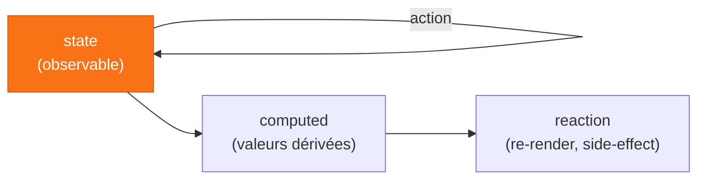
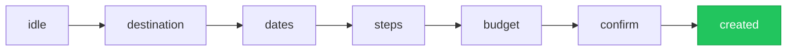

# Chapitre 5
## Les solutions exotiques
<div class="opacity-60 pt-2">Quand un paradigme différent colle mieux au problème</div>

---

# `Jotai` — l'état atomique

<div class="grid grid-cols-2 gap-6 items-center">
<div>

```ts
const textAtom = atom('hello')

// dérivé : on passe une fonction
const upper = atom(
  (get) => get(textAtom).toUpperCase()
)

// dans un composant
const [text, setText] = useAtom(textAtom)
```

</div>
<div>

<v-clicks>

- logique **bottom-up** : pas de store central, des **atomes**
- `useAtom` ≈ `useState` ; `useAtomValue` / `useSetAtom`
- atome = un **accessor** (la valeur vit dans un store)
- ⚠️ créer les atomes **hors composant**

</v-clicks>

</div>
</div>

<div v-click class="pt-3 text-xs opacity-60 text-center">
3 formes : <code>read</code> seul (computed) · <code>write</code> seul (action) · <code>read+write</code>
</div>

<!--
5b théorie. Bottom-up vs top-down. Sous le capot : useState/useReducer (pas
useSyncExternalStore). Atom config = objet immuable sans valeur, la valeur est dans
le store. Attention à l'égalité référentielle des atomes.
-->

---

# `MobX` — les observables

<div class="text-center opacity-70 text-sm pt-1">
Inspiration : un tableur. On change une cellule, tout ce qui en dépend se recalcule. 📊
</div>



<div class="grid grid-cols-2 gap-6 pt-2 text-sm">
<div v-click class="opacity-80">
Wrappe un composant dans <code>observer</code> → re-render <b>seulement</b> sur les propriétés réellement lues.
</div>
<div v-click class="border-l-4 border-orange-500 pl-3">
Dérivations **synchrones** : action → lire une valeur dérivée à jour, tout de suite. Le bénéfice clé.
</div>
</div>

<!--
5b théorie. state → computed → reaction. Synchrone = le gros avantage vs beaucoup
d'observables async. Actions = batching + contrôle. Observe les PROPRIÉTÉS (proxys),
pas l'objet. Attention au déréférencement hors d'un observer → perte de réactivité.
-->

---

# `XState` — la machine à états

<div class="text-center opacity-70 text-sm pt-1">
Certains états se modélisent mieux comme un <b>graphe</b>.
</div>



<div class="grid grid-cols-2 gap-6 pt-3 text-sm">
<div v-click class="opacity-80">
**Guards** : dates valides, budget &gt; 0 avant d'avancer. Back/forward sans perte de données.
</div>
<div v-click class="border-l-4 border-orange-500 pl-3">
**Inspector** en live : la machine se visualise pendant la démo. 🔍
</div>
</div>

<div v-click class="pt-3 text-center">
XState rend les <span v-mark.orange>états impossibles… impossibles.</span>
</div>

<!--
Démo 5a : le formulaire du ch1a devient un wizard multi-étapes = machine d'états.
Guards bloquent les transitions invalides. XState Inspector visualise la machine en live.
-->

