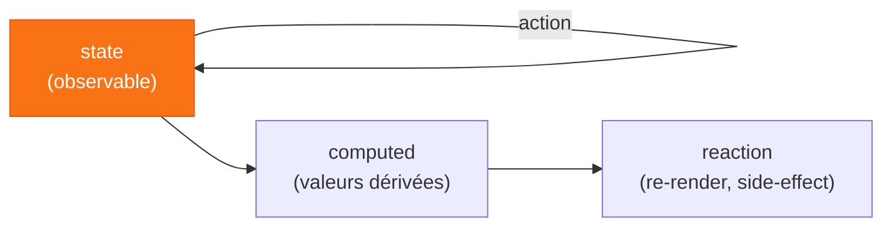
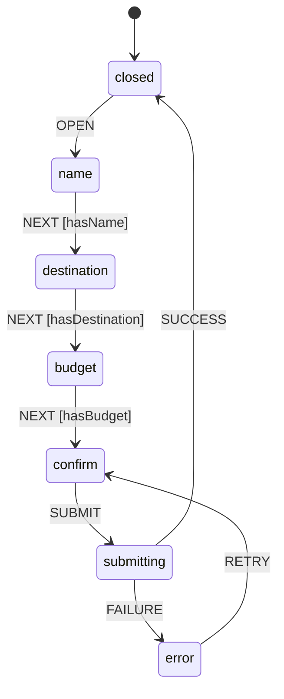

# Chapitre 5
## Les solutions exotiques
<div class="opacity-60 pt-2">Quand un paradigme différent colle mieux au problème</div>

---

# `Jotai` — l'état atomique

<div class="grid grid-cols-2 gap-6 items-center">
<div>

```ts
const textAtom = atom('hello')

// dérivé : on passe une fonction
const upper = atom(
  (get) => get(textAtom).toUpperCase()
)

// dans un composant
const [text, setText] = useAtom(textAtom)
```

</div>
<div>

<v-clicks>

- logique **bottom-up** : pas de store central, des **atomes**
- `useAtom` ≈ `useState` ; `useAtomValue` / `useSetAtom`
- atome = un **accessor** (la valeur vit dans un store)
- ⚠️ créer les atomes **hors composant**

</v-clicks>

</div>
</div>

<div v-click class="pt-3 text-xs opacity-60 text-center">
3 formes : <code>read</code> seul (computed) · <code>write</code> seul (action) · <code>read+write</code>
</div>

<!--
5b théorie. Bottom-up vs top-down. Sous le capot : useState/useReducer (pas
useSyncExternalStore). Atom config = objet immuable sans valeur, la valeur est dans
le store. Attention à l'égalité référentielle des atomes.
-->

---

# `MobX` — les observables

<div class="text-center opacity-70 text-sm pt-1">
Inspiration : un tableur. On change une cellule, tout ce qui en dépend se recalcule. 📊
</div>



<div class="grid grid-cols-2 gap-6 pt-2 text-sm">
<div v-click class="opacity-80">
Wrappe un composant dans <code>observer</code> → re-render <b>seulement</b> sur les propriétés réellement lues.
</div>
<div v-click class="border-l-4 border-orange-500 pl-3">
Dérivations **synchrones** : action → lire une valeur dérivée à jour, tout de suite. Le bénéfice clé.
</div>
</div>

<!--
5b théorie. state → computed → reaction. Synchrone = le gros avantage vs beaucoup
d'observables async. Actions = batching + contrôle. Observe les PROPRIÉTÉS (proxys),
pas l'objet. Attention au déréférencement hors d'un observer → perte de réactivité.
-->

---

# `XState` · rendre les états impossibles… impossibles

Avec `useReducer`, rien ne contraint les transitions :

```ts
dispatch({ type: 'GO_TO_CONFIRM' })
// on est encore à l'étape "nom"
```

<v-clicks>

- 3 booléens `isOpen / isSubmitting / hasError` = **8 combinaisons**, la plupart invalides
- Les `if` de validation se dispersent dans les composants

</v-clicks>

<div v-click class="mt-4 border-l-4 border-orange-500 pl-3">
Un état impossible est un bug qui n'attend que les bonnes conditions pour se manifester.
</div>

<!--
useReducer centralise, mais n'importe quelle action reste dispatchable depuis n'importe quel état.
Qui empêche les combinaisons invalides ? Personne — des if dans les composants, jamais exhaustifs.
-->

---

# La machine d'états

<div class="grid grid-cols-[1fr_2fr] gap-8 items-center pt-2">
<div>



</div>
<div>

<v-clicks>

- **États** : une seule valeur active à la fois
- **Transitions** : les flèches nommées entre états
- **Guards** : conditions pour qu'une transition ait lieu
- **Contexte** : les données qui accompagnent les états

</v-clicks>

<div v-click class="border-l-4 border-orange-500 mt-4 pl-3 text-sm">
Ce qui n'est pas dans le graphe <b>n'existe pas</b>.<br>Les états impossibles sont impossibles par construction.
</div>

</div>
</div>

<!--
Pas un concept React — 60 ans de formalisme (électronique, protocoles, jeux vidéo).
Pointer les absences dans le graphe : pas de chemin closed→confirm, pas de CANCEL sur submitting. Ce qui manque est une garantie.
-->

---

# Machine vs Acteur

<div class="grid grid-cols-2 gap-8 pt-6">
<div v-click class="border border-gray-500 rounded-lg p-6">

### Machine

<div class="text-sm opacity-70 pt-1">

Objet pur et immutable. Décrit les états, les transitions, les guards. **Ne tourne pas.**

Peut être partagée, sérialisée, visualisée, testée sans React.

</div>
</div>
<div v-click class="border border-gray-500 rounded-lg p-6">

### Acteur

<div class="text-sm opacity-70 pt-1">

```tsx
const [snapshot, send] = useMachine(machine)
// snapshot.value   → état courant
// snapshot.context → les données
```

Créé par `useMachine`, abonné à React via `useSyncExternalStore`.

</div>
</div>
</div>

<div v-click class="pt-8 text-center text-xl">
Machine = partition. Acteur = <span v-mark.underline.orange="3">musicien qui la joue</span>.
</div>

<!--
La machine = fichier TypeScript pur, zéro React. Testable en isolation.
Plusieurs wizards en parallèle = plusieurs acteurs, une seule machine.
-->

---

# Guards et contexte

<div class="grid grid-cols-2 gap-8 pt-6">
<div v-click class="border border-gray-500 rounded-lg p-6">

### Guards

<div class="text-sm opacity-70 pt-1">

Fonctions pures déclarées dans `setup`, référencées par nom dans les transitions. Si le guard retourne `false`, la transition est ignorée.

Les composants **envoient des événements**. La machine décide si la transition a lieu.

</div>
</div>
<div v-click class="border border-gray-500 rounded-lg p-6">

### Contexte

<div class="text-sm opacity-70 pt-1">

Les données du wizard vivent dans la machine, pas dans les composants.

Naviguer entre les étapes, revenir en arrière, repartir : les valeurs saisies sont **toujours là**.

</div>
</div>
</div>

<!--
Guards : la validation sort des composants, elle entre dans la spec. Le composant n'a plus à savoir.
Contexte : montrer le contraste avec useState par étape — retour en arrière = champs vidés.
-->

---

# Les composants ne savent plus rien

<div class="grid grid-cols-2 gap-8 pt-6 items-center">
<div>

```
● name

Transitions disponibles :
→ NEXT  (guard: hasName ✗)
→ SET_NAME

Contexte :
{ name: '', destination: '', budget: 0 }
```

<div class="pt-3 opacity-60 text-xs">
Remplir le nom → <code>hasName ✓</code> → <code>NEXT</code> devient actif.
</div>

</div>
<div>

<v-clicks>

- Les composants envoient des événements
- La machine décide si la transition a lieu
- L'Inspector rend ça **visible en temps réel**
- Ce qui n'est pas dans le graphe ne peut pas arriver

</v-clicks>

</div>
</div>

<!--
Ouvrir l'Inspector en premier, le garder visible.
Déroulé : OPEN → name → "Suivant" sans remplir (guard ✗, rien) → remplir → NEXT → back → données intactes → confirm → SUBMIT → submitting → SUCCESS.
Montrer setup() + createMachine() dans l'IDE pendant submitting.
-->

---

# `useReducer` vs `Zustand` vs `XState`

<div class="pt-2">

| | `useReducer` | `Zustand` | `XState` |
|---|---|---|---|
| Transitions contraintes | Non | Non | **Oui** |
| Guards | `if` dans les composants | `if` dans les composants | Déclaratifs, dans la machine |
| États async | Booléens combinés | Booléens combinés | États nommés |
| Visualisation | — | DevTools | **Stately Inspector** |
| Courbe d'apprentissage | Faible | Faible | Moyenne |
| Idéal pour | CRUD simple | State global partagé | **Workflows, processus métier** |

</div>

<!--
XState n'est pas un upgrade de useReducer, c'est un paradigme différent pour un problème différent.
Insister sur la dernière ligne : wizard, checkout, onboarding, player — dès que le problème ressemble à un graphe.
-->

---
layout: quote
---

# « XState rend les états impossibles… impossibles. »

Par construction, pas par convention.

<div class="text-base opacity-60 pt-4">
Ce qui n'est pas dans le graphe n'existe pas.<br>
Les guards centralisent la validation dans la machine, hors des composants.
</div>

<div v-click class="text-sm opacity-50 pt-8">
Machine = définition. Acteur = instance. <code>useMachine</code> = <code>useSyncExternalStore</code>.<br>
Le même pattern que Zustand et nuqs — l'acteur est un store externe.
</div>

<!--
Wizard, checkout, onboarding, player audio/vidéo — dès que le problème ressemble à un graphe, XState est le bon outil.
-->

