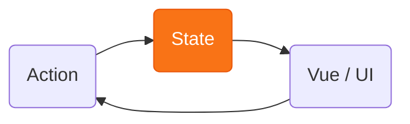

Théo Gianella

Développeur Web

Yoann Frommelt

Tech Lead web

<!--
On se présente, on peut aussi annoncer qu'on va faire des pauses toutes les heures et que les gens peuvent poser des questions quand ils veulent.
-->

---
layout: center
class: text-center
---

# 🙋 Avant de commencer

Quels outils de gestion de state React connaissez-vous ?

<!--
Ice-breaker. Lever de main. On note ceux qui sortent… et surtout ceux qui ne sortent
jamais. Intéressant : est-ce qu'on les connaît en profondeur ?
Si personne ne cite de solution de state serveur, c'est intéressant.
-->

---

# Qu'est-ce que « l'état » ?

### Programme sans état

Même entrée → même sortie. Aucune mémoire.

une fonction pure · un LLM · une calculatrice

### Programme avec état

Se souvient du passé — et <b>réagit en continu</b> aux événements extérieurs.

un éditeur de texte · un chatbot · un jeu vidéo

Tout programme qui tourne et sert à quelque chose garde un état.

<!--
Notion universelle (tout logiciel, pas que web/React). Insister sur EN COURS D'EXÉCUTION : un
programme qui tourne et fait quelque chose d'utile garde forcément une trace de son état —
sinon c'est une fonction pure, one-shot. Sans état = même entrée → même sortie, aucune mémoire.
Avec état = se souvient du passé et réagit en continu aux événements extérieurs. Enchaîner sur :
et où vit cet état ?
-->

---

# Et sur le web ?

Difficile de trouver une vraie page <b>sans état</b>. 🦄

Sur le web, l'état est partout.

interactivité → état

💻 Client

Navigateur

DOM · URL

Code applicatif

JS

⇄

réseau · async

🗄️

Serveur

⇄

🛢️

Base de données

<!--
Narrowing vers le web. Une vraie page sans état est l'exception (doc, Wikipédia, et encore).
Le point clé : c'est l'INTERACTIVITÉ qui crée le besoin d'état — un livre ne suit aucun état,
une page qui réagit aux actions, si. D'où : sur le web, l'état est partout (interaction, compte,
panier, thème, brouillon, cache d'API — 99 % des pages). En plus, une app web n'est pas UN
programme mais un process distribué et asynchrone (navigateur + code JS, serveur, DB), éparpillé
sur beaucoup de pièces. D'où la difficulté → le catégoriser est déjà un défi (slide suivante).
-->

---

# Comment catégoriser l'état ?

Hypothèse 1

### Par son contenu

interaction (dropdown, formulaire) vs métier (compte, panier)

❌ frontière floue, ça ne dit pas où le ranger

Hypothèse 2

### Par où il est lu

local à un composant vs partagé / global

❌ pas stable, un état peut finir lu partout

### 🎯 Par sa source de vérité

Où l'état <b>naît</b>-il ? Qui le <b>possède</b> ?

<!--
Reframe central : on pourrait classer l'état par son contenu (interaction vs métier)
ou par où il est lu (local vs partagé), mais ces axes sont flous et instables. 
Ils peuvent être utiles parfois mais c'est pas la meilleure distinction. 
L'axe qui détermine vraiment l'outil, c'est la SOURCE DE VÉRITÉ : où l'état naît, qui le
possède. C'est le fil rouge de tout le talk.
-->

---

# La source de vérité : où naît l'état ?

💻 Client

🌐 <b>navigateur</b>

DOM · formulaires · scroll · localStorage · <b class="opacity-100">URL</b>

L'<b>URL</b> à part : un state <b>partageable</b> et <b>dans l'historique</b>

💻 <b>runtime JS</b>

variables en mémoire runtime ⚠️ volatile, perdu au refresh

⇄

🗄️

Serveur / DB

persisté · partagé asynchrone

💻 <b>State client</b> — interaction, formulaire, sélection…

🗄️ <b>State serveur</b> — compte, voyages, catalogue, persisté en base…

<!--
Construire progressivement : (1) d'abord la grande séparation client ⇄ serveur. (2) puis
ouvrir le client : ce que le navigateur gère pour nous (DOM, formulaires, scroll,
localStorage, URL) vs ce que NOTRE code JS gère (variables en mémoire, volatiles). (3) cas
spécial de l'URL : contrairement au reste du state navigateur, elle est partageable et dans
l'historique — gratuite, persistante, souvent oubliée (→ ch.2). Cette grille mappe les
chapitres : URL (ch.2), state client (ch.1,4,5), serveur (ch.3).
-->

---

# Donnée persistée ≠ état

🗄️

Donnée persistée

au repos, inerte, mémoire durable

ligne en DB · fichier · localStorage

chargée dans l'app

→

←

persiste la donnée

⚡

État

vivant, en mémoire,  ce que l'UI lit & affiche

disparaît quand l'app s'arrête

La donnée devient de l'état au moment où elle est <b>chargée</b> dans le client.

Tout l'état finit dans le client.

<!--
Distinction mémoire persistée vs état. Une ligne en DB, un fichier, du localStorage = de la
mémoire durable, inerte, au repos. Ce n'est pas « l'état » de l'app tant que ce n'est pas
chargé dans le client : à ce moment-là ça devient de l'état vivant, en mémoire. Et puisque
l'état est ce qui change l'écran, TOUT l'état finit par vivre dans le client, quelle que soit
sa source (c'est l'ancienne « règle d'or »). Corollaire : le client n'en tient qu'une COPIE —
elle peut diverger (donnée périmée → state serveur, ch.3). Le flux est bidirectionnel : on
charge l'état (récupération) ET on le persiste en sens inverse — une annexe nécessaire à la
gestion de state, sans en être à proprement parler.
-->

---

# MPA vs SPA : fragmenter ou tout concentrer

🌍 MPA — le problème est <b>fragmenté</b>

🗄️ <b>Serveur</b> — reconstruit l'état à chaque requête

🌐 <b>Navigateur</b> — ne tient qu'un état d'UI léger

🔗 <b>URL</b> — fait le lien entre les deux

⚡ SPA — tout converge dans le client

connaître <b>tout l'état</b> et le <b>propager</b> correctement, à chaque frame

risque : afficher des données <b>périmées</b>

En SPA, le <b>client</b> est la source de vérité de <b>ce qui s'affiche</b>.

Tradeoff : fluidité &amp; réactivité mais gestion de tout l'état côté client.

<!--
Reframe : le MPA répond au problème de state en le FRAGMENTANT. Le serveur reconstruit l'état
métier à chaque requête (à partir de la DB), le navigateur ne tient qu'un état d'UI léger
(scroll, champ en cours, hover), et l'URL fait le pont entre les deux (elle sélectionne ce que
le serveur rend). Chaque pièce a donc peu à gérer → c'est ce qui rend le MPA simple. Le SPA
casse cette répartition : le client doit connaître TOUT l'état à chaque frame pour rendre l'UI
correctement. Tout écart se paie cash — flash de données périmées, voire désynchronisation
complète. D'où la nécessité de gérer le state côté client : le sujet du reste du talk.
-->

---

# Un angle qui rend compte de tous les paradigmes

« Où vit l'état ? » suffit à reconnaître chaque architecture.

Architecture

Où vit l'état

<b>Site statique</b>

Client — surtout le <b>DOM</b>

<b>SPA + AJAX</b>

Client <b>et</b> serveur

<b>MPA</b>

Serveur — tout passe par des <b>requêtes</b>

<b>HTMX</b>

Backend — l'état client <i>est</i> le <b>markup HTML</b>

Du <b>tout-serveur</b> au <b>tout-client</b>, des réponses différentes au même problème. 
L'état <b>affecte</b> toujours le client, mais seulement en SPA il est géré par le client.

<!--
Le prisme "où vit l'état" range tous les paradigmes. HTMX = la logique poussée à fond,
tout côté backend, le client ne tient que du markup. C'est un spectre, il y a deux extrêmes et plein de positions entre.
Conséquence centrale pour React/SPA :
en abstrayant le DOM, l'état doit vivre ailleurs → mémoire JS volatile.
-->

---

# L'importance du métier

Le métier de l'application influe sur l'importance relative de chaque source de vérité.

🪧

<b>Site vitrine · blog</b>

quasi pas d'état

🌐 surtout <b>navigateur · URL</b>

🛒

<b>E-commerce · back-office</b>

catalogue, stock, commandes

🗄️ surtout <b>serveur</b>

✏️

<b>Éditeur · Figma · Gmail</b>

document vivant, interactions

💻 surtout <b>client</b>

Repérer d'où vient surtout l'état oriente le choix des outils.

<!--
Retour sur les sources de vérité : toutes les apps ne les pondèrent pas pareil. Site vitrine
≈ quasi pas d'état (un peu de navigateur/URL) ; e-commerce/back-office ≈ surtout du serveur
(catalogue, stock, commandes en base) ; éditeur/Figma/Gmail ≈ surtout du client (document
vivant en mémoire, interactions riches). La plupart des vraies apps mélangent les trois — mais
identifier la source dominante oriente déjà le choix des outils. Bien sûr il y a une corrélation avec le paradigme choisi en général.
-->

---

# Le state en React

La donnée ne circule que dans un seul sens. L'état reste <b class="text-orange-400">immuable</b>.

Parent (détient le state)

↓
props

Enfant A

↓
props

Enfant B

La donnée ne va que <b>vers le bas</b>. jamais de l'enfant au parent, jamais entre enfants. On sait toujours d'où vient chaque valeur.

Ça se complique quand deux composants éloignés doivent partager la donnée.

<!--
Le trait unique de React : flux de données unidirectionnel. La donnée ne descend QUE vers le
bas, du parent vers l'enfant via les props — jamais vers le haut, jamais entre frères. Pour
qu'une donnée « remonte », il n'y a qu'un mécanisme (à expliquer à l'oral) : le parent passe
un callback en prop, et l'enfant l'appelle en lui passant des arguments. Ce n'est donc pas un
vrai flux remontant, juste l'enfant qui déclenche du code du parent. Très prévisible → facile
à débugger. Le coût : pour partager entre composants éloignés, il faut tout remonter au parent
commun → point de départ des chapitres (prop drilling → contexte → stores).
-->

---

# Et dans les autres frameworks ?

React

Vue

Angular

Lier état ↔ vue

<code class="text-xs whitespace-nowrap">&lt;Field value={count} onChange={setCount} /&gt;</code>

<code class="text-xs whitespace-nowrap">&lt;Field v-model="count" /&gt;</code>

<code class="text-xs whitespace-nowrap">&lt;app-field [(value)]="count" /&gt;</code>

Changer l'état

<code class="text-sm whitespace-nowrap">setCount(count + 1)</code>

<code class="text-sm whitespace-nowrap">count.value++</code>

<code class="text-sm whitespace-nowrap">this.count++</code>

Vue &amp; Angular : on <b>mute</b>, le framework réagit. 
React : l'état est immuable, il est remplacé.

Immutabilité &amp; flux à sens unique vont de pair → un flux <b>prévisible et traçable</b>.

<!--
Deux axes pour enfoncer le clou. (1) Lier état ↔ vue : Vue (v-model) et Angular ([(x)]) font du
two-way binding (sur composant aussi, pas que les inputs natifs : modelValue/update:modelValue,
@Input x + @Output xChange) ; React reste explicite (value en prop, onChange en callback).
(2) Changer l'état : Vue et Angular MUTENT directement la donnée et le framework réagit
(Proxy / détection de changement) ; React n'autorise jamais la mutation — on passe par le
setter et l'état reste immuable. Bilan : plus verbeux, mais un seul sens, prévisible et traçable.
-->

---
layout: center
---

  UI = f(state)

Une UI n'est qu'une <b>projection de l'état</b> à un instant T.

Changer l'UI = changer l'état.

<!--
Le modèle mental qui accompagne le flux : UI = projection de l'état. Pas unique à React (Vue,
Solid le partagent), mais c'est ainsi qu'on raisonne. Corollaire: changer l'écran = changer l'état, rien
d'autre. Tout le reste du talk : où vit le state, et comment on le change.
-->

---

# Alors… comment gère-t-on tout ça ?

L'état n'est pas un concept <b>simple</b>.

En React, il faut trouver une façon de <b>tout gérer côté client</b>.

Redux
TanStack Query
Zustand
useState
Context API
Jotai
useReducer
MobX
Recoil
Apollo
SWR
Convex
Valtio
Redux Toolkit
nuqs
XState
RTK Query
Firebase
Relay
Supabase
Signals
Nano Stores
useSyncExternalStore
Immer
Flux

Chaque outil finit par faire un peu de <b>tout</b> : cache, sélecteurs, middleware, persistance, optimistic updates, normalisation…

<!--
L'état n'est pas un
concept simple, et React/SPA rapatrie TOUT le state côté client — c'est à nous de trouver
une façon de tout gérer. Réaction de l'écosystème : une avalanche d'outils. Double problème :
il y a BEAUCOUP d'outils, ET chacun déborde de son rôle (un store qui fait du cache, un client
réseau qui fait du state global…). C'est exactement le brouillard qu'on va dissiper.
-->

---
layout: center
---

01

Comment <b>s'y retrouver</b> dans tous ces outils ?

02

<b>Quel outil</b> pour <b>quel besoin</b> ?

03

Comment <b>tirer le meilleur</b> de chacun ?

<!--
On sort du brouillard du nuage pour poser les trois questions auxquelles le talk répond.
(1) Se repérer dans l'écosystème — une carte, pas une liste à apprendre par cœur.
(2) Choisir : associer un type d'état à l'outil adapté, plutôt qu'un outil par défaut pour tout.
(3) Maîtriser : une fois le bon outil choisi, en exploiter les forces (sélecteurs, cache,
invalidation, machines à états…).
-->

---

# Ce qu'on va voir aujourd'hui

Le plus courant

▼

Le plus spécialisé

1

Les API natives de React

useState · useContext · useReducer

2

L'état dans l'URL

nuqs

3

L'état serveur

SWR · TanStack Query · Apollo · Convex

4

Les state managers classiques

Zustand · Redux &amp; RTK

5

Les solutions exotiques

Jotai · MobX · XState 

<!--
Le plan, révélé chapitre par chapitre. On suit la grille "où vit l'état" : on part des API
natives (state client local/partagé), on passe par l'URL (souvent oubliée), puis le state
serveur (asynchrone, le gros morceau), avant les state managers classiques (tout-en-un) et on
finit par les paradigmes exotiques. Ordre voulu : du plus natif/courant au plus spécialisé.
La flèche (clic 6) matérialise ce gradient : plus on descend, plus la solution est rare/de
niche. À l'oral : dans ~90 % des cas aujourd'hui (API natives + URL + state serveur), on n'a
pas besoin d'un state manager dédié — d'où l'ordre du talk.
-->

---

# Notre fil rouge : WanderState

Une app de <b>planification de voyages</b>. 🗺️

À chaque chapitre, <b>les écrans ne changent pas</b>. 
Seule <b>la couche de state</b> est remplacée.

Même UI, même feature — pour voir <b>uniquement</b> ce que l'outil change.

✈️ WanderState

+ Nouveau voyage

Road trip  Sicile

Palerme

1 200 €

Week-end Lisbonne

Lisbonne

450 €

<!--
Présentation du fil rouge. WanderState = app de planification de voyages (créer un voyage,
destination, budget, étapes…). UI volontairement minimaliste : l'attention reste sur le state,
pas sur le design. Point clé à marteler : on ne réécrit pas l'app à chaque chapitre, on
remplace UNIQUEMENT la couche de gestion de state. Les composants présentationnels (les cards
qu'on voit ici) sont réutilisés tels quels — seul change ce qui fournit et met à jour la donnée.
Comme ça l'audience voit en isolation ce que chaque outil apporte, sans bruit visuel.
-->

