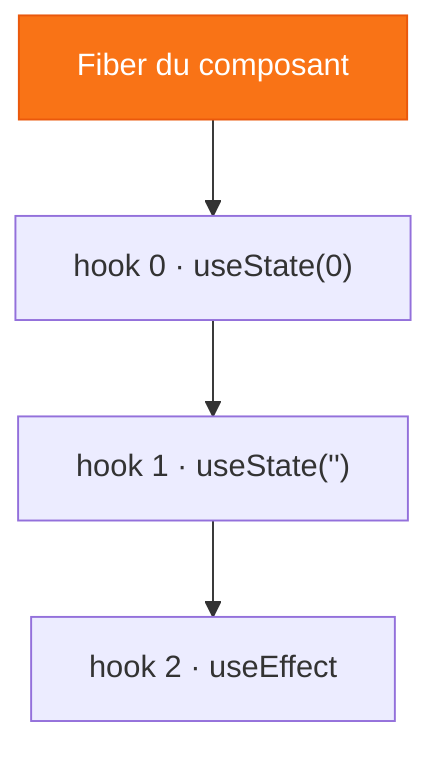

# Chapitre 1
## Les API natives de React
<div class="opacity-60 pt-2">Des outils méconnus qui suffisent souvent</div>

---

# 1a · `useState` — l'état local

<div class="grid grid-cols-2 gap-6 items-center">
<div>

```tsx {all|1|3}
const [count, setCount] = useState(0)

setCount(count + 1) // déclenche un re-render
```

<v-clicks>

- une variable réactive **locale** au composant
- un tuple `[valeur, setter]`
- le setter ⇒ **re-render**
- l'état initial n'est lu **qu'au montage**

</v-clicks>

</div>
<div v-click="6">

### WanderState — point de départ

```tsx
function Ch1aApp() {
  const [trips, setTrips] = useState<Trip[]>([])
  return (
    <TripForm
      onAddTrip={(t) =>
        setTrips((p) => [...p, t])} />
    /* + <TripList trips={trips} /> */
  )
}
```

<div class="text-sm opacity-60 pt-2">
Tout l'état est local. Un formulaire, une liste.
</div>

</div>
</div>

<!--
Démo 1a : formulaire de création + dropdown destination (isOpen + selected = deux
useState, UI state minimal). Message : useState suffit pour de l'état local et éphémère.
-->

---

# Où React range-t-il le state ? — la Fiber

<div class="grid grid-cols-2 gap-8 items-center">
<div>



</div>
<div>

<v-clicks>

- chaque composant a une **fiber node**
- les hooks = une **liste chaînée** sur la fiber
- `useState` = un nœud + sa valeur courante
- l'ordre doit être **stable**

</v-clicks>

<div v-click class="pt-4 border-l-4 border-orange-500 pl-3 text-sm opacity-80">
👉 c'est pour ça qu'on n'appelle <b>jamais</b> un hook conditionnellement.
</div>

</div>
</div>

<!--
Le "pourquoi" derrière la règle des hooks. La valeur survit entre deux renders
parce qu'elle est stockée dans la fiber, repérée par sa position dans la liste.
-->

---

# La règle centrale : immutabilité

<div class="grid grid-cols-2 gap-6 pt-4">
<div>

```js
// ❌ MAUVAIS — mutation en place
state.items.push(item)
setState(state)
```

<div class="text-center text-4xl opacity-30 py-2">≠</div>

```js
// ✅ BON — nouvelle référence
setState({
  ...state,
  items: [...state.items, item],
})
```

</div>
<div v-click class="flex flex-col justify-center">

On passe **toujours une nouvelle référence** au setter.

<div class="pt-4 opacity-70">
spread · <code>map</code> · <code>filter</code> — jamais de mutation en place.
</div>

<div class="pt-6 border-l-4 border-orange-500 pl-3">
React détecte le changement par <span v-mark.underline.orange>comparaison de référence</span>. Pas de nouvelle référence = pas de re-render.
</div>

</div>
</div>

<!--
La contrainte n'est pas gratuite : c'est ce qui permet la détection de changement
par référence (===), bon marché. À garder en tête, ça revient partout (Redux, Zustand).
-->

---

# Le même problème, ailleurs

<div class="grid grid-cols-2 gap-x-8 gap-y-4 pt-2">

<div v-click class="border border-gray-600 rounded p-3">

**Vue** — Proxy 🪄
```js
const s = reactive({ count: 0 })
s.count++ // détecté via le Proxy
```
<span class="text-xs opacity-60">Mutation directe interceptée. Pas de setter.</span>

</div>

<div v-click class="border border-gray-600 rounded p-3">

**Solid** — Signals ⚡
```js
const [count, setCount] = createSignal(0)
count()        // lecture
setCount(1)    // écriture
```
<span class="text-xs opacity-60">Réactivité granulaire, pas de VDOM.</span>

</div>

<div v-click class="border border-gray-600 rounded p-3">

**Svelte** — compilation 🛠️
```js
let count = 0
count++ // compilé en update DOM
```
<span class="text-xs opacity-60">Zéro runtime réactif, zéro overhead.</span>

</div>

<div v-click class="border border-gray-600 rounded p-3">

**Angular** — Zone.js → Signals
<div class="pt-2 text-sm opacity-70">
Historiquement Zone.js, converge vers les Signals (v17+).
</div>

</div>

</div>

<div v-click class="pt-3 text-center">
React choisit la <span v-mark.orange>prévisibilité</span> : state immuable, flux explicite. Contrepartie : verbosité.
</div>

<!--
Décentrer de React une minute : tout le monde résout le même problème (détecter
un changement de state) avec des mécanismes différents. React = explicite plutôt
qu'implicite. La "magie" de Vue/Solid est moins visible mais plus ergonomique.
-->

---

# 1b · Le problème — prop drilling

```tsx {all|4}
<App user={user} onLogout={onLogout}>
  <Header user={user} />
  <Layout user={user} onLogout={onLogout}>
    <UserMenu user={user} onLogout={onLogout} /> {/* ← seul à en avoir besoin */}
  </Layout>
</App>
```

<div class="grid grid-cols-2 gap-8 pt-4">
<div v-click class="opacity-80">

Les composants intermédiaires reçoivent des props **qu'ils ne consomment pas**. Ils ne font que transmettre.

</div>
<div v-click class="border-l-4 border-orange-500 pl-3">

Ajouter un champ = modifier la signature de **chaque composant** sur le chemin.

<div class="pt-2 font-bold">Ça ne scale pas.</div>

</div>
</div>

<!--
Transition vers 1b. Dès qu'on veut accéder au state du voyage depuis plusieurs
composants, le prop drilling devient douloureux. D'où Context + Reducer.
-->

---

# D'où viennent ces hooks ?

<div class="pt-2">

| Quand | Quoi |
|---|---|
| **2014** | **Flux** — Facebook : architecture unidirectionnelle |
| **2015** | **Redux** — Dan Abramov simplifie Flux (inspiré d'Elm) |
| **mars 2018** | **React 16.3** — Context API officiel |
| **fév. 2019** | **React 16.8** — `useContext` + `useReducer` |

</div>

<div class="grid grid-cols-2 gap-6 pt-4 text-sm">
<div v-click class="opacity-75">
<b>Flux</b> : bon diagnostic (flux unidirectionnel, actions nommées) mais trop de boilerplate.
</div>
<div v-click class="opacity-75">
<b>useReducer</b> : Redux a prouvé le pattern, React l'a <span v-mark.underline.orange>intégré nativement</span>.
</div>
</div>

<!--
Chronologie importante : React 2011, open source 2013, Redux 2015, Context 2018.
La communauté a bouché les trous avant que React ne réponde nativement.
-->

---

# `useContext` — partager sans drilling

```tsx {all|1|4-6|11}
const ThemeContext = createContext('light')

function App() {
  return (
    <ThemeContext.Provider value={theme}>
      <Layout /> {/* pas besoin de passer theme en prop */}
    </ThemeContext.Provider>
  )
}

function Button() {
  const theme = useContext(ThemeContext) // accès direct, peu importe la profondeur
}
```

<div class="grid grid-cols-2 gap-6 pt-3 text-sm">
<div v-click class="opacity-75">
React remonte l'arbre vers le <b>Provider le plus proche</b>. Sinon : valeur par défaut.
</div>
<div v-click class="border-l-4 border-orange-500 pl-3">
Quand la valeur change → <b>tous les consommateurs se re-rendent</b>. ⚠️
</div>
</div>

<!--
Cas d'usage adaptés : données vraiment globales à un sous-arbre (thème, user, locale).
PAS un outil universel pour tout état partagé. Le ⚠️ re-render généralisé prépare la suite.
-->

---

# `useReducer` — centraliser les transitions

<div class="grid grid-cols-2 gap-6">
<div>

```ts {all|1|3-5}
const reducer = (state, action) => {
  switch (action.type) {
    case 'ADD_TRIP':
      return { trips: [...state.trips,
                       action.payload] }
    case 'REMOVE_TRIP':
      return { trips: state.trips
        .filter(t => t.id !== action.payload) }
    default: return state
  }
}
```

</div>
<div class="flex flex-col justify-center">

<v-clicks>

- le reducer est **pur** : `(state, action) => newState`
- une action ⇒ **un seul re-render**
- testable **sans React, sans DOM**

</v-clicks>

<div v-click class="pt-3 text-xs opacity-60 border-l-4 border-gray-500 pl-2">
React 18 : l'<b>automatic batching</b> regroupe déjà les setters. La vraie valeur de useReducer reste la <b>lisibilité</b> et la <b>testabilité</b>.
</div>

</div>
</div>

<!--
C'est le reducer réel de WanderState ch1b. Insister : fonction pure → testable en isolation.
L'argument perf est moins fort depuis React 18 (batching), mais la lisibilité reste.
-->

---

# Le pattern `Context + Reducer`

<div class="grid grid-cols-2 gap-4 text-sm">
<div>

```tsx
function TripProvider({ children }) {
  const [state, dispatch] = useReducer(
    tripsReducer, { trips: [] })
  return (
    <TripContext.Provider
      value={{ trips: state.trips, dispatch }}>
      {children}
    </TripContext.Provider>
  )
}
```

</div>
<div>

```tsx
function TripSummary() {
  const { trips, dispatch } =
    useTripContext()
  return (
    <button onClick={() =>
      dispatch({ type: 'CLEAR' })}>
      {trips.length} voyage(s)
    </button>
  )
}
```

</div>
</div>

<div class="grid grid-cols-2 gap-8 pt-4 text-center">
<div v-click class="text-lg">
<code>useContext</code><br><span class="opacity-60 text-sm">le <b>où</b> accéder</span>
</div>
<div v-click class="text-lg">
<code>useReducer</code><br><span class="opacity-60 text-sm">le <b>comment</b> mettre à jour</span>
</div>
</div>

<div v-click class="text-center pt-3 font-bold">
= un store applicatif, sans dépendance externe.
</div>

<!--
Démo 1b : on ouvre un voyage, on y ajoute des étapes. Le state est partagé via le
contexte, muté via le reducer. Plus de prop drilling.
-->

---

# La limite : re-renders non ciblés

```tsx {all|3}
function TripBadge() {
  const { trips } = useTripContext()
  return <span>{trips.length}</span> // re-rend même si seul `budget` a changé
}
```

<div v-click class="pt-2 opacity-80 text-sm">
React compare la <b>référence</b> de <code>value</code>, pas son contenu. L'objet <code>{ trips, dispatch }</code> est recréé à chaque render.
</div>

<div v-click class="pt-4">

C'est là qu'entrent les **sélecteurs** — feature clé des stores dédiés :

```ts
const count = useTripStore(s => s.trips.length) // re-render seulement si length change
```

</div>

<div v-click class="pt-3 text-center opacity-60">
Context n'a pas de sélecteurs. <span v-mark.orange>On y revient.</span>
</div>

<!--
LE point qui justifie tous les stores dédiés. Workaround natif : splitter les contextes
(state vs dispatch). Mais granularité fine = un contexte par slice = ingérable.
-->

---
layout: quote
---

# « useContext n'est pas un state manager. »

C'est de l'**injection de dépendances**.

<div class="text-base opacity-60 pt-4">
Il rend une valeur disponible à plusieurs consommateurs.<br>
Mais il faut <b>quand même gérer le state</b> — avec <code>useState</code> / <code>useReducer</code>.
</div>

<div v-click class="text-sm opacity-50 pt-8">
À terme, le React Compiler pourrait mémoïser correctement un contexte —<br>la limite principale tomberait.
</div>

<!--
Recadrage conceptuel important. Context = DI, pas du state management.
Note prospective : React Compiler pourrait lever la limite des re-renders.
-->

