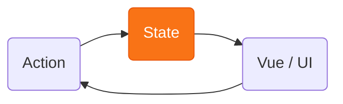

# Chapitre 1
## Les API natives de React
<div class="opacity-80 pt-2">Jusqu'où peut-on aller avec ?</div>

---

# Le state en React

<div v-click="1" class="text-center text-2xl pt-8">
La donnée ne circule que dans <span v-mark.orange>un seul sens</span>. L'état reste <b class="text-orange-400">immuable</b>.
</div>

<div v-click="2" class="flex flex-col items-center gap-1 pt-8">
<div class="border-2 border-orange-500 rounded-lg px-6 py-2 bg-orange-400/10 font-medium">Parent (détient le state)</div>
<div class="flex gap-16 pt-1">
<div class="flex flex-col items-center">
<div class="flex flex-col items-center text-orange-400 leading-tight">
<span class="text-2xl leading-none">↓</span>
<span class="text-xs">props</span>
</div>
<div class="border border-gray-500 rounded-lg px-6 py-2 mt-1">Enfant A</div>
</div>
<div class="flex flex-col items-center">
<div class="flex flex-col items-center text-orange-400 leading-tight">
<span class="text-2xl leading-none">↓</span>
<span class="text-xs">props</span>
</div>
<div class="border border-gray-500 rounded-lg px-6 py-2 mt-1">Enfant B</div>
</div>
</div>
</div>

<div v-click="3" class="pt-8 text-center opacity-70">
La donnée ne va que <b>vers le bas</b>. jamais de l'enfant au parent, jamais entre enfants.<br>On sait toujours d'où vient chaque valeur.
</div>

<div v-click="4" class="pt-6 text-center text-lg">
Ça se complique quand deux composants <span v-mark.orange>éloignés</span> doivent partager la donnée.
</div>

<!--
Le trait unique de React : flux de données unidirectionnel. La donnée ne descend QUE vers le
bas, du parent vers l'enfant via les props — jamais vers le haut, jamais entre frères. Pour
qu'une donnée « remonte », il n'y a qu'un mécanisme (à expliquer à l'oral) : le parent passe
un callback en prop, et l'enfant l'appelle en lui passant des arguments. Ce n'est donc pas un
vrai flux remontant, juste l'enfant qui déclenche du code du parent. Très prévisible → facile
à débugger. Le coût : pour partager entre composants éloignés, il faut tout remonter au parent
commun → point de départ des chapitres (prop drilling → contexte → stores).
-->

---
disabled: true
---

# Et dans les autres frameworks ?

<div class="max-w-4xl mx-auto pt-8 grid grid-cols-[auto_1fr_1fr_1fr] gap-x-5 gap-y-5 items-center">

<div></div>
<div class="text-center font-bold text-orange-400">React</div>
<div class="text-center font-bold opacity-80">Vue</div>
<div class="text-center font-bold opacity-80">Angular</div>

<div v-click="1" class="text-sm opacity-60 whitespace-nowrap">Lier état ↔ vue</div>
<div v-click="1" class="text-center"><code class="text-xs whitespace-nowrap">&lt;Field value={count}<br/>onChange={setCount} /&gt;</code></div>
<div v-click="1" class="text-center"><code class="text-xs whitespace-nowrap">&lt;Field v-model="count" /&gt;</code></div>
<div v-click="1" class="text-center"><code class="text-xs whitespace-nowrap">&lt;app-field [(value)]="count" /&gt;</code></div>

<div v-click="2" class="text-sm opacity-60 whitespace-nowrap">Changer l'état</div>
<div v-click="2" class="text-center"><code class="text-sm whitespace-nowrap">setCount(count + 1)</code></div>
<div v-click="2" class="text-center"><code class="text-sm whitespace-nowrap">count.value++</code></div>
<div v-click="2" class="text-center"><code class="text-sm whitespace-nowrap">this.count++</code></div>

</div>

<div v-click="3" class="pt-10 text-center text-lg">
Vue &amp; Angular : on <b>mute</b>, le framework réagit.<br>
React : l'état est <span v-mark.underline.orange>immuable</span>, il est remplacé.
</div>

<div v-click="4" class="pt-3 text-center opacity-70">
Immutabilité &amp; flux à sens unique vont de pair → un flux <b>prévisible et traçable</b>.
</div>

<!--
Deux axes pour enfoncer le clou. (1) Lier état ↔ vue : Vue (v-model) et Angular ([(x)]) font du
two-way binding (sur composant aussi, pas que les inputs natifs : modelValue/update:modelValue,
@Input x + @Output xChange) ; React reste explicite (value en prop, onChange en callback).
(2) Changer l'état : Vue et Angular MUTENT directement la donnée et le framework réagit
(Proxy / détection de changement) ; React n'autorise jamais la mutation — on passe par le
setter et l'état reste immuable. Bilan : plus verbeux, mais un seul sens, prévisible et traçable.
-->

---
layout: center
---

<div class="text-6xl font-mono pt-6 pb-4">
  UI = <span v-mark.circle.orange="1">f(state)</span>
</div>

<div v-click="2" class="text-xl opacity-70">
Une UI n'est qu'une <b>projection de l'état</b> à un instant T.
</div>

<div v-click="3" class="text-xl opacity-70 pt-2">
Changer l'UI = changer l'état.
</div>

<div v-click="4" class="flex justify-center pt-12">



</div>

<!--
Le modèle mental qui accompagne le flux : UI = projection de l'état. Pas unique à React (Vue,
Solid le partagent), mais c'est ainsi qu'on raisonne. Corollaire: changer l'écran = changer l'état, rien
d'autre. Tout le reste du talk : où vit le state, et comment on le change.
-->

---

# `useState` : la clé de voûte de la réactivité

<div class="grid grid-cols-2 gap-6 items-start pt-2">
<div>

<div class="text-sm opacity-60 pb-1">Une simple variable</div>

```tsx
function Compteur() {
  let count = 0
  return <button onClick={() => count++}>
    {count}
  </button>
}
```

<div v-click="2" class="text-sm pt-2 space-y-1">

- ❌ réinitialisée à **chaque render**
- ❌ `count++` ne **redessine rien**

</div>

</div>
<div v-click="3">

<div class="text-sm opacity-60 pb-1">Avec <code>useState</code></div>

```tsx
function Compteur() {
  const [count, setCount] = useState(0)
  return <button onClick={() => setCount(count + 1)}>
    {count}
  </button>
}
```

<div v-click="4" class="text-sm pt-2 space-y-1">

- ✅ la valeur **survit** aux re-renders
- ✅ `setCount` **déclenche** un re-render
- ✅ la mise à jour est **explicite** : on passe par le setter

</div>

</div>
</div>

<div v-click="5" class="text-center pt-5 text-lg">
Ces deux propriétés relient <b>la donnée</b> <span class="opacity-40">⇄</span> <b>l'UI</b> :
<span v-mark.orange>c'est ça, la réactivité.</span>
</div>

<!--
Passer très vite : useState fait seulement deux choses, persister une valeur entre les re-rendus, et déclencher un re-rendu quand une nouvelle valeur est passée au setter.
-->

---
disabled: true
---

# `useState` : passer une valeur, ou une fonction

<div class="grid grid-cols-2 gap-6 items-start pt-2">
<div>

<div class="text-sm opacity-60 pb-1">À l'initialisation</div>

```tsx
// ❌ valeur : calculée à CHAQUE render
const [items] = useState(loadFromStorage())

// ✅ fonction : exécutée une seule fois (montage)
const [items] = useState(loadFromStorage)
```

<div v-click="3" class="text-sm pt-2 opacity-80">
L'<b>initialiseur paresseux</b> : pour un calcul de départ coûteux.
</div>

</div>
<div v-click="4">

<div class="text-sm opacity-60 pb-1">À la mise à jour</div>

```tsx
// ❌ valeur directe : le state est mis à jour de manière asynchrone
handleClick(() => {
  setCount(count + 1) // count = 0 -> 1
  setCount(count + 1) // count = 0 -> 1
  setCount(count + 1) // count = 0 -> 1
})

// ✅ fonction : reçoit toujours la valeur fraîche
handleClick(() => {
  setCount((c) => c + 1) // count = 0 -> 1
  setCount((c) => c + 1) // count = 1 -> 2
  setCount((c) => c + 1) // count = 2 -> 3
})

```

<div v-click="6" class="text-sm pt-2 opacity-80">
L'<b>updater</b> : indispensable dès que la nouvelle valeur dépend du state actuel et qu'on met à jour la valeur <b>plusieurs fois dans le même handler</b>.
</div>

</div>
</div>

<div v-click="7" class="text-center pt-5 opacity-70">
Même idée des deux côtés : <span v-mark.orange>une fonction = « laisse React choisir le bon moment / la bonne valeur »</span>.
</div>

<!--
Détail à montrer vite
-->

---

# La règle centrale : immutabilité

<div class="grid grid-cols-2 gap-6 pt-4">
<div>

```js
// ❌ MAUVAIS — mutation en place
state.items.push(item)
setState(state)
```

<div class="text-center text-4xl opacity-30 py-2">≠</div>

```js
// ✅ BON — nouvelle référence
setState({
  ...state,
  items: [...state.items, item],
})
```

</div>
<div v-click class="flex flex-col justify-center">

On passe **toujours une nouvelle référence** au setter.

<div class="pt-4 opacity-70">
spread · <code>map</code> · <code>filter</code> — jamais de mutation en place.
</div>

<div class="mt-6 border-l-4 border-orange-500 pl-3">
React détecte le changement par <span v-mark.underline.orange>comparaison de référence</span>. Pas de nouvelle référence = pas de re-render.
</div>

</div>
</div>

<!--
La contrainte n'est pas gratuite : c'est ce qui permet la détection de changement
par référence (===), bon marché. À garder en tête, ça revient partout (Redux, Zustand).
-->

---

# Bonne pratique : dériver plutôt que stocker

<div class="text-center opacity-80 pt-1">
Chaque <code>useState</code> est une donnée à <b>maintenir synchronisée</b>. La meilleure réduction de bugs : en avoir le moins possible.
</div>

<div class="grid grid-cols-2 gap-6 items-start pt-6">
<div>

<div class="text-sm opacity-60 pb-1">❌ State dérivé… mais stocké</div>

```tsx
const [items, setItems] = useState<Item[]>([])
const [query, setQuery] = useState('')
// redondant : à resynchroniser à la main
const [visible, setVisible] = useState<Item[]>([])
```

<div v-click="1" class="text-sm pt-2 opacity-80">
Chaque modif de <code>items</code> ou <code>query</code> oblige à recalculer <code>visible</code>. Un oubli = UI fausse.
</div>

</div>
<div v-click="2">

<div class="text-sm opacity-60 pb-1">✅ Dérivé pendant le render</div>

```tsx
const [items, setItems] = useState<Item[]>([])
const [query, setQuery] = useState('')
// recalculé à chaque render, jamais périmé
const visible = items.filter((i) =>
  i.name.includes(query))
```

<div v-click="3" class="text-sm pt-2 opacity-80">
Une seule source de vérité. <code>visible</code> ne peut pas <b>diverger</b>.
</div>

</div>
</div>

<div v-click="4" class="text-center pt-6">
Ne mettre dans <code>useState</code> que ce qui ne peut <b>pas</b> être recalculé. <span v-mark.orange>Moins de state, moins de bugs.</span>
<span class="opacity-60 text-sm block pt-1">(<code>useMemo</code> peut être utilisé pour limiter les re-calculs coûteux)</span>
</div>

<!--
La règle d'hygiène n°1 de useState. Le state n'est pas gratuit : chaque morceau doit être tenu
à jour, et tout ce qui est stocké peut devenir FAUX (désynchronisé). Donc on minimise la
"surface de state". Test simple : « puis-je recalculer cette valeur à partir des props et des
autres states ? » Si oui → ce n'est PAS du state, c'est du dérivé : on le calcule pendant le
render. Exemples de faux state à bannir : un total, une liste filtrée/triée, un fullName, un
booléen isValid, le miroir d'une prop. Bénéfice : une seule source de vérité, impossible à
désynchroniser, et moins de setters à câbler. Nuance : si la dérivation est vraiment coûteuse,
useMemo — mais c'est une optimisation de calcul, pas un retour à du state. À retenir : on
reverra exactement ce principe avec les sélecteurs (Zustand) et les computed (MobX).
-->

---
disabled: true
---

# Le state vit dans React — pas dans le composant

<div class="text-center opacity-80 pt-1">
Le composant est une fonction ré-exécutée à chaque render — il ne <b>contient</b> pas son state.
</div>

<div class="grid grid-cols-2 gap-10 items-center pt-8">
<div class="flex justify-center">

<div class="ws-tree font-mono text-sm">
  <div class="ws-node ws-root">&lt;App&gt;</div>
  <div class="ws-stem"></div>
  <div class="ws-kids">
    <div class="ws-kid">
      <div class="ws-conn"></div>
      <div class="ws-node">&lt;Counter /&gt;<span class="ws-pos">position 0</span></div>
    </div>
    <div class="ws-kid">
      <div class="ws-conn"></div>
      <div class="ws-node">&lt;Counter /&gt;<span class="ws-pos">position 1</span></div>
    </div>
  </div>
</div>

</div>
<div v-click="2">

```js
// le state vit ICI, dans React —
// pas dans <Counter>
{
  "App › Counter[0]": { n: 3 },
  "App › Counter[1]": { n: 0 },
}
```

</div>
</div>

<div v-click="3" class="text-center pt-8 opacity-80">
Rattaché par <b>type + position</b> (jamais l'instance) : changer l'un <span v-mark.orange>jette le state</span>.
</div>

<style>
.ws-tree { display: flex; flex-direction: column; align-items: center; }
.ws-node { border-radius: 6px; padding: 0.3rem 0.8rem; line-height: 1.2; }
.ws-root { border: 2px solid #f97316; }
.ws-kid .ws-node {
  border: 1px solid #9ca3af;
  display: flex; flex-direction: column; align-items: center;
  width: 150px; box-sizing: border-box;
}
.ws-pos { font-size: 0.7rem; opacity: 0.5; }
.ws-stem { width: 2px; height: 18px; background: #6b7280; }
.ws-kids { position: relative; display: flex; gap: 48px; }
.ws-kids::before {
  content: ''; position: absolute; top: 0; left: 75px; right: 75px;
  height: 2px; background: #6b7280;
}
.ws-kid { display: flex; flex-direction: column; align-items: center; }
.ws-conn { width: 2px; height: 18px; background: #6b7280; }
</style>

<!--
Le modèle mental qui débloque tout le reste. Le composant est une FONCTION, ré-exécutée à
chaque render : il ne "stocke" rien. C'est React qui détient le state, dans sa propre
structure, et qui le rattache à un composant via deux choses : le TYPE du composant + sa
POSITION dans l'arbre de rendu. Pas l'instance, pas une variable.
Conséquences concrètes :
- deux <Counter /> côte à côte = deux positions = deux states séparés ;
- un ternaire qui rend <Counter /> dans les deux branches à la MÊME position garde le state,
  même si c'est un élément JSX différent à chaque fois (← "pas une instance") ;
- si le TYPE change à une position (<p> au lieu de <Counter />), React démonte et le state
  est jeté.
Transition : et si on veut maîtriser cette identité à la main ? → slide `key`.
-->

---
disabled: true
---

# `key` : changer l'identité réinitialise le state

<div class="text-center opacity-80 pt-1">
Par défaut, la position d'un composant = son <b>index</b> parmi ses frères. <code>key</code> remplace cet index dans son identité.
</div>

<div class="grid grid-cols-2 gap-10 items-center pt-8">
<div>

```tsx
// la key entre dans l'identité du slot
<Profile key={userId} id={userId} />
```

<div v-click="2" class="pt-4 text-sm opacity-80 text-center">
<code>userId</code> : <code>"alice"</code> <span class="opacity-40">→</span> <code>"bob"</code>
</div>

</div>
<div v-click="3">

```js
// avant — identité = Profile + key "alice"
{ "Profile[key:alice]": { draft: "Salut…" } }

// après — key différente = nouvelle identité
{ "Profile[key:bob]":   { draft: "" } } // ← reset
```

</div>
</div>

<div v-click="4" class="text-center pt-8 opacity-80">
Changer la <code>key</code> = <b>changer la position</b> = nouvelle identité → React démonte l'ancien et <span v-mark.orange>réinitialise le state</span>.
</div>

<!--
key, vu sous l'angle de la slide précédente. React identifie un composant par type + position ;
"position" = par défaut l'index parmi les frères. key REMPLACE cet index dans le calcul de
l'identité. Donc deux conséquences symétriques :
- même key conservée alors que l'ordre change (liste réordonnée) → React garde le bon state ;
- key qui change à une position fixe → React croit que c'est un AUTRE composant → démonte,
  remonte, state réinitialisé.
L'astuce classique : <Form key={userId} /> pour repartir d'un formulaire vierge quand on
change d'utilisateur, sans useEffect de reset à la main. C'est "changer la position" volontairement.
Transition : cette "structure à part" où vit le state, concrètement c'est la Fiber (slide suivante).
-->

---

# Le même problème, ailleurs

<div class="grid grid-cols-2 gap-x-8 gap-y-4 pt-2">

<div v-click class="border border-gray-600 rounded px-3">

**Vue** — Proxy 🪄
```js
const s = reactive({ count: 0 })
s.count++ // détecté via le Proxy
```
<span class="text-xs opacity-60">Mutation directe interceptée. Pas de setter.</span>

</div>

<div v-click class="border border-gray-600 rounded px-3">

**Solid** — Signals ⚡
```js
const [count, setCount] = createSignal(0)
count()        // lecture
setCount(1)    // écriture
```
<span class="text-xs opacity-60">Réactivité granulaire, pas de VDOM.</span>

</div>

<div v-click class="border border-gray-600 rounded px-3">

**Svelte** — compilation 🛠️
```js
let count = 0
count++ // compilé en update DOM
```
<span class="text-xs opacity-60">Zéro runtime réactif, zéro overhead.</span>

</div>

<div v-click class="border border-gray-600 rounded px-3">

**Angular** — Zone.js → Signals
<div class="pt-2 text-sm opacity-70">
Historiquement Zone.js, converge vers les Signals (v17+).
</div>

</div>

</div>

<div v-click class="pt-3 text-center">
React choisit la <span v-mark.orange>prévisibilité</span> : state immuable, flux explicite. Contrepartie : verbosité.
</div>

<!--
Décentrer de React une minute : tout le monde résout le même problème (détecter
un changement de state) avec des mécanismes différents. React = explicite plutôt
qu'implicite. La "magie" de Vue/Solid est moins visible mais plus ergonomique.
-->

---

# `useReducer` : une gestion plus structurée du state

<div class="grid grid-cols-2 gap-6 items-center pt-2">
<div>

```ts
// le reducer : une fonction pure (state, action) => state
function reducer(count, action) {
  switch (action.type) {
    case 'inc':   return count + 1
    case 'reset': return 0
    default:      return count
  }
}

const [count, dispatch] = useReducer(reducer, 0)
dispatch({ type: 'inc' }) // → re-render, count = 1
```

<div v-click="4">

```ts
function useState(initial) {
  return useReducer(
    (prev, action) =>
      typeof action === 'function' ? action(prev) : action,
    initial,
  )
}
```

</div>

</div>
<div>

<v-clicks>

- on ne passe plus *la valeur*, mais une **action**
- Reducer : une fonction **pure** `(state, action) => state` qui centralise toute la logique de transition
- ⇒ un **contrôle plus fin** du « setter » : nommé, centralisé, testable

</v-clicks>

<div v-click="4" class="mt-4 text-sm opacity-80 pt-8">
En interne, <code>useState</code> <b>n'est qu'un</b> <code>useReducer</code> avec un reducer trivial.
</div>

</div>
</div>

<!--
useReducer = la version générale de useState. Au lieu de fournir directement la prochaine
valeur, on DÉCRIT une action et une fonction pure (le reducer) calcule le state suivant. Même
contrat que useState (valeur qui survit + setter qui déclenche un render), avec un cran de
contrôle en plus sur le "comment". Fait vrai et utile à dire : useState EST implémenté
par-dessus useReducer dans React — son reducer interne est en gros
(state, action) => typeof action === 'function' ? action(state) : action. Rien de neuf sous
le capot, juste une API qui expose la transition.
-->

---

# Regrouper les states qui interagissent

<div class="text-center opacity-80 pt-1">
Quand changer un morceau d'état doit en changer un autre, des <code>useState</code> séparés se désynchronisent. Un objet + un reducer = transitions <b>atomiques</b>.
</div>

<div class="grid grid-cols-2 gap-6 items-start pt-6">
<div>

<div class="text-sm opacity-60 pb-1">❌ états dispersés, incohérences possibles</div>

```tsx
const [data, setData] = useState(null)
const [error, setError] = useState(null)
const [loading, setLoading] = useState(false)
// rien n'interdit data ET error en même temps
```

</div>
<div v-click="1">

<div class="text-sm opacity-60 pb-1">✅ un objet, des transitions nommées</div>

```ts
const [req, dispatch] = useReducer(reducer, {
  status: 'idle', data: null, error: null,
})
dispatch({ type: 'success', data })  // 1 transition
dispatch({ type: 'failure', error }) // 1 état cohérent
```

</div>
</div>

<div v-click="2" class="grid grid-cols-3 gap-4 pt-6 text-sm text-center">
<div>reducer <b>pur</b> → testable sans React</div>
<div>une action ⇒ <b>un seul</b> re-render</div>
<div>états impossibles <b>éliminés</b></div>
</div>

<!--
Le cas où useReducer brille : plusieurs morceaux d'état couplés. Avec des useState séparés
(data / error / loading), rien n'empêche des combinaisons absurdes (data ET error, loading qui
reste à true). En regroupant dans UN objet piloté par un reducer, chaque action décrit une
transition COMPLÈTE et COHÉRENTE — on rend les états impossibles... impossibles. Bonus : une
action = un seul re-render, et le reducer est pur donc testable sans React ni DOM. Depuis
React 18 l'automatic batching réduit l'argument perf des setters groupés ; la vraie valeur
restante = lisibilité, cohérence, testabilité. C'est exactement le pattern du reducer de
WanderState (ch1b), qu'on branche au Context juste après.
-->

---

# L'unique source de réactivité

<div class="text-center opacity-80 pt-1">
Deux choses seulement peuvent déclencher le re-rendu d'un composant.
</div>

<div class="grid grid-cols-2 gap-8 pt-8">
<div class="border-2 border-orange-500 rounded px-4 py-5 text-center">
<div class="text-3xl font-bold opacity-30 pb-1">1</div>
une mise à jour de <b>state</b><br>
<code>setState</code> · <code>dispatch</code>
</div>
<div v-click="1" class="border border-gray-500 rounded px-4 py-5 text-center">
<div class="text-3xl font-bold opacity-30 pb-1">2</div>
le <b>re-render du parent</b>
</div>
</div>

<div v-click="2" class="text-center pt-6 opacity-80">
Mais un parent ne se re-rend <b>jamais spontanément</b> : en remontant la chaîne, il y a toujours un <code>setState</code> à la racine.
</div>

<div v-click="3" class="text-center pt-6 text-xl">
⇒ changer le state est le <span v-mark.orange>seul déclencheur spontané</span> d'un rendu.
</div>

<div v-click="4" class="text-center pt-5 text-4xl font-bold">
<code>UI = f(state)</code>
</div>

<!--
Le bilan du chapitre useState. Question simple : qu'est-ce qui peut re-rendre un composant
React ? Exactement DEUX choses : (1) une mise à jour de state (setState / dispatch), (2) le
re-render de son parent. Mais le (2) n'est jamais spontané — si un parent se re-rend, c'est
qu'un state a changé quelque part au-dessus. En remontant la chaîne, la seule cause INITIALE
d'un rendu, c'est donc un changement de state. C'est ce qui justifie UI = f(state) : l'écran
est une pure fonction du state, et le seul levier pour le faire évoluer est setState. Ça boucle
avec la 1re slide (la clé de voûte) et ça cadre toute la suite : gérer une UI réactive,
c'est gérer du state.
-->

---

# Partager le state en le faisant remonter

<div class="text-center opacity-80 pt-1">
Pas de « state global » en React : juste du state <b>local</b>, placé plus ou moins haut dans l'arbre. <b>portée</b> = <b>endroit</b> où vit le <code>useState</code>.
</div>

<div class="grid grid-cols-2 gap-10 items-center pt-6">
<div class="flex items-stretch gap-3 font-mono text-sm">

<div class="flex flex-col items-center justify-between text-xs opacity-60 py-1">
<div>+ large</div>
<div class="text-xl">↑</div>
<div>+ étroite</div>
</div>

<div class="flex flex-col gap-3 flex-1">
<div class="border-2 border-orange-500 rounded px-3 py-2">🌍 <code>&lt;App /&gt;</code> <span class="opacity-60">— state « global »</span></div>
<div class="border border-gray-500 rounded px-3 py-2">🔀 ancêtre commun <span class="opacity-60">— partagé entre frères</span></div>
<div class="border border-gray-500 rounded px-3 py-2">🍃 composant feuille <span class="opacity-60">— local</span></div>
</div>

</div>
<div>

<v-clicks>

- utilisé dans **un seul** composant → state **local** au composant
- **deux frères** le partagent → on le remonte à leur **ancêtre commun**
- besoin **partout** → on le remonte jusqu'à la **racine** : state « global »

</v-clicks>

</div>
</div>

<div v-click class="text-center pt-6 opacity-80">
Un seul mécanisme dans tout l'arbre de composants. <span v-mark.orange>Remonter le state = élargir sa portée.</span>
</div>

<!--
Le modèle mental clé avant d'attaquer le partage de state. En React, il n'existe PAS de
primitive « state global » : il n'y a que du state local (un useState), qu'on place plus ou
moins haut dans l'arbre. La PORTÉE d'un state = l'endroit où on l'a déclaré. Règle pratique
(lifting state up) : on met le state au plus proche ANCÊTRE COMMUN des composants qui en ont
besoin, et on le redistribue par props. Cas limite : un state utile partout → on le remonte
jusqu'à la racine de l'app, et c'est exactement ce qu'on appelle du « global ». Donc local et
global ne sont pas deux outils différents, c'est le même useState à deux hauteurs.
Transition (slide suivante) : remonter le state, c'est bien, mais le redescendre par props sur
plusieurs niveaux devient vite douloureux — le prop drilling. C'est ce qui motive Context.
-->

---

# Le problème du prop drilling

```tsx
<App user={user} onLogout={onLogout}>
  <Header user={user} />
  <Layout user={user} onLogout={onLogout}>
    <UserMenu user={user} onLogout={onLogout} /> {/* ← seul à en avoir besoin */}
  </Layout>
</App>
```

<div v-click class="flex items-center justify-center gap-3 pt-10">

<div class="border-2 border-gray-500 rounded px-5 py-4 text-center w-36">
<div class="text-4xl">🧩</div>
<div class="text-sm pt-2 opacity-80">nombre de states</div>
</div>

<div class="text-4xl opacity-40">×</div>

<div class="border-2 border-gray-500 rounded px-5 py-4 text-center w-36">
<div class="text-4xl">↕️</div>
<div class="text-sm pt-2 opacity-80">profondeur de l'arbre</div>
</div>

<div class="text-4xl opacity-40">×</div>

<div class="border-2 border-gray-500 rounded px-5 py-4 text-center w-36">
<div class="text-4xl">↔️</div>
<div class="text-sm pt-2 opacity-80">largeur de l'arbre</div>
</div>

<div class="text-4xl opacity-40">=</div>

<div class="border-2 border-orange-500 rounded px-5 py-4 text-center w-36">
<div class="text-4xl">🔥</div>
<div class="text-sm pt-2 opacity-80">douleur</div>
</div>

</div>

<div v-click class="text-center pt-10 text-xl">
<span v-mark.orange>Pas d'optimisation prématurée</span> : c'est leur <b>produit</b> qui fait mal, pas un facteur seul.
</div>

<!--
Transition vers 1b. Dès qu'on veut accéder au state du voyage depuis plusieurs
composants, le prop drilling devient douloureux. D'où Context + Reducer.
Nuance à dire à l'oral : NE PAS dégainer Context/un store dès le premier prop passé deux
niveaux plus bas — c'est de la sur-ingénierie. Le prop drilling n'est PAS un bug ni un
problème de perf : c'est purement de la DX (verbosité, friction à la maintenance). On peut
parfaitement vivre avec sur de petits arbres. Ça ne devient réellement coûteux que quand TROIS
dimensions enflent en même temps : (1) le nombre de morceaux de state à faire descendre, (2) la
profondeur de l'arbre à traverser, (3) sa largeur (combien de branches/feuilles). C'est le
PRODUIT des trois qui croît non-linéairement — une seule grande dimension reste gérable.
-->

---

# `useContext` : partager sans drilling

```tsx
const ThemeContext = createContext('light')

function App() {
  return (
    <ThemeContext.Provider value={theme}>
      <Layout /> {/* pas besoin de passer theme en prop */}
    </ThemeContext.Provider>
  )
}

function Button() {
  const theme = useContext(ThemeContext) // accès direct, peu importe la profondeur
}
```

<div class="grid grid-cols-2 gap-6 pt-3 text-sm">
<div v-click class="opacity-75">
React remonte l'arbre vers le <b>Provider le plus proche</b>. Sinon : valeur par défaut.
</div>
<div v-click class="border-l-4 border-orange-500 pl-3">
Quand la valeur change → <b>tous les consommateurs se re-rendent</b>. ⚠️
</div>
</div>

<div v-click class="mt-5 border-2 border-orange-500 rounded px-4 py-3">
⚠️ <code>Context</code> n'est <b>pas</b> un outil de gestion d'état,c'est de l'<b>injection de dépendances</b>.
<div class="text-sm opacity-80 pt-1">
Le state reste un <code>useState</code> / <code>useReducer</code> ; le Context ne fait que le rendre <span v-mark.orange>accessible partout</span>, sans prop drilling.
</div>
</div>

<!--
Le point à marteler : Context ≠ state manager. C'est un mécanisme d'INJECTION DE DÉPENDANCES —
il fait descendre une valeur dans l'arbre sans la passer de props en props. Point. La gestion
d'état (la valeur qui survit, le setter qui déclenche un render) reste assurée par useState /
useReducer, placés dans le Provider. Autrement dit : on garde EXACTEMENT le state local du
chapitre précédent, on le remonte au sommet (lifting state up), et le Context sert juste de
"tuyau" pour y accéder partout. Beaucoup de gens disent "je gère mon état avec Context" : non,
ils gèrent leur état avec useReducer et le DISTRIBUENT avec Context. Cas d'usage adaptés :
données vraiment globales et peu changeantes (thème, user, locale). Le ⚠️ re-render généralisé
(tous les consommateurs) prépare la limite qu'on voit juste après.
-->

---

# Le pattern `Context + Reducer`

<div class="grid grid-cols-2 gap-4 text-sm">
<div>

```tsx
function TripProvider({ children }) {
  const [state, dispatch] = useReducer(
    tripsReducer, { trips: [] })
  return (
    <TripContext.Provider
      value={{ trips: state.trips, dispatch }}>
      {children}
    </TripContext.Provider>
  )
}
```

</div>
<div>

```tsx
function TripSummary() {
  const { trips, dispatch } =
    useTripContext()
  return (
    <button onClick={() =>
      dispatch({ type: 'CLEAR' })}>
      {trips.length} voyage(s)
    </button>
  )
}
```

</div>
</div>

<div class="grid grid-cols-2 gap-8 pt-4 text-center">
<div v-click class="text-lg">
<code>useContext</code><br><span class="opacity-60 text-sm">le <b>où</b> accéder</span>
</div>
<div v-click class="text-lg">
<code>useReducer</code><br><span class="opacity-60 text-sm">le <b>comment</b> mettre à jour</span>
</div>
</div>

<div v-click class="text-center pt-3 font-bold">
= un store applicatif, sans dépendance externe.
</div>

<!--
Démo 1b : on ouvre un voyage, on y ajoute des étapes. Le state est partagé via le
contexte, muté via le reducer. Plus de prop drilling.
-->

---

# La limite : re-renders non ciblés

```tsx
function TripBadge() {
  const { trips } = useTripContext()
  return <span>{trips.length}</span> // re-rend même si seul `budget` a changé
}
```

<div v-click class="pt-2 opacity-80 text-sm">
React compare la <b>référence</b> de <code>value</code>, pas son contenu. L'objet <code>{ trips, dispatch }</code> est recréé à chaque render.
</div>

<div v-click class="pt-4">

C'est là qu'entrent les **sélecteurs** — feature clé des stores dédiés :

```ts
const count = useTripStore(s => s.trips.length) // re-render seulement si length change
```

</div>

<div v-click class="pt-3 text-center opacity-60">
Context n'a pas de sélecteurs. <span v-mark.orange>On y revient.</span>
</div>

<!--
LE point qui justifie tous les stores dédiés. Workaround natif : splitter les contextes
(state vs dispatch). Mais granularité fine = un contexte par slice = ingérable.
-->

---

# Les API natives — bilan

<Bilan
  :scores="[5, 5, 3, 5, 2]"
  poids="0 kB (intégré à React)"
  perimetre="State local, remonté plus ou moins haut dans l'arbre"
  idealPour="State local et données globales peu changeantes (thème, user, locale)"
  :avantages="[
    'Zéro dépendance — déjà là, rien à installer',
    'Modèle mental simple : UI = f(state), flux unidirectionnel',
    'useReducer : transitions nommées, pures, testables',
  ]"
  :limites="[
    'Context = injection de dépendances, pas un state manager',
    'Pas de sélecteurs → re-renders non ciblés de tous les consommateurs',
    'Prop drilling douloureux dès que l\'arbre grandit',
  ]"
/>

<!--
Le bilan du chapitre, en miroir des autres (mêmes axes sur 5). Scores : prise en main 5
(c'est React, rien à apprendre de plus), poids 5 (intégré, 0 kB), perf 3 (le talon d'Achille :
re-renders non ciblés du Context, faute de sélecteurs), écosystème 5 (c'est React lui-même +
React DevTools), montée en charge 2 (prop drilling + re-renders généralisés rendent les grands
arbres pénibles — c'est exactement ce qui motive les stores dédiés du chapitre suivant).
À marteler : Context n'est PAS un state manager, c'est de la DI. Note prospective : le React
Compiler pourrait à terme lever la limite des re-renders.
-->

