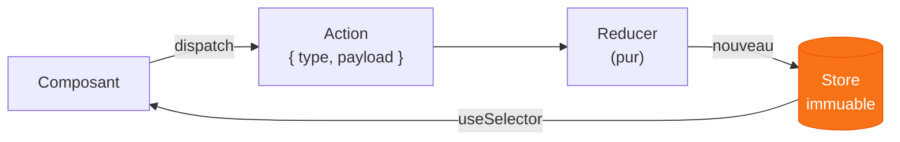

# Chapitre 4
## Les state managers classiques
<div class="opacity-60 pt-2">Tout faire — mais pas aussi bien qu'un outil spécialisé</div>

---

# Deux familles, une question

<div class="grid grid-cols-2 gap-6 pt-4">
<div v-click class="border border-gray-600 rounded-lg p-5">

### State immuable
<div class="opacity-70 text-sm pt-1">
fonctionnel, comme React.<br>
<b>Redux</b>, useReducer.
</div>

</div>
<div v-click class="border border-gray-600 rounded-lg p-5">

### State mutable
<div class="opacity-70 text-sm pt-1">
signaux, observables.<br>
<b>MobX</b>, Jotai.
</div>

</div>
</div>

<div v-click class="pt-8 text-center text-xl">
Autre axe décisif : le store vit-il dans un <span v-mark.orange>Provider</span> ?
</div>

<div v-click class="text-center text-sm opacity-60 pt-2">
Faut-il wrapper toute l'app… ou pas ? (Redux oui, Zustand non)
</div>

<!--
Deux familles : immuable (Redux) vs mutable (MobX, Jotai). Et l'axe "contexte ou pas".
Argument pour un state manager classique : un seul outil pour tout, ou énormément
de state global client. Mais : pas aussi bien qu'un outil spécialisé.
-->

---

# `Zustand` — Redux en plus simple ?

```ts {all|1|2-5|7}
const useTripStore = create((set) => ({
  trips: [],                                          // state
  addTrip:    (t)  => set((s) => ({ trips: [...s.trips, t] })),
  removeTrip: (id) => set((s) => ({ trips: s.trips.filter(x => x.id !== id) })),
}))

const count = useTripStore((s) => s.trips.length)     // hook + sélecteur, SANS provider
```

<div class="grid grid-cols-3 gap-3 pt-4 text-xs">
<div v-click>✅ <b>Pas de provider</b> — juste un hook</div>
<div v-click>✅ <b>State + actions</b> au même endroit</div>
<div v-click>✅ <b>Sélecteurs</b> → re-render ciblé</div>
</div>

<div v-click class="pt-4 text-sm opacity-70 text-center">
« Comme un <code>useState</code> sous stéroïdes, sans contexte. »
</div>

<!--
Démo 4b : refacto TripContext → Zustand. set merge superficiellement. Sélecteur =
une seule propriété par appel (sinon nouvelle référence → re-render). useShallow pour
plusieurs. Encourage plusieurs stores (un par domaine). persist en 1 ligne. Diff: -60 lignes.
-->

---

# `Zustand` — l'architecture

<div class="grid grid-cols-2 gap-6 pt-2">
<div>

<v-clicks>

- un store = un hook ⇒ **plusieurs stores** faciles, un par domaine
- ⚠️ domaines interdépendants → un seul store (ne pas recoupler à la main)
- sélecteur = **une propriété** par appel (sinon nouvelle référence)
- `useShallow` pour en lire plusieurs d'un coup

</v-clicks>

</div>
<div v-click="5">

```ts
// persistance en UNE ligne
const useTripStore = create(
  persist(
    (set) => ({ /* … */ }),
    { name: 'wanderstate' } // localStorage
  )
)
```

<div class="text-sm opacity-60 pt-3">
Diff git côte à côte vs Context+Reducer :<br>
<b class="opacity-100">−60 lignes</b>, même comportement.
</div>

</div>
</div>

<!--
Détailler l'archi Zustand. Bounded store : slices A, B, AB combinées en un store.
Le persist middleware est l'argument démo le plus parlant.
-->

---

# `Redux` + RTK — la sainte trinité



<div class="grid grid-cols-2 gap-6 pt-2 text-sm">
<div v-click class="opacity-80">
Né comme une implémentation de <b>Flux</b> : stopper l'event-based illisible, tracer les changements via des actions.
</div>
<div v-click class="border-l-4 border-orange-500 pl-3">
« <b>Dispatching is the only feature of Redux.</b> » — Dan Abramov
</div>
</div>

<!--
4a théorie. Trinité state-action-reducer. Reducer PUR. Le store global avec provider
est un bénéfice collatéral. POINT CLÉ : si le seul usage est d'éviter le prop drilling,
utiliser Context. La vraie valeur de Redux : tracer l'évolution du state (devtools).
-->

---

# `Redux` — sa (mauvaise) réputation

<div class="grid grid-cols-2 gap-8 pt-4">
<div v-click>

### La réputation
- usine à gaz, pas moderne
- énormément de boilerplate
- « un seul store global pour tout »

<div class="text-xs opacity-60 pt-2">
…surtout des apps legacy, écrites avant les bons patterns.
</div>

</div>
<div v-click>

### Redux Toolkit (RTK)
- `configureStore` — defaults sains
- `createSlice` — fin du boilerplate
- `createAsyncThunk` — l'async, proche de TanStack Query
- **DevTools + middleware** : inégalés

</div>
</div>

<div v-click class="pt-5 text-center">
Bien utilisé, avec RTK, Redux <span v-mark.underline.orange>n'est pas une mauvaise solution</span>.
</div>

<!--
Nuancer la réputation. Le problème vient de l'âge + mésusage, pas de la lib en soi.
useSelector compare par référence (===) → interdit de renvoyer un objet/tableau littéral
(atomiser, ou createSelector qui mémoïse). RTK modernise tout ça.
-->

