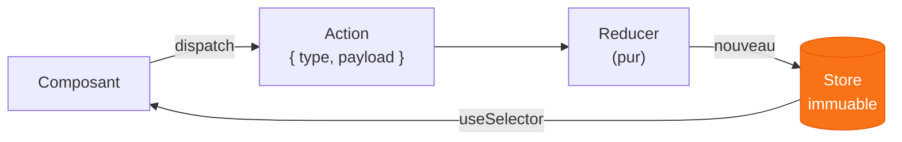

# Chapitre 4
## Les state managers classiques
<div class="opacity-60 pt-2">Tout faire — mais pas aussi bien qu'un outil spécialisé</div>

---

# ⚠️ Mise en garde

<div class="text-base pt-1 opacity-80 text-center">
Une grande partie de la donnée qu'on met d'instinct dans un store est <b>déjà couverte</b> par les chapitres précédents.
</div>

<!-- Diagramme : Serveur ↔ URL ↔ Client -->
<div class="pt-8 max-w-3xl mx-auto grid grid-cols-[1fr_auto_1fr_auto_1fr] gap-x-3 gap-y-5 items-center">

<!-- ligne 1 : les trois lieux -->
<div class="text-center">
<div class="text-4xl">🖥️</div>
<div class="text-sm opacity-60 pt-1">Serveur</div>
</div>
<div class="text-2xl opacity-30">↔</div>
<div class="text-center">
<div class="text-4xl">🔗</div>
<div class="text-sm opacity-60 pt-1">URL <span class="opacity-50 text-xs">· au milieu</span></div>
</div>
<div class="text-2xl opacity-30">↔</div>
<div class="text-center">
<div class="text-4xl">💻</div>
<div class="text-sm opacity-60 pt-1">Client</div>
</div>

<!-- ligne 2 : les boîtes d'état (apparition : URL → serveur → client) -->
<div v-click="2" class="border border-gray-600 rounded-lg p-3 text-center self-start">
<div class="font-bold">État serveur</div>
<div class="opacity-70 text-xs pt-1">→ cache réseau<br>TanStack Query, Convex <span class="opacity-50">· ch. 3</span></div>
</div>
<div></div>
<div v-click="1" class="border border-gray-600 rounded-lg p-3 text-center self-start">
<div class="font-bold">État d'URL</div>
<div class="opacity-70 text-xs pt-1">→ <code>nuqs</code><br>filtres, sélection <span class="opacity-50">· ch. 2</span></div>
</div>
<div></div>
<div v-click="3" class="border-2 border-orange-500 rounded-lg p-3 text-center self-start">
<div class="font-bold">État client</div>
<div class="opacity-70 text-xs pt-1">→ <b class="text-orange-400">store managers</b><br>global &amp; complexe <span class="opacity-50">· ce chapitre</span></div>
</div>

</div>

<div v-click="4" class="pt-6 text-center">
<div class="text-base">Côté client, les state managers font le travail des <b>API natives</b>… <span v-mark.orange>en mieux à l'échelle</span>.</div>
<div class="text-sm opacity-60 pt-2">
<code>useState</code> <span class="opacity-40 px-1">→</span> <code>useReducer</code> <span class="opacity-40 px-1">→</span> <code>Context</code> <span class="opacity-40 px-1">→</span> <b class="opacity-100">store</b>
</div>
</div>

<div v-click="5" class="pt-5 text-center text-lg">
Leur cas d'usage est la gestion <span v-mark.orange>de l'état client global réellement complexe</span>
</div>

<div v-click="6" class="pt-3 text-center text-base opacity-70">
Store classique = outil <b>de niche</b> : gros projets, beaucoup de state client.<br>
Dans la majorité des apps, les chapitres précédents suffisent.
</div>

<!--
Mise en garde d'ouverture, version diagramme. Le réflexe « j'installe Redux/Zustand » est
souvent prématuré. On situe la donnée par son lieu de vie : l'URL au milieu (état partageable
→ nuqs, ch. 2), le serveur (état serveur → cache réseau, ch. 3), le client (état purement
client). Apparition URL → serveur → client : une fois l'URL et le serveur retirés, ce qui
reste est de l'état client — et c'est là, seulement là, que les store managers se justifient.
Côté client, ils ne font pas autre chose que les API natives (useState → useReducer → Context) :
ils font le MÊME travail, en mieux à l'échelle (réactivité fine, outillage). D'où les lignes du
bas : outil de niche (gros projets, beaucoup de state client) ; dans la majorité des apps, les
chapitres précédents suffisent.
-->

---

# Store manager, quelle utilité ?

<div class="grid grid-cols-2 gap-8 pt-4">
<div>

### Le problème
<div class="opacity-80 text-sm pt-1">État client global, gros, interdépendant.</div>

<v-clicks>

- Context + Reducer : **tout l'arbre re-render**
- pas de lecture ciblée (pas de sélecteurs)
- logique de mutation **éparpillée**
- aucun outil pour tracer / débugger

</v-clicks>

</div>
<div>

### La promesse d'un store
<div class="opacity-80 text-sm pt-1">Un état qui vit <b>hors</b> du cycle de vie React.</div>

<v-clicks>

- une **source de vérité** centralisée
- des **sélecteurs** → re-render ciblé
- mutations **au même endroit** que l'état
- DevTools, middleware, persistance

</v-clicks>

</div>
</div>

<!--
Le problème que résolvent les stores : à grande échelle, Context+Reducer re-render tout
l'arbre, pas d'abonnement fin, pas d'outillage. Un store = état externe + sélecteurs +
devtools. Mécanisme commun : useSyncExternalStore. Mais ils ne se ressemblent pas tous,
d'où deux axes pour les ranger.
-->

---

# Le problème du _concurrent rendering_

<div class="grid grid-cols-2 gap-8 pt-2">
<div>

### Avant — rendu synchrone
<v-clicks>

- un rendu = un bloc **atomique**, non interruptible
- l'état est lu une seule fois, de façon cohérente
- un store externe (simple objet JS) marche sans souci

</v-clicks>

</div>
<div>

### React 18 — rendu concurrent
<v-clicks>

- React peut **interrompre**, reprendre ou abandonner un rendu pour prioriser le traitement de l'interaction utilisateur
- le rendu n'est plus atomique
- ⚠️ un store **hors du cycle de vie React** peut changer en cours de route

</v-clicks>

</div>
</div>

<div v-click class="pt-5 text-center">
Deux composants lisent le même état à deux instants → valeurs incohérentes = <span v-mark.orange>state tearing</span>.
</div>

<div v-click class="pt-5 text-center">
<div class="inline-block border border-green-500 rounded-lg px-5 py-2">
<div class="text-xl font-mono">use<span class="text-green-400 font-bold">Sync</span>ExternalStore</div>
<div class="text-xs opacity-70 pt-1">un escape hatch pour brancher un store externe sans state tearing</div>
</div>
</div>

<!--
Contexte du trade-off. Avant React 18, le rendu était synchrone et atomique : lire un store
externe pendant le rendu était sûr. Le concurrent rendering (React 18) permet à React de
mettre un rendu en pause, le reprendre, voire le jeter. Du coup un store externe — qui vit
HORS du cycle de vie React — peut muter entre deux lectures du même rendu : deux composants
affichent deux versions du même état = state tearing.
useSyncExternalStore est l'escape hatch officiel. Le « Sync » est clé : le hook force une
lecture synchrone et cohérente du store, ce qui garantit l'absence de tearing mais désactive
de fait le time-slicing pour ce state. D'où le compromis de la slide suivante (le triangle).
-->

---

# Le compromis impossible

<div class="grid grid-cols-2 gap-4 items-center pt-1">
<div>

<svg viewBox="0 0 600 500" class="w-full max-w-md mx-auto">
  <g v-click="1">
    <circle cx="300" cy="217" r="165" fill="#f97316" fill-opacity="0.16" stroke="#f97316" stroke-width="2"/>
    <text x="300" y="120" text-anchor="middle" fill="#fb923c" font-size="6" font-weight="700">Réactivité fine</text>
  </g>
  <g v-click="2">
    <circle cx="240" cy="321" r="165" fill="#38bdf8" fill-opacity="0.16" stroke="#38bdf8" stroke-width="2"/>
    <text x="120" y="395" text-anchor="middle" fill="#38bdf8" font-size="6" font-weight="700">Concurrent</text>
    <text x="120" y="415" text-anchor="middle" fill="#38bdf8" font-size="6" font-weight="700">rendering</text>
  </g>
  <g v-click="3">
    <circle cx="360" cy="321" r="165" fill="#a78bfa" fill-opacity="0.16" stroke="#a78bfa" stroke-width="2"/>
    <text x="480" y="395" text-anchor="middle" fill="#a78bfa" font-size="6" font-weight="700">Pas de</text>
    <text x="480" y="415" text-anchor="middle" fill="#a78bfa" font-size="6" font-weight="700">state tearing</text>
  </g>

  <g v-click="4">
    <text x="400" y="200" text-anchor="middle" fill="currentColor" font-size="5.5" font-weight="600">Zustand</text>
    <text x="422" y="245" text-anchor="middle" fill="currentColor" font-size="5.5" font-weight="600">Redux</text>
  </g>
  <g v-click="5">
    <text x="185" y="225" text-anchor="middle" fill="currentColor" font-size="5.5" font-weight="600">MobX</text>
    <text x="175" y="260" text-anchor="middle" fill="currentColor" font-size="5.5" font-weight="600">Jotai</text>
    <text x="215" y="190" text-anchor="middle" fill="currentColor" font-size="5.5" font-weight="600">XState</text>
  </g>
  <g v-click="6">
    <text x="300" y="410" text-anchor="middle" fill="currentColor" font-size="5.5" font-weight="600">React natif</text>
  </g>

  <g v-click="8">
    <text x="300" y="283" text-anchor="middle" fill="#4ade80" font-size="6.5" font-weight="700">React</text>
    <text x="300" y="308" text-anchor="middle" fill="#4ade80" font-size="6.5" font-weight="700">compiler</text>
  </g>
</svg>

</div>
<div>

<div class="text-lg pb-2">Trois propriétés désirables — on n'en cumule que <span v-mark="{ at: 3, color: 'orange' }">deux sur trois</span>.</div>

<v-clicks at="4">

- **Fine + sans tearing** → on perd le concurrent rendering<br><span class="text-xs opacity-60">c'est le rôle de <code>useSyncExternalStore</code> — Redux, Zustand</span>
- **Fine + concurrent** → tearing temporaire possible<br><span class="text-xs opacity-60">signaux / observables lus pendant un rendu interruptible — MobX, Jotai, XState</span>
- **Concurrent + sans tearing** → trop de re-renders<br><span class="text-xs opacity-60">l'état natif de React — Context, <code>useReducer</code></span>

</v-clicks>

<div v-click="7" class="pt-4 text-base">
Tout store choisit son <b>compromis</b> — il n'y a pas de gagnant absolu.
</div>

</div>
</div>

<!--
Le state tearing : en concurrent rendering, React peut interrompre puis reprendre un rendu.
Si l'état (dans un store externe mutable) change entre-temps, deux composants affichent des
valeurs différentes du MÊME état → incohérence visible = tearing.
useSyncExternalStore (React 18) garantit l'absence de tearing pour un store externe, mais
force un rendu synchrone : on renonce aux bénéfices du concurrent rendering pour ce state.
Le triangle (Daishi Kato / Tanner Linsley) : réactivité fine, concurrent rendering, pas de
tearing — on ne peut en garantir que deux. React natif sacrifie la finesse (re-renders en
cascade) ; les libs uSES sacrifient le concurrent ; les signaux/MobX acceptent un tearing
temporaire. À placer en tête de chapitre : ça explique POURQUOI les libs diffèrent autant.
Réf : interbolt.org/blog/react-ui-tearing, thread Tanner Linsley.
-->

---

# Deux axes pour les ranger

<div class="text-sm opacity-70 pb-2">
<b>Mutabilité</b> : on remplace l'état (immuable) ou on le modifie en place (mutable) ?<br>
<b>Provider</b> : faut-il wrapper l'app dans un contexte React, ou non ?
</div>

<div class="grid grid-cols-[7rem_1fr_1fr] gap-3 pt-3 text-center items-stretch">

<div></div>
<div class="font-bold opacity-70 self-center">Sans Provider</div>
<div class="font-bold opacity-70 self-center">Avec Provider</div>

<div class="font-bold opacity-70 self-center text-right pr-2">Immuable</div>
<div v-click class="border border-gray-600 rounded-lg p-4">
<b class="text-lg">Zustand</b>
<div class="opacity-60 text-xs pt-1">un hook, set() immuable</div>
</div>
<div v-click class="border-2 border-orange-500 rounded-lg p-4">
<b class="text-lg">Redux</b> <span class="opacity-50 text-xs">+ RTK</span>
<div class="opacity-60 text-xs pt-1">action → reducer pur → store</div>
</div>

<div class="font-bold opacity-70 self-center text-right pr-2">Mutable</div>
<div v-click class="border border-gray-600 rounded-lg p-4">
<b class="text-lg">MobX</b>
<div class="opacity-60 text-xs pt-1">observables, mutation directe</div>
</div>
<div v-click class="border border-gray-600 rounded-lg p-4">
<b class="text-lg">Jotai</b>
<div class="opacity-60 text-xs pt-1">atomes, granulaire</div>
</div>

</div>

<!--
Deux axes orthogonaux. Mutabilité : immuable (fonctionnel, comme React — Redux, Zustand)
vs mutable (signaux/observables — MobX, Jotai). Provider : Redux et Jotai wrappent l'app,
Zustand et MobX non. Le tableau situe chaque lib. Jotai range-able en mutable car modèle
atomique/granulaire proche des signaux. On démarre par Zustand (coin simple), puis Redux.
-->

---
layout: center
class: text-center
---

# Zustand

<div class="text-xl opacity-60 pt-3">Le state manager minimaliste — un hook, sans provider</div>

---

# `Zustand`

<FicheSolution
  annee="2019"
  auteur="Paul Henschel — pmndrs (Poimandres)"
  tagline="Une gestion de state minimaliste, rapide et qui passe à l'échelle."
  probleme="Le boilerplate de Redux et le re-render global du Context : avoir du state partagé sans provider ni cérémonie."
  creneau="State global client, simple et performant, via un hook et des sélecteurs."
  :infos="[
    'Zustand = « état » en allemand (clin d\'œil à Redux/Valtio/Jotai, tous nommés par l\'équipe pmndrs).',
    'Même écurie que Jotai et Valtio ; maintenu notamment par Daishi Kato.',
    'API minuscule (~1 kB gzip), sans dépendance, agnostique du framework.',
    'Sélecteurs → re-render ciblé ; middlewares persist / devtools / immer fournis.',
  ]"
/>

<!--
Slide d'ouverture de la sous-section Zustand. Poser le décor avant la démo 4b :
d'où ça vient, quel problème, son créneau. Enchaîner sur le hook + sélecteur.
-->

---

# `create`

<div class="text-sm opacity-80 pb-1">La fonction <code>create()</code> renvoie un <b>hook</b> qui permet d'interagir avec le store.</div>

```ts {all|1|2-5|7}
const useTripStore = create((set) => ({
  trips: [],                                          // state
  addTrip:    (t)  => set((s) => ({ trips: [...s.trips, t] })),
  removeTrip: (id) => set((s) => ({ trips: s.trips.filter(x => x.id !== id) })),
}))

const count = useTripStore((s) => s.trips.length)     // hook + sélecteur, SANS provider
```

<v-clicks>

- le **state** est une propriété (`trips`)
- on le **mute via des propriétés-fonctions** (`addTrip`, `removeTrip`)
- `set` fait un **merge superficiel** avec le state existant

</v-clicks>

<!--
Démo 4b : refacto TripContext → Zustand. set merge superficiellement. Sélecteur =
une seule propriété par appel (sinon nouvelle référence → re-render). useShallow pour
plusieurs. Encourage plusieurs stores (un par domaine). persist en 1 ligne. Diff: -60 lignes.
-->

---

# Consommer le store

<div class="text-sm opacity-80 pb-1">Dans un composant, on appelle le hook avec un <b>sélecteur</b> pour ne lire que ce qu'on utilise.</div>

```tsx {all|2|3|6}
function TripList() {
  const trips   = useTripStore((s) => s.trips)       // on lit un morceau de state
  const addTrip = useTripStore((s) => s.addTrip)     // … et une action, de la même façon

  return (
    <button onClick={() => addTrip(newTrip)}>Ajouter</button>
  )
}
```

<v-clicks>

- **state et actions** se récupèrent pareil : ce sont des propriétés du store
- Bonne pratique : un appel au store par propriété.

</v-clicks>

<!--
Consommation du hook. On passe un sélecteur (s) => s.xxx pour ne s'abonner qu'à une part
du store. State et actions sont logés au même endroit → on les récupère de la même façon.
Un sélecteur par valeur = re-render ciblé. Appeler useTripStore() sans sélecteur renvoie
l'objet entier et re-render à chaque update (à éviter). Pour lire plusieurs valeurs d'un
coup sans nouvelle référence : useShallow (détaillé sur la slide suivante).
-->

---

# Sélecteurs

<div class="text-center py-4">
<span class="font-mono text-3xl">(<span class="text-orange-400">state</span>) <span class="opacity-40">=&gt;</span> <span class="text-green-400">state.trips</span></span>
<div class="text-sm opacity-60 pt-3">reçoit <b>tout</b> le state · en renvoie une <b>part</b> · aucun effet de bord</div>
</div>

<v-clicks>

- à chaque update du store, Zustand **ré-exécute** le sélecteur
- il compare le résultat par référence (`===`) (attention aux tableaux et objets littéraux !)
- le composant re-render **seulement si cette part a changé**

</v-clicks>

<div v-click class="pt-4 text-center text-lg">
concept central pour la <span v-mark.orange>réactivité fine</span>
</div>

<div v-click class="pt-6 text-sm opacity-80">Récupérer plusieurs valeurs en un appel :</div>

<div v-click>

```ts
// useShallow compare champ par champ (pas la référence)
const { trips, addTrip } = useTripStore(
  useShallow((s) => ({ trips: s.trips, addTrip: s.addTrip }))
)
```

</div>

<!--
Insister : un sélecteur n'est rien de plus qu'une fonction pure (state) => part. Pas de magie,
pas de syntaxe propriétaire. Il reçoit l'intégralité du state et en extrait ce dont le composant
a besoin, sans effet de bord. À chaque update, Zustand le ré-exécute et compare son résultat par
référence (===) : re-render uniquement si cette part a changé. C'est LE mécanisme de la réactivité
fine — à opposer à Context, qui re-render tous les consommateurs dès que sa value change.
-->

---

# Actions « standalone » — `setState`

<div class="text-sm opacity-80 pt-1 pb-3 text-center">Le hook expose une <b>API statique</b> (<code>getState</code>, <code>setState</code>, <code>subscribe</code>) utilisable <b>hors de React</b>, sans s'abonner.</div>

```ts
// l'action vit hors du hook, branchée sur le store
export const addTrip = (t) =>
  useTripStore.setState((s) => ({ trips: [...s.trips, t] }))
```

```tsx
// appel direct : pas de useTripStore(...) → aucun abonnement
<button onClick={() => addTrip(newTrip)}>Ajouter</button>
```

<div class="grid grid-cols-2 gap-4 pt-3 text-sm">
<div v-click class="border border-gray-600 rounded-lg p-3">
Récupérer une <b>action</b> ne devrait pas obliger à <b>s'abonner</b> à l'état.
</div>
<div v-click class="border border-orange-500 rounded-lg p-3">
Un composant qui ne fait qu'<b>émettre</b> ne re-render <b>jamais</b>.
</div>
</div>

<!--
API statique du store. Le hook créé par create() porte aussi useStore.getState / setState /
subscribe — accessibles HORS de React, sans hook ni abonnement. On peut donc définir les actions
comme de simples fonctions autonomes qui appellent useStore.setState(...). Un composant qui ne
fait que déclencher une action l'importe et l'appelle directement : il ne lit pas le store, donc
ne s'y abonne pas, donc ne re-render jamais inutilement. (À noter : sélectionner une action via
useStore(s => s.addTrip) renvoie déjà une réf stable ; les actions standalone vont plus loin —
zéro souscription, et utilisables hors composant : events, callbacks, code non-React.)
-->

---

# Stores atomiques

<div class="text-sm opacity-80 pt-1 pb-4 text-center">Un store = un hook → on en crée un <b>par domaine</b> métier, plutôt qu'un mono-store global.</div>

<div v-click class="flex gap-3 justify-center">
<div class="border border-gray-600 rounded-lg px-5 py-2 text-center text-sm w-44">🧳<div class="font-mono pt-1 opacity-80">useTripStore</div></div>
<div class="border border-gray-600 rounded-lg px-5 py-2 text-center text-sm w-44">👤<div class="font-mono pt-1 opacity-80">useUserStore</div></div>
<div class="border border-gray-600 rounded-lg px-5 py-2 text-center text-sm w-44">🎛️<div class="font-mono pt-1 opacity-80">useUiStore</div></div>
</div>

<div class="grid grid-cols-2 gap-8 pt-5 items-start">
<div v-click>
<div class="text-xs opacity-70 pb-1">❌ recoupler deux stores dans la vue</div>

```tsx
const userId     = useUserStore((s) => s.id)
const resetTrips = useTripStore((s) => s.reset)
// user change → on vide ses voyages à la main
useEffect(() => resetTrips(), [userId])
```

</div>
<div v-click>
<div class="text-xs opacity-70 pb-1">✅ domaines liés → un store, des slices</div>

```ts
// le couplage vit dans le store
logout: () => set({ user: null, trips: [] })
```

</div>
</div>

<div v-click class="pt-4 text-sm text-center opacity-70">
⚠️ Domaines <b>interdépendants</b> → un seul store : la logique de couplage ne vit pas dans la vue.
</div>

<!--
Stores atomiques. Un store = un hook → un par domaine métier (voyages, user, UI), pas un
mono-store global. Contre-exemple : quand deux domaines sont interdépendants, on est tenté de
les resynchroniser à la main dans un composant (useEffect qui appelle l'action d'un autre store)
→ logique métier qui fuit dans la vue, fragile. La bonne réponse : un seul store découpé en
slices, où le couplage (ex. logout vide user ET trips) vit dans l'action. (useShallow : slide Sélecteurs.)
-->

---

# Bound store — composer des slices

<div class="text-sm opacity-80 pt-1 pb-2 text-center">Découper le store en <b>slices</b> ciblées, mais les réunir dans <b>un seul store</b> cohérent.</div>

```ts {all|2-5|6-9|12-15}
// 1 slice = 1 domaine, défini comme une fonction
const createTripSlice = (set) => ({
  trips: [],
  addTrip: (t) => set((s) => ({ trips: [...s.trips, t] })),
})
const createUserSlice = (set) => ({
  user: null,
  logout: () => set({ user: null, trips: [] }),   // ← peut toucher une autre slice
})

// 1 seul store, composé de toutes les slices
const useStore = create((...a) => ({
  ...createTripSlice(...a),
  ...createUserSlice(...a),
}))
```

<div class="grid grid-cols-3 gap-3 pt-3 text-xs">
<div v-click class="border border-gray-600 rounded-lg p-3">🧩 chaque slice reste <b>petite et isolée</b></div>
<div v-click class="border border-gray-600 rounded-lg p-3">🔗 une action peut toucher <b>plusieurs slices</b></div>
<div v-click class="border border-gray-600 rounded-lg p-3">🎯 sélecteurs toujours ciblés : <code>useStore(s =&gt; s.trips)</code></div>
</div>

<!--
Bound store (slices pattern). Quand les domaines sont interdépendants, on ne fait pas plusieurs
stores recouplés à la main : on découpe UN store en slices, chacune = une fonction (set, get) =>
({ state + actions }) ciblée sur un domaine. On les combine via create((...a) => ({ ...sliceA(...a),
...sliceB(...a) })). Comme tout vit dans le même store, une action d'une slice peut lire/modifier
une autre slice (ex. logout vide user ET trips) — le couplage est explicite et centralisé, pas
éparpillé dans les composants. Et on garde des slices petites + des sélecteurs ciblés.
-->

---

# Une slice de jonction

<div class="text-sm opacity-80 pt-1 pb-3 text-center">La logique qui <b>croise plusieurs domaines</b> mérite sa propre slice — qui lit les autres via <code>get()</code>.</div>

<div v-click class="flex items-center justify-center gap-3 text-xs pb-3">
<span class="border border-gray-600 rounded px-2 py-1 font-mono">userSlice</span>
<span class="opacity-50">+</span>
<span class="border border-gray-600 rounded px-2 py-1 font-mono">tripSlice</span>
<span class="opacity-50">→</span>
<span class="border-2 border-orange-500 rounded px-2 py-1 font-mono">userTripsSlice</span>
</div>

```ts {all|4|5-8|13-15}
const createUserTripsSlice = (set, get) => ({
  // action de jonction : lit user + trips, met à jour trips
  archiveMyTrips: () => {
    const { user, trips } = get()                       // lit les autres slices
    set({
      trips: trips.map((t) =>
        t.ownerId === user.id ? { ...t, archived: true } : t),
    })
  },
})

const useStore = create((...a) => ({
  ...createUserSlice(...a),
  ...createTripSlice(...a),
  ...createUserTripsSlice(...a),                         // ← la jonction
}))
```

<div v-click class="pt-2 text-center text-sm opacity-70">
Les slices de base restent <b>pures et isolées</b> ; la slice de jonction <b>orchestre</b>.
</div>

<!--
Slice de jonction (combined slice). Pour modéliser finement un store qui mêle plusieurs domaines :
en plus des slices de base (user, trip), une slice de jonction qui dépend des autres. Ses actions
utilisent get() pour lire l'état des autres slices et set() pour les mettre à jour de façon
cohérente (ex. archiveMyTrips lit le user courant + tous les trips, archive ceux qui lui
appartiennent). Avantage : les slices de base restent pures et découplées, toute la logique
transversale est isolée et explicite dans la slice de jonction. C'est la façon canonique (doc
Zustand) de composer un « bounded store » élaboré sans recoupler à la main.
-->

---

# Middlewares

<div class="text-base opacity-80 pt-1 pb-4 text-center">Des fonctions qui <b>enveloppent</b> le store pour lui ajouter des capacités.</div>

<div class="grid grid-cols-2 gap-10 items-center pt-2">

<div v-click class="font-mono text-sm">
<div class="border-2 border-orange-500 rounded-lg p-3">
<div class="pb-2 text-orange-400">create</div>
<div class="border border-gray-500 rounded p-3">
<div class="pb-2">devtools</div>
<div class="border border-gray-500 rounded p-3">
<div class="pb-2">persist <span class="opacity-50">→ localStorage</span></div>
<div class="border border-gray-500 rounded p-3 text-center opacity-70">state + actions</div>
</div>
</div>
</div>
</div>

<div v-click>

```ts
const useStore = create(
  devtools(
    persist(
      (set) => ({ /* state + actions */ }),
      { name: 'wanderstate' },   // clé localStorage
    ),
  ),
)
```

</div>

</div>

<div class="grid grid-cols-3 gap-3 pt-5 text-xs">
<div v-click class="border border-gray-600 rounded-lg p-3"><code>persist</code> — survit au refresh (localStorage)</div>
<div v-click class="border border-gray-600 rounded-lg p-3"><code>devtools</code> — Redux DevTools, time-travel</div>
<div v-click class="border border-gray-600 rounded-lg p-3"><code>immer</code> — mutations « directes »</div>
</div>

<div v-click class="text-center text-sm opacity-60 pt-3">
persistance en <b>une ligne</b> · diff vs Context+Reducer : <b class="text-orange-400">−60 lignes</b>
</div>

<!--
Les middlewares enveloppent le store (create → devtools → persist → state). On les empile pour
ajouter des capacités sans toucher à la logique. persist = persistance localStorage en une
ligne (l'argument démo le plus parlant). devtools = Redux DevTools + time-travel. immer = écrire
des mutations « directes » tout en restant immuable. Diff vs Context+Reducer : −60 lignes.
-->

---

# `Zustand` — bilan

<Bilan
  :scores="[5, 5, 4, 4, 3]"
  poids="485 B (gzip)"
  perimetre="état client global"
  idealPour="la majorité des besoins de store, du plus simple au moyennement complexe"
  :avantages="[
    'Pas de provider — juste un hook',
    'API minimale, très peu de boilerplate',
    'Sélecteurs → réactivité fine',
    'Middlewares : persist, devtools, immer',
  ]"
  :limites="[
    'Aucune structure imposée → à se discipliner',
    'Couplage inter-stores géré à la main (slices)',
    'Outillage en deçà de Redux DevTools',
  ]"
/>

<!--
Bilan Zustand. Scores (sur 5) : prise en main 5 (un hook, on démarre en 2 min), poids 5
(485 B gzip), perf 4 (sélecteurs = re-render ciblé), écosystème 4 (middlewares solides mais
moins fourni que Redux), montée en charge 3 (pas de structure imposée, à cadrer soi-même).
Idéal pour la majorité des besoins de store client. Limite principale : la liberté = il faut
imposer ses propres conventions (slices, un store par domaine) sur les gros projets.
-->

---

# `Redux` + RTK — la sainte trinité



<div class="grid grid-cols-2 gap-6 pt-2 text-sm">
<div v-click class="opacity-80">
Né comme une implémentation de <b>Flux</b> : stopper l'event-based illisible, tracer les changements via des actions.
</div>
<div v-click class="border-l-4 border-orange-500 pl-3">
« <b>Dispatching is the only feature of Redux.</b> » — Dan Abramov
</div>
</div>

<!--
4a théorie. Trinité state-action-reducer. Reducer PUR. Le store global avec provider
est un bénéfice collatéral. POINT CLÉ : si le seul usage est d'éviter le prop drilling,
utiliser Context. La vraie valeur de Redux : tracer l'évolution du state (devtools).
-->

---

# `Redux` — sa (mauvaise) réputation

<div class="grid grid-cols-2 gap-8 pt-4">
<div v-click>

### La réputation
- usine à gaz, pas moderne
- énormément de boilerplate
- « un seul store global pour tout »

<div class="text-xs opacity-60 pt-2">
…surtout des apps legacy, écrites avant les bons patterns.
</div>

</div>
<div v-click>

### Redux Toolkit (RTK)
- `configureStore` — defaults sains
- `createSlice` — fin du boilerplate
- `createAsyncThunk` — l'async, proche de TanStack Query
- **DevTools + middleware** : inégalés

</div>
</div>

<div v-click class="pt-5 text-center">
Bien utilisé, avec RTK, Redux <span v-mark.underline.orange>n'est pas une mauvaise solution</span>.
</div>

<!--
Nuancer la réputation. Le problème vient de l'âge + mésusage, pas de la lib en soi.
useSelector compare par référence (===) → interdit de renvoyer un objet/tableau littéral
(atomiser, ou createSelector qui mémoïse). RTK modernise tout ça.
-->

