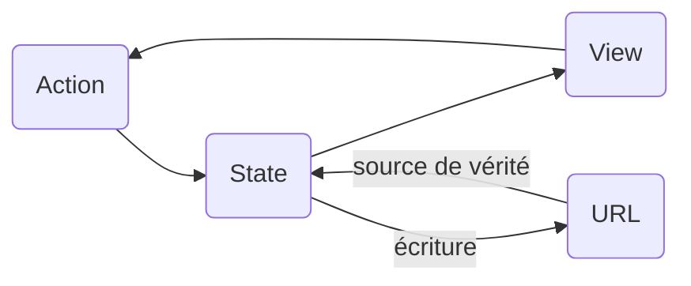

# Chapitre 2 — State URL

## L'URL est du state

- Une URL n'est pas qu'une adresse — c'est un état sérialisé, persisté dans le navigateur.
- Elle survit au refresh, au copier-coller, au partage.
- Elle déclenche le bouton back/forward nativement — sans une ligne de code.
- Si ton app affiche quelque chose qui dépend d'un paramètre, ce paramètre est du state.



- L'URL est une source de vérité **externe** au composant — comme une base de données, mais gratuite et déjà là.
- Le principe : ce qui doit survivre à un refresh ou être partageable doit vivre dans l'URL.

### Ce qui appartient à l'URL

**Oui :**
- `?trip=abc123` — la modal du bon voyage s'ouvre depuis un lien partagé
- `?view=grid` — vue cards vs liste, persistée entre navigations
- `?status=confirmed` — filtre actif sur la liste
- `?page=3` — rechargement de page = même page, pas retour à 1

**Non :**
- Tooltip ouvert — éphémère, sans sens hors contexte
- Valeur d'un champ en cours de frappe — état intermédiaire
- Menu mobile ouvert/fermé — UI state pur

**Cas limite :**
- Champ de recherche après soumission → URL (`?q=barcelone`)
- Drawer ouvert sur une entité → l'ID dans l'URL, l'ouverture en est la conséquence

---

## Le problème sans nuqs

Sans librairie dédiée, synchroniser l'URL et le state React est verbeux et fragile.

### Avec les APIs natives

```tsx
// Lecture
const searchParams = new URLSearchParams(window.location.search);
const tripId = searchParams.get("trip"); // string | null — pas typé

// Écriture
const params = new URLSearchParams(window.location.search);
params.set("trip", id);
window.history.pushState({}, "", `?${params.toString()}`);
// → React ne sait pas que l'URL a changé. Pas de re-render.
```

- `window.history.pushState` écrit dans l'URL mais ne déclenche **pas** de re-render React.
- Il faut écouter `popstate` + forcer un re-render manuellement.
- Aucun typage : tout est `string | null`, la conversion est à la charge du développeur.
- Chaque paramètre = un bloc de code identique à dupliquer.

---

## `nuqs` — l'API

nuqs traite les paramètres URL comme du `useState` — avec typage, parsing et batching.

### `useQueryState` — un paramètre

```tsx
import { useQueryState, parseAsString } from "nuqs";

// ?trip=abc123
const [tripId, setTripId] = useQueryState("trip", parseAsString);
// tripId : string | null

setTripId("abc123"); // écrit ?trip=abc123 dans l'URL
setTripId(null);     // supprime le paramètre
```

- L'API est identique à `useState` — setter inclus.
- `parseAsString` est le parser par défaut. La valeur est typée automatiquement.

### `useQueryStates` — plusieurs paramètres

```tsx
import { useQueryStates, parseAsString, parseAsStringLiteral } from "nuqs";

const [params, setParams] = useQueryStates({
  trip: parseAsString,
  view: parseAsStringLiteral(["list", "grid"] as const).withDefault("list"),
});
// params.trip : string | null
// params.view : "list" | "grid"

setParams({ trip: "abc123", view: "grid" });
// → une seule entrée dans l'historique, les deux paramètres mis à jour atomiquement
```

### Parsers built-in

| Parser | Type TypeScript | Exemple URL |
|---|---|---|
| `parseAsString` | `string \| null` | `?q=paris` |
| `parseAsInteger` | `number \| null` | `?page=3` |
| `parseAsFloat` | `number \| null` | `?budget=1500.5` |
| `parseAsBoolean` | `boolean \| null` | `?confirmed=true` |
| `parseAsStringLiteral(["a","b"])` | `"a" \| "b" \| null` | `?view=grid` |
| `parseAsArrayOf(parseAsString)` | `string[] \| null` | `?tags=vol,hotel` |
| `parseAsJson<T>()` | `T \| null` | `?filter=%7B...%7D` |

### Application sur WanderState

nuqs permet deux approches selon la nature du paramètre :

**`tripId` → `<a href>` avec `createSerializer`**

`tripId` est une ressource navigable. Un vrai lien HTML permet le clic-droit "Ouvrir dans un nouvel onglet", est indexable par les crawlers, et sémantiquement correct.

```tsx
import { createSerializer, parseAsString } from "nuqs";

const serialize = createSerializer({ trip: parseAsString });

function TripCard({ trip }: { trip: Trip }) {
  return (
    <a href={serialize({ trip: trip.id })}>
      {trip.name}
    </a>
  );
}

function TripModal() {
  const [tripId, setTripId] = useQueryState("trip", parseAsString);
  if (!tripId) return null;
  return (
    <Modal onClose={() => setTripId(null)}>
      <TripDetail id={tripId} />
    </Modal>
  );
}
```

**`viewType` → setter programmatique**

`viewType` est un état UI (grid/list), pas une ressource. Un setter suffit — l'URL reste quand même mise à jour, donc partageable.

```tsx
// Toggle vue — ?view=grid
const [view, setView] = useQueryState(
  "view",
  parseAsStringLiteral(["list", "grid"] as const).withDefault("list")
);

function ViewToggle() {
  return (
    <button onClick={() => setView(view === "grid" ? "list" : "grid")}>
      {view === "grid" ? "List" : "Grid"}
    </button>
  );
}
// view : "list" | "grid" — jamais null grâce à withDefault
```

| | `tripId` | `viewType` |
|---|---|---|
| Nature | Ressource navigable | État UI |
| Approche | `<a href>` via `createSerializer` | `setView()` |
| Clic-droit "nouvel onglet" | Oui | N/A |
| Indexable | Oui | Pas critique |
| URL partageable | Les deux ! | Les deux ! |

- Ouvrir le voyage `abc123` en vue grille : `?trip=abc123&view=grid`
- Ce lien fonctionne directement — l'app s'ouvre avec la modal et la vue grille, sans code supplémentaire.
- Le bouton back ferme la modal. Le bouton forward la rouvre. Gratuit.

---

## Sous le capot

### History API — `pushState` et `replaceState`

Le navigateur expose deux méthodes pour écrire dans l'URL sans déclencher de navigation :

```
window.history.pushState(state, title, url)   // nouvelle entrée dans l'historique
window.history.replaceState(state, title, url) // remplace l'entrée courante
```

- `pushState` = le back/forward fonctionnera (modal ouverte → back → modal fermée).
- `replaceState` = l'URL change mais sans créer d'entrée (nuqs option `{ history: "replace" }`).
- nuqs utilise `pushState` par défaut. Configurable par paramètre.

### `useSyncExternalStore` — l'URL comme store externe

Le problème fondamental : React ne sait pas que l'URL a changé quand `pushState` est appelé.

nuqs résout ça en traitant l'URL comme un **store externe** via `useSyncExternalStore` :

```
                   ┌─────────────────────────┐
                   │   nuqs internal store    │
                   │  (cache de l'URL en mém) │
                   └────────────┬────────────┘
                                │ subscribe / getSnapshot
                    ┌───────────▼──────────┐
                    │  useSyncExternalStore │  ← hook React
                    └───────────┬──────────┘
                                │
                    ┌───────────▼──────────┐
                    │  composant React      │
                    │  const [v, setV] = …  │
                    └──────────────────────┘
```

- `useSyncExternalStore` prend un `subscribe` (écouter les changements) et un `getSnapshot` (lire la valeur courante).
- nuqs s'abonne aux événements `popstate` (back/forward) et intercepte ses propres writes.
- Quand l'URL change, le store notifie tous les abonnés → React re-rend les composants concernés.
- C'est le même mécanisme que Zustand, Redux ou n'importe quel store externe.

### Batching des writes

Plusieurs `useQueryState` peuvent être mis à jour dans le même handler. Sans batching, chaque write déclencherait un `pushState` séparé — plusieurs entrées dans l'historique pour une seule action utilisateur.

```tsx
// Sans batching — 2 entrées dans l'historique
setTripId("abc123");  // pushState → ?trip=abc123
setView("grid");      // pushState → ?trip=abc123&view=grid
```

nuqs résout ça par **micro-task batching** :

```
tick 1 : setTripId("abc123")  → mise en file
tick 1 : setView("grid")       → mise en file
                                     ↓ fin du tick synchrone
tick 2 : flush → un seul pushState(?trip=abc123&view=grid)
```

- Les writes sont accumulés dans la même micro-task.
- À la fin du tick, nuqs fusionne toutes les modifications et appelle `pushState` une seule fois.
- Résultat : une seule entrée dans l'historique, peu importe le nombre de paramètres modifiés.
- C'est le même principe que le batching de React 18 pour les setters de `useState`.

### Shallow routing vs navigation réelle

nuqs opère en **shallow** par défaut : il écrit dans l'URL sans déclencher de navigation router.

```
URL change → History API (pushState)
           → nuqs store notifié → re-renders React
           ✗ Router (React Router / Next.js) n'est PAS notifié
```

Pour les cas où le router doit réagir (chargement d'une page entière, loader de route), nuqs propose des adaptateurs :

```tsx
// Next.js App Router
import { NuqsAdapter } from "nuqs/adapters/next/app";

// React Router
import { NuqsAdapter } from "nuqs/adapters/react-router";

<NuqsAdapter>
  <App />
</NuqsAdapter>
```

Avec un adaptateur, nuqs délègue les writes au router — qui gère alors la navigation, les loaders, et le rendu côté serveur.

### Serializers et parsers custom

Un parser est un objet avec deux méthodes :

```ts
interface Parser<T> {
  parse: (value: string) => T | null;  // URL string → valeur typée
  serialize: (value: T) => string;      // valeur typée → URL string
}
```

Exemple — parser pour un enum custom :

```ts
const parseAsStatus = createParser({
  parse(value) {
    if (value === "confirmed" || value === "draft" || value === "cancelled") {
      return value;
    }
    return null; // valeur inconnue → null (ignorée)
  },
  serialize(value) {
    return value;
  },
});

// Utilisation
const [status, setStatus] = useQueryState("status", parseAsStatus.withDefault("draft"));
// status : "confirmed" | "draft" | "cancelled" — jamais null
```

---

## Comparaison avec les alternatives (pas sûr de garder)

| | `useSearchParams` natif | `qs` | `nuqs` |
|---|---|---|---|
| Réactivité | Oui (si router) | Non | Oui (router-agnostic) |
| Typage | Non (`string \| null`) | Non | Oui (parsers typés) |
| Batching multi-params | Non | N/A | Oui (micro-task) |
| Back/forward natif | Oui | Non | Oui |
| Router-agnostic | Non | Oui | Oui (avec adaptateur) |
| SSR | Partiel | Partiel | Oui (Next.js App Router) |
| API `useState`-like | Non | Non | Oui |

---

## Les limites

### Taille de l'URL

- Les navigateurs imposent une limite sur la longueur des URLs (2 048 caractères sur IE, 8 000+ sur Chrome/Firefox).
- En pratique : ne pas stocker de données volumineuses dans l'URL — des IDs, des filtres, des vues. Pas des objets complets.
- `parseAsJson` est disponible mais doit rester pour des structures petites et stables.

### Types complexes

- Les tableaux sont sérialisés comme chaîne séparée par des virgules : `?tags=vol,hotel` — les virgules dans les valeurs posent problème.
- Les objets imbriqués avec `parseAsJson` sont encodés en URI — illisibles dans la barre d'adresse.
- Pour des filtres complexes, préférer une représentation aplatie (`?from=2026-06&to=2026-09`) à un objet JSON encodé.

### Server-side rendering

- **Next.js Pages Router** : `useQueryState` fonctionne comme côté client. Pas d'accès serveur aux params sans passer par `getServerSideProps`.
- **Next.js App Router** : le `NuqsAdapter` permet de lire les `searchParams` dans les Server Components — mais en lecture seule (pas de write côté serveur, c'est une contrainte du modèle).
- **Vite / SPA** : pas de problème SSR. nuqs fonctionne out of the box.

---

## Points clés à retenir

- L'URL est une source de vérité externe : persistante, partageable, avec back/forward natif.
- `useQueryState` = `useState` dont la valeur vit dans l'URL.
- nuqs utilise `useSyncExternalStore` pour rendre l'URL réactive — même mécanisme que tout store externe.
- Le batching par micro-task garantit une seule entrée dans l'historique quelle que soit le nombre de paramètres modifiés.
- En shallow (défaut) : nuqs écrit dans l'URL sans déclencher le router. Avec un adaptateur : le router est notifié.
- Les parsers sont le contrat de typage entre l'URL (string) et le composant (type TypeScript).
- Ce qui doit survivre à un refresh ou être partageable appartient à l'URL. Rien d'autre.
