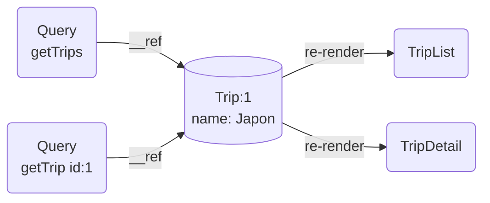
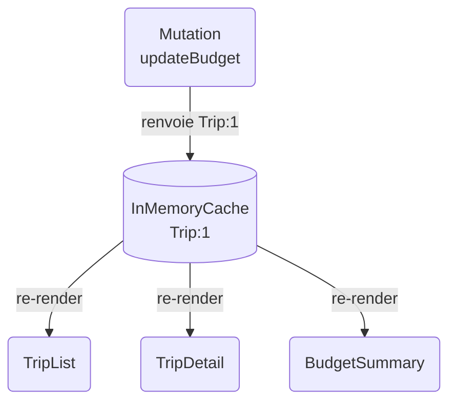

# Chapitre 3b — Apollo Client

> **Le client GraphQL de référence.**

---

## Le contexte — GraphQL et le problème qu'il résout

Avec REST, la forme de la réponse est décidée par le serveur.

- **Over-fetching** : le serveur renvoie plus de champs que nécessaire — du poids inutile sur le réseau.
- **Under-fetching** : une vue nécessite plusieurs endpoints — plusieurs aller-retours pour assembler les données.

GraphQL inverse le rapport : **c'est le client qui déclare exactement ce qu'il veut**. Un seul endpoint, une seule requête, la réponse a exactement la forme demandée.

```tsx
// Le composant déclare ses besoins, Apollo s'occupe du reste
const { data } = useQuery(gql`
  query GetTrip($id: ID!) {
    trip(id: $id) {
      id
      name
      budget   # uniquement les champs dont j'ai besoin
    }
  }
`);
```

---

## Le cache normalisé — le cœur d'Apollo

C'est ici que la magie opère — et c'est ce qui distingue Apollo de tous les autres outils de fetching.

### Un store plat, pas une pile de réponses

La plupart des caches HTTP stockent les réponses brutes, associées à une clé de requête. Apollo fait quelque chose de fondamentalement différent : il **décompose chaque réponse en objets individuels** et les range dans un store plat.

Chaque objet reçoit une clé : `__typename` + `:` + `id`. Par exemple `Trip:1`, `Trip:2`, `User:42`.

```
InMemoryCache (store plat)
├── Trip:1  → { id: "1", name: "Japon", budget: 3000 }
├── Trip:2  → { id: "2", name: "Islande", budget: 1500 }
└── Step:7  → { id: "7", label: "Vol Tokyo", trip: { __ref: "Trip:1" } }
```

Les relations entre objets ne sont pas dupliquées — elles sont représentées par des **références** (`__ref`). Si `Step:7` pointe vers `Trip:1`, les deux partagent la même entrée dans le store.

### Une seule source de vérité par entité

C'est la conséquence directe du store plat : **une entité n'existe qu'une fois**, quelle que soit la query qui l'a ramenée.

Imaginons que `TripList` et `TripDetail` aient toutes les deux chargé le voyage "Japon". Dans le cache, il n'y a pas deux copies — il y a une seule entrée `Trip:1`, et les deux queries y pointent.



### La propagation automatique

Quand une mutation renvoie un objet modifié, Apollo calcule sa clé (`Trip:1`), trouve l'entrée dans le store, et **merge les champs mis à jour**. Toutes les queries qui référencent cette entrée déclenchent automatiquement un re-render.



Pas d'invalidation à écrire. Pas de refetch manuel. **C'est un store global qui se met à jour lui-même.**

> Pour les Reacteurs dans la salle : c'est le même principe que Zustand ou Redux — un store centralisé, des souscripteurs qui réagissent. Sauf qu'Apollo le construit automatiquement à partir de vos réponses GraphQL.

---

## Les fragments — co-location des données

Un fragment permet à chaque composant de **déclarer ses propres besoins en données**, indépendamment de la query qui l'encapsule.

```tsx
// TripCard déclare ses besoins — colocalisés avec le composant
const TRIP_CARD_FIELDS = gql`
  fragment TripCardFields on Trip {
    id
    name
    destination
  }
`;

function TripCard({ trip }) { /* ... */ }

// La page compose les fragments — sans connaître les détails
function TripList() {
  const { data } = useQuery(gql`
    ${TRIP_CARD_FIELDS}
    query GetTrips { trips { ...TripCardFields } }
  `);
  return data.trips.map(trip => <TripCard key={trip.id} trip={trip} />);
}
```

- Ajouter un champ à `TripCard` = modifier uniquement son fragment — la query s'adapte.
- Les données voyagent avec le composant qui les consomme, pas avec la page qui l'héberge.
- Même principe que la co-location CSS ou les tests unitaires : chaque unité gère ce qui la concerne.

---

## Les subscriptions GraphQL natives

GraphQL définit trois opérations : `query`, `mutation`, et `subscription`. Les subscriptions sont une connexion persistante — le serveur pousse les mises à jour dès qu'elles se produisent.

```tsx
// Même API que useQuery — le composant reçoit les updates en temps réel
const { data } = useSubscription(gql`
  subscription OnTripUpdated($id: ID!) {
    tripUpdated(id: $id) { id budget }
  }
`, { variables: { id: tripId } });
```

- Connexion ouverte au montage, fermée au démontage — comme un `useEffect` avec cleanup.
- Les données reçues passent par le cache normalisé — l'entité mise à jour se propage à toutes les vues.
- Transport WebSocket.

---

## Quand choisir Apollo

- **API GraphQL existante côté backend** — Apollo est conçu pour GraphQL, pas pour REST.
- **Entités partagées entre plusieurs vues** — le cache normalisé synchronise automatiquement la même entité partout.
- **Subscriptions GraphQL** — temps réel intégré nativement dans le cache.
- **Grandes bases de code** — les fragments permettent à chaque composant de gérer ses besoins en données indépendamment.

---

## Limites honnêtes

- **Bundle size** : ~50 kb minifié+gzippé — significatif pour une app légère.
- **Cache normalisé = complexité** : puissant, mais difficile à déboguer. Quand une entité ne se met pas à jour comme attendu, il faut comprendre les règles de normalisation (`__typename`, `keyFields`).
- **Nécessite une API GraphQL** : inutilisable avec REST sans couche de traduction.

---

## Points clés à retenir

- GraphQL inverse le contrat REST : le client décrit la forme de la réponse.
- Apollo ne cache pas des réponses — il cache des **entités**. Un store plat, une entrée par objet, des références entre eux.
- Une mutation met à jour une entrée dans le store → toutes les vues qui la lisent se re-rendent. Automatiquement.
- C'est fondamentalement le même modèle que les stores React (Zustand, Redux) — mais auto-généré depuis le réseau.
- Les fragments co-localisent les besoins en données au niveau du composant.
