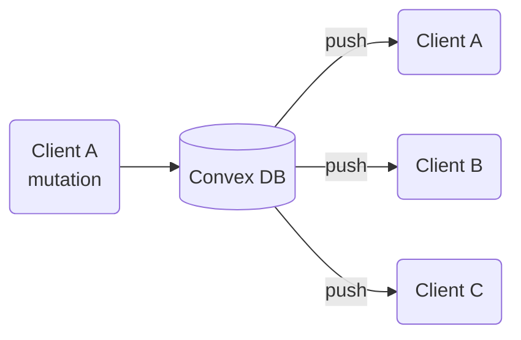

# Chapitre 3c — Convex

> **Réactif partout. Par défaut.**

---

## Le changement de paradigme

- Depuis le début : on *gère* du state — local, URL, réseau. À chaque couche, des outils, des compromis.
- Convex pose une question différente : et si la réactivité était le comportement par défaut de toute la stack ?
- Pas de cache à invalider. Pas de polling. Pas de websocket à brancher manuellement.
- Dès qu'une donnée change, tout le monde se met à jour. Automatiquement.

> *"Whole classes of state management problems go away."*



---

## Architecture

### Le schema — TypeScript de bout en bout

- Schéma défini en TypeScript — pas de SQL, pas de Zod séparé, pas de JSON Schema.
- Une seule source de vérité, typée partout.
- Types inférés automatiquement côté client — pas de codegen, pas d'étape de build.

```ts
// convex/schema.ts
export default defineSchema({
  trips: defineTable({
    name: v.string(),
    destination: v.string(),
    startDate: v.string(),
    endDate: v.string(),
    budget: v.number(),
  }),
  steps: defineTable({
    tripId: v.id("trips"),
    label: v.string(),
    type: v.union(v.literal("flight"), v.literal("hotel"), v.literal("activity")),
  }),
});
```

### Les fonctions serveur

- Pas de REST, pas de GraphQL — des fonctions TypeScript co-localisées avec le code client.
- **Query** = lecture réactive — Convex trace les dépendances en base et re-exécute dès qu'une ligne change.
- **Mutation** = écriture transactionnelle ACID.
- **Action** = appels externes (webhooks, emails, APIs tierces).

```ts
// convex/trips.ts
export const list = query({
  handler: async (ctx) => ctx.db.query("trips").collect(),
});

export const create = mutation({
  args: { name: v.string(), destination: v.string(), budget: v.number() },
  handler: async (ctx, args) => ctx.db.insert("trips", args),
});
```

### Côté client

- API hooks familière — ressemble à TanStack Query, mais `useQuery` ne refetch jamais : il **reçoit**.
- Le `?` sur `trips` couvre uniquement le premier rendu avant que la subscription soit établie.

```tsx
function TripList() {
  const trips = useQuery(api.trips.list);           // subscription live
  const createTrip = useMutation(api.trips.create); // typée end-to-end

  return <ul>{trips?.map(trip => <li key={trip._id}>{trip.name}</li>)}</ul>;
}
```

---

## Sous le capot

### WebSocket unique
- Une seule connexion persistante partagée par toutes les subscriptions de l'app.
- Toutes les mises à jour arrivent par ce canal — pas de requête HTTP par `useQuery`.

### Dependency tracking — le même principe que React
- Convex trace quelles lignes de DB chaque query a lues à l'exécution.
- Quand une ligne change → seules les queries qui l'ont lue sont re-exécutées.
- C'est le même principe que les Signals ou `useMemo` — mais appliqué côté serveur, sur la DB.

### Le cache comme projection automatique
- Le cache client n'est pas géré manuellement — c'est une projection des subscriptions actives.
- Pas d'invalidation, pas de staleTime. La donnée est soit en cours de chargement, soit à jour.

### Un seul Provider
- `ConvexProvider` en racine — comme `QueryClientProvider`.
- Gère la connexion WS, le cache et la propagation des updates à tous les `useQuery` de l'arbre.

```tsx
const convex = new ConvexReactClient(import.meta.env.VITE_CONVEX_URL);

<ConvexProvider client={convex}>
  <App />
</ConvexProvider>
```

### Sécurité
- Les fonctions sont **publiques par défaut** — appelables depuis le client.
- `internalQuery` / `internalMutation` = fonctions serveur uniquement, jamais exposées au client.
- La logique d'accès s'écrit dans la fonction via `ctx.auth` — pas de RLS déclaratif, la sécurité est dans le code.

```ts
const identity = await ctx.auth.getUserIdentity();
if (!identity) throw new Error("Non authentifié");
```

- Intégration native avec Clerk, Auth0, NextAuth — JWT vérifié côté serveur.

---

## La démo — co-planning en temps réel

- Deux onglets ouverts sur WanderState.
- Ajout d'une étape dans l'onglet A → visible dans l'onglet B en < 100ms.
- Suppression dans l'onglet B → disparaît dans l'onglet A.
- Rechargement de page → état intact, persisté dans Convex DB.

**Pas une ligne de code temps réel écrite. C'est le comportement par défaut.**

---

## Positionnement — Convex vs les autres BaaS

| | Firebase | Supabase | Convex |
|---|---|---|---|
| Temps réel | Oui (RTDB / Firestore) | Oui (Postgres + websockets) | Natif sur toutes les queries |
| Langage | JS/TS, config JSON | SQL + REST/GraphQL | TypeScript pur, end-to-end |
| Typage | Partiel | Génération via CLI | Inféré automatiquement |
| Transactions | Limitées | Postgres ACID | ACID, dans les mutations |
| Fonctions serveur | Cloud Functions (séparées) | Edge Functions (séparées) | Intégrées, co-localisées |
| Cible principale | Mobile / web générique | Web, profils SQL | React / frontend-first |

---

## Limites honnêtes

- **Vendor lock-in** : tourne sur l'infra Convex, pas sur votre serveur.
- **Pas universel** : reporting complexe, bases existantes, migrations à grande échelle.
- **Pricing** : gratuit jusqu'à un certain volume, puis à la consommation.

---

## Points clés à retenir

- Convex rend le server state **réactif par défaut** — à toutes les couches.
- Schema, fonctions serveur et types client dans le même repo TypeScript — zéro contrat API à maintenir.
- Cache, invalidation, polling, synchronisation multi-clients — ces problèmes disparaissent.
- La réactivité n'est plus une feature à câbler : c'est le comportement de base.
