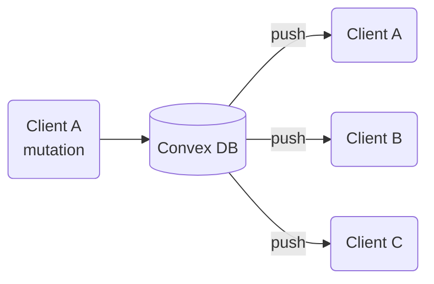

# Chapitre 3c — Convex

> **Réactif partout. Par défaut.**

---

## Le changement de paradigme

- Depuis le début : on *gère* du state — local, URL, réseau. À chaque couche, des outils, des compromis.
- Convex pose une question différente : et si la réactivité était le comportement par défaut de toute la stack ?
- Pas de cache à invalider. Pas de polling. Pas de websocket à brancher manuellement.
- Dès qu'une donnée change, tout le monde se met à jour. Automatiquement.

> *"Whole classes of state management problems go away."*



---

## Architecture

### Le schema — TypeScript de bout en bout

- Schéma défini en TypeScript — pas de SQL, pas de Zod séparé, pas de JSON Schema.
- Une seule source de vérité, typée partout.
- Types inférés automatiquement côté client — pas de codegen, pas d'étape de build.

```ts
// convex/schema.ts
export default defineSchema({
  trips: defineTable({
    name: v.string(),
    destination: v.string(),
    startDate: v.string(),
    endDate: v.string(),
    budget: v.number(),
  }),
  steps: defineTable({
    tripId: v.id("trips"),
    label: v.string(),
    type: v.union(v.literal("flight"), v.literal("hotel"), v.literal("activity")),
  }),
});
```

### Les fonctions serveur

- Pas de REST, pas de GraphQL — des fonctions TypeScript co-localisées avec le code client.
- **Query** = lecture réactive — Convex trace les dépendances en base et re-exécute dès qu'une ligne change.
- **Mutation** = écriture transactionnelle ACID.
- **Action** = appels externes (webhooks, emails, APIs tierces).

```ts
// convex/trips.ts
export const list = query({
  handler: async (ctx) => ctx.db.query("trips").collect(),
});

export const create = mutation({
  args: { name: v.string(), destination: v.string(), budget: v.number() },
  handler: async (ctx, args) => ctx.db.insert("trips", args),
});
```

### Côté client

- API hooks familière — ressemble à TanStack Query, mais `useQuery` ne refetch jamais : il **reçoit**.
- Le `?` sur `trips` couvre uniquement le premier rendu avant que la subscription soit établie.

```tsx
function TripList() {
  const trips = useQuery(api.trips.list);           // subscription live
  const createTrip = useMutation(api.trips.create); // typée end-to-end

  return <ul>{trips?.map(trip => <li key={trip._id}>{trip.name}</li>)}</ul>;
}
```

---

## Sous le capot — la stack technique

### Réseau
- Communication via **WebSockets** — pas de HTTP polling, connexion persistante.
- Convex maintient la connexion et pousse les mises à jour dès qu'une query est invalidée.
- Reconnexion automatique en cas de coupure réseau.

### Base de données
- Moteur de base de données **propriétaire** (ni Postgres, ni MongoDB, ni SQLite).
- Modèle document avec relations via `v.id()` — pense Firestore mais avec des transactions ACID réelles.
- Les queries sont des **fonctions**, pas du SQL — Convex trace exactement quelles lignes ont été lues pour savoir quand re-exécuter.

### Exécution des fonctions
- Fonctions exécutées dans des **V8 isolates** sur l'infra Convex (similaire à Cloudflare Workers).
- Pas de cold start notable — les fonctions sont déjà chargées.
- TypeScript compilé à la volée — pas de build step manuel.

### React ou agnostique ?
- SDK React officiel (`convex/react`) — c'est la cible principale.
- Mais aussi : **Vue**, **Svelte**, **React Native**, **Next.js** (avec support SSR).
- SDK bas niveau en **Python** et **Rust** pour des cas backend/scripts.
- Le core est agnostique — les hooks React sont une surcouche sur le client JS universel.

### Le Provider global

```tsx
// main.tsx
import { ConvexProvider, ConvexReactClient } from "convex/react";

const convex = new ConvexReactClient(import.meta.env.VITE_CONVEX_URL);

ReactDOM.createRoot(document.getElementById("root")!).render(
  <ConvexProvider client={convex}>
    <App />
  </ConvexProvider>
);
```

- `ConvexProvider` fonctionne comme `QueryClientProvider` — un seul provider en racine.
- Gère la connexion WebSocket, le cache local et la propagation des mises à jour.
- Tous les `useQuery` / `useMutation` de l'arbre sont automatiquement abonnés via ce client.

### Sécurité

- Par défaut, toutes les fonctions `query` et `mutation` sont **publiques** — appelables depuis le client.
- Les fonctions `internalQuery` / `internalMutation` ne sont appelables que depuis d'autres fonctions Convex, jamais depuis le client.
- La sécurité métier s'implémente dans les fonctions elles-mêmes via `ctx.auth` :

```ts
export const createTrip = mutation({
  args: { name: v.string() },
  handler: async (ctx, args) => {
    const identity = await ctx.auth.getUserIdentity();
    if (!identity) throw new Error("Non authentifié");
    return ctx.db.insert("trips", { ...args, userId: identity.subject });
  },
});
```

- Intégration native avec **Clerk**, **Auth0**, **NextAuth** — Convex vérifie le JWT côté serveur.
- Pas de règles déclaratives type Row Level Security (Postgres) — la logique d'accès est dans le code, ce qui la rend testable.

---

## La démo — co-planning en temps réel

- Deux onglets ouverts sur WanderPlan.
- Ajout d'une étape dans l'onglet A → visible dans l'onglet B en < 100ms.
- Suppression dans l'onglet B → disparaît dans l'onglet A.
- Rechargement de page → état intact, persisté dans Convex DB.

**Pas une ligne de code temps réel écrite. C'est le comportement par défaut.**

---

## Positionnement — Convex vs les autres BaaS

| | Firebase | Supabase | Convex |
|---|---|---|---|
| Temps réel | Oui (RTDB / Firestore) | Oui (Postgres + websockets) | Natif sur toutes les queries |
| Langage | JS/TS, config JSON | SQL + REST/GraphQL | TypeScript pur, end-to-end |
| Typage | Partiel | Génération via CLI | Inféré automatiquement |
| Transactions | Limitées | Postgres ACID | ACID, dans les mutations |
| Fonctions serveur | Cloud Functions (séparées) | Edge Functions (séparées) | Intégrées, co-localisées |
| Cible principale | Mobile / web générique | Web, profils SQL | React / frontend-first |

---

## Limites honnêtes

- **Vendor lock-in** : tourne sur l'infra Convex, pas sur votre serveur.
- **Pas universel** : reporting complexe, bases existantes, migrations à grande échelle.
- **Pricing** : gratuit jusqu'à un certain volume, puis à la consommation.

---

## Points clés à retenir

- Convex rend le server state **réactif par défaut** — à toutes les couches.
- Schema, fonctions serveur et types client dans le même repo TypeScript — zéro contrat API à maintenir.
- Cache, invalidation, polling, synchronisation multi-clients — ces problèmes disparaissent.
- La réactivité n'est plus une feature à câbler : c'est le comportement de base.
