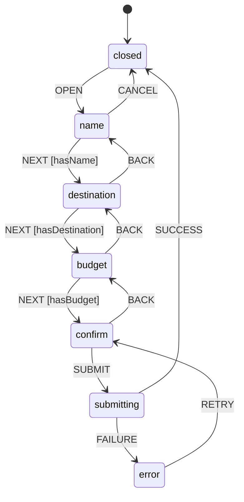

# Chapitre 5a — XState

## Le problème — les états impossibles

- On a vu `useReducer` au chapitre 1 : un reducer centralisé, des actions nommées, une logique testable.
- Mais `useReducer` ne contraint pas les transitions. N'importe quelle action peut être dispatchée depuis n'importe quel état.

```ts
// Avec useReducer — rien n'empêche ça
dispatch({ type: 'GO_TO_CONFIRM' }) // on est encore à l'étape "nom du voyage"
dispatch({ type: 'SET_BUDGET', payload: -500 }) // état interdit, mais possible
```

- Pour un formulaire simple, ce n'est pas un problème.
- Pour un **flux multi-états**, ça devient un terrain miné : `{ isModalOpen: true, isSubmitting: true, hasError: true }` — trois booléens, huit combinaisons possibles, la plupart invalides. Les guards (`if (!name) return`) se dispersent dans les handlers des composants.

> Un état impossible est un bug qui n'attend que les bonnes conditions pour se manifester.

---

## Les machines d'états — le concept

- Une **machine d'états finis** (FSM) est un système avec :
  - un ensemble fini d'**états** — une seule valeur active à la fois
  - des **transitions** nommées entre ces états
  - un **état initial** et optionnellement des états finaux
- Ce n'est pas un concept React. C'est un formalisme mathématique vieux de 60 ans, utilisé en électronique, en protocoles réseau, en jeux vidéo.



- **Ce graphe est la spec.** Pas les commentaires dans le code, pas la doc Notion — le graphe.
- L'état `submitting` n'a pas de transition `CANCEL` — impossible d'annuler une soumission en cours, par construction.
- `closed → confirm` n'existe pas. On ne peut pas arriver à l'écran de confirmation sans passer par les étapes.

> XState rend les états impossibles... impossibles.

---

## XState — l'API

### `setup` + `createMachine` (v5)

XState v5 introduit `setup` pour déclarer les types, guards et actions avant la machine. Ça permet un typage bout en bout sans casting.

```ts
import { setup, assign } from 'xstate'

const tripWizardMachine = setup({
  types: {
    context: {} as {
      name: string
      destination: string
      budget: number
    },
    events: {} as
      | { type: 'OPEN' }
      | { type: 'CANCEL' }
      | { type: 'NEXT' }
      | { type: 'BACK' }
      | { type: 'SUBMIT' }
      | { type: 'SUCCESS' }
      | { type: 'FAILURE' }
      | { type: 'RETRY' }
      | { type: 'SET_NAME'; value: string }
      | { type: 'SET_DESTINATION'; value: string }
      | { type: 'SET_BUDGET'; value: number },
  },
  guards: {
    hasName: ({ context }) => context.name.trim().length > 0,
    hasDestination: ({ context }) => context.destination.trim().length > 0,
    hasBudget: ({ context }) => context.budget > 0,
  },
  actions: {
    setName: assign(({ event }) =>
      event.type === 'SET_NAME' ? { name: event.value } : {}
    ),
    setDestination: assign(({ event }) =>
      event.type === 'SET_DESTINATION' ? { destination: event.value } : {}
    ),
    setBudget: assign(({ event }) =>
      event.type === 'SET_BUDGET' ? { budget: event.value } : {}
    ),
  },
}).createMachine({
  id: 'tripWizard',
  initial: 'closed',
  context: { name: '', destination: '', budget: 0 },
  states: {
    closed: {
      on: { OPEN: 'name' },
    },
    name: {
      on: {
        SET_NAME: { actions: 'setName' },
        NEXT: { target: 'destination', guard: 'hasName' },
        CANCEL: 'closed',
      },
    },
    destination: {
      on: {
        SET_DESTINATION: { actions: 'setDestination' },
        NEXT: { target: 'budget', guard: 'hasDestination' },
        BACK: 'name',
        CANCEL: 'closed',
      },
    },
    budget: {
      on: {
        SET_BUDGET: { actions: 'setBudget' },
        NEXT: { target: 'confirm', guard: 'hasBudget' },
        BACK: 'destination',
        CANCEL: 'closed',
      },
    },
    confirm: {
      on: {
        SUBMIT: 'submitting',
        BACK: 'budget',
        CANCEL: 'closed',
      },
    },
    submitting: {
      // Pas de CANCEL ici — impossible d'annuler une soumission en cours
      on: {
        SUCCESS: 'closed',
        FAILURE: 'error',
      },
    },
    error: {
      on: {
        RETRY: 'confirm',
      },
    },
  },
})
```

### Contexte + `assign` — les données vivent dans la machine

- Le **contexte** est la mémoire étendue de la machine : les données qui accompagnent les états.
- `assign` est la seule façon de muter le contexte — c'est une action pure, appelée lors d'une transition.
- Les données ne sont jamais perdues lors des navigations back/forward : elles vivent dans le contexte, pas dans des `useState` locaux.

```
État courant : 'destination'
Contexte     : { name: 'Road trip Provence', destination: '', budget: 0 }

Événement    : SET_DESTINATION { value: 'Gordes' }
→ assign     : { destination: 'Gordes' }

Nouveau contexte : { name: 'Road trip Provence', destination: 'Gordes', budget: 0 }
```

### Guards — les conditions de transition typées

- Un guard est une fonction **pure** : `({ context, event }) => boolean`.
- Il est déclaré dans `setup` et référencé par nom dans la machine.
- Si le guard retourne `false`, la transition est ignorée — l'état ne change pas.

```ts
guards: {
  hasName: ({ context }) => context.name.trim().length > 0,
}

// Dans la machine
name: {
  on: {
    NEXT: { target: 'destination', guard: 'hasName' }, // ignoré si hasName === false
  },
},
```

- Le bouton "Suivant" peut envoyer `NEXT` sans condition — c'est la machine qui décide si la transition a lieu.
- La logique de validation sort des composants et entre dans la machine.

### `useMachine` — brancher React

```tsx
import { useMachine } from '@xstate/react'
import { tripWizardMachine } from './tripWizardMachine'

function Ch5aApp() {
  const [snapshot, send] = useMachine(tripWizardMachine)

  // snapshot.value  : l'état courant ('closed', 'name', 'submitting', ...)
  // snapshot.context: les données ({ name, destination, budget })
  // send(event)     : envoyer un événement à la machine

  return (
    <Layout>
      <LayoutHeader chapter="Ch. 5a · XState" />
      <LayoutBody>
        <TripList trips={trips} />
        <button onClick={() => send({ type: 'OPEN' })}>
          Nouveau voyage
        </button>
      </LayoutBody>

      {!snapshot.matches('closed') ? (
        <TripWizardModal
          snapshot={snapshot}
          send={send}
        />
      ) : null}
    </Layout>
  )
}
```

- `useMachine` crée un **acteur** à partir de la définition de machine et s'abonne à ses changements.
- `snapshot` est immuable — React re-rend uniquement quand l'état ou le contexte change.
- `send` est stable en référence — pas besoin de `useCallback`.

---

## Application sur WanderState

Le formulaire de la page d'accueil (ch.1a) disparaît. À la place : un bouton "Nouveau voyage", et la liste en plein écran.

**Ce qu'on voit en démo :**

- Page d'accueil : liste des voyages + bouton "Nouveau voyage". Clic → la modal s'ouvre, machine passe de `closed` à `name`.
- Étape `name` : "Suivant" ne fait rien si le champ est vide — pas de message d'erreur, pas de `disabled`, la machine ignore l'événement.
- Navigation back/forward : revenir à `name`, changer le titre, repartir vers `confirm` — destination et budget intacts dans le contexte.
- Étape `confirm` : récapitulatif complet, bouton "Créer le voyage" envoie `SUBMIT`.
- État `submitting` : spinner, boutons désactivés, pas de `CANCEL` possible — l'état le rend impossible, pas un `if`.
- Retour à `closed` : modal fermée, trip apparu dans la liste.

**Ce qu'on ne voit pas dans les composants :**

```tsx
// Pas de ça dans les étapes du wizard
if (!name) {
  setError('Nom requis')
  return
}
// Les composants envoient des événements. La machine décide.
```

---

## Stately Inspector

L'Inspector est un outil de debug visuel pour XState — une fenêtre séparée qui montre la machine en temps réel pendant la démo.

### Activation — une ligne

```ts
import { createBrowserInspector } from '@statelyai/inspect'

const { inspect } = createBrowserInspector()

const [snapshot, send] = useMachine(tripWizardMachine, { inspect })
```

Une nouvelle fenêtre s'ouvre automatiquement avec le graphe de la machine.

### Ce qu'on voit en démo

```
┌─────────────────────────────────────┐
│  Stately Inspector                  │
│                                     │
│  ○ closed                           │
│  ● name         ← état courant      │
│  ○ destination                      │
│  ○ budget                           │
│  ○ confirm                          │
│  ○ submitting                       │
│  ○ error                            │
│                                     │
│  Transitions disponibles :          │
│  → NEXT (guard: hasName ✗)          │
│  → CANCEL                           │
│  → SET_NAME                         │
│                                     │
│  Contexte :                         │
│  { name: '', destination: '', ... } │
└─────────────────────────────────────┘
```

- Chaque `send` apparaît dans l'historique des événements.
- Le guard `hasName` est marqué `✗` tant que le champ est vide — on voit **pourquoi** `NEXT` est ignoré.
- Passer à `submitting` → `CANCEL` disparaît des transitions disponibles. L'état impossible est visible.
- Remplir le nom → le guard passe à `✓` → `NEXT` fait avancer la machine.

> L'Inspector transforme la machine abstraite en quelque chose de visible. C'est le meilleur outil pédagogique de la démo.

---

## Sous le capot

### Machine vs Acteur

- La **machine** (`tripWizardMachine`) est une **définition pure** — un objet JavaScript immutable qui décrit les états, transitions, guards et actions. Elle ne "tourne" pas.
- Un **acteur** est une **instance en cours d'exécution** de cette machine — il a un état courant, un contexte, et peut recevoir des événements.

```
tripWizardMachine (définition) ──── useMachine ────► acteur (instance)
                                                         │
                                                   état courant
                                                   contexte
                                                   abonnements React
```

- `useMachine` crée l'acteur au montage et le détruit au démontage.
- On peut créer plusieurs acteurs à partir de la même machine — ex: un wizard par trip en cours de création.

### L'Interpreter

- L'interpreter est le moteur qui fait tourner un acteur.
- À chaque `send(event)` :
  1. Cherche les transitions valides depuis l'état courant pour cet event
  2. Évalue les guards
  3. Si une transition passe : exécute les actions (`assign`, effets), change l'état
  4. Notifie les abonnés (React via `useMachine`)
- Ce cycle est **synchrone** — pas de Promise, pas de setTimeout. L'état suivant est calculé immédiatement.

### Abonnement React

`useMachine` utilise `useSelector` de `@xstate/react`, lui-même basé sur `useSyncExternalStore` — le même mécanisme que Zustand et nuqs. L'acteur est un store externe ; React s'abonne à ses changements.

---

## Comparaison — table rapide

| | `useReducer` | `Zustand` | `XState` |
|---|---|---|---|
| Transitions contraintes | Non | Non | Oui |
| Guards | Manuel (if/return) | Manuel | Déclaratifs, dans la machine |
| Contexte (données associées) | State React séparé | Store séparé | Intégré dans la machine |
| États async (submitting, error) | Booléens combinés | Booléens combinés | États nommés, transitions explicites |
| Visualisation | DevTools limités | Zustand DevTools | Stately Inspector |
| Cas d'usage idéal | Logique CRUD simple | State global partagé | Workflows, modales, processus métier |
| Courbe d'apprentissage | Faible | Faible | Moyenne |

---

## Points clés à retenir

- Certains problèmes se modélisent mieux comme un **graphe de transitions** que comme un objet mutable.
- Une machine d'états rend les **états impossibles impossibles** — par construction, pas par convention.
- `assign` stocke les données dans le **contexte** de la machine — elles survivent aux navigations back/forward.
- Les **guards** centralisent la logique de validation dans la machine, hors des composants.
- Machine = définition. Acteur = instance en cours d'exécution. `useMachine` crée l'acteur et abonne React.
- Le **Stately Inspector** rend la machine visible en temps réel — l'outil pédagogique le plus impactant de la démo.
- XState brille sur les **workflows avec états async** : soumission, erreur, retry — là où les booléens combinés deviennent ingérables.
