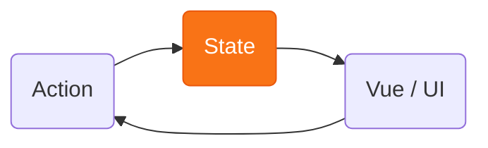
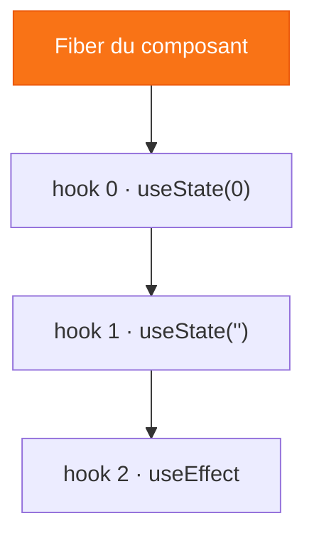
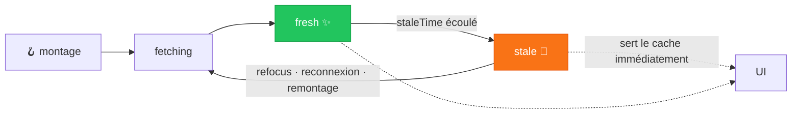
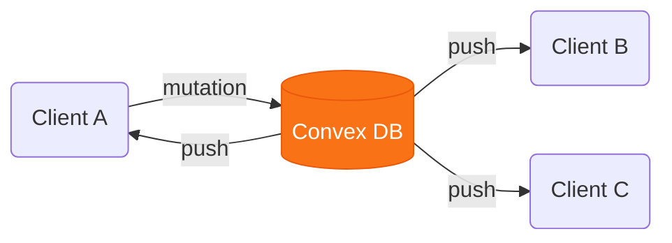
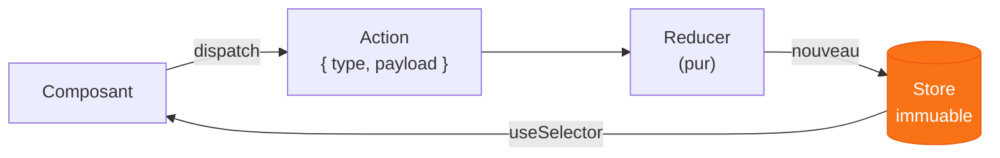
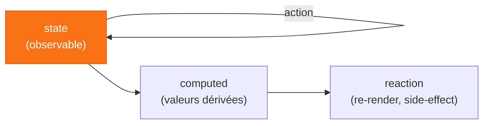
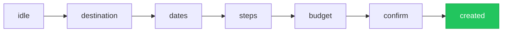

# Gestion de state en React

**Deep Dive** — connaître les types d'état pour choisir le bon outil

<!--
Intro. On va construire une seule app, WanderState, et la faire évoluer chapitre
par chapitre. Chaque chapitre = un type d'état = un outil adapté.
-->

---
layout: center
class: text-center
---

# 🙋 Avant de commencer

<div v-click class="text-2xl pt-8 leading-relaxed">
Quels outils de gestion de state React<br>connaissez-vous ?
</div>

<!--
Ice-breaker. Lever de main. On note ceux qui sortent… et surtout ceux qui ne sortent
jamais. Intéressant : est-ce qu'on les connaît en profondeur ?
Si personne ne cite de solution de state serveur → c'est LE signal du talk.
-->

---

# Qu'est-ce que « l'état » ?

<div class="grid grid-cols-2 gap-8 pt-10">
<div v-click class="border border-gray-500 rounded-lg p-6">

### Programme sans état

Même entrée → même sortie.<br>Aucune mémoire.

<div class="opacity-60 text-sm pt-2">
une fonction pure · <code>grep</code> · une calculatrice
</div>

</div>
<div v-click class="border-2 border-orange-500 rounded-lg p-6">

### Programme avec état

Se souvient du passé — et <b>réagit en continu</b> aux événements extérieurs.

<div class="opacity-60 text-sm pt-2">
un éditeur de texte · un jeu vidéo · un thermostat
</div>

</div>
</div>

<div v-click class="pt-12 text-center text-xl">
Tout programme <span v-mark.underline.orange>qui tourne</span> et sert à quelque chose garde un état.
</div>

<!--
Notion universelle (tout logiciel, pas que web/React). Insister sur EN COURS D'EXÉCUTION : un
programme qui tourne et fait quelque chose d'utile garde forcément une trace de son état —
sinon c'est une fonction pure, one-shot. Sans état = même entrée → même sortie, aucune mémoire.
Avec état = se souvient du passé et réagit en continu aux événements extérieurs. Enchaîner sur :
et où vit cet état ?
-->

---

# Et sur le web ?

<div v-click class="text-center opacity-55 pt-3">
Difficile de trouver une vraie page <b>sans état</b>. 🦄
</div>

<div v-click class="text-center text-3xl font-bold pt-4">
Sur le web, <span v-mark.orange>l'état est partout.</span>
</div>

<div v-click class="text-center text-xl pt-3">
interactivité <span class="text-orange-500">→</span> état
</div>

<div v-click class="flex items-center justify-center gap-4 pt-6">

<div class="border border-gray-400 rounded-xl px-4 py-3">
<div class="text-xs uppercase tracking-widest opacity-40 pb-2">💻 Client</div>
<div class="flex flex-col gap-2">
<div class="border border-gray-500 rounded-lg px-4 py-1.5 leading-tight">
Navigateur
<div class="text-xs opacity-50">DOM · URL</div>
</div>
<div class="border-2 border-orange-500 rounded-lg px-4 py-1.5 leading-tight bg-orange-400/10">
Code applicatif
<div class="text-xs opacity-50">JS</div>
</div>
</div>
</div>

<div class="flex flex-col items-center text-orange-400">
<div class="text-3xl leading-none">⇄</div>
<div class="text-[10px] uppercase tracking-wider opacity-60 pt-1">réseau · async</div>
</div>

<div class="border border-gray-400 rounded-xl px-6 py-4 text-center">
<div class="text-3xl">🗄️</div>
<div class="pt-1">Serveur</div>
</div>

<div class="flex items-center text-orange-400 text-3xl">⇄</div>

<div class="border border-gray-400 rounded-xl px-6 py-4 text-center">
<div class="text-3xl">🛢️</div>
<div class="pt-1">Base de données</div>
</div>

</div>

<!--
Narrowing vers le web. Une vraie page sans état est l'exception (doc, Wikipédia, et encore).
Le point clé : c'est l'INTERACTIVITÉ qui crée le besoin d'état — un livre ne suit aucun état,
une page qui réagit aux actions, si. D'où : sur le web, l'état est partout (interaction, compte,
panier, thème, brouillon, cache d'API — 99 % des pages). En plus, une app web n'est pas UN
programme mais un process distribué et asynchrone (navigateur + code JS, serveur, DB), éparpillé
sur beaucoup de pièces. D'où la difficulté → le catégoriser est déjà un défi (slide suivante).
-->

---

# Comment catégoriser l'état ?

<div class="grid grid-cols-2 gap-6 pt-8">

<div v-click class="border border-gray-500 rounded-lg p-4">
<div class="text-xs uppercase tracking-widest opacity-40">Hypothèse 1</div>

### Par son contenu

<div class="text-sm opacity-70 pt-1">interaction (dropdown, formulaire)<br>vs métier (compte, panier)</div>

<div class="text-sm opacity-50 pt-3">❌ frontière floue — et ça ne dit pas où le ranger</div>
</div>

<div v-click class="border border-gray-500 rounded-lg p-4">
<div class="text-xs uppercase tracking-widest opacity-40">Hypothèse 2</div>

### Par où il est lu

<div class="text-sm opacity-70 pt-1">local à un composant<br>vs partagé / global</div>

<div class="text-sm opacity-50 pt-3">❌ ça bouge tout le temps — un état peut finir lu partout</div>
</div>

</div>

<div v-click class="border-2 border-orange-500 rounded-lg p-4 mt-8 bg-orange-400/10 text-center max-w-md mx-auto">

### 🎯 Par sa source de vérité

<div class="pt-1">Où l'état <b>naît</b>-il ? Qui le <b>possède</b> ?</div>
</div>

<!--
Reframe central : on pourrait classer l'état par son contenu (interaction vs métier)
ou par où il est lu (local vs partagé), mais ces axes sont flous et instables. L'axe
qui détermine vraiment l'outil, c'est la SOURCE DE VÉRITÉ : où l'état naît, qui le
possède. C'est le fil rouge de tout le talk.
-->

---

# La source de vérité : où naît l'état ?

<div class="flex items-stretch justify-center gap-4 pt-6">

<div v-click="1" class="border-2 border-gray-400 rounded-xl p-4 flex-1 max-w-md">
<div class="text-sm uppercase tracking-widest opacity-50 text-center pb-3">💻 Client</div>

<div class="flex flex-col gap-2">

<div v-click="2" class="border border-gray-500 rounded-lg p-3">
🌐 <b>navigateur</b>
<div class="text-xs opacity-60 pt-1">DOM · formulaires · scroll · localStorage · <b class="opacity-100">URL</b></div>
<div v-click="3" class="text-xs text-orange-400 pt-2 border-l-2 border-orange-500 pl-2">
L'<b>URL</b> à part : un state <b>partageable</b> et <b>dans l'historique</b> — gratuit, souvent oublié
</div>
</div>

<div v-click="2" class="border-2 border-orange-500 rounded-lg p-3 bg-orange-400/10">
💻 <b>runtime JS</b>
<div class="text-xs opacity-60 pt-1">variables en mémoire runtime — ⚠️ volatile, perdu au refresh</div>
</div>

</div>
</div>

<div v-click="1" class="flex flex-col items-center justify-center text-orange-400">
<div class="text-3xl">⇄</div>
</div>

<div v-click="1" class="border-2 border-gray-400 rounded-xl p-4 flex flex-col items-center justify-center text-center">
<div class="text-4xl">🗄️</div>
<div class="font-bold pt-2">Serveur / DB</div>
<div class="text-xs opacity-60 pt-2">persisté · partagé<br>asynchrone</div>
</div>

</div>

<div class="pt-10 max-w-3xl mx-auto text-sm space-y-3">
<div v-click="4">💻 <b>State client</b> — interaction, formulaire, sélection…</div>
<div v-click="5">🗄️ <b>State serveur</b> — compte, voyages, catalogue, persisté en base…</div>
</div>

<!--
Construire progressivement : (1) d'abord la grande séparation client ⇄ serveur. (2) puis
ouvrir le client : ce que le navigateur gère pour nous (DOM, formulaires, scroll,
localStorage, URL) vs ce que NOTRE code JS gère (variables en mémoire, volatiles). (3) cas
spécial de l'URL : contrairement au reste du state navigateur, elle est partageable et dans
l'historique — gratuite, persistante, souvent oubliée (→ ch.2). Cette grille mappe les
chapitres : URL (ch.2), state client (ch.1,4,5), serveur (ch.3).
-->

---

# Donnée persistée ≠ état

<div class="flex items-center justify-center gap-6 pt-6">

<div v-click="1" class="border border-gray-500 rounded-xl p-5 text-center max-w-xs">
<div class="text-4xl">🗄️</div>
<div class="font-bold pt-2">Donnée persistée</div>
<div class="text-sm opacity-60 pt-2">au repos, inerte —<br>de la mémoire durable</div>
<div class="text-xs opacity-50 pt-2">ligne en DB · fichier · localStorage</div>
</div>

<div class="flex flex-col items-center text-orange-400 gap-2">
<div v-click="2" class="flex flex-col items-center">
<div class="text-xs uppercase tracking-wider opacity-70">chargée dans l'app</div>
<div class="text-3xl leading-none">→</div>
</div>
<div v-click="5" class="flex flex-col items-center">
<div class="text-3xl leading-none">←</div>
<div class="text-xs uppercase tracking-wider opacity-70">persiste la donnée</div>
</div>
</div>

<div v-click="2" class="border-2 border-orange-500 rounded-xl p-5 text-center max-w-xs bg-orange-400/10">
<div class="text-4xl">⚡</div>
<div class="font-bold pt-2">État</div>
<div class="text-sm opacity-60 pt-2">vivant, en mémoire —<br>ce que l'UI lit & affiche</div>
<div class="text-xs opacity-50 pt-2">disparaît quand l'app s'arrête</div>
</div>

</div>

<div v-click="3" class="pt-6 text-center text-lg">
La donnée devient de l'état au moment où elle est <b>chargée</b> dans le client.
</div>

<div v-click="4" class="pt-4 text-center text-xl font-bold">
Tout l'état <span v-mark.underline.orange>finit dans le client</span>.
</div>

<!--
Distinction mémoire persistée vs état. Une ligne en DB, un fichier, du localStorage = de la
mémoire durable, inerte, au repos. Ce n'est pas « l'état » de l'app tant que ce n'est pas
chargé dans le client : à ce moment-là ça devient de l'état vivant, en mémoire. Et puisque
l'état est ce qui change l'écran, TOUT l'état finit par vivre dans le client, quelle que soit
sa source (c'est l'ancienne « règle d'or »). Corollaire : le client n'en tient qu'une COPIE —
elle peut diverger (donnée périmée → state serveur, ch.3). Le flux est bidirectionnel : on
charge l'état (récupération) ET on le persiste en sens inverse — une annexe nécessaire à la
gestion de state, sans en être à proprement parler.
-->

---

# MPA vs SPA : fragmenter ou tout concentrer

<div class="grid grid-cols-2 gap-6 pt-4">

<div class="border border-gray-500 rounded-xl p-5">
<div class="text-sm uppercase tracking-widest opacity-50 pb-2">🌍 MPA — le problème est <b>fragmenté</b></div>

<div class="text-sm opacity-80 leading-relaxed space-y-1">
<div v-click="1">🗄️ <b>Serveur</b> — reconstruit l'état à chaque requête</div>
<div v-click="2">🌐 <b>Navigateur</b> — ne tient qu'un état d'UI léger</div>
<div v-click="3">🔗 <b>URL</b> — fait le lien entre les deux</div>
</div>
</div>

<div class="border-2 border-orange-500 rounded-xl p-5 bg-orange-400/10">
<div class="text-sm uppercase tracking-widest opacity-60 pb-2">⚡ SPA — tout converge dans le client</div>

<div class="text-sm opacity-80 leading-relaxed space-y-1">
<div v-click="4">connaître <b>tout l'état</b> et le <b>propager</b> correctement, à chaque frame</div>
<div v-click="5" class="opacity-60">risque : afficher des données <b>périmées</b></div>
</div>
</div>

</div>

<div v-click="6" class="pt-6 text-center text-lg">
En SPA, le <b>client</b> est la source de vérité de <b>ce qui s'affiche</b>.
</div>

<div v-click="7" class="pt-2 text-center text-lg">
On échange fluidité &amp; réactivité contre la charge de <span v-mark.underline.orange>gérer tout l'état côté client</span>.
</div>

<!--
Reframe : le MPA répond au problème de state en le FRAGMENTANT. Le serveur reconstruit l'état
métier à chaque requête (à partir de la DB), le navigateur ne tient qu'un état d'UI léger
(scroll, champ en cours, hover), et l'URL fait le pont entre les deux (elle sélectionne ce que
le serveur rend). Chaque pièce a donc peu à gérer → c'est ce qui rend le MPA simple. Le SPA
casse cette répartition : le client doit connaître TOUT l'état à chaque frame pour rendre l'UI
correctement. Tout écart se paie cash — flash de données périmées, voire désynchronisation
complète. D'où la nécessité de gérer le state côté client : le sujet du reste du talk.
-->

---

# Un même prisme, tous les paradigmes

<div class="text-center opacity-70 text-sm pb-3">« Où vit l'état ? » suffit à reconnaître chaque architecture.</div>

<div class="max-w-3xl mx-auto pt-2">

<div class="grid grid-cols-[1fr_2fr] gap-x-6 pb-2 border-b border-gray-600 text-sm uppercase tracking-wider opacity-50">
<div>Architecture</div>
<div>Où vit l'état</div>
</div>

<div v-click class="grid grid-cols-[1fr_2fr] gap-x-6 py-2 border-b border-gray-700">
<div><b>Site statique</b></div>
<div>Client — surtout le <b>DOM</b></div>
</div>

<div v-click class="grid grid-cols-[1fr_2fr] gap-x-6 py-2 border-b border-gray-700">
<div><b>SPA + AJAX</b></div>
<div>Client <b>et</b> serveur</div>
</div>

<div v-click class="grid grid-cols-[1fr_2fr] gap-x-6 py-2 border-b border-gray-700">
<div><b>MPA</b></div>
<div>Serveur — tout passe par des <b>requêtes</b></div>
</div>

<div v-click class="grid grid-cols-[1fr_2fr] gap-x-6 py-2">
<div><b>HTMX</b></div>
<div>Backend — l'état client <i>est</i> le <b>markup HTML</b></div>
</div>

</div>

<div v-click class="pt-5 text-center opacity-80">
Du <b>tout-serveur</b> (HTMX, MPA) au <b>tout-client</b> (SPA) — un même prisme.<br>
Partout l'état <b>affecte</b> le client ; mais le <b>gérer</b> côté client, <span v-mark.orange>c'est le pari du SPA</span>.
</div>

<!--
Le prisme "où vit l'état" range tous les paradigmes. HTMX = la logique poussée à fond,
tout côté backend, le client ne tient que du markup. Conséquence centrale pour React/SPA :
en abstrayant le DOM, l'état doit vivre ailleurs → mémoire JS volatile.
-->

---

# Pas le même état partout

<div class="text-center opacity-70 pb-4">Toutes les apps ne pondèrent pas ces sources de vérité de la même façon.</div>

<div class="grid grid-cols-3 gap-5 pt-2">
<div v-click class="border border-gray-500 rounded-xl p-5 text-center">
<div class="text-4xl">🪧</div>
<b>Site vitrine · blog</b>
<div class="text-xs opacity-60 pt-2">quasi pas d'état</div>
<div class="text-sm pt-3">🌐 surtout <b>navigateur · URL</b></div>
</div>
<div v-click class="border border-gray-500 rounded-xl p-5 text-center">
<div class="text-4xl">🛒</div>
<b>E-commerce · back-office</b>
<div class="text-xs opacity-60 pt-2">catalogue, stock, commandes</div>
<div class="text-sm pt-3">🗄️ surtout <b>serveur</b></div>
</div>
<div v-click class="border-2 border-orange-500 rounded-xl p-5 text-center bg-orange-400/10">
<div class="text-4xl">✏️</div>
<b>Éditeur · Figma · Gmail</b>
<div class="text-xs opacity-60 pt-2">document vivant, interactions</div>
<div class="text-sm pt-3">💻 surtout <b>client</b></div>
</div>
</div>

<div v-click class="pt-6 text-center text-lg">
Repérer <span v-mark.underline.orange>d'où vient surtout l'état</span> oriente le choix des outils.
</div>

<!--
Retour sur les sources de vérité : toutes les apps ne les pondèrent pas pareil. Site vitrine
≈ quasi pas d'état (un peu de navigateur/URL) ; e-commerce/back-office ≈ surtout du serveur
(catalogue, stock, commandes en base) ; éditeur/Figma/Gmail ≈ surtout du client (document
vivant en mémoire, interactions riches). La plupart des vraies apps mélangent les trois — mais
identifier la source dominante oriente déjà le choix des outils. C'est tout le plan du talk.
-->

---

# React

<div v-click="1" class="text-center text-2xl pt-8">
Toute la donnée ne circule que dans <span v-mark.orange>un seul sens</span> — et l'état reste <b class="text-orange-400">immuable</b>.
</div>

<div v-click="2" class="flex flex-col items-center gap-1 pt-8">
<div class="border-2 border-orange-500 rounded-lg px-6 py-2 bg-orange-400/10 font-medium">Parent — détient le state</div>
<div class="flex gap-16 pt-1">
<div class="flex flex-col items-center">
<div class="flex flex-col items-center text-orange-400 leading-tight">
<span class="text-2xl leading-none">↓</span>
<span class="text-xs">props</span>
</div>
<div class="border border-gray-500 rounded-lg px-6 py-2 mt-1">Enfant A</div>
</div>
<div class="flex flex-col items-center">
<div class="flex flex-col items-center text-orange-400 leading-tight">
<span class="text-2xl leading-none">↓</span>
<span class="text-xs">props</span>
</div>
<div class="border border-gray-500 rounded-lg px-6 py-2 mt-1">Enfant B</div>
</div>
</div>
</div>

<div v-click="3" class="pt-8 text-center opacity-70">
La donnée ne va que <b>vers le bas</b> — jamais vers le haut, jamais à l'horizontale.<br>On sait toujours d'où vient chaque valeur.
</div>

<div v-click="4" class="pt-6 text-center text-lg">
Ça se complique quand deux composants <span v-mark.orange>éloignés</span> doivent partager la donnée.
</div>

<!--
Le trait unique de React : flux de données unidirectionnel. La donnée ne descend QUE vers le
bas, du parent vers l'enfant via les props — jamais vers le haut, jamais entre frères. Pour
qu'une donnée « remonte », il n'y a qu'un mécanisme (à expliquer à l'oral) : le parent passe
un callback en prop, et l'enfant l'appelle en lui passant des arguments. Ce n'est donc pas un
vrai flux remontant, juste l'enfant qui déclenche du code du parent. Très prévisible → facile
à débugger. Le coût : pour partager entre composants éloignés, il faut tout remonter au parent
commun → point de départ des chapitres (prop drilling → contexte → stores).
-->

---

# Et dans les autres frameworks ?

<div class="max-w-4xl mx-auto pt-8 grid grid-cols-[auto_1fr_1fr_1fr] gap-x-5 gap-y-5 items-center">

<div></div>
<div class="text-center font-bold text-orange-400">React</div>
<div class="text-center font-bold opacity-80">Vue</div>
<div class="text-center font-bold opacity-80">Angular</div>

<div v-click="1" class="text-sm opacity-60 whitespace-nowrap">Lier état ↔ vue</div>
<div v-click="1" class="text-center"><code class="text-xs whitespace-nowrap">&lt;Field value={count}<br/>onChange={setCount} /&gt;</code></div>
<div v-click="1" class="text-center"><code class="text-xs whitespace-nowrap">&lt;Field v-model="count" /&gt;</code></div>
<div v-click="1" class="text-center"><code class="text-xs whitespace-nowrap">&lt;app-field [(value)]="count" /&gt;</code></div>

<div v-click="2" class="text-sm opacity-60 whitespace-nowrap">Changer l'état</div>
<div v-click="2" class="text-center"><code class="text-sm whitespace-nowrap">setCount(count + 1)</code></div>
<div v-click="2" class="text-center"><code class="text-sm whitespace-nowrap">count.value++</code></div>
<div v-click="2" class="text-center"><code class="text-sm whitespace-nowrap">this.count++</code></div>

</div>

<div v-click="3" class="pt-10 text-center text-lg">
Vue &amp; Angular : on <b>mute</b>, le framework réagit.<br>
React : l'état est <span v-mark.underline.orange>immuable</span> — on ne le modifie pas, on le remplace.
</div>

<div v-click="4" class="pt-3 text-center opacity-70">
Immutabilité &amp; flux à sens unique vont de pair → un flux <b>prévisible et traçable</b>.
</div>

<!--
Deux axes pour enfoncer le clou. (1) Lier état ↔ vue : Vue (v-model) et Angular ([(x)]) font du
two-way binding (sur composant aussi, pas que les inputs natifs : modelValue/update:modelValue,
@Input x + @Output xChange) ; React reste explicite (value en prop, onChange en callback).
(2) Changer l'état : Vue et Angular MUTENT directement la donnée et le framework réagit
(Proxy / détection de changement) ; React n'autorise jamais la mutation — on passe par le
setter et l'état reste immuable. Bilan : plus verbeux, mais un seul sens, prévisible et traçable.
-->

---
layout: center
---

<div class="text-6xl font-mono pt-6 pb-4">
  UI = <span v-mark.circle.orange="1">f(state)</span>
</div>

<div v-click="2" class="text-xl opacity-70">
Une UI n'est qu'une <b>projection de l'état</b> à un instant T.
</div>

<div v-click="3" class="text-xl opacity-70 pt-2">
Changer l'UI = changer l'état. <b>Rien d'autre.</b>
</div>

<div class="flex justify-center pt-12">



</div>

<!--
Le modèle mental qui accompagne le flux : UI = projection de l'état. Pas unique à React (Vue,
Solid le partagent), mais c'est ainsi qu'on raisonne. Changer l'écran = changer l'état, rien
d'autre. Tout le reste du talk : où vit le state, et comment on le change.
-->

---

# Alors… comment gère-t-on tout ça ?

<div v-click="1" class="text-center text-lg pt-3 opacity-80">
L'état n'est pas un concept <b>simple</b>.
</div>

<div v-click="2" class="text-center text-lg opacity-80 pt-2">
En React, il faut trouver une façon de <b>tout gérer côté client</b>.
</div>

<div class="flex flex-wrap items-center justify-center gap-x-4 gap-y-3 pt-10 max-w-4xl mx-auto leading-tight">
<span v-click="3" class="fall text-4xl font-bold" style="transform: rotate(-4deg)">Redux</span>
<span v-click="4" class="fall text-4xl font-bold text-orange-400" style="transform: rotate(-2deg)">TanStack Query</span>
<span v-click="5" class="fall text-3xl font-bold" style="transform: rotate(2deg)">Zustand</span>
<span v-click="6" class="fall text-xl opacity-60" style="transform: rotate(3deg); transition-delay: 0ms">useState</span>
<span v-click="6" class="fall text-lg opacity-50" style="transform: rotate(-5deg); transition-delay: 70ms">Context API</span>
<span v-click="6" class="fall text-2xl" style="transform: rotate(5deg); transition-delay: 140ms">Jotai</span>
<span v-click="6" class="fall text-base opacity-40" style="transform: rotate(4deg); transition-delay: 210ms">useReducer</span>
<span v-click="6" class="fall text-2xl text-orange-400" style="transform: rotate(-6deg); transition-delay: 280ms">MobX</span>
<span v-click="6" class="fall text-lg opacity-55" style="transform: rotate(2deg); transition-delay: 350ms">Recoil</span>
<span v-click="6" class="fall text-3xl font-bold" style="transform: rotate(3deg); transition-delay: 420ms">Apollo</span>
<span v-click="6" class="fall text-xl" style="transform: rotate(-3deg); transition-delay: 490ms">SWR</span>
<span v-click="6" class="fall text-2xl font-bold text-orange-400" style="transform: rotate(4deg); transition-delay: 560ms">Convex</span>
<span v-click="6" class="fall text-base opacity-45" style="transform: rotate(-4deg); transition-delay: 630ms">Valtio</span>
<span v-click="6" class="fall text-2xl" style="transform: rotate(2deg); transition-delay: 700ms">Redux Toolkit</span>
<span v-click="6" class="fall text-lg opacity-60" style="transform: rotate(-2deg); transition-delay: 770ms">nuqs</span>
<span v-click="6" class="fall text-3xl font-bold" style="transform: rotate(5deg); transition-delay: 840ms">XState</span>
<span v-click="6" class="fall text-xl opacity-50" style="transform: rotate(-5deg); transition-delay: 910ms">RTK Query</span>
<span v-click="6" class="fall text-2xl text-orange-400" style="transform: rotate(3deg); transition-delay: 980ms">Firebase</span>
<span v-click="6" class="fall text-lg opacity-55" style="transform: rotate(-3deg); transition-delay: 1050ms">Relay</span>
<span v-click="6" class="fall text-xl" style="transform: rotate(4deg); transition-delay: 1120ms">Supabase</span>
<span v-click="6" class="fall text-2xl font-bold" style="transform: rotate(2deg); transition-delay: 1190ms">Signals</span>
<span v-click="6" class="fall text-lg opacity-50" style="transform: rotate(-6deg); transition-delay: 1260ms">Nano Stores</span>
<span v-click="6" class="fall text-base opacity-45" style="transform: rotate(5deg); transition-delay: 1330ms">useSyncExternalStore</span>
<span v-click="6" class="fall text-xl opacity-60" style="transform: rotate(-2deg); transition-delay: 1400ms">Immer</span>
<span v-click="6" class="fall text-lg opacity-40" style="transform: rotate(3deg); transition-delay: 1470ms">Flux</span>
</div>

<div v-click="7" class="text-center text-sm opacity-50 pt-10">
…et chacun finit par faire un peu de <b>tout</b> : cache, sélecteurs, middleware, persistance, optimistic updates, normalisation…
</div>

<style>
.fall {
  transition: transform 0.5s cubic-bezier(0.34, 1.56, 0.64, 1), opacity 0.4s ease;
}
.fall.slidev-vclick-hidden {
  transform: translateY(-80px) !important;
  opacity: 0 !important;
}
</style>

<!--
Slide-charnière entre l'intro conceptuelle et le plan. On rembobine : l'état n'est pas un
concept simple, et React/SPA rapatrie TOUT le state côté client — c'est à nous de trouver
une façon de tout gérer. Réaction de l'écosystème : une avalanche d'outils. Les trois premiers
(Redux, TanStack Query, Zustand) tombent un par un, puis au dernier clic le reste dégringole
en cascade — l'effet doit submerger, volontairement chaotique et illisible. Double problème :
il y a BEAUCOUP d'outils, ET chacun déborde de son rôle (un store qui fait du cache, un client
réseau qui fait du state global…). C'est exactement le brouillard qu'on va dissiper — à l'oral :
on va remettre de l'ordre dans ce nuage, chapitre par chapitre, via la grille "où vit l'état".
-->

---
layout: center
---

<div class="flex flex-col gap-5 max-w-3xl mx-auto">

<div v-click="1" class="flex items-center gap-5 border border-gray-600 rounded-xl p-5">
<div class="text-4xl font-bold text-orange-400 opacity-80">01</div>
<div class="text-xl">Comment <b>s'y retrouver</b> dans tous ces outils ?</div>
</div>

<div v-click="2" class="flex items-center gap-5 border border-gray-600 rounded-xl p-5">
<div class="text-4xl font-bold text-orange-400 opacity-80">02</div>
<div class="text-xl"><b>Quel outil</b> pour <b>quel besoin</b> ?</div>
</div>

<div v-click="3" class="flex items-center gap-5 border-2 border-orange-500 rounded-xl p-5 bg-orange-400/10">
<div class="text-4xl font-bold text-orange-400">03</div>
<div class="text-xl">Comment <b>tirer le meilleur</b> de chacun ?</div>
</div>

</div>

<!--
On sort du brouillard du nuage pour poser les trois questions auxquelles le talk répond.
(1) Se repérer dans l'écosystème — une carte, pas une liste à apprendre par cœur.
(2) Choisir : associer un type d'état à l'outil adapté, plutôt qu'un outil par défaut pour tout.
(3) Maîtriser : une fois le bon outil choisi, en exploiter les forces (sélecteurs, cache,
invalidation, machines à états…). À l'oral : le fil rouge qui répond aux trois reste "où vit
l'état ?" — la grille de lecture posée en intro, qu'on déroule chapitre par chapitre.
-->

---

# Ce qu'on va voir aujourd'hui

<div class="flex gap-6 max-w-3xl mx-auto pt-4">

<div v-click="6" class="flex flex-col items-center self-stretch text-orange-400">
<div class="text-[10px] uppercase tracking-widest opacity-70 pb-2 text-center leading-tight">Le plus<br>courant</div>
<div class="w-0.5 flex-1 bg-gradient-to-b from-orange-400/20 to-orange-500"></div>
<div class="text-xl leading-none -mt-1">▼</div>
<div class="text-[10px] uppercase tracking-widest opacity-70 pt-2 text-center leading-tight">Le plus<br>spécialisé</div>
</div>

<div class="flex flex-col gap-3 flex-1">

<div v-click="1" class="flex items-baseline gap-5 border-b border-gray-700 pb-3">
<div class="text-2xl font-bold text-orange-400 opacity-80 w-8">1</div>
<div>
<div class="text-xl font-medium">Les API natives de React</div>
<div class="text-sm opacity-50">useState · useContext · useReducer</div>
</div>
</div>

<div v-click="2" class="flex items-baseline gap-5 border-b border-gray-700 pb-3">
<div class="text-2xl font-bold text-orange-400 opacity-80 w-8">2</div>
<div>
<div class="text-xl font-medium">L'état dans l'URL</div>
<div class="text-sm opacity-50">nuqs</div>
</div>
</div>

<div v-click="3" class="flex items-baseline gap-5 border-b border-gray-700 pb-3">
<div class="text-2xl font-bold text-orange-400 opacity-80 w-8">3</div>
<div>
<div class="text-xl font-medium">L'état serveur</div>
<div class="text-sm opacity-50">SWR · TanStack Query · Apollo · Convex</div>
</div>
</div>

<div v-click="4" class="flex items-baseline gap-5 border-b border-gray-700 pb-3">
<div class="text-2xl font-bold text-orange-400 opacity-80 w-8">4</div>
<div>
<div class="text-xl font-medium">Les state managers classiques</div>
<div class="text-sm opacity-50">Redux &amp; RTK · Zustand</div>
</div>
</div>

<div v-click="5" class="flex items-baseline gap-5 pb-1">
<div class="text-2xl font-bold text-orange-400 opacity-80 w-8">5</div>
<div>
<div class="text-xl font-medium">Les solutions exotiques</div>
<div class="text-sm opacity-50">XState · Jotai · MobX</div>
</div>
</div>

</div>

</div>

<!--
Le plan, révélé chapitre par chapitre. On suit la grille "où vit l'état" : on part des API
natives (state client local/partagé), on passe par l'URL (souvent oubliée), puis le state
serveur (asynchrone, le gros morceau), avant les state managers classiques (tout-en-un) et on
finit par les paradigmes exotiques. Ordre voulu : du plus natif/courant au plus spécialisé.
La flèche (clic 6) matérialise ce gradient : plus on descend, plus la solution est rare/de
niche. À l'oral : dans ~90 % des cas aujourd'hui (API natives + URL + state serveur), on n'a
pas besoin d'un state manager dédié — d'où l'ordre du talk.
-->

---
layout: section
---

# Chapitre 1
## Les API natives de React
<div class="opacity-60 pt-2">Des outils méconnus qui suffisent souvent</div>

---

# 1a · `useState` — l'état local

<div class="grid grid-cols-2 gap-6 items-center">
<div>

```tsx {all|1|3}
const [count, setCount] = useState(0)

setCount(count + 1) // déclenche un re-render
```

<v-clicks>

- une variable réactive **locale** au composant
- un tuple `[valeur, setter]`
- le setter ⇒ **re-render**
- l'état initial n'est lu **qu'au montage**

</v-clicks>

</div>
<div v-click="6">

### WanderState — point de départ

```tsx
function Ch1aApp() {
  const [trips, setTrips] = useState<Trip[]>([])
  return (
    <TripForm
      onAddTrip={(t) =>
        setTrips((p) => [...p, t])} />
    /* + <TripList trips={trips} /> */
  )
}
```

<div class="text-sm opacity-60 pt-2">
Tout l'état est local. Un formulaire, une liste.
</div>

</div>
</div>

<!--
Démo 1a : formulaire de création + dropdown destination (isOpen + selected = deux
useState, UI state minimal). Message : useState suffit pour de l'état local et éphémère.
-->

---

# Où React range-t-il le state ? — la Fiber

<div class="grid grid-cols-2 gap-8 items-center">
<div>



</div>
<div>

<v-clicks>

- chaque composant a une **fiber node**
- les hooks = une **liste chaînée** sur la fiber
- `useState` = un nœud + sa valeur courante
- l'ordre doit être **stable**

</v-clicks>

<div v-click class="pt-4 border-l-4 border-orange-500 pl-3 text-sm opacity-80">
👉 c'est pour ça qu'on n'appelle <b>jamais</b> un hook conditionnellement.
</div>

</div>
</div>

<!--
Le "pourquoi" derrière la règle des hooks. La valeur survit entre deux renders
parce qu'elle est stockée dans la fiber, repérée par sa position dans la liste.
-->

---

# La règle centrale : immutabilité

<div class="grid grid-cols-2 gap-6 pt-4">
<div>

```js
// ❌ MAUVAIS — mutation en place
state.items.push(item)
setState(state)
```

<div class="text-center text-4xl opacity-30 py-2">≠</div>

```js
// ✅ BON — nouvelle référence
setState({
  ...state,
  items: [...state.items, item],
})
```

</div>
<div v-click class="flex flex-col justify-center">

On passe **toujours une nouvelle référence** au setter.

<div class="pt-4 opacity-70">
spread · <code>map</code> · <code>filter</code> — jamais de mutation en place.
</div>

<div class="pt-6 border-l-4 border-orange-500 pl-3">
React détecte le changement par <span v-mark.underline.orange>comparaison de référence</span>. Pas de nouvelle référence = pas de re-render.
</div>

</div>
</div>

<!--
La contrainte n'est pas gratuite : c'est ce qui permet la détection de changement
par référence (===), bon marché. À garder en tête, ça revient partout (Redux, Zustand).
-->

---

# Le même problème, ailleurs

<div class="grid grid-cols-2 gap-x-8 gap-y-4 pt-2">

<div v-click class="border border-gray-600 rounded p-3">

**Vue** — Proxy 🪄
```js
const s = reactive({ count: 0 })
s.count++ // détecté via le Proxy
```
<span class="text-xs opacity-60">Mutation directe interceptée. Pas de setter.</span>

</div>

<div v-click class="border border-gray-600 rounded p-3">

**Solid** — Signals ⚡
```js
const [count, setCount] = createSignal(0)
count()        // lecture
setCount(1)    // écriture
```
<span class="text-xs opacity-60">Réactivité granulaire, pas de VDOM.</span>

</div>

<div v-click class="border border-gray-600 rounded p-3">

**Svelte** — compilation 🛠️
```js
let count = 0
count++ // compilé en update DOM
```
<span class="text-xs opacity-60">Zéro runtime réactif, zéro overhead.</span>

</div>

<div v-click class="border border-gray-600 rounded p-3">

**Angular** — Zone.js → Signals
<div class="pt-2 text-sm opacity-70">
Historiquement Zone.js, converge vers les Signals (v17+).
</div>

</div>

</div>

<div v-click class="pt-3 text-center">
React choisit la <span v-mark.orange>prévisibilité</span> : state immuable, flux explicite. Contrepartie : verbosité.
</div>

<!--
Décentrer de React une minute : tout le monde résout le même problème (détecter
un changement de state) avec des mécanismes différents. React = explicite plutôt
qu'implicite. La "magie" de Vue/Solid est moins visible mais plus ergonomique.
-->

---

# 1b · Le problème — prop drilling

```tsx {all|4}
<App user={user} onLogout={onLogout}>
  <Header user={user} />
  <Layout user={user} onLogout={onLogout}>
    <UserMenu user={user} onLogout={onLogout} /> {/* ← seul à en avoir besoin */}
  </Layout>
</App>
```

<div class="grid grid-cols-2 gap-8 pt-4">
<div v-click class="opacity-80">

Les composants intermédiaires reçoivent des props **qu'ils ne consomment pas**. Ils ne font que transmettre.

</div>
<div v-click class="border-l-4 border-orange-500 pl-3">

Ajouter un champ = modifier la signature de **chaque composant** sur le chemin.

<div class="pt-2 font-bold">Ça ne scale pas.</div>

</div>
</div>

<!--
Transition vers 1b. Dès qu'on veut accéder au state du voyage depuis plusieurs
composants, le prop drilling devient douloureux. D'où Context + Reducer.
-->

---

# D'où viennent ces hooks ?

<div class="pt-2">

| Quand | Quoi |
|---|---|
| **2014** | **Flux** — Facebook : architecture unidirectionnelle |
| **2015** | **Redux** — Dan Abramov simplifie Flux (inspiré d'Elm) |
| **mars 2018** | **React 16.3** — Context API officiel |
| **fév. 2019** | **React 16.8** — `useContext` + `useReducer` |

</div>

<div class="grid grid-cols-2 gap-6 pt-4 text-sm">
<div v-click class="opacity-75">
<b>Flux</b> : bon diagnostic (flux unidirectionnel, actions nommées) mais trop de boilerplate.
</div>
<div v-click class="opacity-75">
<b>useReducer</b> : Redux a prouvé le pattern, React l'a <span v-mark.underline.orange>intégré nativement</span>.
</div>
</div>

<!--
Chronologie importante : React 2011, open source 2013, Redux 2015, Context 2018.
La communauté a bouché les trous avant que React ne réponde nativement.
-->

---

# `useContext` — partager sans drilling

```tsx {all|1|4-6|11}
const ThemeContext = createContext('light')

function App() {
  return (
    <ThemeContext.Provider value={theme}>
      <Layout /> {/* pas besoin de passer theme en prop */}
    </ThemeContext.Provider>
  )
}

function Button() {
  const theme = useContext(ThemeContext) // accès direct, peu importe la profondeur
}
```

<div class="grid grid-cols-2 gap-6 pt-3 text-sm">
<div v-click class="opacity-75">
React remonte l'arbre vers le <b>Provider le plus proche</b>. Sinon : valeur par défaut.
</div>
<div v-click class="border-l-4 border-orange-500 pl-3">
Quand la valeur change → <b>tous les consommateurs se re-rendent</b>. ⚠️
</div>
</div>

<!--
Cas d'usage adaptés : données vraiment globales à un sous-arbre (thème, user, locale).
PAS un outil universel pour tout état partagé. Le ⚠️ re-render généralisé prépare la suite.
-->

---

# `useReducer` — centraliser les transitions

<div class="grid grid-cols-2 gap-6">
<div>

```ts {all|1|3-5}
const reducer = (state, action) => {
  switch (action.type) {
    case 'ADD_TRIP':
      return { trips: [...state.trips,
                       action.payload] }
    case 'REMOVE_TRIP':
      return { trips: state.trips
        .filter(t => t.id !== action.payload) }
    default: return state
  }
}
```

</div>
<div class="flex flex-col justify-center">

<v-clicks>

- le reducer est **pur** : `(state, action) => newState`
- une action ⇒ **un seul re-render**
- testable **sans React, sans DOM**

</v-clicks>

<div v-click class="pt-3 text-xs opacity-60 border-l-4 border-gray-500 pl-2">
React 18 : l'<b>automatic batching</b> regroupe déjà les setters. La vraie valeur de useReducer reste la <b>lisibilité</b> et la <b>testabilité</b>.
</div>

</div>
</div>

<!--
C'est le reducer réel de WanderState ch1b. Insister : fonction pure → testable en isolation.
L'argument perf est moins fort depuis React 18 (batching), mais la lisibilité reste.
-->

---

# Le pattern `Context + Reducer`

<div class="grid grid-cols-2 gap-4 text-sm">
<div>

```tsx
function TripProvider({ children }) {
  const [state, dispatch] = useReducer(
    tripsReducer, { trips: [] })
  return (
    <TripContext.Provider
      value={{ trips: state.trips, dispatch }}>
      {children}
    </TripContext.Provider>
  )
}
```

</div>
<div>

```tsx
function TripSummary() {
  const { trips, dispatch } =
    useTripContext()
  return (
    <button onClick={() =>
      dispatch({ type: 'CLEAR' })}>
      {trips.length} voyage(s)
    </button>
  )
}
```

</div>
</div>

<div class="grid grid-cols-2 gap-8 pt-4 text-center">
<div v-click class="text-lg">
<code>useContext</code><br><span class="opacity-60 text-sm">le <b>où</b> accéder</span>
</div>
<div v-click class="text-lg">
<code>useReducer</code><br><span class="opacity-60 text-sm">le <b>comment</b> mettre à jour</span>
</div>
</div>

<div v-click class="text-center pt-3 font-bold">
= un store applicatif, sans dépendance externe.
</div>

<!--
Démo 1b : on ouvre un voyage, on y ajoute des étapes. Le state est partagé via le
contexte, muté via le reducer. Plus de prop drilling.
-->

---

# La limite : re-renders non ciblés

```tsx {all|3}
function TripBadge() {
  const { trips } = useTripContext()
  return <span>{trips.length}</span> // re-rend même si seul `budget` a changé
}
```

<div v-click class="pt-2 opacity-80 text-sm">
React compare la <b>référence</b> de <code>value</code>, pas son contenu. L'objet <code>{ trips, dispatch }</code> est recréé à chaque render.
</div>

<div v-click class="pt-4">

C'est là qu'entrent les **sélecteurs** — feature clé des stores dédiés :

```ts
const count = useTripStore(s => s.trips.length) // re-render seulement si length change
```

</div>

<div v-click class="pt-3 text-center opacity-60">
Context n'a pas de sélecteurs. <span v-mark.orange>On y revient.</span>
</div>

<!--
LE point qui justifie tous les stores dédiés. Workaround natif : splitter les contextes
(state vs dispatch). Mais granularité fine = un contexte par slice = ingérable.
-->

---
layout: quote
---

# « useContext n'est pas un state manager. »

C'est de l'**injection de dépendances**.

<div class="text-base opacity-60 pt-4">
Il rend une valeur disponible à plusieurs consommateurs.<br>
Mais il faut <b>quand même gérer le state</b> — avec <code>useState</code> / <code>useReducer</code>.
</div>

<div v-click class="text-sm opacity-50 pt-8">
À terme, le React Compiler pourrait mémoïser correctement un contexte —<br>la limite principale tomberait.
</div>

<!--
Recadrage conceptuel important. Context = DI, pas du state management.
Note prospective : React Compiler pourrait lever la limite des re-renders.
-->

---
layout: section
---

# Chapitre 2
## L'état dans l'URL
<div class="opacity-60 pt-2">La source de vérité qu'on oublie</div>

---

# L'URL est du state

<div class="text-center pt-2">

```
wanderstate.app/?trip=42&view=grid
                  └──┬──┘ └───┬───┘
              quel voyage   quelle vue
```

</div>

<div class="grid grid-cols-3 gap-4 pt-8">
<div v-click class="text-center">
<div class="text-4xl">🆓</div>
<b>Gratuite</b>
<div class="text-xs opacity-60">gérée par le navigateur</div>
</div>
<div v-click class="text-center">
<div class="text-4xl">🔗</div>
<b>Partageable</b>
<div class="text-xs opacity-60">un lien rouvre le bon état</div>
</div>
<div v-click class="text-center">
<div class="text-4xl">↩️</div>
<b>Persistante</b>
<div class="text-xs opacity-60">back/forward marche tout seul</div>
</div>
</div>

<!--
Transition naturelle vers la couche réseau. Avant d'aller chercher le serveur,
rappeler que l'URL est un endroit de state gratuit, partageable, persistant.
-->

---

# `nuqs` — l'URL comme `useState`

<div class="grid grid-cols-2 gap-6 items-center">
<div>

```tsx
// au lieu de useState
const [view, setView] =
  useQueryState('view')

// modal détail d'un voyage
const [tripId, setTripId] =
  useQueryState('trip')
```

</div>
<div>

<v-clicks>

- même ergonomie que `useState`
- la valeur **vit dans l'URL**
- lien partageable ⇒ rouvre le bon voyage, la bonne vue
- back/forward du navigateur **gratuit**

</v-clicks>

</div>
</div>

<div v-click class="pt-6 text-center text-lg">
<span v-mark.underline.orange>L'URL est une source de vérité</span> — gratuite, persistante, partageable.
</div>

<!--
Démo 2 : modal détail via ?trip=<id>, toggle liste/grid via ?view=grid.
Message : avant d'inventer du state client, demandez-vous s'il ne va pas dans l'URL.
-->

---
layout: section
---

# Chapitre 3
## L'état serveur
<div class="opacity-60 pt-2">Le cache d'appels réseau</div>

---
layout: center
---

# Le state serveur est différent

<div class="grid grid-cols-2 gap-10 pt-4">
<div v-click class="text-center">

### State local
<div class="text-5xl py-3">🔒</div>
**Tu le possèdes.**

<div class="text-sm opacity-60 pt-2">
Synchrone. Toi seul le changes.<br>
Toujours « frais ».
</div>

</div>
<div v-click class="text-center border-l border-gray-600 pl-8">

### State serveur
<div class="text-5xl py-3">🌐</div>
**Tu l'empruntes.**

<div class="text-sm opacity-60 pt-2">
<span v-mark.orange>Asynchrone.</span> D'autres le changent.<br>
Peut périmer à tout moment.
</div>

</div>
</div>

<div v-click class="pt-8 text-center opacity-80">
Les APIs de React ne sont pas faites pour ça. Redux non plus :<br>il faudrait recoder cache, dédup, invalidation… à la main.
</div>

<!--
Le point conceptuel le plus important du chapitre. State serveur = capture à un
instant T d'une donnée qu'on ne possède pas. C'est ce qui justifie un outil dédié.
TanStack Query n'est PAS qu'un wrapper réseau : c'est du server-state management.
-->

---

# `SWR` — le minimum viable

<div class="grid grid-cols-2 gap-6 items-center">
<div>

```tsx
const { data, error, isLoading } =
  useSWR('/api/trips', fetcher)
```

<div class="text-xs opacity-60 pt-2">
SWR = <b>stale-while-revalidate</b> : on sert le cache, on revalide en fond, on remplace si besoin.
</div>

</div>
<div>

<v-clicks>

- une **clé** (souvent l'URL) + une fonction de fetch
- bonne pratique : un **hook custom par ressource**
- query conditionnelle (clé `null` ⇒ pas d'appel)
- requêtes dépendantes

</v-clicks>

</div>
</div>

<div v-click class="pt-6 text-sm opacity-60 border-l-4 border-gray-500 pl-3">
Très simple, petite communauté, peu d'APIs si on <b>mute</b> beaucoup. → on passe à TanStack Query.
</div>

<!--
SWR = la version la plus simple. Les composants ne pensent plus en "appels" mais en
"dépendances de données". Limite : trop simple dès qu'on mute beaucoup.
-->

---

# `TanStack Query` — `useQuery`

```tsx {all|2|3|5}
const { data, isPending, isError } = useQuery({
  queryKey: ['trips', tripId],          // identifiant unique de la donnée
  queryFn: () => fetchTrip(tripId),     // comment la récupérer (renvoie une promesse)
})
```

<div class="grid grid-cols-2 gap-8 pt-4">
<div v-click class="opacity-80 text-sm">

On dit juste **comment récupérer** la donnée. TanStack gère tout l'entre-deux : fraîcheur, cohérence, dédup.

</div>
<div v-click class="border-l-4 border-orange-500 pl-3 text-sm">

`queryFn` renvoie **une promesse** — pas forcément un appel réseau. D'où : librairie de **state asynchrone**, pas de fetching.

</div>
</div>

<!--
Tout part de useQuery : une queryKey + une queryFn. La magie c'est l'abstraction de
ce qu'il y a entre "je veux la donnée" et "je l'ai". TSQ ne fetch pas (on garde fetch/axios).
-->

---

# Les états, gratuits

```tsx {all|2|4|6}
function TripList() {
  if (isPending) return <Skeleton />        // 1er fetch
  if (isError)   return <Error />           // échec
  return <ul>{data.map(...)}</ul>           // succès
}
```

<div class="grid grid-cols-2 gap-8 pt-4 text-sm">
<div v-click class="border border-gray-600 rounded p-3">

**`isPending`** — premier chargement
<div class="opacity-60">→ skeleton</div>

</div>
<div v-click class="border border-gray-600 rounded p-3">

**`isFetching`** — inclut les refetch
<div class="opacity-60">→ garder l'ancienne donnée + indicateur</div>

</div>
</div>

<div v-click class="pt-4 text-center">
Zéro <code>useState</code> de loading/error. <span v-mark.orange>C'est un standard de l'industrie.</span>
</div>

<!--
Les états retournés automatiquement = la moitié de la valeur. Distinguer isPending
(1er fetch, skeleton) de isFetching (revalidation, on peut laisser la donnée périmée).
-->

---

# La `queryKey` — identifiant + hiérarchie

<div class="grid grid-cols-2 gap-6">
<div>

```ts
['trips']                 // toute la racine
['trips', 'list']         // la liste
['trips', tripId]         // un détail
```

<div v-click="2" class="text-sm opacity-75 pt-2">
Clé **dynamique** = comme un tableau de dépendances : si elle change → refetch automatique.
</div>

</div>
<div v-click="3">

### Invalidation fine

```ts
// invalide TOUT ce qui commence par 'trips'
queryClient.invalidateQueries({
  queryKey: ['trips']
})
```

<div class="text-sm opacity-60 pt-2">
Arborescence de clés : on invalide large ou précis, au choix.
</div>

</div>
</div>

<div v-click="4" class="pt-4 text-center text-sm opacity-70">
<code>QueryClientProvider</code> : tous les consommateurs d'une même clé partagent la même donnée.
</div>

<!--
La queryKey est centrale : elle permet de retrouver la donnée de façon décentralisée
dans toute l'app, et d'invalider hiérarchiquement. Si la query dépend d'une variable,
cette variable DOIT être dans la clé.
-->

---

# Cycle de vie : stale-while-revalidate



<div class="grid grid-cols-2 gap-8 pt-3 text-sm">
<div v-click class="opacity-80">
Par défaut <code>staleTime = 0</code> : tout est périmé d'office (l'app ne possède pas la donnée).
</div>
<div v-click class="border-l-4 border-orange-500 pl-3">
Périmé ≠ refetché. La donnée stale est <b>servie depuis le cache</b>, puis rafraîchie.
</div>
</div>

<!--
Le modèle mental clé. Donnée toujours rendue depuis le cache (dispo), refetch sous
conditions. Bien distinguer "périmé" (éligible au refetch) de "refetché". Ne pas
confondre staleTime avec gcTime (suppression quand plus aucun consommateur).
-->

---

# Les mutations — écrire et resynchroniser

```ts {all|5-7}
const { mutate } = useMutation({
  mutationFn: (trip) => api.post('/trips', trip),
  onSuccess: () => {
    // la killer feature : invalider le cache, déclarativement
    queryClient.invalidateQueries({ queryKey: ['trips'] })
  },
})
```

<div class="grid grid-cols-2 gap-8 pt-4 text-sm">
<div v-click class="opacity-80">
Comme les queries, on reçoit les **états** automatiquement (pending, error…).
</div>
<div v-click class="border-l-4 border-orange-500 pl-3">
<code>onSuccess</code> : exécuter du code <b>si</b> la mutation réussit — invalider, sans gérer la mécanique.
</div>
</div>

<div v-click class="pt-4 text-center opacity-60 text-sm">
🛠️ Et les <b>DevTools</b> : voir le cache, les états, les refetch en live.
</div>

<!--
Démo 3a : cycle complet fetch → mutation → invalidation. Backend maison (Hono/Express).
Message : le server state a son propre cycle de vie. TSQ le gère, useEffect le subit.
Terminer par les devtools.
-->

---

# 3b · `Apollo` — quand le préférer

<div class="grid grid-cols-2 gap-8 pt-6">
<div v-click class="border border-gray-600 rounded-lg p-5">

### TanStack Query
- n'importe quelle API (REST, RPC…)
- cache **par query** (par clé)
- agnostique du transport

</div>
<div v-click class="border-2 border-orange-500 rounded-lg p-5">

### Apollo
- API **GraphQL** existante
- cache **normalisé par entité**
- **subscriptions** GraphQL natives
- **fragments** : co-location des données

</div>
</div>

<div v-click class="pt-6 text-center opacity-70">
<span class="text-sm">THÉORIE</span> — même use case, deux philosophies de cache.
</div>

<!--
4a théorie uniquement. Choisir Apollo quand : backend GraphQL, besoin d'un cache
normalisé par entité, subscriptions, fragments. Montrer un snippet comparatif.
-->

---

# 3c · `Convex` — réactif par défaut

<div class="text-center text-xl pt-2 opacity-80">
Et si la réactivité était le comportement <span v-mark.orange>par défaut</span> de toute la stack ?
</div>



<div class="grid grid-cols-3 gap-3 pt-2 text-xs text-center opacity-75">
<div v-click>Pas de cache à invalider</div>
<div v-click>Pas de polling</div>
<div v-click>Pas de websocket à brancher</div>
</div>

<!--
Killer feature du talk. Question différente : et si la réactivité était le défaut ?
Dès qu'une donnée change, tout le monde se met à jour, automatiquement.
-->

---

# Convex — TypeScript de bout en bout

<div class="grid grid-cols-2 gap-4 text-sm">
<div>

```ts
// convex/schema.ts — la source de vérité
defineTable({
  name: v.string(),
  destination: v.string(),
  budget: v.number(),
})
```

```ts
// convex/trips.ts — fonction serveur
export const list = query({
  handler: (ctx) =>
    ctx.db.query('trips').collect(),
})
```

</div>
<div>

```tsx
// côté client — typé end-to-end
function TripList() {
  const trips = useQuery(api.trips.list)
  //    ↑ ne refetch jamais : il REÇOIT
  return <ul>{trips?.map(/* … */)}</ul>
}
```

<v-clicks>

- **query** = lecture réactive
- **mutation** = écriture ACID
- **action** = appels externes

</v-clicks>

</div>
</div>

<!--
Schema + fonctions serveur + types client dans le même repo TS. Zéro codegen.
useQuery ressemble à TanStack mais ne refetch jamais : il reçoit via subscription.
-->

---

# Convex — sous le capot

<div class="grid grid-cols-2 gap-6 pt-2">
<div>

<v-clicks>

- **un seul WebSocket** partagé par toute l'app
- **dependency tracking** : Convex sait quelles lignes chaque query a lues
- une ligne change → seules les queries concernées re-tournent

</v-clicks>

</div>
<div v-click="4" class="border-l-4 border-orange-500 pl-4 flex flex-col justify-center">

Le **cache n'est pas géré** : c'est une **projection** des subscriptions actives.

<div class="pt-3 opacity-70">
Pas d'invalidation. Pas de <code>staleTime</code>.<br>
La donnée est soit en chargement, soit à jour.
</div>

</div>
</div>

<div v-click class="pt-5 text-center text-sm opacity-70">
Même principe que les Signals / <code>useMemo</code> — mais appliqué <b>côté serveur, sur la DB</b>.
</div>

<!--
Le dependency tracking est exactement le principe de la réactivité fine, mais sur la base.
Le cache devient une conséquence, pas une chose à gérer.
-->

---

# Convex vs les autres BaaS

<div class="text-sm pt-2">

| | Firebase | Supabase | **Convex** |
|---|---|---|---|
| Temps réel | RTDB / Firestore | Postgres + WS | **natif, toutes les queries** |
| Langage | JS/TS + config JSON | SQL + REST/GraphQL | **TypeScript pur, e2e** |
| Typage | partiel | génération CLI | **inféré automatiquement** |
| Fonctions serveur | séparées | séparées | **co-localisées** |
| Cible | mobile / web | web, profils SQL | **React / frontend-first** |

</div>

<div class="grid grid-cols-3 gap-3 pt-5 text-xs opacity-70">
<div v-click>⚠️ <b>Vendor lock-in</b> — infra Convex</div>
<div v-click>⚠️ <b>Pas universel</b> — reporting, legacy</div>
<div v-click>⚠️ <b>Pricing</b> — à la consommation</div>
</div>

<!--
Démo 3c : deux onglets côte à côte, ajout d'étape visible en <100ms dans l'autre,
refresh → état intact. "Pas une ligne de code temps réel écrite." Rester honnête
sur les limites : lock-in, pas universel, pricing.
-->

---
layout: section
---

# Chapitre 4
## Les state managers classiques
<div class="opacity-60 pt-2">Tout faire — mais pas aussi bien qu'un outil spécialisé</div>

---

# Deux familles, une question

<div class="grid grid-cols-2 gap-6 pt-4">
<div v-click class="border border-gray-600 rounded-lg p-5">

### State immuable
<div class="opacity-70 text-sm pt-1">
fonctionnel, comme React.<br>
<b>Redux</b>, useReducer.
</div>

</div>
<div v-click class="border border-gray-600 rounded-lg p-5">

### State mutable
<div class="opacity-70 text-sm pt-1">
signaux, observables.<br>
<b>MobX</b>, Jotai.
</div>

</div>
</div>

<div v-click class="pt-8 text-center text-xl">
Autre axe décisif : le store vit-il dans un <span v-mark.orange>Provider</span> ?
</div>

<div v-click class="text-center text-sm opacity-60 pt-2">
Faut-il wrapper toute l'app… ou pas ? (Redux oui, Zustand non)
</div>

<!--
Deux familles : immuable (Redux) vs mutable (MobX, Jotai). Et l'axe "contexte ou pas".
Argument pour un state manager classique : un seul outil pour tout, ou énormément
de state global client. Mais : pas aussi bien qu'un outil spécialisé.
-->

---

# `Zustand` — Redux en plus simple ?

```ts {all|1|2-5|7}
const useTripStore = create((set) => ({
  trips: [],                                          // state
  addTrip:    (t)  => set((s) => ({ trips: [...s.trips, t] })),
  removeTrip: (id) => set((s) => ({ trips: s.trips.filter(x => x.id !== id) })),
}))

const count = useTripStore((s) => s.trips.length)     // hook + sélecteur, SANS provider
```

<div class="grid grid-cols-3 gap-3 pt-4 text-xs">
<div v-click>✅ <b>Pas de provider</b> — juste un hook</div>
<div v-click>✅ <b>State + actions</b> au même endroit</div>
<div v-click>✅ <b>Sélecteurs</b> → re-render ciblé</div>
</div>

<div v-click class="pt-4 text-sm opacity-70 text-center">
« Comme un <code>useState</code> sous stéroïdes, sans contexte. »
</div>

<!--
Démo 4b : refacto TripContext → Zustand. set merge superficiellement. Sélecteur =
une seule propriété par appel (sinon nouvelle référence → re-render). useShallow pour
plusieurs. Encourage plusieurs stores (un par domaine). persist en 1 ligne. Diff: -60 lignes.
-->

---

# `Zustand` — l'architecture

<div class="grid grid-cols-2 gap-6 pt-2">
<div>

<v-clicks>

- un store = un hook ⇒ **plusieurs stores** faciles, un par domaine
- ⚠️ domaines interdépendants → un seul store (ne pas recoupler à la main)
- sélecteur = **une propriété** par appel (sinon nouvelle référence)
- `useShallow` pour en lire plusieurs d'un coup

</v-clicks>

</div>
<div v-click="5">

```ts
// persistance en UNE ligne
const useTripStore = create(
  persist(
    (set) => ({ /* … */ }),
    { name: 'wanderstate' } // localStorage
  )
)
```

<div class="text-sm opacity-60 pt-3">
Diff git côte à côte vs Context+Reducer :<br>
<b class="opacity-100">−60 lignes</b>, même comportement.
</div>

</div>
</div>

<!--
Détailler l'archi Zustand. Bounded store : slices A, B, AB combinées en un store.
Le persist middleware est l'argument démo le plus parlant.
-->

---

# `Redux` + RTK — la sainte trinité



<div class="grid grid-cols-2 gap-6 pt-2 text-sm">
<div v-click class="opacity-80">
Né comme une implémentation de <b>Flux</b> : stopper l'event-based illisible, tracer les changements via des actions.
</div>
<div v-click class="border-l-4 border-orange-500 pl-3">
« <b>Dispatching is the only feature of Redux.</b> » — Dan Abramov
</div>
</div>

<!--
4a théorie. Trinité state-action-reducer. Reducer PUR. Le store global avec provider
est un bénéfice collatéral. POINT CLÉ : si le seul usage est d'éviter le prop drilling,
utiliser Context. La vraie valeur de Redux : tracer l'évolution du state (devtools).
-->

---

# `Redux` — sa (mauvaise) réputation

<div class="grid grid-cols-2 gap-8 pt-4">
<div v-click>

### La réputation
- usine à gaz, pas moderne
- énormément de boilerplate
- « un seul store global pour tout »

<div class="text-xs opacity-60 pt-2">
…surtout des apps legacy, écrites avant les bons patterns.
</div>

</div>
<div v-click>

### Redux Toolkit (RTK)
- `configureStore` — defaults sains
- `createSlice` — fin du boilerplate
- `createAsyncThunk` — l'async, proche de TanStack Query
- **DevTools + middleware** : inégalés

</div>
</div>

<div v-click class="pt-5 text-center">
Bien utilisé, avec RTK, Redux <span v-mark.underline.orange>n'est pas une mauvaise solution</span>.
</div>

<!--
Nuancer la réputation. Le problème vient de l'âge + mésusage, pas de la lib en soi.
useSelector compare par référence (===) → interdit de renvoyer un objet/tableau littéral
(atomiser, ou createSelector qui mémoïse). RTK modernise tout ça.
-->

---
layout: section
---

# Chapitre 5
## Les solutions exotiques
<div class="opacity-60 pt-2">Quand un paradigme différent colle mieux au problème</div>

---

# `Jotai` — l'état atomique

<div class="grid grid-cols-2 gap-6 items-center">
<div>

```ts
const textAtom = atom('hello')

// dérivé : on passe une fonction
const upper = atom(
  (get) => get(textAtom).toUpperCase()
)

// dans un composant
const [text, setText] = useAtom(textAtom)
```

</div>
<div>

<v-clicks>

- logique **bottom-up** : pas de store central, des **atomes**
- `useAtom` ≈ `useState` ; `useAtomValue` / `useSetAtom`
- atome = un **accessor** (la valeur vit dans un store)
- ⚠️ créer les atomes **hors composant**

</v-clicks>

</div>
</div>

<div v-click class="pt-3 text-xs opacity-60 text-center">
3 formes : <code>read</code> seul (computed) · <code>write</code> seul (action) · <code>read+write</code>
</div>

<!--
5b théorie. Bottom-up vs top-down. Sous le capot : useState/useReducer (pas
useSyncExternalStore). Atom config = objet immuable sans valeur, la valeur est dans
le store. Attention à l'égalité référentielle des atomes.
-->

---

# `MobX` — les observables

<div class="text-center opacity-70 text-sm pt-1">
Inspiration : un tableur. On change une cellule, tout ce qui en dépend se recalcule. 📊
</div>



<div class="grid grid-cols-2 gap-6 pt-2 text-sm">
<div v-click class="opacity-80">
Wrappe un composant dans <code>observer</code> → re-render <b>seulement</b> sur les propriétés réellement lues.
</div>
<div v-click class="border-l-4 border-orange-500 pl-3">
Dérivations **synchrones** : action → lire une valeur dérivée à jour, tout de suite. Le bénéfice clé.
</div>
</div>

<!--
5b théorie. state → computed → reaction. Synchrone = le gros avantage vs beaucoup
d'observables async. Actions = batching + contrôle. Observe les PROPRIÉTÉS (proxys),
pas l'objet. Attention au déréférencement hors d'un observer → perte de réactivité.
-->

---

# `XState` — la machine à états

<div class="text-center opacity-70 text-sm pt-1">
Certains états se modélisent mieux comme un <b>graphe</b>.
</div>



<div class="grid grid-cols-2 gap-6 pt-3 text-sm">
<div v-click class="opacity-80">
**Guards** : dates valides, budget &gt; 0 avant d'avancer. Back/forward sans perte de données.
</div>
<div v-click class="border-l-4 border-orange-500 pl-3">
**Inspector** en live : la machine se visualise pendant la démo. 🔍
</div>
</div>

<div v-click class="pt-3 text-center">
XState rend les <span v-mark.orange>états impossibles… impossibles.</span>
</div>

<!--
Démo 5a : le formulaire du ch1a devient un wizard multi-étapes = machine d'états.
Guards bloquent les transitions invalides. XState Inspector visualise la machine en live.
-->

---
layout: section
---

# Conclusion

---
layout: center
---

# Le compromis fondamental

<div class="text-center opacity-70 pt-2">Toute solution de store doit sacrifier <b>une</b> de ces trois propriétés :</div>

<div class="grid grid-cols-3 gap-4 pt-8">
<div v-click class="border-2 border-orange-500 rounded-lg p-5 text-center">
<div class="text-3xl">🎯</div>
<b>Réactivité fine</b>
<div class="text-xs opacity-60 pt-1">re-render seulement ce qui change</div>
</div>
<div v-click class="border-2 border-orange-500 rounded-lg p-5 text-center">
<div class="text-3xl">⏸️</div>
<b>Concurrent rendering</b>
<div class="text-xs opacity-60 pt-1">React peut interrompre un render</div>
</div>
<div v-click class="border-2 border-orange-500 rounded-lg p-5 text-center">
<div class="text-3xl">🧩</div>
<b>Pas de tearing</b>
<div class="text-xs opacity-60 pt-1">UI toujours cohérente</div>
</div>
</div>

<div v-click class="pt-8 text-center text-2xl font-bold">
On n'en garde que <span v-mark.circle.orange>deux sur trois.</span>
</div>

<!--
Le cadre théorique pour ranger TOUTES les solutions. useSyncExternalStore (store
externe) → réactivité fine + pas de tearing, mais sync → perd parfois le concurrent
rendering. Context → concurrent OK mais pas de réactivité fine. Voir interbolt.org
sur le tearing, et le thread de Tanner Linsley.
-->

---

# Le bon état, le bon outil

<div class="text-sm pt-2">

| Type d'état | Exemple WanderState | Outil |
|---|---|---|
| **Local / éphémère** | dropdown, champ de formulaire | `useState` |
| **Partagé (sous-arbre)** | voyage courant + étapes | `useContext` + `useReducer` |
| **URL** | voyage ouvert, vue active | `nuqs` |
| **Serveur (async)** | voyages persistés, cache | TanStack Query / Convex |
| **Global client riche** | beaucoup de state partagé | Zustand / Redux |
| **Graphe / dérivations** | wizard, dépendances en cascade | XState / MobX |

</div>

<div v-click class="pt-5 text-center text-lg">
Pas <span v-mark.orange>UN</span> outil pour tout. <span v-mark.underline.orange>Plusieurs outils simples</span>, chacun à sa place.
</div>

<!--
Le takeaway central. En connaissant les types d'état, on choisit des libs plus simples
et plus adaptées plutôt que tout gérer avec le même outil.
-->

---
layout: center
class: text-center
---

# Retour sur les idées reçues

<div class="pt-6 space-y-5 text-xl">
<div v-click>
<span class="line-through opacity-40">« Redux c'est trop lourd. »</span> → RTK + bon usage. ✅
</div>
<div v-click>
<span class="line-through opacity-40">« On peut rien faire sans Redux. »</span> → <code>useState</code>, URL, TanStack… ✅
</div>
<div v-click>
<span class="line-through opacity-40">« Toute app a besoin d'un store. »</span> → souvent, non. ✅
</div>
</div>

<div v-click class="pt-12 text-2xl font-bold">
UI = f(state). Connaissez votre state. 🧭
</div>

<div class="abs-br m-6 text-sm opacity-50">
Merci ! — Questions ?
</div>

<!--
Boucler sur les 3 idées reçues du début. Phrase finale = on revient à UI = f(state).
-->
